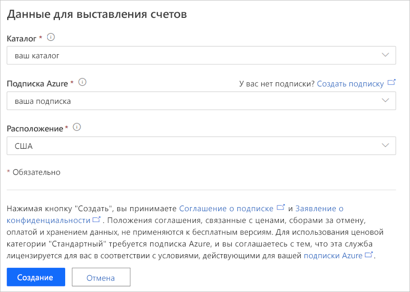

# Руководство по развертыванию и использованию шаблона приложения интеллектуальной логистики

В этом учебнике показано, как приступить к работе с шаблоном приложения *интеллектуальной логистики* для IoT Central. Вы узнаете, как развернуть и использовать этот шаблон.

В этом руководстве описано следующее:

> [!div class="checklist"]
> * Создание приложения для интеллектуальной логистики.
> * Использование ключевых функций приложения.
> * Использование панели мониторинга для отображения важных операций устройства логистики.
> * Использование шаблона устройства.
> * Следование правилам.
> * Использование заданий.

## Предварительные требования

* Для развертывания этого приложения не требуется выполнять какие-либо предварительные требования.
* Вы можете использовать бесплатный тарифный план или подписку Azure.

## Создание приложения интеллектуальной логистики

Вы можете создать приложение, выполнив следующие действия.

1. Перейдите на сайт [сборки Azure IoT Central](https://aka.ms/iotcentral). Затем выполните вход с помощью личной, рабочей или учебной учетной записи Microsoft. Выберите **Build** (Сборка) в области навигации слева, а затем перейдите на вкладку **Retail** (Розничная торговля).

    :::image type="content" source="media/tutorial-iot-central-connected-logistics/iotc-retail-homepage.png" alt-text="Шаблон интеллектуальной логистики":::

1. В разделе **Connected Logistics Application** (Приложение интеллектуальной логистики) выберите **Create app** (Создать приложение).

1. Щелчок **Создание приложений** откроет форму **Новое приложение**. Введите следующие сведения:

    * **Application name** (Имя приложения): можно использовать предложенное имя по умолчанию или ввести понятное имя приложения.
    * **URL** (URL-адрес): можно использовать предложенный URL-адрес по умолчанию или ввести понятный уникальный URL-адрес. Если у вас уже есть подписка Azure, то рекомендуется использовать параметр по умолчанию. Вы можете начать с 7-дневной бесплатной пробной версии тарифного плана и выбрать преобразование в стандартный тарифный план в любое время до истечения срока действия бесплатной версии.
    * **Billing Info** (Данные для выставления счетов): сведения о каталоге, подписке Azure и регионе необходимы для подготовки ресурсов.
    * **Создание**. Выберите "Create" (Создать) в нижней части страницы, чтобы развернуть приложение.

    :::image type="content" source="media/tutorial-iot-central-connected-logistics/connected-logistics-app-create.png" alt-text="Шаблон приложения интеллектуальной логистики":::

    :::image type="content" source="media/tutorial-iot-central-connected-logistics/connected-logistics-app-create-billinginfo.png" alt-text="Сведения о выставлении счетов для интеллектуальной логистики":::

## ознакомиться с этим приложением.

Ниже приведен снимок экрана, на котором показано, как выбрать шаблон приложения интеллектуальной логистики.

> [!div class="mx-imgBorder"]
> 

Следующие разделы содержат описание основных функций приложения.

### Панель мониторинга

После развертывания шаблона приложения панель мониторинга по умолчанию является порталом оператора интеллектуальной логистики. Northwind Trader — это вымышленный поставщик услуг логистики, управляющий флотом транспортных судов в море и парком транспортных автомобилей на суше. На этой панели мониторинга вы увидите два шлюза, предоставляющие данные телеметрии о доставке вместе со связанными командами, заданиями и действиями.

> [!div class="mx-imgBorder"]
> 

> [!div class="mx-imgBorder"]
> 

Эта панель мониторинга предварительно настроена для показа важных операций устройства логистики.

Панель мониторинга позволяет выполнять операции управления устройством, связанным с двумя разными шлюзами:

* просмотр маршрутов логистики для сухопутных грузоперевозок и сведений о расположении морских грузоперевозок;
* просмотр состояния шлюза и другой связанной информации.

:::image type="content" source="media/tutorial-iot-central-connected-logistics/connected-logistics-dashboard1.png" alt-text="Панель мониторинга для интеллектуальной логистики":::

* Вы можете отслеживать общее число шлюзов, активных и неизвестных радиожетонов.
* Вы можете выполнять такие операции управления устройствами, как обновление встроенного ПО, отключение и включение датчиков, изменение порога датчика, изменение интервалов передачи телеметрии и обновление контрактов службы устройства.
* Просмотр потребления заряда аккумулятора устройства

:::image type="content" source="media/tutorial-iot-central-connected-logistics/connected-logistics-dashboard2.png" alt-text="Состояние панели мониторинга для интеллектуальной логистики":::

#### Шаблон устройства

Выберите **Шаблоны устройств**, чтобы просмотреть модель возможностей шлюза. Модель возможностей основана на интерфейсах **Gateway Telemetry & Property** (Телеметрия и свойства шлюза) и **Gateway Commands** (Команды шлюза).

**Gateway Telemetry & Property** (Телеметрия и свойства шлюза). Этот интерфейс определяет все данные телеметрии, связанные с датчиками, расположением и сведениями об устройстве. Он также определяет возможности свойств двойника устройства, такие как пороговые значения датчика и интервалы обновления.

:::image type="content" source="media/tutorial-iot-central-connected-logistics/connected-logistics-devicetemplate1.png" alt-text="Интерфейс телеметрии и свойств":::

**Gateway Commands** (Команды шлюза). Этот интерфейс организовывает все возможности команд шлюза.

:::image type="content" source="media/tutorial-iot-central-connected-logistics/connected-logistics-devicetemplate2.png" alt-text="Интерфейс команд шлюза":::

### Правила

Выберите вкладку **Правила**, чтобы просмотреть правила в этом шаблоне приложения. Эти правила настроены для отправки уведомлений по электронной почте операторам для дальнейшего исследования.

**Gateway theft alert** (Оповещение о краже шлюза): это правило активируется при обнаружении датчиками непредвиденного освещения во время пути. Операторы должны быть немедленно уведомлены, чтобы расследовать потенциальную кражу.

**Unresponsive Gateway** (Шлюз не отвечает): это правило активируется, если шлюз долго не передает данные в облако. Шлюз может не отвечать из-за низкого заряда аккумулятора, потери подключения или повреждения устройства.

:::image type="content" source="media/tutorial-iot-central-connected-logistics/connected-logistics-rules.png" alt-text="Определения правил":::

### Задания

Перейдите на вкладку **Задания**, чтобы просмотреть задания в этом приложении.

:::image type="content" source="media/tutorial-iot-central-connected-logistics/connected-logistics-jobs.png" alt-text="Выполняемые задания":::

Задания можно использовать для выполнения операций на уровне всего приложения. В этом приложении задания используют команды устройства и возможности двойника для выполнения таких задач, как отключение определенных датчиков в шлюзе или изменение порога датчика в зависимости от режима и маршрута доставки.

* Отключение вибродатчиков при доставке по морю для экономии заряда аккумулятора — это стандартная операция, как и снижение порога температуры при транспортировке в холодильной цепи.

* Задания позволяют выполнять операции уровня системы, такие как обновление встроенного ПО на шлюзах или обновление контракта службы для контроля операций обслуживания.

## Очистка ресурсов

Если вы не собираетесь в дальнейшем использовать это приложение, удалите шаблон приложения, выбрав **Administration** (Администрирование)  > **Application settings** (Параметры приложения) и щелкнув **Delete** (Удалить).

:::image type="content" source="media/tutorial-iot-central-connected-logistics/connected-logistics-cleanup.png" alt-text="Очистка шаблона":::

## Дальнейшие действия
* Кроме того, вы можете узнать больше о: 
> [!div class="nextstepaction"]
> [Принцип интеллектуальной логистики](./architecture-connected-logistics.md)
* Узнайте больше о других [шаблонах IoT Central для розничной торговли](./overview-iot-central-retail.md).
* Узнайте больше об [IoT Central](../core/overview-iot-central.md).
