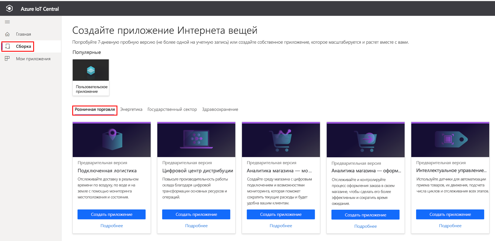
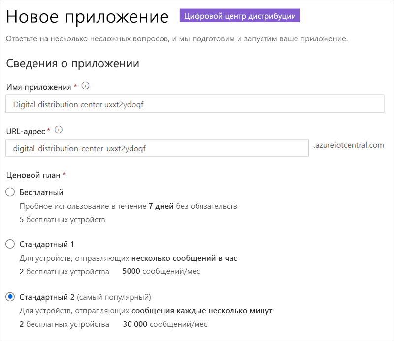
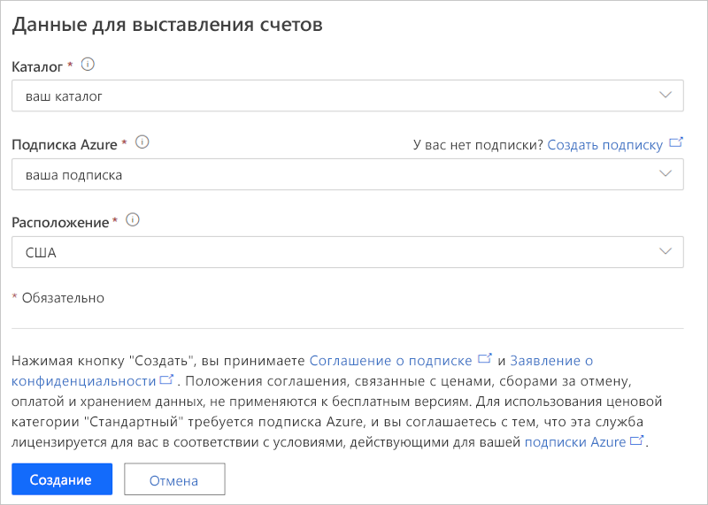
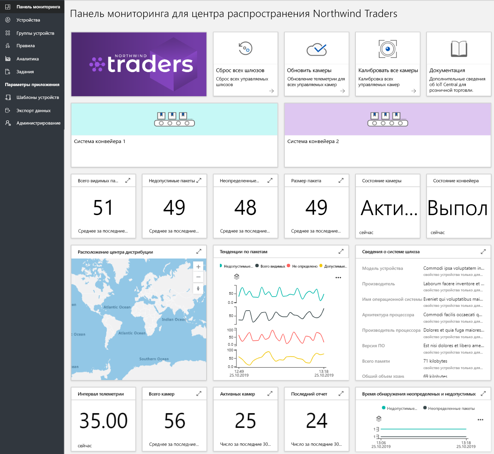
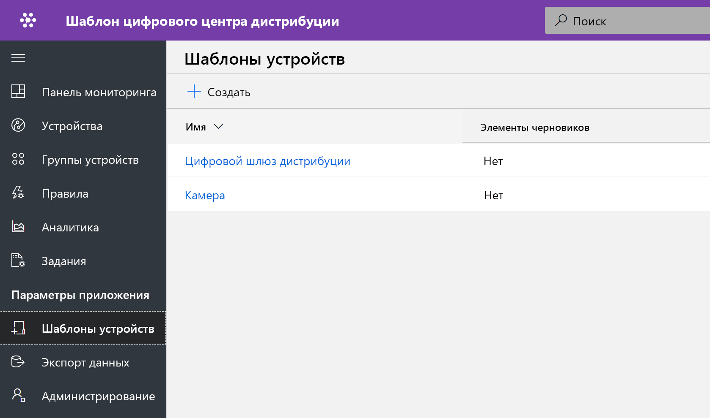
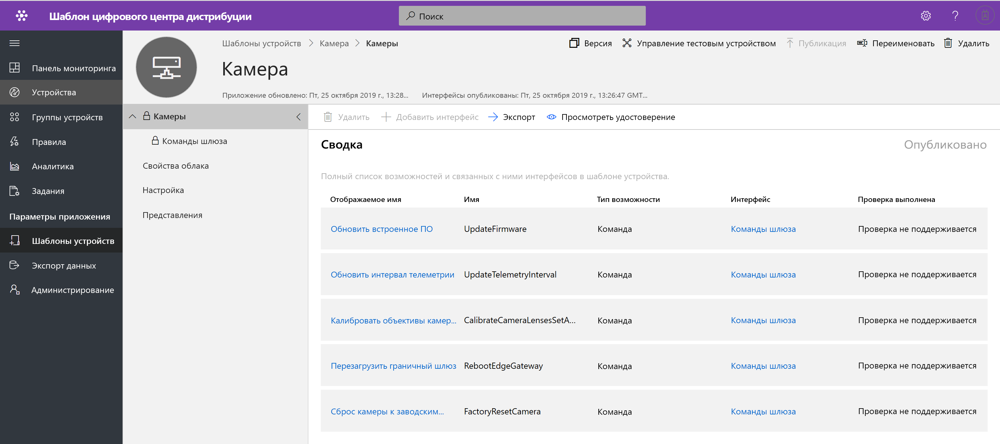
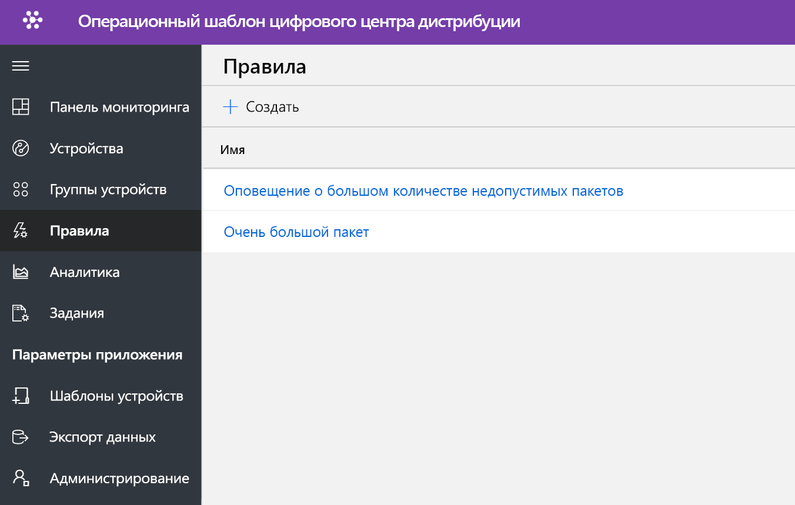
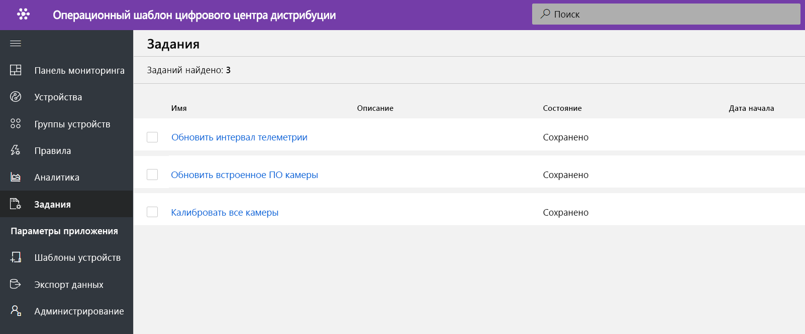
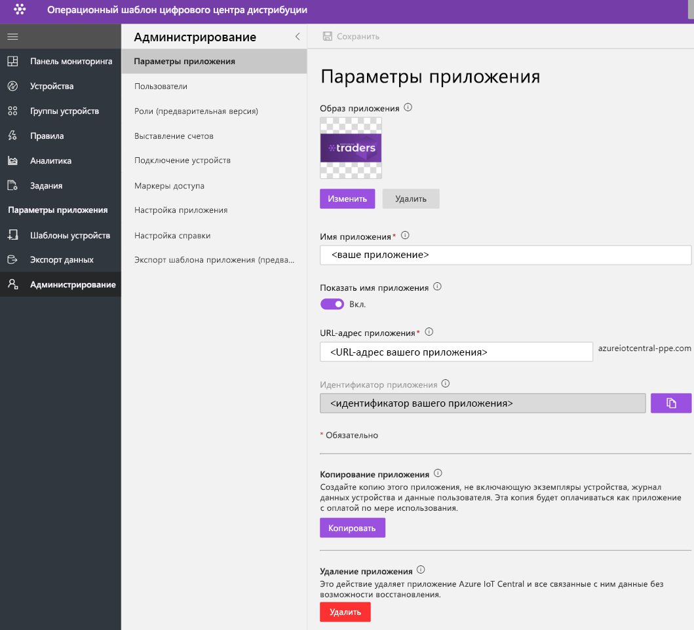

# Руководство по развертыванию шаблона приложения цифрового центра дистрибуции и его использованию

В этом руководстве показано, как приступить к работе, развернув шаблон приложения **цифрового центра дистрибуции** для IoT Central. Вы узнаете, как развернуть шаблон, который готов к использованию, и что можно будет сделать дальше.

Из этого руководства вы узнаете, как: 
* создать приложение цифрового центра дистрибуции; 
* ознакомиться с этим приложением. 

## Предварительные требования
* Для развертывания этого приложения не требуется выполнять какие-либо предварительные требования.
* Рекомендуется иметь подписку Azure, но вы можете поработать с приложением даже без нее.

## Создание шаблона приложения цифрового центра дистрибуции

Вы можете создать приложение, выполнив следующие действия.

1. Перейдите на веб-сайт диспетчера приложений в Azure IoT Central. Выберите **Build** (Сборка) в области навигации слева, а затем перейдите на вкладку **Retail** (Розничная торговля).

    > [!div class="mx-imgBorder"]
    > 

2. Выберите вкладку **Retail** (Розничная торговля) и щелкните **Create app** (Создать) в разделе **digital distribution center application** (Приложение цифрового центра дистрибуции).

3. Для **создания приложения** откроется форма нового приложения, которая будет заполнена запрошенными данными, как показано ниже.
   **Application name** (Имя приложения): можно использовать предложенное имя по умолчанию или ввести понятное имя приложения.
   **URL** (URL-адрес): можно использовать предложенный URL-адрес по умолчанию или ввести понятный уникальный URL-адрес. Если у вас уже есть подписка Azure, то рекомендуется использовать параметр по умолчанию. Вы можете начать с 7-дневной бесплатной пробной версии тарифного плана и выбрать преобразование в стандартный тарифный план в любое время до истечения срока действия бесплатной версии.
   **Billing Info** (Данные для выставления счетов): сведения о каталоге, подписке Azure и регионе необходимы для подготовки ресурсов.
   **Создание**. Выберите "Create" (Создать) в нижней части страницы, чтобы развернуть приложение.

    > [!div class="mx-imgBorder"]
    > 

    > [!div class="mx-imgBorder"]
    > 

## Знакомство с панелью мониторинга приложения 

После успешного развертывания шаблона приложения панель мониторинга по умолчанию является порталом оператора центра дистрибуции. Northwind Trader — это вымышленный поставщик решений центров дистрибуции, управляющий конвейерными системами. 

На этой панели мониторинга вы увидите один шлюз и одну камеру, действующую как устройство Интернета вещей. Шлюз предоставляет данные телеметрии о пакетах (допустимый, недопустимый или неидентифицированный пакет и его размер), а также связанные свойства двойника устройства. Все нисходящие команды выполняются на устройствах Интернета вещей, например на камере. Эта панель мониторинга предварительно настроена для демонстрации важных операций устройства центра дистрибуции.

Панель мониторинга логически организована, чтобы продемонстрировать возможности управления устройствами, обеспечиваемые шлюзом Azure IoT и устройством Интернета вещей.  
   * Вы можете выполнять команды шлюза и задачи управления.
   * Можно управлять всеми камерами, которые являются частью решения. 

> [!div class="mx-imgBorder"]
> 

## Шаблон устройства

Перейдите на вкладку "Device templates" (Шаблоны устройств), и вы увидите модель возможностей шлюза. Модель возможностей основана на двух интерфейсах, **Camera** (Камера) и **Digital Distribution Gateway** (Шлюз цифровой дистрибуции).

> [!div class="mx-imgBorder"]
> 

**Camera** (Камера). Этот интерфейс организовывает все возможности команд камеры. 

> [!div class="mx-imgBorder"]
> 

**Digital Distribution Gateway** (Шлюз цифровой дистрибуции). Этот интерфейс представляет все данные телеметрии, поступающие от камеры, определяемые облаком свойства двойника устройства и сведения о шлюзе.

> [!div class="mx-imgBorder"]
> 

## "Gateway Commands" (Команды шлюза)
Этот интерфейс организовывает все возможности команд шлюза.

> [!div class="mx-imgBorder"]
> 

## Правила
Перейдите на вкладку "Rules" (Правила), чтобы просмотреть два правила в этом шаблоне приложения. Эти правила настроены для отправки уведомлений по электронной почте операторам для дальнейшего исследования.

 **Too many invalid packages alert** (Оповещение о слишком большом числе недопустимых пакетов). Это правило активируется, когда камера обнаруживает большое число недопустимых пакетов, передаваемых через конвейерную систему.
 
**Large package** (Большой пакет). Это правило активируется, если камера обнаруживает большой пакет, качество которого невозможно проверить. 

> [!div class="mx-imgBorder"]
> 

## Задания
Перейдите на вкладку "Jobs" (Задания), чтобы увидеть пять заданий, входящих в состав этого шаблона приложения. Функцию заданий можно использовать для выполнения операций уровня всего решения. Здесь задания центра дистрибуции используют команды устройства и возможности двойника для выполнения таких задач, как:
   * калибровка камеры перед началом обнаружения пакетов; 
   * периодическое обновление встроенного ПО камеры;
   * изменение интервала отправки данных телеметрии для управления передачей данных.

> [!div class="mx-imgBorder"]
> 

## Очистка ресурсов
Если вы не собираетесь в дальнейшем использовать это приложение, удалите шаблон приложения, выбрав **Administration** (Администрирование)  > **Application settings** (Параметры приложения) и щелкнув **Delete** (Удалить).

> [!div class="mx-imgBorder"]
> 

## Дальнейшие действия
* См. сведения об архитектуре решения цифрового центра дистрибуции. 
> [!div class="nextstepaction"]
> [Понятия, связанные с цифровым центром дистрибуции](./architecture-digital-distribution-center.md)
* Узнайте больше о других [шаблонах IoT Central для розничной торговли](./overview-iot-central-retail.md).
* См. сведения об [IoT Central](../core/overview-iot-central.md).
