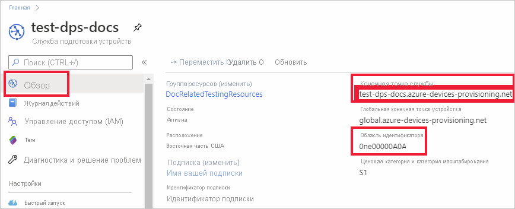

# <a name="quickstart-provision-a-symmetric-key-device-using-c"></a>Краткое руководство. Подготовка устройства симметричного ключа с помощью C#

В этом кратком руководстве описано, как в центре Интернета вещей подготовить компьютер разработки Windows в качестве устройства с помощью C#. Это устройство будет использовать симметричный ключ и индивидуальную регистрацию для аутентификации в экземпляре Службы подготовки устройств к добавлению в Центр Интернета вещей (DPS), а также для назначения в центре Интернета вещей. Для подготовки устройства будет использоваться пример кода из [Примеров Интернета вещей Azure для C#](https://github.com/Azure-Samples/azure-iot-samples-csharp). 

Хотя в этой статье показано, как выполнить подготовку с использованием отдельной регистрации, вы можете использовать для этой цели группы регистрации. При использовании групп регистрации существуют некоторые отличия. Например, необходимо использовать производный ключ устройства с уникальным идентификатором регистрации. [Подготовка устройств к работе с использованием симметричных ключей](how-to-legacy-device-symm-key.md) предоставляет пример группы регистрации. Дополнительные сведения о группах регистрации для аттестации симметричных ключей см. в [этом разделе](concepts-symmetric-key-attestation.md#group-enrollments).

Если вы не знакомы с процессом автоматической подготовки, см. раздел [Процесс подготовки](about-iot-dps.md#provisioning-process). 

Кроме того, прежде чем продолжить работу с этим кратким руководством, выполните шаги, описанные в статье [Настройка службы подготовки устройств для Центра Интернета вещей на портале Azure](./quick-setup-auto-provision.md). В этом руководстве предполагается, что экземпляр службы подготовки устройств уже создан.

В этой статье описывается использование рабочей станции под управлением Windows. Тем не менее эти процедуры можно выполнить и на Linux. Пример для Linux см. в статье о [подготовке к мультитенантности](how-to-provision-multitenant.md).


[!INCLUDE [quickstarts-free-trial-note](../../includes/quickstarts-free-trial-note.md)]


## <a name="prerequisites"></a>Обязательные условия

* Убедитесь, что на компьютере под управлением Windows установлен [пакет SDK для .NET Core 2.1](https://www.microsoft.com/net/download/windows) или более поздней версии.

* Установите последнюю версию [Git](https://git-scm.com/download/).

<a id="setupdevbox"></a>


## <a name="create-a-device-enrollment"></a>Создание регистрации устройств

1. Войдите на [портал Azure](https://portal.azure.com), нажмите кнопку **Все ресурсы** в меню слева и откройте экземпляр Службы подготовки устройств (DPS).

2. Щелкните вкладку **Управление регистрациями** , а затем нажмите кнопку **Добавить индивидуальную регистрацию** в верхней области. 

3. В области **Добавление регистрации** введите приведенные ниже сведения, а затем нажмите кнопку **Сохранить**.

   - **Механизм** : выберите **симметричный ключ** как *механизм* аттестации удостоверения.

   - **Автоматически создавать ключи** : установите флажок.

   - **Идентификатор регистрации** : введите идентификатор регистрации для идентификации регистрации. Используйте только буквы в нижнем регистре, цифры и дефис ("-"). Например, **symm-key-csharp-device-01**.

   - **Идентификатор устройства Центра Интернета вещей** : введите идентификатор устройства. Например, **csharp-device-01**.

     

4. После сохранения регистрации **первичный** и **вторичный ключи** будут созданы и добавлены в запись регистрации. Запись о регистрации устройства по симметричному ключу отобразится как **symm-key-csharp-device-01** в столбце *Идентификатор регистрации* на вкладке *Индивидуальные регистрации*. 

5. Откройте регистрацию и скопируйте значение созданных **первичного ключа** и **вторичного ключа**. Вы примените это значение ключа и **идентификатор регистрации** позже, при добавлении переменных среды для использования с примером кода подготовки устройства.


## <a name="prepare-the-c-environment"></a>Подготовка среды C# 

1. Откройте среду командной строки Git CMD или Git Bash. Клонируйте репозиторий GitHub [примеров Интернета вещей Azure для C#](https://github.com/Azure-Samples/azure-iot-samples-csharp) с помощью следующей команды:

    ```cmd
    git clone https://github.com/Azure-Samples/azure-iot-samples-csharp.git
    ```


<a id="firstbootsequence"></a>

## <a name="prepare-the-device-provisioning-code"></a>Подготовка кода для подготовки устройства

В рамках этого раздела вы добавите следующие четыре переменные среды, которые будут использоваться в качестве параметров в примере кода подготовки устройства для устройства симметричного ключа. 

* `DPS_IDSCOPE`
* `PROVISIONING_REGISTRATION_ID`
* `PRIMARY_SYMMETRIC_KEY`
* `SECONDARY_SYMMETRIC_KEY`

Код подготовки будет обращаться к экземпляру DPS, используя значения этих переменных для аутентификации устройства. Затем устройство будет назначено центру Интернета вещей, который уже связан с экземпляром DPS на основе конфигурации индивидуальной регистрации. По завершении подготовки этот пример кода отправит некоторые тестовые данные телеметрии в центр Интернета вещей.

1. В меню службы подготовки устройств на [портале Azure](https://portal.azure.com) выберите **Обзор** и скопируйте значения _Конечная точка службы_ и _Область идентификатора_. Эти значения будут использоваться для переменных среды `PROVISIONING_HOST` и `DPS_IDSCOPE`.

    

2. Откройте командную строку и перейдите к *SymmetricKeySample* в репозитории клонированных примеров:

    ```cmd
    cd provisioning\Samples\device\SymmetricKeySample
    ```

3. В папке *SymmetricKeySample* откройте *Program.cs* в текстовом редакторе и найдите строки кода, в которых заданы строки `individualEnrollmentPrimaryKey` и `individualEnrollmentSecondaryKey`. Обновите эти строки кода указанным ниже образом, чтобы вместо жестко запрограммированных ключей использовались переменные среды.
 
    ```csharp
        //These are the two keys that belong to your individual enrollment. 
        // Leave them blank if you want to try this sample for an individual enrollment instead
        //private const string individualEnrollmentPrimaryKey = "";
        //private const string individualEnrollmentSecondaryKey = "";

        private static string individualEnrollmentPrimaryKey = Environment.GetEnvironmentVariable("PRIMARY_SYMMETRIC_KEY");;
        private static string individualEnrollmentSecondaryKey = Environment.GetEnvironmentVariable("SECONDARY_SYMMETRIC_KEY");;
    ```

    Кроме того, найдите строку кода, где задается `registrationId`, и обновите ее указанным ниже образом, чтобы использовать переменную среды.

    ```csharp
        //This field is mandatory to provide for this sample
        //private static string registrationId = "";

        private static string registrationId = Environment.GetEnvironmentVariable("PROVISIONING_REGISTRATION_ID");;
    ```

    Сохраните изменения в *Program.cs*.

3. В командной строке добавьте переменные среды для области идентификатора, идентификатора регистрации, первичного и вторичного симметричных ключей, значения которых вы скопировали из индивидуальной регистрации в предыдущем разделе.  

    Следующие примеры команд только демонстрируют синтаксис команд. Убедитесь, что вы используете правильные значения.

    ```console
    set DPS_IDSCOPE=0ne00000A0A
    ```

    ```console
    set PROVISIONING_REGISTRATION_ID=symm-key-csharp-device-01
    ```

    ```console
    set PRIMARY_SYMMETRIC_KEY=sbDDeEzRuEuGKag+kQKV+T1QGakRtHpsERLP0yPjwR93TrpEgEh/Y07CXstfha6dhIPWvdD1nRxK5T0KGKA+nQ==
    ```

    ```console
    set SECONDARY_SYMMETRIC_KEY=Zx8/eE7PUBmnouB1qlNQxI7fcQ2HbJX+y96F1uCVQvDj88jFL+q6L9YWLLi4jqTmkRPOulHlSbSv2uFgj4vKtw==
    ```


4. Создайте и запустите пример кода с помощью следующей команды:

    ```console
    dotnet run
    ```

5. Ожидается результат примерно такого вида, как показано ниже, с указанием связанного центра Интернета вещей, которому назначено устройство на основе параметров индивидуальной регистрации. Пример строки TestMessage отправляется в центр в качестве теста:

    ```output
    D:\azure-iot-samples-csharp\provisioning\Samples\device\SymmetricKeySample>dotnet run
    RegistrationID = symm-key-csharp-device-01
    ProvisioningClient RegisterAsync . . . Assigned
    ProvisioningClient AssignedHub: docs-test-iot-hub.azure-devices.net; DeviceID: csharp-device-01
    Creating Symmetric Key DeviceClient authentication
    DeviceClient OpenAsync.
    DeviceClient SendEventAsync.
    DeviceClient CloseAsync.
    Enter any key to exit
    ```
    
6. На портале Azure перейдите к центру Интернета вещей, который связан со службой подготовки, и откройте колонку **Устройства Интернета вещей**. После успешной подготовки устройства симметричного ключа в центре Интернета вещей для идентификатора этого устройства параметр *STATUS* (Состояние) получит значение **enabled** (включено). Если вы уже открывали эту колонку перед запуском примера кода для устройства, возможно, потребуется нажать кнопку **Обновить** вверху. 

     

> [!NOTE]
> Если в записи регистрации для своего устройства вы изменили значение по умолчанию для *начального состояния двойника устройства* , требуемое состояние двойника будет извлечено из концентратора с последующим выполнением соответствующих действий. См. [общие сведения о двойниках устройств и их использовании в Центре Интернета вещей](../iot-hub/iot-hub-devguide-device-twins.md).
>


## <a name="clean-up-resources"></a>Очистка ресурсов

Если вы планируете продолжить работу с примером клиентского устройства, не удаляйте ресурсы, созданные в ходе работы с этим кратким руководством. Если вы не планируете продолжать работу, следуйте инструкциям ниже, чтобы удалить все созданные ресурсы.

1. В меню слева на портале Azure щелкните **Все ресурсы** и откройте службу подготовки устройств. Откройте раздел **Управление регистрациями** для службы, а затем щелкните вкладку **Индивидуальные регистрации**. Установите флажок рядом с *идентификатором регистрации* устройства, которое вы зарегистрировали в рамках этого краткого руководства, и нажмите кнопку **Удалить** в верхней части панели. 
1. В меню слева на портале Azure щелкните **Все ресурсы** и выберите свой центр Интернета вещей. Откройте колонку **Устройства Интернета вещей** для нужного центра, установите флажок *Идентификатор устройства* , зарегистрированного в процессе работы с кратким руководством, и нажмите кнопку **Удалить** в верхней части панели.

## <a name="next-steps"></a>Дальнейшие действия

Из этого краткого руководства вы узнали, как подготовить устройство симметричного ключа под управлением Windows в центре Интернета вещей, используя Службу подготовки устройств к добавлению в Центр Интернета вещей. Чтобы узнать, как подготавливать устройства с сертификатами X.509 с помощью C#, перейдите к краткому руководству по устройствам X.509, ссылка на которое приведена ниже. 

> [!div class="nextstepaction"]
> [Краткое руководство. Создание и подготовка имитированного устройства X.509 с помощью пакета SDK устройства C# для службы подготовки устройств Центра Интернета вещей](quick-create-simulated-device-x509-csharp.md)
