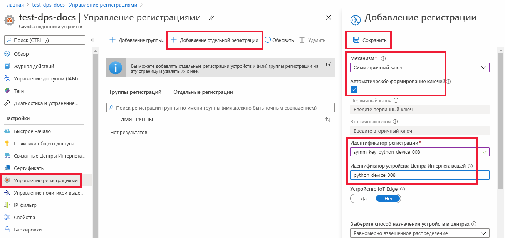
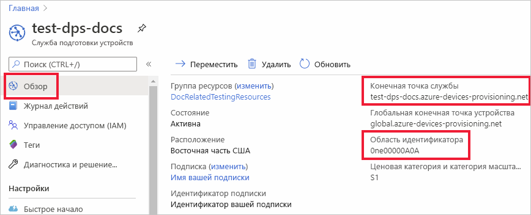
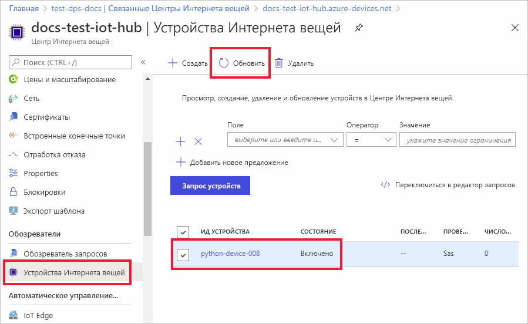

# <a name="quickstart-provision-a-python-device-with-symmetric-keys"></a>Подготовка устройства Python с использованием симметричных ключей

В этом кратком руководстве описано, как в центре Интернета вещей подготовить компьютер разработки Windows в качестве устройства с помощью Python. Это устройство будет использовать симметричный ключ и индивидуальную регистрацию для аутентификации в экземпляре Службы подготовки устройств к добавлению в Центр Интернета вещей (DPS), а также для назначения в центре Интернета вещей. Для подготовки устройства будет использоваться пример кода из [пакета SDK для Azure IoT для Python](https://github.com/Azure/azure-iot-sdk-python). 

Хотя в этой статье показано, как выполнить подготовку с использованием отдельной регистрации, вы можете использовать для этой цели группы регистрации. При использовании групп регистрации существуют некоторые отличия. Например, необходимо использовать производный ключ устройства с уникальным идентификатором регистрации. Хотя группы регистрации с использованием симметричных ключей не ограничиваются устаревшими устройствами, пример группы регистрации см.[How to provision legacy devices using Symmetric key attestation](how-to-legacy-device-symm-key.md) (Как подготовить устаревшие устройства с использованием симметричных ключей). Дополнительные сведения см. в разделе [о групповых регистрациях](concepts-symmetric-key-attestation.md#group-enrollments).

Если вы не знакомы с процессом автоматической подготовки, см. раздел [Процесс подготовки](about-iot-dps.md#provisioning-process). 

Кроме того, прежде чем продолжить работу с этим кратким руководством, выполните шаги, описанные в статье [Настройка службы подготовки устройств для Центра Интернета вещей на портале Azure](./quick-setup-auto-provision.md). В этом руководстве предполагается, что экземпляр службы подготовки устройств уже создан.

В этой статье описывается использование рабочей станции под управлением Windows. Тем не менее эти процедуры можно выполнить и на Linux. Пример для Linux см. в статье [Подготовка к мультитенантности](how-to-provision-multitenant.md).


[!INCLUDE [quickstarts-free-trial-note](../../includes/quickstarts-free-trial-note.md)]


## <a name="prerequisites"></a>Предварительные требования

* Убедитесь, что на компьютере под управлением Windows установлен [Python 3.7](https://www.python.org/downloads/) или более поздней версии. Вы можете проверить версию Python, выполнив команду `python --version`.

* Установите последнюю версию [Git](https://git-scm.com/download/).

<a id="setupdevbox"></a>

## <a name="prepare-the-python-sdk-environment"></a>Подготовка среды пакета SDK для Python 

1. Установите на компьютер систему Git и добавьте ее в переменные среды, доступные в командном окне. Последнюю версию средств `git` для установки, которая включает **Git Bash** , приложение командной строки для взаимодействия с локальным репозиторием Git, можно найти на [этой странице](https://git-scm.com/download/). 

2. Откройте командную строку. Клонируйте репозиторий GitHub с пакетом SDK для Azure IoT для Python:
    
    ```console
    git clone https://github.com/Azure/azure-iot-sdk-python.git --recursive
    ```
3. Перейдите в каталог `azure-iot-sdk-python\azure-iot-device\samples\async-hub-scenarios`, где находится пример файла _provision_symmetric_key.py_.
   
   ```console
   cd azure-iot-sdk-python\azure-iot-device\samples\async-hub-scenarios
   ```
4. Установите библиотеку _azure-iot-device_ , выполнив следующую команду:

    ```console
    pip install azure-iot-device
    ```


## <a name="create-a-device-enrollment"></a>Создание регистрации устройств

1. Войдите на [портал Azure](https://portal.azure.com), нажмите кнопку **Все ресурсы** в меню слева и откройте экземпляр Службы подготовки устройств (DPS).

2. Щелкните вкладку **Управление регистрациями** , а затем нажмите кнопку **Добавить индивидуальную регистрацию** в верхней области. 

3. В области **Добавление регистрации** введите приведенные ниже сведения, а затем нажмите кнопку **Сохранить**.

   - **Механизм** : выберите **симметричный ключ** как *механизм* аттестации удостоверения.

   - **Автоматически создавать ключи** : установите флажок.

   - **Идентификатор регистрации** : введите идентификатор регистрации для идентификации регистрации. Используйте только буквы в нижнем регистре, цифры и дефис ("-"). Например, **symm-key-python-device-008**.

   - **Идентификатор устройства Центра Интернета вещей** : введите идентификатор устройства. Например, **python-device-008**.

     

4. После сохранения регистрации **первичный** и **вторичный ключи** будут созданы и добавлены в запись регистрации. Запись о регистрации устройства по симметричному ключу отобразится как **symm-key-python-device-008** в столбце *Идентификатор регистрации* на вкладке *Индивидуальные регистрации*. 

5. Откройте регистрацию и скопируйте значение сформированного **первичного ключа**. Вы примените это значение ключа и **идентификатор регистрации** позже, при добавлении переменных среды для использования с примером кода подготовки устройства.


<a id="firstbootsequence"></a>

## <a name="prepare-the-device-provisioning-code"></a>Подготовка кода для подготовки устройства

В этом разделе вы добавите следующие четыре переменные среды, которые будут использоваться в качестве параметров в примере кода подготовки устройства для устройства симметричного ключа. 

* `PROVISIONING_HOST`
* `PROVISIONING_IDSCOPE`
* `PROVISIONING_REGISTRATION_ID`
* `PROVISIONING_SYMMETRIC_KEY`

Код подготовки будет обращаться к экземпляру DPS, используя значения этих переменных для аутентификации устройства. Затем устройство будет назначено центру Интернета вещей, который уже связан с экземпляром DPS на основе конфигурации индивидуальной регистрации. По завершении подготовки этот пример кода отправит некоторые тестовые данные телеметрии в центр Интернета вещей.

1. В меню службы подготовки устройств на [портале Azure](https://portal.azure.com) выберите **Обзор** и скопируйте значения _Конечная точка службы_ и _Область идентификатора_. Эти значения будут использоваться для переменных среды `PROVISIONING_HOST` и `PROVISIONING_IDSCOPE`.

    

2. В командной строке Python добавьте переменные среды, используя скопированные значения. 

    Следующие примеры команд только демонстрируют синтаксис команд. Убедитесь, что вы используете правильные значения.

    ```console
    set PROVISIONING_HOST=test-dps-docs.azure-devices-provisioning.net
    ```

    ```console
    set PROVISIONING_IDSCOPE=0ne00000A0A
    ```

3. В командной строке Python добавьте переменные среды для идентификатора регистрации и симметричного ключа, значения которых вы скопировали из индивидуальной регистрации в предыдущем разделе. 

    Следующие примеры команд только демонстрируют синтаксис команд. Убедитесь, что вы используете правильные значения.

    ```console
    set PROVISIONING_REGISTRATION_ID=symm-key-python-device-008
    ```

    ```console
    set PROVISIONING_SYMMETRIC_KEY=sbDDeEzRuEuGKag+kQKV+T1QGakRtHpsERLP0yPjwR93TrpEgEh/Y07CXstfha6dhIPWvdD1nRxK5T0KGKA+nQ==
    ```

4. Запустите пример кода Python из файла _provision_symmetric_key.py_.

    ```console
    D:\azure-iot-sdk-python\azure-iot-device\samples\async-hub-scenarios>python provision_symmetric_key.py
    ```

5. Ожидается результат примерно такого вида, как показано ниже, с указанием связанного центра Интернета вещей, которому назначено устройство на основе параметров индивидуальной регистрации. Также для целей тестирования в этот центр отправляется несколько примеров сообщений телеметрии с информацией о скорости ветра:

    ```output
    D:\azure-iot-sdk-python\azure-iot-device\samples\async-hub-scenarios>python provision_symmetric_key.py
    RegistrationStage(RequestAndResponseOperation): Op will transition into polling after interval 2.  Setting timer.
    The complete registration result is
    python-device-008
    docs-test-iot-hub.azure-devices.net
    initialAssignment
    null
    Will send telemetry from the provisioned device
    sending message #8
    sending message #9
    sending message #3
    sending message #10
    sending message #4
    sending message #2
    sending message #6
    sending message #7
    sending message #1
    sending message #5
    done sending message #8
    done sending message #9
    done sending message #3
    done sending message #10
    done sending message #4
    done sending message #2
    done sending message #6
    done sending message #7
    done sending message #1
    done sending message #5
    ```
    
6. На портале Azure перейдите к центру Интернета вещей, который связан со службой подготовки, и откройте колонку **Устройства Интернета вещей**. После успешной подготовки устройства симметричного ключа в центре Интернета вещей для идентификатора этого устройства параметр *STATUS* (Состояние) получит значение **enabled** (включено). Если вы уже открывали эту колонку перед запуском примера кода для устройства, возможно, потребуется нажать кнопку **Обновить** вверху. 

     

> [!NOTE]
> Если в записи регистрации для своего устройства вы изменили значение по умолчанию для *начального состояния двойника устройства* , требуемое состояние двойника будет извлечено из концентратора с последующим выполнением соответствующих действий. См. [общие сведения о двойниках устройств и их использовании в Центре Интернета вещей](../iot-hub/iot-hub-devguide-device-twins.md).
>


## <a name="clean-up-resources"></a>Очистка ресурсов

Если вы планируете продолжить работу с примером клиентского устройства, не удаляйте ресурсы, созданные в ходе работы с этим кратким руководством. Если вы не планируете продолжать работу, следуйте инструкциям ниже, чтобы удалить все созданные ресурсы.

1. В меню слева на портале Azure щелкните **Все ресурсы** и откройте службу подготовки устройств. Откройте раздел **Управление регистрациями** для службы, а затем щелкните вкладку **Индивидуальные регистрации**. Установите флажок рядом с *идентификатором регистрации* устройства, которое вы зарегистрировали в рамках этого краткого руководства, и нажмите кнопку **Удалить** в верхней части панели. 
1. В меню слева на портале Azure щелкните **Все ресурсы** и выберите свой центр Интернета вещей. Откройте колонку **Устройства Интернета вещей** для нужного центра, установите флажок *Идентификатор устройства* , зарегистрированного в процессе работы с кратким руководством, и нажмите кнопку **Удалить** в верхней части панели.

## <a name="next-steps"></a>Дальнейшие действия

Из этого краткого руководства вы узнали, как подготовить устройство симметричного ключа под управлением Windows в центре Интернета вещей, используя Службу подготовки устройств к добавлению в Центр Интернета вещей. Чтобы узнать, как подготавливать устройства с сертификатами X.509 с помощью Python, перейдите к краткому руководству по устройствам X.509, ссылка на которое приведена ниже. 

> [!div class="nextstepaction"]
> [Краткое руководство. Создание и подготовка имитированного устройства X.509 с помощью пакета SDK службы устройства Python для службы подготовки устройств Центра Интернета вещей](quick-create-simulated-device-x509-python.md)
