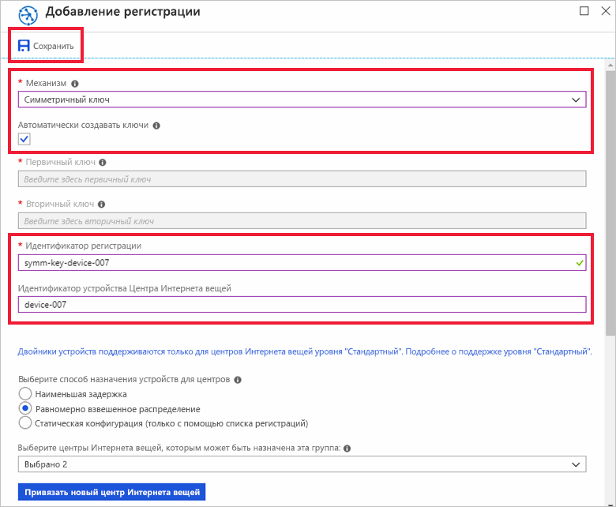
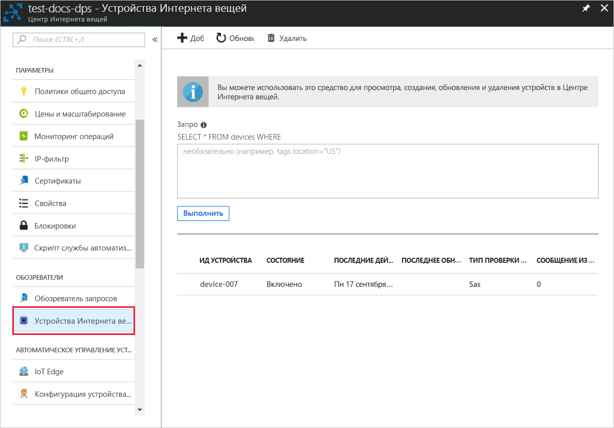

# <a name="quickstart-provision-a-simulated-device-with-symmetric-keys"></a>Краткое руководство по подготовке имитированного устройства с использованием симметричных ключей

В этом кратком руководстве вы узнаете, как создать и запустить симулятор устройств на компьютере для разработки Windows. Вы настроите в имитированном устройстве использование симметричного ключа для прохождения аутентификации в экземпляре службы подготовки устройств и назначения Центру Интернета вещей. Для моделирования последовательности загрузки устройства, которая инициирует подготовку, будет использоваться пример кода из [пакета SDK Azure IoT для C](https://github.com/Azure/azure-iot-sdk-c). Устройство будет распознано по отдельной регистрации в экземпляре службы подготовки и назначено Центру Интернета вещей.

Хотя в этой статье показано, как выполнить подготовку с использованием отдельной регистрации, вы можете использовать группы регистрации. При использовании групп регистрации существуют некоторые отличия. Например, необходимо использовать производный ключ устройства с уникальным идентификатором регистрации. Хотя группы регистрации с использованием симметричных ключей не ограничиваются устаревшими устройствами, пример группы регистрации см.[How to provision legacy devices using Symmetric key attestation](how-to-legacy-device-symm-key.md) (Как подготовить устаревшие устройства с использованием симметричных ключей). Дополнительные сведения см. в разделе [о групповых регистрациях](concepts-symmetric-key-attestation.md#group-enrollments).

Если вы не знакомы с процессом автоматической подготовки, см. раздел [Процесс подготовки](about-iot-dps.md#provisioning-process). 

Кроме того, прежде чем продолжить работу с этим кратким руководством, выполните шаги, описанные в статье [Настройка службы подготовки устройств для Центра Интернета вещей на портале Azure](./quick-setup-auto-provision.md). В этом руководстве предполагается, что экземпляр службы подготовки устройств уже создан.

В этой статье описывается использование рабочей станции под управлением Windows. Тем не менее эти процедуры можно выполнить и на Linux. Пример для Linux см. в статье [Подготовка к мультитенантности](how-to-provision-multitenant.md).


[!INCLUDE [quickstarts-free-trial-note](../../includes/quickstarts-free-trial-note.md)]


## <a name="prerequisites"></a>Предварительные требования

Приведенные ниже предварительные требования касаются среды разработки Windows. При использовании Linux или macOS ознакомьтесь с соответствующим разделом в статье [Подготовка среды разработки](https://github.com/Azure/azure-iot-sdk-c/blob/master/doc/devbox_setup.md) из документации к пакету SDK.

* [Visual Studio 2019](https://visualstudio.microsoft.com/vs/) с включенной рабочей нагрузкой [Разработка классических приложений на C++](/cpp/ide/using-the-visual-studio-ide-for-cpp-desktop-development). Visual Studio 2015 или Visual Studio 2017 также поддерживаются.

* Установите последнюю версию [Git](https://git-scm.com/download/).

<a id="setupdevbox"></a>

## <a name="prepare-an-azure-iot-c-sdk-development-environment"></a>Подготовка среды разработки для пакета SDK Azure IoT для C

В этом разделе вы подготовите среду разработки, которая используется для сборки [пакета SDK Azure IoT для C](https://github.com/Azure/azure-iot-sdk-c). 

В пакет SDK входит пример кода для имитированного устройства. Для этого имитированного устройства будет выполнена попытка подготовки во время последовательности загрузки.

1. Скачайте [систему сборки CMake](https://cmake.org/download/).

    **Перед** установкой `CMake` очень важно установить на компьютер необходимые компоненты Visual Studio (Visual Studio с рабочей нагрузкой "Разработка классических приложений на C++"). После установки компонентов и проверки загрузки установите систему сборки CMake.

    В предыдущих версиях системы сборки CMake было невозможно создать файл решения, используемый в этой статье. Убедитесь, что используется более новая версия CMake.

2. Щелкните **Теги** и найдите имя тега для последнего выпуска на странице [Выпуск пакета SDK для Azure IoT C](https://github.com/Azure/azure-iot-sdk-c/releases/latest).

3. Откройте командную строку или оболочку Git Bash. Выполните приведенные ниже команды, чтобы клонировать репозиторий GitHub с последним выпуском [пакета SDK Azure IoT для C](https://github.com/Azure/azure-iot-sdk-c). Используйте найденный тег в качестве значения для параметра `-b`:

    ```cmd/sh
    git clone -b <release-tag> https://github.com/Azure/azure-iot-sdk-c.git
    cd azure-iot-sdk-c
    git submodule update --init
    ```

    Выполнение этой операции может занять несколько минут.

4. Создайте подкаталог `cmake` в корневом каталоге репозитория Git и перейдите в эту папку. В каталоге `azure-iot-sdk-c` выполните следующие команды:

    ```cmd/sh
    mkdir cmake
    cd cmake
    ```

5. Выполните приведенную ниже команду, чтобы создать версию пакета SDK для используемой клиентской платформы разработки. Эта команда также создает решение Visual Studio для имитированного устройства в каталоге `cmake`. 

    ```cmd
    cmake -Dhsm_type_symm_key:BOOL=ON -Duse_prov_client:BOOL=ON  ..
    ```
    
    Если `cmake` не удастся найти компилятор C++, могут возникнуть ошибки сборки во время выполнения предыдущей команды. В этом случае попробуйте, выполнить эту команду в [командной строке Visual Studio](/dotnet/framework/tools/developer-command-prompt-for-vs). 

    После успешного создания последние несколько строк выходных данных будут выглядеть следующим образом:

    ```cmd/sh
    $ cmake -Dhsm_type_symm_key:BOOL=ON -Duse_prov_client:BOOL=ON  ..
    -- Building for: Visual Studio 15 2017
    -- Selecting Windows SDK version 10.0.16299.0 to target Windows 10.0.17134.
    -- The C compiler identification is MSVC 19.12.25835.0
    -- The CXX compiler identification is MSVC 19.12.25835.0

    ...

    -- Configuring done
    -- Generating done
    -- Build files have been written to: E:/IoT Testing/azure-iot-sdk-c/cmake
    ```

## <a name="create-a-device-enrollment-entry-in-the-portal"></a>Создание записи регистрации устройств на портале

1. Войдите на [портал Azure](https://portal.azure.com), нажмите кнопку **Все ресурсы** в меню слева и откройте службу подготовки устройств.

2. Щелкните вкладку **Управление регистрациями**, а затем нажмите кнопку **Добавить индивидуальную регистрацию** в верхней области. 

3. В области **Добавление регистрации** введите приведенные ниже сведения, а затем нажмите кнопку **Сохранить**.

   - **Механизм**: выберите **симметричный ключ** как *механизм* аттестации удостоверения.

   - **Автоматически создавать ключи**: установите флажок.

   - **Идентификатор регистрации**: введите идентификатор регистрации для идентификации регистрации. Используйте только буквы в нижнем регистре, цифры и дефис ("-"). Например, **symm-key-device-007**.

   - **Идентификатор устройства Центра Интернета вещей**: введите идентификатор устройства. Например, **device-007**.

     

4. После сохранения регистрации **первичный** и **вторичный ключи** будут созданы и добавлены в запись регистрации. Запись о регистрации устройства по симметричному ключу отобразится как **symm-key-device-007** в столбце *Индивидуальные регистрации* на вкладке *Индивидуальные регистрации*. 

    Откройте регистрацию и скопируйте значение сформированного **первичного ключа**.


<a id="firstbootsequence"></a>

## <a name="simulate-first-boot-sequence-for-the-device"></a>Имитация последовательности первой загрузки для устройства

В этом разделе вы обновите пример кода для отправки последовательности загрузки устройства в экземпляр службы подготовки устройств. Эта последовательность загрузки приведет к тому, что устройство будет распознано и назначено Центру Интернета вещей, связанному с экземпляром службы подготовки устройств.


1. На портале Azure выберите вкладку **Обзор** службы подготовки устройств и запишите значение **_области идентификатора_**.

     

2. В Visual Studio откройте файл решения **azure_iot_sdks.sln**, который был создан в результате запуска CMake. Файл решения должен находиться в следующем расположении:

    ```
    \azure-iot-sdk-c\cmake\azure_iot_sdks.sln
    ```

    Если файл не был создан в каталоге cmake, убедитесь, что используется последняя версия системы сборки CMake.

3. В окне *Обозреватель решений* Visual Studio перейдите в папку **Provision\_Samples**. Разверните пример проекта с именем **prov\_dev\_client\_sample**. Разверните **исходные файлы** и откройте **prov\_dev\_client\_sample.c**.

4. Найдите константу `id_scope` и замените ее значение ранее скопированным значением **области идентификатора**. 

    ```c
    static const char* id_scope = "0ne00002193";
    ```

5. Найдите определение функции `main()` в том же файле. Проверьте, чтобы переменной `hsm_type` было задано значение `SECURE_DEVICE_TYPE_SYMMETRIC_KEY`, как показано ниже.

    ```c
    SECURE_DEVICE_TYPE hsm_type;
    //hsm_type = SECURE_DEVICE_TYPE_TPM;
    //hsm_type = SECURE_DEVICE_TYPE_X509;
    hsm_type = SECURE_DEVICE_TYPE_SYMMETRIC_KEY;
    ```

6. Найдите закомментированный вызов `prov_dev_set_symmetric_key_info()` в **prov\_dev\_client\_sample.c**.

    ```c
    // Set the symmetric key if using they auth type
    //prov_dev_set_symmetric_key_info("<symm_registration_id>", "<symmetric_Key>");
    ```

    Раскомментируйте вызов функции и замените значения заполнителей (включая угловые скобки) значениями идентификатора регистрации и первичного ключа.

    ```c
    // Set the symmetric key if using they auth type
    prov_dev_set_symmetric_key_info("symm-key-device-007", "your primary key here");
    ```
   
    Сохраните файл.

7. Щелкните проект **prov\_dev\_client\_sample** правой кнопкой мыши и выберите пункт **Назначить запускаемым проектом**. 

8. В меню Visual Studio выберите **Отладка** > **Запуск без отладки**, чтобы запустить решение. При появлении запроса перестроить проект щелкните **Да**, чтобы перестроить его перед запуском.

    Следующий результат является примером успешной загрузки имитированного устройства и его подключения к экземпляру службы подготовки для назначения Центру Интернета вещей.

    ```cmd
    Provisioning API Version: 1.2.8

    Registering Device

    Provisioning Status: PROV_DEVICE_REG_STATUS_CONNECTED
    Provisioning Status: PROV_DEVICE_REG_STATUS_ASSIGNING
    Provisioning Status: PROV_DEVICE_REG_STATUS_ASSIGNING

    Registration Information received from service: 
    test-docs-hub.azure-devices.net, deviceId: device-007    
    Press enter key to exit:
    ```

9. На портале перейдите в Центр Интернета вещей, которому назначено имитированное устройство, и щелкните вкладку **Устройства Интернета вещей**. Когда имитированное устройство будет подготовлено для центра, в колонке **Устройства IoT** появится идентификатор этого устройства со значением **Включено** в столбце *Состояние*. Возможно, вам потребуется нажать кнопку **Обновить** в верхней области. 

     


## <a name="clean-up-resources"></a>Очистка ресурсов

Если вы планируете продолжить работу с примером клиентского устройства, не удаляйте ресурсы, созданные в ходе работы с этим кратким руководством. Если вы не планируете продолжать работу, следуйте инструкциям ниже, чтобы удалить все созданные ресурсы.

1. Закройте окно выходных данных примера клиентского устройства на компьютере.
1. В меню слева на портале Azure щелкните **Все ресурсы** и откройте службу подготовки устройств. Откройте раздел **Управление регистрациями** для службы, а затем щелкните вкладку **Индивидуальные регистрации**. Установите флажок рядом с *идентификатором регистрации* устройства, которое вы зарегистрировали в рамках этого краткого руководства, и нажмите кнопку **Удалить** в верхней части панели. 
1. В меню слева на портале Azure щелкните **Все ресурсы** и выберите свой центр Интернета вещей. Откройте колонку **Устройства Интернета вещей** для нужного центра, установите флажок *Идентификатор устройства*, зарегистрированного в процессе работы с кратким руководством, и нажмите кнопку **Удалить** в верхней части панели.

## <a name="next-steps"></a>Дальнейшие действия

В этом кратком руководстве вы создали имитированное устройство на компьютере Windows и подготовили его для Центра Интернета вещей с использованием симметричного ключа в Службе подготовки устройств к добавлению в Центр Интернета вещей Azure на портале. Чтобы узнать, как выполнить программную регистрацию устройства X.509, изучите соответствующее краткое руководство. 

> [!div class="nextstepaction"]
> [Краткое руководство. Регистрация устройств X.509 в Службе подготовки устройств с помощью C#](quick-enroll-device-x509-java.md)