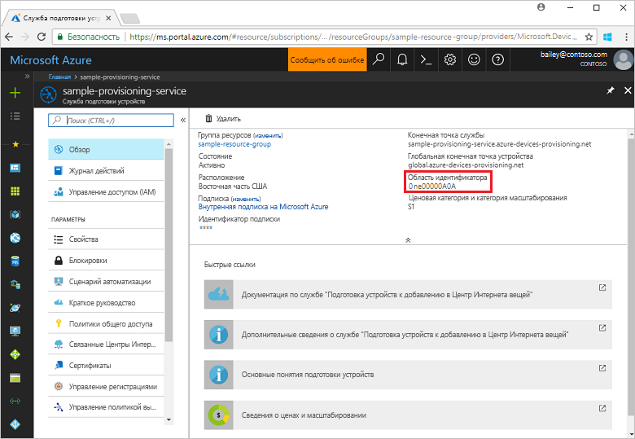
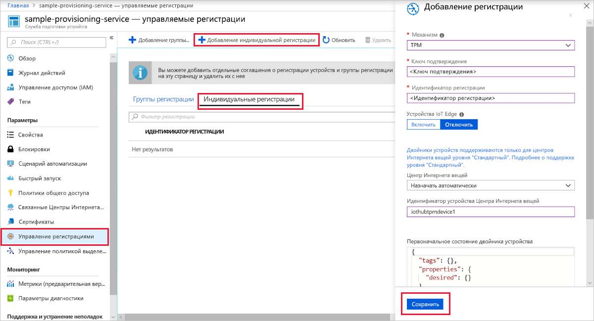
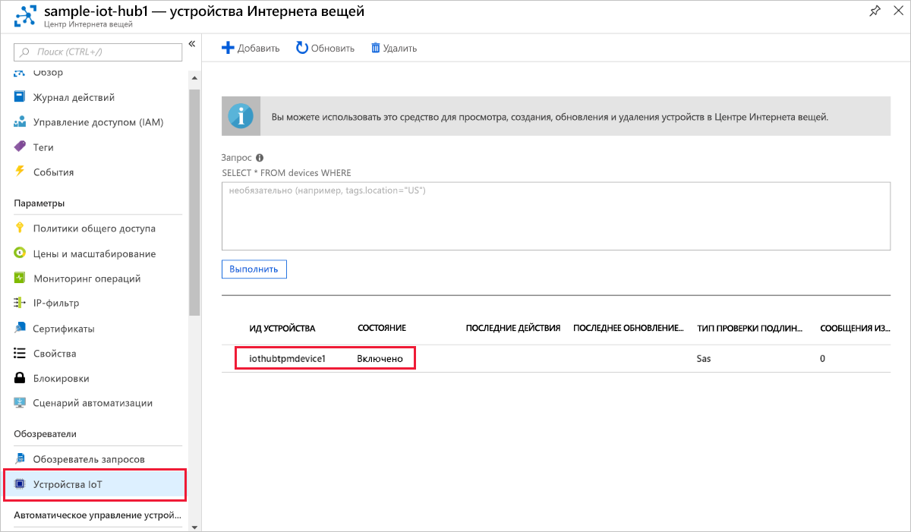

# <a name="quickstart-create-and-provision-a-simulated-tpm-device-using-c-device-sdk-for-iot-hub-device-provisioning-service"></a>Краткое руководство. Создание и подготовка имитированного устройства доверенного платформенного модуля с помощью пакета SDK службы устройства C# для службы подготовки устройств Центра Интернета вещей

[!INCLUDE [iot-dps-selector-quick-create-simulated-device-tpm](../../includes/iot-dps-selector-quick-create-simulated-device-tpm.md)]

В этой статье описывается, как с помощью [примеров Azure IoT для C#](https://github.com/Azure-Samples/azure-iot-samples-csharp) имитировать устройство TPM на компьютере для разработки под управлением ОС Windows. В примере также показано, как подключить это имитированное устройство к Центру Интернета вещей с помощью службы подготовки устройств. 

В примере кода в качестве [аппаратного модуля безопасности](https://azure.microsoft.com/blog/azure-iot-supports-new-security-hardware-to-strengthen-iot-security/) устройства используется симулятор доверенного платформенного модуля (TPM) Windows. 

Если вы не знакомы с процессом автоматической подготовки устройств, обязательно прочтите [эту статью](concepts-auto-provisioning.md). Кроме того, прежде чем продолжить, выполните инструкции по [настройке службы "Подготовка устройств к добавлению в Центр Интернета вещей" на портале Azure](./quick-setup-auto-provision.md). 

Служба подготовки устройств Интернета вещей Azure поддерживает два типа регистрации:

- [Группы регистрации](concepts-service.md#enrollment-group). Используются для регистрации нескольких связанных устройств.
- [Индивидуальные регистрации](concepts-service.md#individual-enrollment). Предназначены для регистрации одного устройства.

В этой статье описана индивидуальная регистрация.

[!INCLUDE [IoT Device Provisioning Service basic](../../includes/iot-dps-basic.md)]

<a id="setupdevbox"></a>
## <a name="prepare-the-development-environment"></a>Подготовка среды разработки 

1. Установите на компьютере [пакет SDK для .NET Core 2.1 или более поздней версии](https://www.microsoft.com/net/download/windows). 

1. Установите на компьютер систему `git` и добавьте ее в переменные среды, доступные в командном окне. Последнюю версию средств `git` для установки, которая включает **Git Bash**, приложение командной строки для взаимодействия с локальным репозиторием Git, можно найти на [этой странице](https://git-scm.com/download/). 

1. Откройте окно командной строки или Git Bash. Клонируйте репозиторий GitHub с примерами на C# для Интернета вещей Azure:

    ```cmd
    git clone https://github.com/Azure-Samples/azure-iot-samples-csharp.git
    ```

## <a name="provision-the-simulated-device"></a>Подготовка имитированного устройства

1. Войдите на портал Azure. Нажмите кнопку **Все ресурсы** в меню слева и откройте службу подготовки устройств. В колонке **Обзор** обратите внимание на значение **_Область идентификатора_** .

     

1. В окне командной строки замените каталоги на каталог проекта в примере подготовки устройства TPM.

    ```cmd
    cd .\azure-iot-samples-csharp\provisioning\Samples\device\TpmSample
    ```

1. Введите следующую команду, чтобы создать и запустить пример подготавливаемого устройства TPM. Замените значение `<IDScope>` значением области идентификатора для службы подготовки. 

    ```cmd
    dotnet run <IDScope>
    ```

    Эта команда запустит симулятор микросхемы TPM в отдельной командной строке. В Windows может появиться оповещение системы безопасности Windows с вопросом о том, следует ли разрешить Simulator.exe обмен данными в общедоступных сетях. В этом примере можно запретить обмен, выбрав "Отмена".

1. В исходном командном окне отображается **_ключ подтверждения_** , **_идентификатор регистрации_** и предполагаемый **_идентификатор устройства_** , необходимые для регистрации устройства. Запишите эти значения: Эти значения могут быть использованы при создании отдельной регистрации устройства в Службе подготовки устройств к добавлению в Центр Интернета вещей. 
   > [!NOTE]
   > Не путайте окно, содержащее выходные данные команды, с окном, которое содержит выходные данные из симулятора TPM. Возможно, потребуется выбрать исходное командное окно, чтобы перевести его на передний план.

     

1. На портале Azure в меню службы подготовки устройств выберите **Управление регистрациями**. Щелкните вкладку **Индивидуальные регистрации** и нажмите кнопку **Добавить индивидуальную регистрацию** вверху. 

1. На панели **Добавление регистрации** введите следующие сведения:
   - Выберите **доверенный платформенный модуль (TPM)** как *механизм* аттестации удостоверения.
   - Введите записанные ранее *идентификатор регистрации* и *ключ подтверждения* для вашего устройства доверенного платформенного модуля.
   - Выберите Центр Интернета вещей, связанный с вашей службой подготовки.
   - При необходимости можно указать следующие сведения:
       - Введите уникальное значение для параметра *Идентификатор устройства* (вы можете использовать предлагаемое значение или предоставить собственное). Убедитесь, что при назначении имен устройства не используются конфиденциальные данные. Если вы решите его не предоставлять, вместо него для идентификации устройства будет использоваться идентификатор регистрации.
       - Обновите **начальное состояние двойника устройства**, используя требуемую начальную конфигурацию для устройства.
   - По завершении нажмите кнопку **Сохранить**. 

       

   После успешной регистрации *идентификатор регистрации* устройства отобразится в списке под вкладкой *Отдельные регистрации*. 

1. Нажмите клавишу *ВВОД* в командном окне (где отображается **_ключ подтверждения_** , **_идентификатор регистрации_** и предполагаемый **_идентификатор устройства_** ), чтобы зарегистрировать имитированное устройство. Обратите внимание на сообщения, которые имитируют загрузку устройства и его подключение к службе подготовки устройств для получения информации Центра Интернета вещей. 

1. Убедитесь, что устройство подготовлено. После подготовки имитированного устройства для центра Интернета вещей, подключенного к службе подготовки, идентификатор устройства отобразится в колонке **Устройства Интернета вещей**. 

     

    Если в записи регистрации для своего устройства вы изменили значение по умолчанию для *начального состояния двойника устройства*, требуемое состояние двойника будет извлечено из концентратора с последующим выполнением соответствующих действий. См. [общие сведения о двойниках устройств и их использовании в Центре Интернета вещей](../iot-hub/iot-hub-devguide-device-twins.md).

## <a name="clean-up-resources"></a>Очистка ресурсов

Если вы планируете продолжить работу с примером клиентского устройства, не удаляйте ресурсы, созданные в ходе работы с этим кратким руководством. Если вы не планируете продолжать работу, следуйте инструкциям ниже, чтобы удалить все созданные ресурсы.

1. Закройте окно выходных данных примера клиентского устройства на компьютере.
1. Закройте окно симулятора доверенного платформенного модуля на компьютере.
1. В меню слева на портале Azure щелкните **Все ресурсы** и откройте службу подготовки устройств. В верхней части колонки **Обзор** нажмите **Удалить** в верхней части области.  
1. В меню слева на портале Azure щелкните **Все ресурсы** и выберите свой центр Интернета вещей. В верхней части колонки **Обзор** нажмите **Удалить** в верхней части области.  

## <a name="next-steps"></a>Дополнительная информация

Вы создали имитированное устройство доверенного платформенного модуля на компьютере и подготовили его для центра Интернета вещей с помощью Службы подготовки устройств к добавлению в Центр Интернета вещей. Чтобы узнать, как программными средствами зарегистрировать устройство доверенного платформенного модуля, изучите соответствующее краткое руководство. 

> [!div class="nextstepaction"]
> [Краткое руководство. Регистрация устройств TPM в службе "Подготовка устройств к добавлению в Центр Интернета вещей" пакета SDK для служб C#](quick-enroll-device-tpm-csharp.md)
