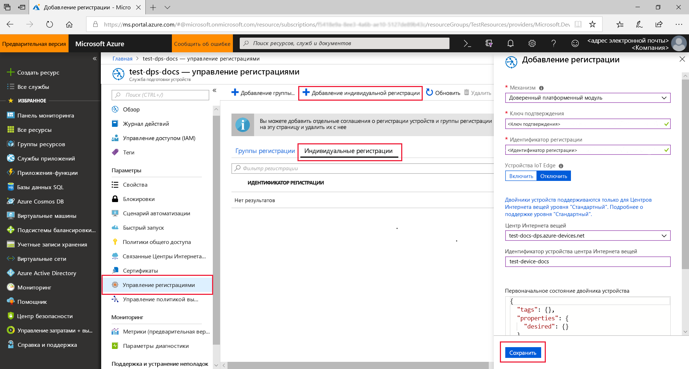
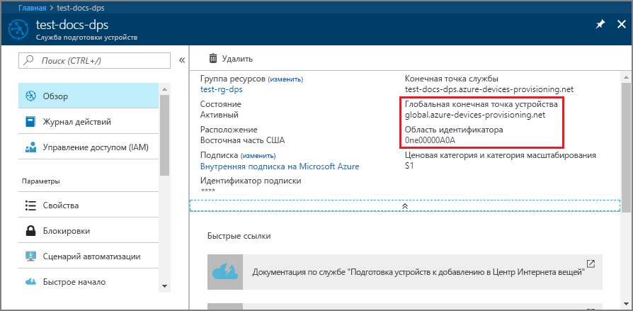
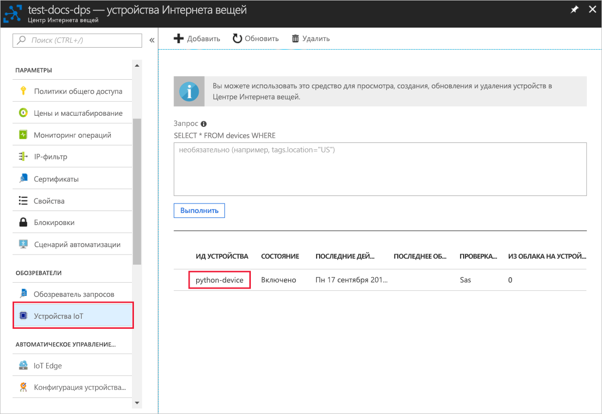

# <a name="quickstart-create-and-provision-a-simulated-tpm-device-using-python-device-sdk-for-iot-hub-device-provisioning-service"></a>Краткое руководство. Создание и подготовка имитированного устройства TPM с помощью пакета SDK устройств для Python для службы "Подготовка устройств к добавлению в Центр Интернета вещей"

[!INCLUDE [iot-dps-selector-quick-create-simulated-device-tpm](../../includes/iot-dps-selector-quick-create-simulated-device-tpm.md)]

В этом руководстве показано, как создать имитированное устройство на компьютере разработки под управлением ОС Windows, запустить симулятор доверенного платформенного модуля (TPM) Windows в качестве [аппаратного модуля безопасности](https://azure.microsoft.com/blog/azure-iot-supports-new-security-hardware-to-strengthen-iot-security/) устройства, а также как с помощью примера кода Python подключить это имитированное устройство к службе подготовки устройств и Центру Интернета вещей. 

> [!IMPORTANT]
> Эта статья предназначена исключительно для пакета SDK Python версии 1, который был объявлен нерекомендуемым. Клиенты устройств и служб для Службы подготовки устройств к добавлению в Центр Интернета вещей пока недоступны в версии 2. Сейчас ведутся работы по реализации всего функционала в версии 2.

Если вы не знакомы с процессом автоматической подготовки устройств, обязательно прочтите [эту статью](concepts-auto-provisioning.md). Кроме того, прежде чем продолжить, выполните инструкции по [настройке службы "Подготовка устройств к добавлению в Центр Интернета вещей" на портале Azure](./quick-setup-auto-provision.md). 

Служба подготовки устройств Интернета вещей Azure поддерживает два типа регистрации:
- [Группы регистрации](concepts-service.md#enrollment-group). Используются для регистрации нескольких связанных устройств.
- [Индивидуальные регистрации](concepts-service.md#individual-enrollment). Предназначены для регистрации одного устройства.

В этой статье описана индивидуальная регистрация.

[!INCLUDE [IoT Device Provisioning Service basic](../../includes/iot-dps-basic.md)]

## <a name="prepare-the-environment"></a>Подготовка среды 

1. Проверьте, установлена ли среда [Visual Studio](https://visualstudio.microsoft.com/vs/) 2015 или более поздней версии с включенной рабочей нагрузкой "Разработка классических приложений на C++".

1. Скачайте и установите [систему сборки CMake](https://cmake.org/download/).

1. Установите на компьютер систему `git` и добавьте ее в переменные среды, доступные в командном окне. Последнюю версию средств `git` для установки, которая включает **Git Bash**, приложение командной строки для взаимодействия с локальным репозиторием Git, можно найти на [этой странице](https://git-scm.com/download/). 

1. Откройте окно командной строки или Git Bash. Клонируйте репозиторий GitHub для примера кода виртуального устройства:
    
    ```cmd/sh
    git clone --single-branch --branch v1-deprecated https://github.com/Azure/azure-iot-sdk-python.git --recursive
    ```

1. Создайте папку в локальной копии этого репозитория GitHub для процесса сборки CMake. 

    ```cmd/sh
    cd azure-iot-sdk-python/c
    mkdir cmake
    cd cmake
    ```

1. В этом примере кода используется симулятор доверенного платформенного модуля Windows. Выполните следующую команду, чтобы включить аутентификацию маркера подписанного URL-адреса. Эта команда также создает решение Visual Studio для виртуального устройства.

    ```cmd/sh
    cmake -Duse_prov_client:BOOL=ON -Duse_tpm_simulator:BOOL=ON ..
    ```

1. В отдельной командной строке перейдите к папке симулятора [TPM](https://docs.microsoft.com/windows/device-security/tpm/trusted-platform-module-overview) и запустите его. Нажмите кнопку **Разрешить доступ**. Он ожидает передачи данных через сокет на портах 2321 и 2322. Не закрывайте командное окно. Симулятор должен работать, пока вы не выполните все инструкции из этого руководства. 

    ```cmd/sh
    .\azure-iot-sdk-python\c\provisioning_client\deps\utpm\tools\tpm_simulator\Simulator.exe
    ```

    


## <a name="create-a-device-enrollment-entry"></a>Создание записи о регистрации устройства

1. Откройте решение `azure_iot_sdks.sln`, созданное в папке *cmake*, и соберите его в Visual Studio.

1. Щелкните проект **tpm_device_provision** правой кнопкой мыши и выберите параметр **Назначить запускаемым проектом**. Запустите решение. Окно выходных данных отображает **_ключ подтверждения_** и **_идентификатор регистрации_** , необходимые для регистрации устройства. Запишите эти значения. 

    

1. Войдите на портал Azure, нажмите кнопку **Все ресурсы** в меню слева и откройте службу подготовки устройств.

1. В меню службы подготовки устройств выберите **Управление регистрациями**. Выберите вкладку **Индивидуальные регистрации** и нажмите кнопку **Добавить индивидуальную регистрацию** вверху. 

1. На панели **Добавление регистрации** введите следующие сведения:
   - Выберите **доверенный платформенный модуль (TPM)** как *механизм* аттестации удостоверения.
   - Введите записанные ранее *идентификатор регистрации* и *ключ подтверждения* для вашего устройства доверенного платформенного модуля.
   - Выберите Центр Интернета вещей, связанный с вашей службой подготовки.
   - При необходимости можно указать следующие сведения:
       - Укажите уникальный *идентификатор устройства*. Убедитесь, что при назначении имен устройства не используются конфиденциальные данные. Если вы решите его не предоставлять, вместо него для идентификации устройства будет использоваться идентификатор регистрации.
       - Обновите **начальное состояние двойника устройства**, используя требуемую начальную конфигурацию для устройства.
   - По завершении нажмите кнопку **Сохранить**. 

       

   После успешной регистрации *идентификатор регистрации* устройства отобразится в списке под вкладкой *Отдельные регистрации*. 


## <a name="simulate-the-device"></a>Имитация устройства

1. Скачайте и установите [Python 2.x или 3.x](https://www.python.org/downloads/). Обязательно используйте 32-разрядную или 64-разрядную версию установки согласно требованиям программы настройки. При появлении запроса во время установки обязательно добавьте Python в переменную среды соответствующей платформы.
    - Если вы работаете с ОС Windows, потребуется [распространяемый пакет Visual C++](https://support.microsoft.com/help/2977003/the-latest-supported-visual-c-downloads), чтобы разрешить использовать собственные библиотеки DLL из Python.

1. Следуйте [этим инструкциям](https://github.com/Azure/azure-iot-sdk-python/blob/v1-deprecated/doc/python-devbox-setup.md) по созданию пакетов Python.

   > [!NOTE]
   > Если выполняется скрипт `build_client.cmd`, обязательно используйте флаг `--use-tpm-simulator`.
   > 
   > [!NOTE]
   > При использовании `pip` обязательно установите пакет `azure-iot-provisioning-device-client`. Обратите внимание, что для выпущенных пакетов PIP применяются реальные модули TPM, а не симуляторы. Чтобы использовать симулятор, необходимо выполнить сборку из источника, применив флаг `--use-tpm-simulator`.

1. Перейдите к папке с примерами.

    ```cmd/sh
    cd azure-iot-sdk-python/provisioning_device_client/samples
    ```

1. Используя интегрированную среду разработки для Python, измените скрипт Python с именем **provisioning\_device\_client\_sample.py**. Замените значения переменных *GLOBAL\_PROV\_URI* и *ID\_SCOPE* на значения, записанные ранее. Также убедитесь, что для *SECURITY\_DEVICE\_TYPE* задано значение `ProvisioningSecurityDeviceType.TPM`.

    ```python
    GLOBAL_PROV_URI = "{globalServiceEndpoint}"
    ID_SCOPE = "{idScope}"
    SECURITY_DEVICE_TYPE = ProvisioningSecurityDeviceType.TPM
    PROTOCOL = ProvisioningTransportProvider.HTTP
    ```

    

1. Запустите пример. 

    ```cmd/sh
    python provisioning_device_client_sample.py
    ```

1. Обратите внимание на сообщения, которые имитируют загрузку устройства и его подключение к службе подготовки устройств для получения информации Центра Интернета вещей. 

    

1. После подготовки имитированного устройства для центра Интернета вещей, подключенного к службе подготовки, идентификатор устройства отобразится в колонке **Устройства Интернета вещей**.

     

    Если в записи регистрации для своего устройства вы изменили значение по умолчанию для *начального состояния двойника устройства*, требуемое состояние двойника будет извлечено из концентратора с последующим выполнением соответствующих действий. См. [общие сведения о двойниках устройств и их использовании в Центре Интернета вещей](../iot-hub/iot-hub-devguide-device-twins.md).


## <a name="clean-up-resources"></a>Очистка ресурсов

Если вы планируете продолжить работу с примером клиентского устройства, не удаляйте ресурсы, созданные в ходе работы с этим кратким руководством. Если вы не планируете продолжать работу, следуйте инструкциям ниже, чтобы удалить все созданные ресурсы.

1. Закройте окно выходных данных примера клиентского устройства на компьютере.
1. Закройте окно симулятора доверенного платформенного модуля на компьютере.
1. В меню слева на портале Azure щелкните **Все ресурсы** и откройте службу подготовки устройств. Откройте колонку **Управление регистрациями** для службы, а затем щелкните вкладку **Индивидуальные регистрации**. Установите флажок рядом с *идентификатором регистрации* устройства, которое вы зарегистрировали в рамках этого краткого руководства, и нажмите кнопку **Удалить** в верхней части панели. 
1. В меню слева на портале Azure щелкните **Все ресурсы** и выберите свой центр Интернета вещей. Откройте колонку **Устройства Интернета вещей** для нужного концентратора, установите флажок *Идентификатор устройства*, зарегистрированного в процессе работы с кратким руководством, и нажмите кнопку **Удалить** в верхней части панели.

## <a name="next-steps"></a>Дополнительная информация

Вы создали имитированное устройство доверенного платформенного модуля на компьютере и подготовили его для центра Интернета вещей с помощью Службы подготовки устройств к добавлению в Центр Интернета вещей. Чтобы узнать, как программными средствами зарегистрировать устройство доверенного платформенного модуля, изучите соответствующее краткое руководство. 

> [!div class="nextstepaction"]
> [Краткое руководство. Регистрация устройств TPM в службе "Подготовка устройств к добавлению в Центр Интернета вещей" пакета SDK для службы подготовки Python](quick-enroll-device-tpm-python.md)
