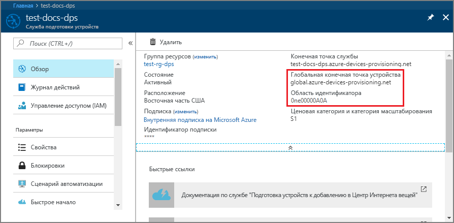
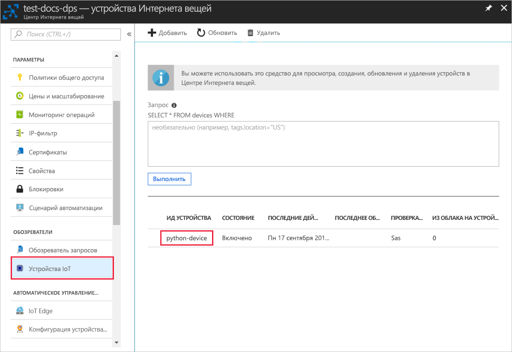

# <a name="quickstart-create-and-provision-a-simulated-x509-device-using-python-device-sdk-for-iot-hub-device-provisioning-service"></a>Краткое руководство. Создание и подготовка имитированного устройства X.509 с помощью пакета SDK службы устройства Python для службы подготовки устройств Центра Интернета вещей

[!INCLUDE [iot-dps-selector-quick-create-simulated-device-x509](../../includes/iot-dps-selector-quick-create-simulated-device-x509.md)]

В этом руководстве показано, как имитировать устройство X.509 на компьютере разработки под управлением ОС Windows, а также как с помощью примера кода Python подключить имитированное устройство к службе подготовки устройств и Центру Интернета вещей. 

> [!IMPORTANT]
> Эта статья предназначена исключительно для пакета SDK Python версии 1, который был объявлен нерекомендуемым. Клиенты устройств и служб для Службы подготовки устройств к добавлению в Центр Интернета вещей пока недоступны в версии 2. Сейчас ведутся работы по реализации всего функционала в версии 2.

Если вы не знакомы с процессом автоматической подготовки устройств, обязательно прочтите [эту статью](concepts-auto-provisioning.md). Кроме того, прежде чем продолжить, выполните инструкции по [настройке службы "Подготовка устройств к добавлению в Центр Интернета вещей" на портале Azure](./quick-setup-auto-provision.md). 

Служба подготовки устройств Интернета вещей Azure поддерживает два типа регистрации:
- [Группы регистрации](concepts-service.md#enrollment-group). Используются для регистрации нескольких связанных устройств.
- [Индивидуальные регистрации](concepts-service.md#individual-enrollment). Предназначены для регистрации одного устройства.

В этой статье описана индивидуальная регистрация.

[!INCLUDE [IoT Device Provisioning Service basic](../../includes/iot-dps-basic.md)]

## <a name="prepare-the-environment"></a>Подготовка среды 

1. Проверьте, установлена ли среда [Visual Studio](https://visualstudio.microsoft.com/vs/) 2015 или более поздней версии с включенной рабочей нагрузкой "Разработка классических приложений на C++".

2. Скачайте и установите [систему сборки CMake](https://cmake.org/download/).

3. Установите на компьютер систему `git` и добавьте ее в переменные среды, доступные в командном окне. Последнюю версию средств `git` для установки, которая включает **Git Bash**, приложение командной строки для взаимодействия с локальным репозиторием Git, можно найти на [этой странице](https://git-scm.com/download/). 

4. Откройте окно командной строки или Git Bash. Клонируйте из репозитория GitHub пример кода для имитации устройства.
    
    ```cmd/sh
    git clone https://github.com/Azure/azure-iot-sdk-python.git --recursive
    ```

5. Создайте папку в локальной копии этого репозитория GitHub для процесса сборки CMake. 

    ```cmd/sh
    cd azure-iot-sdk-python/c
    mkdir cmake
    cd cmake
    ```

6. Чтобы создать решение Visual Studio для клиента подготовки, выполните следующую команду.

    ```cmd/sh
    cmake -Duse_prov_client:BOOL=ON ..
    ```


## <a name="create-a-self-signed-x509-device-certificate-and-individual-enrollment-entry"></a>Создание самозаверяющего сертификата устройства X.509 и запись отдельной регистрации

В этом разделе вы используете самозаверяющий сертификат X.509. При этом стоит учесть следующее:

* Самозаверяющие сертификаты предназначены только для тестирования и не должны использоваться в рабочей среде.
* Срок действия самозаверяющего сертификата по умолчанию составляет один год.

Вы воспользуетесь примером кода из пакета SDK для Интернета вещей Azure для С, чтобы создать сертификат, который будет использоваться с отдельной записью регистрации для имитированного устройства.

1. Откройте решение `azure_iot_sdks.sln`, созданное в папке *cmake*, и соберите его в Visual Studio.

2. В папке **Provision\_Tools** щелкните правой кнопкой мыши проект **dice\_device\_enrollment** и выберите пункт **Назначить запускаемым проектом**. Запустите решение. 

3. В окне вывода введите `i` (индивидуальная регистрация), когда появится запрос. В окне вывода отобразится локально созданный сертификат X.509 для имитированного устройства. 
    
    Скопируйте первый сертификат в буфер обмена. Начните копировать с первой строки:
    
        -----BEGIN CERTIFICATE----- 
        
    И закончите копировать после первой встретившейся строки:
    
        -----END CERTIFICATE-----
        
    Обязательно скопируйте и эти строки. 

    
 
4. На компьютере с ОС Windows создайте файл **_X509testcertificate.pem_** , откройте его в любом редакторе и скопируйте в него содержимое из буфера обмена. Сохраните файл. 

5. Войдите на портал Azure, нажмите кнопку **Все ресурсы** в меню слева и откройте службу подготовки.

6. В меню службы подготовки устройств выберите **Управление регистрациями**. Выберите вкладку **Индивидуальные регистрации** и нажмите кнопку **Добавить индивидуальную регистрацию** вверху. 

7. На панели **Добавление регистрации** введите следующие сведения:
   - Выберите **X.509** как *механизм* аттестации удостоверения.
   - В поле *PEM-файл или CER-файл первичного сертификата* щелкните *Выберите файл*, чтобы выбрать созданный ранее файл сертификата **X509testcertificate.pem**.
   - При необходимости можно указать следующие сведения:
     - Выберите Центр Интернета вещей, связанный с вашей службой подготовки.
     - Укажите уникальный идентификатор устройства. Убедитесь, что при назначении имен устройства не используются конфиденциальные данные. 
     - Обновите **начальное состояние двойника устройства**, используя требуемую начальную конфигурацию для устройства.
   - По завершении нажмите кнопку **Сохранить**. 

     [](./media/python-quick-create-simulated-device-x509/device-enrollment.png#lightbox)

   После успешной регистрации устройство X.509 отобразится как **riot-device-cert** в столбце *Идентификатор регистрации* на вкладке *Индивидуальные регистрации*. 

## <a name="simulate-the-device"></a>Имитация устройства

1. В меню службы подготовки устройств выберите **Обзор**. Запишите значения параметров _Область идентификатора_ и _Global Service Endpoint_ (Конечная точка глобальной службы).

    

2. Скачайте и установите [Python 2.x или 3.x](https://www.python.org/downloads/). Обязательно используйте 32-разрядную или 64-разрядную версию установки согласно требованиям программы настройки. При появлении запроса во время установки обязательно добавьте Python в переменную среды соответствующей платформы. Если вы используете Python 2.x, может потребоваться [установка или обновление *pip* — системы управления пакетами Python](https://pip.pypa.io/en/stable/installing/).
    
    > [!NOTE] 
    > Если вы используете Windows, также установите [Распространяемый компонент Visual C++ для Visual Studio 2015](https://support.microsoft.com/help/2977003/the-latest-supported-visual-c-downloads). Для загрузки и выполнения библиотек DLL C пакетам pip требуется распространяемый компонент.

3. Следуйте [этим инструкциям](https://github.com/Azure/azure-iot-sdk-python/blob/v1-deprecated/doc/python-devbox-setup.md) по созданию пакетов Python.

   > [!NOTE]
   > При использовании `pip` обязательно установите пакет `azure-iot-provisioning-device-client`.

4. Перейдите к папке с примерами.

    ```cmd/sh
    cd azure-iot-sdk-python/provisioning_device_client/samples
    ```

5. Используя интегрированную среду разработки для Python, измените скрипт Python с именем **provisioning\_device\_client\_sample.py**. Замените значения переменных _GLOBAL\_PROV\_URI_ и _ID\_SCOPE_ на значения, записанные ранее.

    ```python
    GLOBAL_PROV_URI = "{globalServiceEndpoint}"
    ID_SCOPE = "{idScope}"
    SECURITY_DEVICE_TYPE = ProvisioningSecurityDeviceType.X509
    PROTOCOL = ProvisioningTransportProvider.HTTP
    ```

6. Запустите пример. 

    ```cmd/sh
    python provisioning_device_client_sample.py
    ```

7. Приложение установит подключение, зарегистрирует устройство и выведет сообщение об успешной регистрации.

    

8. На портале перейдите в Центр Интернета вещей, связанный со службой подготовки, и откройте колонку **Обозреватель устройств**. Когда имитированное устройство X.509 будет успешно подготовлено для центра, в колонке **Обозреватель устройств** появится идентификатор этого устройства со значением **Включено** в столбце *Состояние*. Если вы уже открывали колонку, прежде чем запустить пример приложения для устройства, возможно, потребуется нажать кнопку **Обновить** вверху. 

     

> [!NOTE]
> Если в записи регистрации для своего устройства вы изменили значение по умолчанию для *начального состояния двойника устройства*, требуемое состояние двойника будет извлечено из концентратора с последующим выполнением соответствующих действий. См. [общие сведения о двойниках устройств и их использовании в Центре Интернета вещей](../iot-hub/iot-hub-devguide-device-twins.md).
>

## <a name="clean-up-resources"></a>Очистка ресурсов

Если вы планируете продолжить работу с примером клиентского устройства, не удаляйте ресурсы, созданные в ходе работы с этим кратким руководством. Если вы не планируете продолжать работу, следуйте инструкциям ниже, чтобы удалить все созданные ресурсы.

1. Закройте окно выходных данных примера клиентского устройства на компьютере.
2. В меню слева на портале Azure щелкните **Все ресурсы** и откройте службу подготовки устройств. Откройте колонку **Управление регистрациями** для службы, а затем щелкните вкладку **Индивидуальные регистрации**. Установите флажок рядом с *идентификатором регистрации* устройства, которое вы зарегистрировали в рамках этого краткого руководства, и нажмите кнопку **Удалить** в верхней части панели. 
3. В меню слева на портале Azure щелкните **Все ресурсы** и выберите свой центр Интернета вещей. Откройте колонку **Устройства Интернета вещей** для нужного концентратора, установите флажок *Идентификатор устройства*, зарегистрированного в процессе работы с кратким руководством, и нажмите кнопку **Удалить** в верхней части панели.

## <a name="next-steps"></a>Дополнительная информация

В рамках этого краткого руководства вы создали имитированное устройство X.509 на компьютере Windows и подготовили его для центра Интернета вещей с помощью Службы подготовки устройств к добавлению в Центр Интернета вещей Azure на портале. Чтобы узнать, как выполнить программную регистрацию устройства X.509, изучите соответствующее краткое руководство. 

> [!div class="nextstepaction"]
> [Краткое руководство. Регистрация устройств X.509 в Службе подготовки устройств с помощью C#](quick-enroll-device-x509-python.md)
