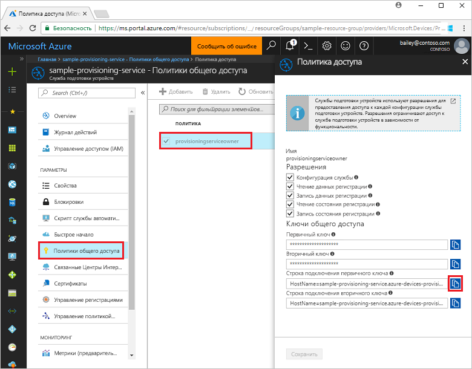
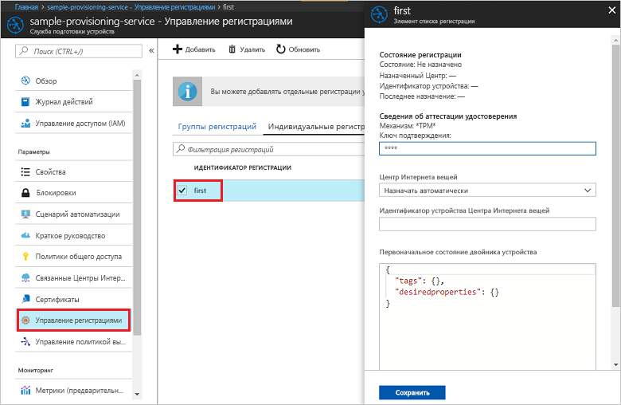

# <a name="quickstart-enroll-tpm-device-to-iot-hub-device-provisioning-service-using-nodejs-service-sdk"></a>Краткое руководство. Регистрация устройств TPM в службе подготовки устройств Центра Интернета вещей с помощью пакета SDK для службы Node.js

[!INCLUDE [iot-dps-selector-quick-enroll-device-tpm](../../includes/iot-dps-selector-quick-enroll-device-tpm.md)]

В этом кратком руководстве показано, как программными средствами создать индивидуальную регистрацию устройства TPM в Службу подготовки устройств к добавлению в Центр Интернета вещей с помощью пакета SDK для службы Node.js и примера приложения Node.js. С помощью этой записи отдельной регистрации вы можете по мере необходимости регистрировать имитированные устройства TPM в службе подготовки.

## <a name="prerequisites"></a>Предварительные требования

- Выполнение инструкций из краткого руководства по [настройке Службы подготовки устройств к добавлению в Центр Интернета вещей на портале Azure](./quick-setup-auto-provision.md).
- Учетная запись Azure с активной подпиской. [Создайте бесплатно](https://azure.microsoft.com/free/?ref=microsoft.com&utm_source=microsoft.com&utm_medium=docs&utm_campaign=visualstudio).
- [Node.js версии 4.0 и более поздней](https://nodejs.org). В этом кратком руководстве мы устанавливаем [пакет SDK для службы Node.js](https://github.com/Azure/azure-iot-sdk-node), приведенный ниже.
- Ключ подтверждения (необязательно). Выполните действия, описанные в кратком руководстве [Подготовка имитированного устройства TPM с помощью пакета SDK Интернета вещей Azure для C](quick-create-simulated-device.md) до получения ключа. Не создавайте индивидуальную регистрацию с помощью портала Azure.

## <a name="create-the-individual-enrollment-sample"></a>Создание примера для отдельной регистрации 

 
1. В окне командной строки перейдите в рабочую папку и выполните следующую команду:
  
    ```cmd\sh
    npm install azure-iot-provisioning-service
    ```  

2. С помощью текстового редактора создайте а рабочей папке файл **create_individual_enrollment.js**. Добавьте в этот файл следующий код и сохраните файл:

    ```
    'use strict';

    var provisioningServiceClient = require('azure-iot-provisioning-service').ProvisioningServiceClient;

    var serviceClient = provisioningServiceClient.fromConnectionString(process.argv[2]);
    var endorsementKey = process.argv[3];

    var enrollment = {
      registrationId: 'first',
      attestation: {
        type: 'tpm',
        tpm: {
          endorsementKey: endorsementKey
        }
      }
    };

    serviceClient.createOrUpdateIndividualEnrollment(enrollment, function(err, enrollmentResponse) {
      if (err) {
        console.log('error creating the individual enrollment: ' + err);
      } else {
        console.log("enrollment record returned: " + JSON.stringify(enrollmentResponse, null, 2));
      }
    });
    ```

## <a name="run-the-individual-enrollment-sample"></a>Запуск примера отдельной регистрации
  
1. Чтобы запустить этот пример, вам потребуется строка подключения к службе подготовки. 
    1. Войдите на портал Azure, нажмите кнопку **Все ресурсы** в меню слева и откройте службу подготовки устройств. 
    2. Выберите **Политики общего доступа**, а затем нужную политику доступа, чтобы открыть ее свойства. В окне **Политика доступа** скопируйте и запишите строку подключения первичного ключа. 

        


2. Вам также потребуется ключ подтверждения для устройства. Если вы создали имитированное устройство TPM с помощью краткого руководства [Создание и подготовка имитированного устройства с помощью службы подготовки устройств Центра Интернета вещей](quick-create-simulated-device.md), используйте созданный в нем ключ для устройства. В противном случае вы можете создать пример индивидуальной регистрации с помощью стандартного ключа подтверждения, который входит в [пакет SDK для службы Node.js](https://github.com/Azure/azure-iot-sdk-node):

    ```
    AToAAQALAAMAsgAgg3GXZ0SEs/gakMyNRqXXJP1S124GUgtk8qHaGzMUaaoABgCAAEMAEAgAAAAAAAEAxsj2gUScTk1UjuioeTlfGYZrrimExB+bScH75adUMRIi2UOMxG1kw4y+9RW/IVoMl4e620VxZad0ARX2gUqVjYO7KPVt3dyKhZS3dkcvfBisBhP1XH9B33VqHG9SHnbnQXdBUaCgKAfxome8UmBKfe+naTsE5fkvjb/do3/dD6l4sGBwFCnKRdln4XpM03zLpoHFao8zOwt8l/uP3qUIxmCYv9A7m69Ms+5/pCkTu/rK4mRDsfhZ0QLfbzVI6zQFOKF/rwsfBtFeWlWtcuJMKlXdD8TXWElTzgh7JS4qhFzreL0c1mI0GCj+Aws0usZh7dLIVPnlgZcBhgy1SSDQMQ==
    ```

3. Чтобы создать отдельную регистрацию устройства TPM, выполните следующую команду (сохранив кавычки для аргументов команд):
 
     ```cmd\sh
     node create_individual_enrollment.js "<the connection string for your provisioning service>" "<endorsement key>"
     ```
 
3. После успешного создания в окне командной строки отобразятся свойства новой отдельной регистрации.

     

4. Убедитесь, что отдельная регистрация успешно создана. На портале Azure в колонке сводки для службы подготовки устройств выберите **Управление регистрациями**. Выберите вкладку **Индивидуальные регистрации** и щелкните новую (*первую*) запись регистрации, чтобы проверить ключ подтверждения и другие свойства этой записи.

     
 
Итак, вы создали отдельную регистрацию для устройства TPM. Если вы хотите сразу зарегистрировать имитированное устройство, выполните оставшиеся шаги из руководства [Создание и подготовка имитированного устройства с помощью службы подготовки устройств Центра Интернета вещей](quick-create-simulated-device.md). Пропустите все шаги по созданию отдельной регистрации с помощью портала Azure, включенные в это краткое руководство.

## <a name="clean-up-resources"></a>Очистка ресурсов
Если вы планируете изучить пример службы Node.js, не удаляйте ресурсы, которые вы создали при работе с этим кратким руководством. Если вы не планируете продолжать работу, следуйте инструкциям ниже, чтобы удалить все созданные ресурсы.

1. Закройте окно выходных данных примера Node.js, если оно открыто на компьютере.
1. Если вы создавали имитированное устройство TPM, закройте окно симулятора.
2. Перейдите к службе подготовки устройств на портале Azure, откройте раздел **Управление регистрациями** и выберите вкладку **Индивидуальные регистрации**. Выберите флажок рядом с *идентификатором регистрации* для записи регистрации, которую вы создали в процессе работы с этим кратким руководством, и нажмите кнопку **Удалить** в верхней части панели. 
 
## <a name="next-steps"></a>Дальнейшие действия
При работе с этим кратким руководством вы программным способом создали запись отдельной регистрации для устройства TPM, а также (необязательно) создали на компьютере имитированное устройство TPM и подготовили его для Центра Интернета вещей с помощью Службы подготовки устройств к добавлению в Центр Интернета вещей Azure. Дополнительные сведения о подготовке устройств см. в руководстве по настройке службы подготовки устройств на портале Azure. 
 
> [!div class="nextstepaction"]
> [Руководства по службе подготовки устройств для Центра Интернета вещей Azure](./tutorial-set-up-cloud.md)