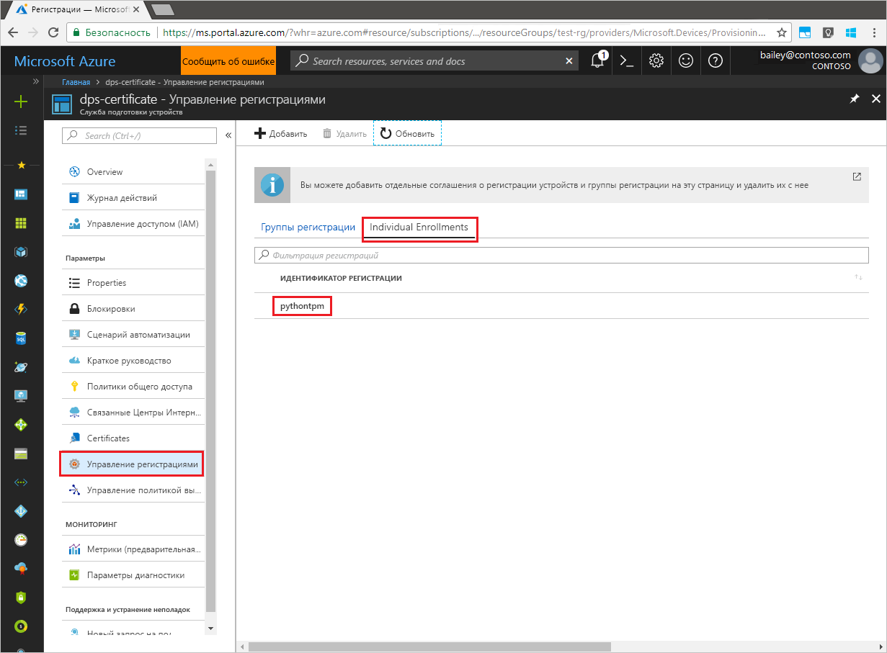

# <a name="quickstart-enroll-tpm-device-to-iot-hub-device-provisioning-service-using-python-provisioning-service-sdk"></a>Краткое руководство. Регистрация устройств TPM в службе "Подготовка устройств к добавлению в Центр Интернета вещей" пакета SDK для службы подготовки Python

[!INCLUDE [iot-dps-selector-quick-enroll-device-tpm](../../includes/iot-dps-selector-quick-enroll-device-tpm.md)]

В этой статье показано, как программными средствами создать отдельную регистрацию устройства TPM в службе "Подготовка устройств к добавлению в Центр Интернета вещей" с помощью [пакета SDK для службы подготовки Python версии 1](https://github.com/Azure/azure-iot-sdk-python/tree/v1-deprecated/provisioning_service_client) и примера приложения Python. В этой статье процесс регистрации описан на примере компьютера под управлением Windows. Но пакет SDK для службы Python также успешно работает на Linux.

> [!IMPORTANT]
> Эта статья предназначена исключительно для пакета SDK Python версии 1, который был объявлен нерекомендуемым. Клиенты устройств и служб для Службы подготовки устройств к добавлению в Центр Интернета вещей пока недоступны в версии 2. Сейчас ведутся работы по реализации всего функционала в версии 2.

Прежде чем продолжить, [настройте службу подготовки устройств Центра Интернета вещей на портале Azure](./quick-setup-auto-provision.md).


<a id="prepareenvironment"></a>

## <a name="prepare-the-environment"></a>Подготовка среды 

1. Скачайте и установите [Python 2.x или 3.x](https://www.python.org/downloads/). Обязательно используйте 32-разрядную или 64-разрядную версию установки согласно требованиям программы настройки. При появлении запроса во время установки обязательно добавьте Python в переменную среды соответствующей платформы. 

1. Выберите один из следующих вариантов:

    - Создайте и скомпилируйте **пакет SDK для Azure IoT Python**. Следуйте [этим инструкциям](https://github.com/Azure/azure-iot-sdk-python/blob/v1-deprecated/doc/python-devbox-setup.md) по созданию пакетов Python. Если вы работаете с ОС Windows, также установите [распространяемый пакет Visual C++](https://support.microsoft.com/help/2977003/the-latest-supported-visual-c-downloads), чтобы разрешить использовать собственные библиотеки DLL из Python.

    - [Установите или обновите *pip*, систему управления пакетами Python](https://pip.pypa.io/en/stable/installing/) и установите пакет с помощью следующей команды.

        ```cmd/sh
        pip install azure-iothub-provisioningserviceclient
        ```

1. Вам потребуется ключ подтверждения для устройства. Если вы создали имитированное устройство TPM с помощью краткого руководства [Создание и подготовка имитированного устройства с помощью службы подготовки устройств Центра Интернета вещей](quick-create-simulated-device.md), используйте созданный в нем ключ для устройства. В противном случае вы можете использовать следующий ключ подтверждения, который входит в пакет SDK.

    ```
    AToAAQALAAMAsgAgg3GXZ0SEs/gakMyNRqXXJP1S124GUgtk8qHaGzMUaaoABgCAAEMAEAgAAAAAAAEAtW6MOyCu/Nih47atIIoZtlYkhLeCTiSrtRN3q6hqgOllA979No4BOcDWF90OyzJvjQknMfXS/Dx/IJIBnORgCg1YX/j4EEtO7Ase29Xd63HjvG8M94+u2XINu79rkTxeueqW7gPeRZQPnl1xYmqawYcyzJS6GKWKdoIdS+UWu6bJr58V3xwvOQI4NibXKD7htvz07jLItWTFhsWnTdZbJ7PnmfCa2vbRH/9pZIow+CcAL9mNTNNN4FdzYwapNVO+6SY/W4XU0Q+dLMCKYarqVNH5GzAWDfKT8nKzg69yQejJM8oeUWag/8odWOfbszA+iFjw3wVNrA5n8grUieRkPQ==
    ```


## <a name="modify-the-python-sample-code"></a>Изменение примера кода Python

В этом разделе показано, как добавить в пример кода сведения о подготовке устройства TPM. 

1. В текстовом редакторе создайте файл **TpmEnrollment.py**.

1. Добавьте следующие инструкции `import` и переменные в начало файла **TpmEnrollment.py**: Затем замените `dpsConnectionString` вашей строкой подключения, которая находится в разделе **Политики общего доступа** в **службе подготовки устройств** на **портале Azure**. Замените `endorsementKey` значением, указанным ранее в разделе [Подготовка среды](quick-enroll-device-tpm-python.md#prepareenvironment). Наконец, создайте уникальный идентификатор `registrationid` и убедитесь, что он состоит только из алфавитно-цифровых символов нижнего регистра и дефисов.  
   
    ```python
    from provisioningserviceclient import ProvisioningServiceClient
    from provisioningserviceclient.models import IndividualEnrollment, AttestationMechanism

    CONNECTION_STRING = "{dpsConnectionString}"

    ENDORSEMENT_KEY = "{endorsementKey}"

    REGISTRATION_ID = "{registrationid}"
    ```

1. Добавьте следующую функцию и ее вызов, чтобы реализовать создание групповой регистрации:
   
    ```python
    def main():
        print ( "Starting individual enrollment..." )

        psc = ProvisioningServiceClient.create_from_connection_string(CONNECTION_STRING)

        att = AttestationMechanism.create_with_tpm(ENDORSEMENT_KEY)
        ie = IndividualEnrollment.create(REGISTRATION_ID, att)

        ie = psc.create_or_update(ie)
    
        print ( "Individual enrollment successful." )
    
    if __name__ == '__main__':
        main()
    ```

1. Сохраните и закройте файл **TpmEnrollment.py**.
 

## <a name="run-the-sample-tpm-enrollment"></a>Запуск образца регистрации доверенного платформенного модуля

1. Откройте командную строку и выполните скрипт.

    ```cmd/sh
    python TpmEnrollment.py
    ```

1. Удостоверьтесь, что регистрация прошла успешно, просмотрев выходные данные.

1. Откройте службу подготовки на портале Azure. Выберите **Управление регистрациями**. Обратите внимание, что устройство доверенного платформенного модуля отображается на вкладке **Индивидуальные регистрации** с именем созданного ранее `registrationid`. 

      


## <a name="clean-up-resources"></a>Очистка ресурсов
Если вы планируете изучить пример службы Java, не удаляйте ресурсы, созданные при работе с этим кратким руководством. Если вы не планируете продолжать работу, следуйте инструкциям ниже, чтобы удалить все созданные ресурсы.

1. Закройте окно выходных данных примера Python, если оно открыто на компьютере.
1. Если вы создавали имитированное устройство TPM, закройте окно симулятора.
1. Перейдите к службе подготовки устройств на портале Azure, откройте раздел **Управление регистрациями** и выберите вкладку **Индивидуальные регистрации**. Выберите флажок рядом с *идентификатором регистрации* для записи регистрации, которую вы создали в процессе работы с этим кратким руководством, и нажмите кнопку **Удалить** в верхней части панели.


## <a name="next-steps"></a>Дополнительная информация
При работе с этим кратким руководством вы программным способом создали запись отдельной регистрации для устройства TPM, а также (необязательно) создали на компьютере имитированное устройство TPM и подготовили его для Центра Интернета вещей с помощью Службы подготовки устройств к добавлению в Центр Интернета вещей Azure. Дополнительные сведения о подготовке устройств см. в руководстве по настройке службы подготовки устройств на портале Azure.

> [!div class="nextstepaction"]
> [Руководства по службе подготовки устройств для Центра Интернета вещей Azure](./tutorial-set-up-cloud.md)
