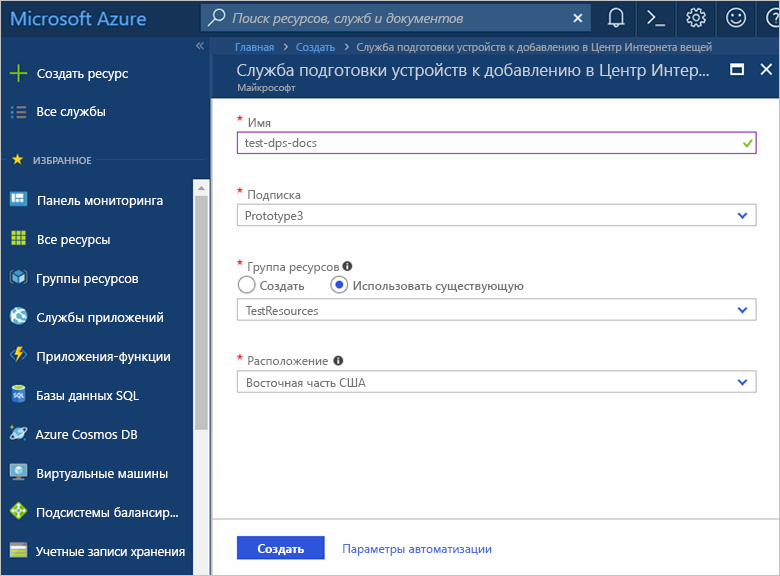
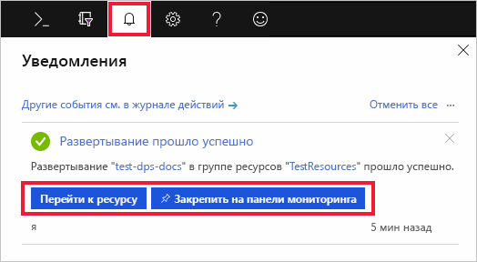

# Краткое руководство. Настройка службы подготовки устройств для Центра Интернета вещей на портале Azure

Службу подготовки устройств к добавлению в Центр Интернета вещей можно использовать с Центром Интернета вещей для обеспечения полностью автоматической JIT-подготовки для нужного Центра Интернета вещей. Она позволяет подготавливать миллионы устройств Интернета вещей и обеспечивает высокий уровень безопасности и масштабируемости без каких-либо действий со стороны пользователя. Служба подготовки устройств к добавлению в Центр Интернета вещей поддерживает устройства Интернета вещей с проверкой подлинности с помощью доверенного платформенного модуля (TPM), симметричного ключа и сертификата X.509. Дополнительные сведения см. в статье [Подготовка устройств с помощью Службы подготовки устройств к добавлению в Центр Интернета вещей](./about-iot-dps.md).

В рамках этого краткого руководства вы настроите Службу подготовки устройств к добавлению в Центр Интернета вещей на портале Azure для подготовки устройств. Для этого необходимо:
> [!div class="checklist"]
> * создать Центр Интернета вещей с помощью портала Azure;
> * использовать портал Azure для создания службы подготовки устройств для Центра Интернета вещей и получить область идентификаторов;
> * связать Центр Интернета вещей со службой подготовки устройств;

Если у вас еще нет подписки Azure, [создайте бесплатную учетную запись Azure](https://azure.microsoft.com/free/?WT.mc_id=A261C142F), прежде чем начинать работу.

## Создание Центра Интернета вещей

[!INCLUDE [iot-hub-include-create-hub](../../includes/iot-hub-include-create-hub.md)]

## Создание Службы подготовки устройств к добавлению в Центр Интернета вещей

1. Нажмите кнопку **+ Create a resource** (+ Создать ресурс) еще раз.

2. *Выполните в Marketplace поиск* по запросу **Служба подготовки устройств**. Выберите **Служба подготовки устройств к добавлению в Центр Интернета вещей** и нажмите кнопку **Создать**. 

3. Укажите следующие сведения для нового экземпляра службы подготовки устройств и нажмите кнопку **Создать**.

    * **Имя.** Укажите уникальное имя нового экземпляра службы подготовки устройств. Если введенное имя доступно, появится зеленая галочка.
    * **Подписка**: Выберите подписку, с помощью которой нужно создать экземпляр службы подготовки устройств.
    * **Группа ресурсов**. Это поле позволяет создать новую группу ресурсов или выбрать существующую. В этой группе ресурсов будет содержаться новый экземпляр. Выберите ту же группу ресурсов, содержащую центр Интернета вещей, созданный ранее, например **TestResources**. Помещение всех связанных ресурсов в одну группу позволит управлять ими совместно. Например, при удалении группы ресурсов все содержащиеся в ней ресурсы также удаляются. Дополнительные сведения о группах ресурсов см. в статье об [управлении группами ресурсов в Azure Resource Manager](../azure-resource-manager/management/manage-resource-groups-portal.md).
    * **Расположение**. Выберите ближайшее к вашим устройствам расположение.

        

4. Нажмите кнопку уведомлений, чтобы отслеживать процесс создания экземпляра ресурса. Когда служба будет успешно развернута, щелкните **Закрепить на панели мониторинга**, а затем **Перейти к ресурсу**.

    

## Связывание центра Интернета вещей со службой подготовки устройств

В этом разделе добавляется конфигурация в экземпляр службы подготовки устройств. Эта конфигурации устанавливает Центр Интернета вещей, для которого будут подготовлены устройства.

1. Нажмите кнопку **Все ресурсы** в меню слева на портале Azure. Выберите созданный выше экземпляр службы подготовки устройств. 

    Если для меню настроен режим **Всплывающий элемент**, а не **Закреплено** в параметрах портала, щелкните 3 строки в верхнем левом углу, чтобы открыть меню портала слева.  

2. В меню службы подготовки устройств выберите **Связанные центры Интернета вещей**. Нажмите кнопку **+ Добавить** сверху. 

3. Страница **Добавление ссылки на Центр Интернета вещей** предоставляет следующую информацию, необходимую для связи экземпляра службы подготовки устройств и Центра Интернета вещей. Затем нажмите кнопку **Сохранить**. 

    * **Подписка**: Выберите подписку, содержащую центр Интернета вещей, которую требуется связать с новым экземпляром службы подготовки устройств.
    * **Центр Интернета вещей**. Выберите центр Интернета вещей, который требуется связать с новым экземпляром службы подготовки устройств.
    * **Политика доступа**. Выберите **iothubowner** в качестве учетных данных для установления связи с Центром Интернета вещей.  

        

3. Теперь вы выбранный центр будет отображается в колонке **Связанные Центры Интернета вещей**. Возможно, для его отображения потребуется нажать кнопку **Обновить**.

## Очистка ресурсов

Другие краткие руководства в этой коллекции созданы на основе этого документа. Если вы планируете продолжать работу с этими руководствами по быстрому запуску или обычными руководствами, не удаляйте созданные ресурсы. Если вы не планируете продолжать работу, удалите все созданные ресурсы, выполнив на портале Azure следующие действия.

1. В меню слева на портале Azure щелкните **Все ресурсы** и откройте службу подготовки устройств. В верхней части области сведений об устройстве выберите **Удалить**.  
2. В меню слева на портале Azure щелкните **Все ресурсы** и выберите свой центр Интернета вещей. В верхней части области сведений о центре выберите **Удалить**.  

## Дальнейшие действия

Вы развернули центр Интернета вещей и экземпляр службы подготовки устройств, а затем связали эти два ресурса. Чтобы узнать, как подготовить виртуальное устройство, см. краткое руководство по созданию имитированного устройства.

> [!div class="nextstepaction"]
> [Краткое руководство. Подготовка имитированного устройства TPM с помощью пакета SDK Интернета вещей Azure для C](./quick-create-simulated-device-symm-key.md)
