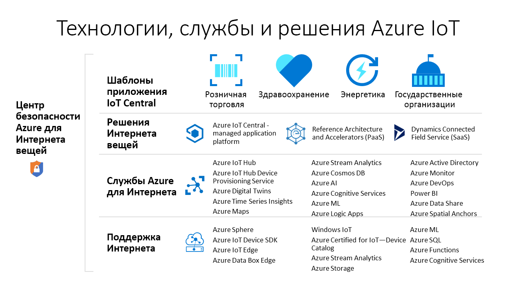

# Какие технологии и службы Azure можно использовать для создания решений для Интернета вещей?

Технологии и службы Azure IoT предоставляют возможности для создания разнообразных решений IoT для цифровых преобразований в организации. Например, администратор может сделать следующее:

- Использовать управляемую платформу [Azure IoT Central](https://apps.azureiotcentral.com) приложений IoT для создания и развертывания безопасных решений IoT корпоративного уровня. IoT Central содержит набор шаблонов приложений для таких отраслей, как розничная торговля и здравоохранение, позволяя ускорить разработку решений.
- Расширить базу открытого кода для [акселераторов решений Azure IoT](https://www.azureiotsolutions.com), включив реализацию типичного сценария IoT, включая удаленный мониторинг или прогнозное обслуживание.
- Использовать такие службы платформы Azure IoT, как [Центр Интернета вещей](../iot-hub/about-iot-hub.md) и [пакеты SDK для устройств Azure IoT](../iot-hub/iot-hub-devguide-sdks.md), чтобы с нуля создавать персонализированные решения для Интернета вещей.

## Azure IoT Central

[Платформа приложений IoT Central](https://apps.azureiotcentral.com) помогает минимизировать затраты на разработку, обслуживание и поддержку решений Интернета вещей корпоративного уровня. Настраиваемый веб-интерфейс IoT Central позволяет отслеживать состояние устройств, создавать правила и управлять миллионами устройств и их данными на протяжении всего жизненного цикла. API для IoT Central предоставляют возможность программными средствами настраивать решение Интернета вещей и взаимодействовать с ним.

Azure IoT Central является полностью управляемой платформой приложений, на основе которой вы можете создать персонализированные решения Интернета вещей. IoT Central использует для создания решений шаблоны приложений. В нее входят шаблоны для типовых решений и таких отраслей, как энергетика, здравоохранение, государственный сектор и розничная торговля. Шаблоны приложений IoT Central позволяют за несколько минут развернуть приложение IoT Central с возможностью настройки тем, панелей мониторинга и представлений.

Выберите устройства в [каталоге устройств Azure Certified for IoT](https://catalog.azureiotsolutions.com), чтобы быстро подключить их к своему решению. Используйте веб-интерфейс IoT Central для мониторинга и контроля устройств, обеспечивая их работоспособность и подключение. Используйте соединители и API для интеграции приложения IoT Central с другими бизнес-приложениями.

Полностью управляемая платформа приложений IoT Central имеет простую и предсказуемую модель ценообразования.

## Акселераторы решений Azure IoT

[Акселераторы решений Azure IoT](https://www.azureiotsolutions.com) — это наборы настраиваемых решений корпоративного класса. Вы можете развернуть эти решения без дополнительной настройки или создать собственное решение Интернета вещей на основе открытого исходного кода Java или .NET.

Акселераторы решений Azure IoT обеспечивают высокий уровень контроля над решением Интернета вещей. Акселераторы решений содержат готовые решения для типичных сценариев Интернета вещей, которые можно развернуть в подписке Azure за считаные минуты. Поддерживаются следующие сценарии:

  - удаленный мониторинг;
  - подключенная фабрика.
  - Прогнозное обслуживание
  - Виртуальное устройство

Открытый исходный код всех акселераторов решений размещен в репозиториях GitHub. Скачайте этот код, чтобы создать акселератор решений для своего сценария Интернета вещей.

Акселераторы решений используют службы Azure, например Центр Интернета вещей Azure и службу хранилища Azure, управление которыми осуществляется через подписку Azure.

## Пользовательские решения

Чтобы создать решение IoT с нуля или расширить решение, созданное на основе IoT Central или акселератора решений, выберите одну или несколько перечисленных ниже технологий и служб Azure IoT.

### Устройства

Разрабатывайте устройства Интернета вещей с помощью любого из [начальных наборов Azure IoT](https://catalog.azureiotsolutions.com/kits) или выберите готовое устройство в [каталоге Azure Certified for IoT](https://catalog.azureiotsolutions.com). Реализуйте внедренный код с помощью [пакетов средств разработки](../iot-hub/iot-hub-devguide-sdks.md) с открытым кодом. Пакеты средств разработки поддерживают несколько операционных систем, включая Linux, Windows и операционные системы реального времени. Доступны также пакеты средств разработки для нескольких языков программирования, включая [C](https://github.com/Azure/azure-iot-sdk-c), [Node.js](https://github.com/Azure/azure-iot-sdk-node), [Java](https://github.com/Azure/azure-iot-sdk-java), [.NET](https://github.com/Azure/azure-iot-sdk-csharp) и [Python](https://github.com/Azure/azure-iot-sdk-python).

Вы можете упростить создание внедренного кода для устройств с помощью службы [IoT Plug and Play](../iot-pnp/overview-iot-plug-and-play.md). IoT Plug and Play позволяет разработчикам решений интегрировать устройства без создания внедренного кода. В основу IoT Plug and Play положена схема _модели возможностей устройства_, которая описывает возможности устройства. Используйте модель возможностей устройства для создания внедренного кода и настройки облачного решения, например приложения IoT Central.

[Azure IoT Edge](../iot-edge/about-iot-edge.md) позволяет вынести некоторые элементы рабочей нагрузки Интернета вещей из облачных служб Azure на устройства. Благодаря IoT Edge вы сможете снизить сетевые задержки в решении и объем данных, передаваемых между устройствами и облаком, а также поддерживать сценарии работы без подключения к Интернету. Вы можете управлять устройствами IoT Edge через IoT Central или некоторые ускорители решений.

[Azure Sphere](https://docs.microsoft.com/azure-sphere/product-overview/what-is-azure-sphere) — это защищенная платформа приложений высокого уровня со встроенными функциями взаимодействия и обеспечения безопасности, предназначенная для устройств, подключенных к Интернету. Она включает защищенный блок микроконтроллера, специализированную операционную систему на базе Linux и облачную службу безопасности, которая обеспечивает непрерывную возобновляемую защиту.

### Подключение к облаку

Служба [Центр Интернета вещей Azure](../iot-hub/about-iot-hub.md) обеспечивает надежный и защищенный двунаправленный обмен данными между миллионами устройств Интернета вещей и облачным решением. Вы также можете использовать [Службу подготовки устройств к добавлению в Центр Интернета вещей Azure](../iot-dps/about-iot-dps.md). Эта служба позволяет выполнить автоматическую JIT-подготовку устройств для нужного центра Интернета вещей без вмешательства пользователя. Благодаря этому пользователи могут подготавливать миллионы устройств с высоким уровнем безопасности и масштабируемости.

Центр Интернета вещей служит основным компонентом для акселераторов решений, позволяя решать следующие задачи реализации Интернета вещей:

* взаимодействие устройств большого объема и управление ими;
* прием больших объемов данных телеметрии;
* контроль и управление устройствами;
* обеспечение безопасности устройства.

### Устранение препятствий между физическим и цифровым миром

Служба Интернета вещей [Azure Digital Twins](../digital-twins/about-digital-twins.md) позволяет моделировать физическое окружение. Она использует пространственный интеллектуальный граф для моделирования связей между людьми, пространствами и устройствами. Сопоставляя данные о цифровом и физическом мирах, вы можете создавать контекстно-зависимые решения.

Центр Интернета вещей использует цифровые двойники для синхронизации устройств и данных реального мира с цифровыми моделями, которые позволяют пользователям отслеживать и контролировать подключенные устройства.

### Данные и аналитика

Как правило, устройства Интернета вещей создают большие объемы данных в формате временных рядов, таких как показания температуры. [Аналитика временных рядов Azure](../time-series-insights/time-series-insights-overview.md) может подключаться к центру Интернета вещей, считывать потоки данных телеметрии от устройств, а также сохранять их с возможностью получения и визуализации данных.

[Azure Maps](/azure/azure-maps) — это коллекция геопространственных служб, которые используют новые сопоставления данных для обеспечения точного географического контекста для мобильных и веб-приложений. Для создания приложений можно использовать REST API, веб-интерфейс управления JavaScript или пакет SDK для Android.

## Дальнейшие действия

См. инструкции в следующих кратких руководствах:

- [Создание приложения Azure IoT Central](../iot-central/core/quick-deploy-iot-central.md)
- [отправке данных телеметрии с устройства в Центр Интернета вещей (Swift)](../iot-hub/quickstart-send-telemetry-cli.md)
- [Пробное использование облачного решения для удаленного мониторинга](../iot-accelerators/quickstart-remote-monitoring-deploy.md)
