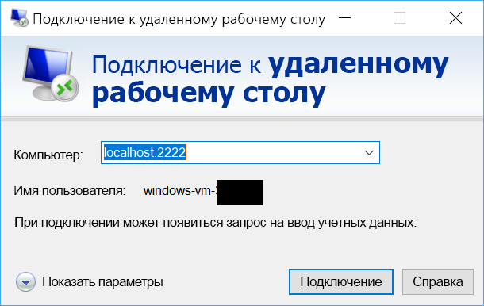

# <a name="quickstart-sshrdp-over-iot-hub-device-streams-using-c-proxy-applications-preview"></a>Краткое руководство. SSH/RDP через потоки устройств Центра Интернета вещей с помощью приложений прокси C# (предварительная версия)

[!INCLUDE [iot-hub-quickstarts-4-selector](../../includes/iot-hub-quickstarts-4-selector.md)]

[Потоки устройств Центра Интернета вещей](./iot-hub-device-streams-overview.md) позволяют службам и приложениям устройств безопасным и подходящим методом обмениваться данными с брандмауэром. Это краткое руководство включает две программы C#, которые отправляют трафик приложения клиента и сервера (например, SSH и RDP) через поток устройств, установленный через Центр Интернета вещей. Общие сведения о настройке см. [здесь](./iot-hub-device-streams-overview.md#local-proxy-sample-for-ssh-or-rdp).

Сначала мы опишем настройку для SSH (используя порт 22). Затем опишем, как изменить порт настройки для RDP. Так как потоки устройств не зависят от приложений и протоколов, тот же пример можно изменить для размещения других типов трафика приложений. Обычно это подразумевает только изменение порта связи на тот, который используется нужным приложением.


## <a name="how-it-works"></a>Принципы работы.

На рисунке, приведенном ниже показано, как программы локального прокси-сервера устройств и служб в этом примере обеспечивают сквозное подключение между клиентом SSH и управляющей программой SSH. В данном случае предполагается, что управляющая программа запущена на том же устройстве, что и локальный прокси-сервер устройства.


1. Локальный прокси-сервер службы подключается к центру Интернета вещей и инициирует поток устройств в целевое устройство с помощью кода устройства.

2. Локальный прокси-сервер устройства завершает подтверждение инициации потоковой передачи и устанавливает сквозной потоковый туннель через конечную точку потоковой передачи Центра Интернета вещей на стороне службы.

3. Локальный прокси-сервер устройства подключается к управляющей программе SSH (SSHD), прослушивающей порт 22 на устройстве (этот порт можно настроить, как описано [ниже](#run-the-device-side-application)).

4. Локальный прокси-сервер службы ожидает новые SSH-подключения от пользователя, прослушивая назначенный порт, который в этом случае является портом 2222 (это также можно настроить, как описано [ниже](#run-the-service-side-application)). Когда пользователь подключается через клиент SSH, туннель позволяет обмениваться трафиком приложения между клиентом SSH и программами сервера.

> [!NOTE]
> Трафик SSH, передаваемый по потоку, будет туннелироваться через конечную точку потоковой передачи Центра Интернета вещей, а не напрямую между службой и устройством. Это обеспечивает [такие преимущества](./iot-hub-device-streams-overview.md#benefits).

[!INCLUDE [cloud-shell-try-it.md](../../includes/cloud-shell-try-it.md)]

Если у вас еще нет подписки Azure, [создайте бесплатную учетную запись Azure](https://azure.microsoft.com/free/?WT.mc_id=A261C142F), прежде чем начинать работу.

## <a name="prerequisites"></a>Предварительные требования

Примеры приложений, запускаемые в рамках этого краткого руководства, написаны на языке C#. На компьютере, на котором ведется разработка, необходимо установить пакет SDK для .NET Core версии 2.1.0 или более поздней.

Пакет SDK для .NET Core, предназначенный для нескольких платформ, можно загрузить из [.NET](https://www.microsoft.com/net/download/all).

Текущую версию C# на компьютере, на котором ведется разработка, можно проверить, используя следующую команду:

```
dotnet --version
```

Скачайте пример проекта C# по ссылке https://github.com/Azure-Samples/azure-iot-samples-csharp/archive/master.zip и извлеките ZIP-архив.


## <a name="create-an-iot-hub"></a>Создание Центра Интернета вещей

[!INCLUDE [iot-hub-include-create-hub](../../includes/iot-hub-include-create-hub-device-streams.md)]

## <a name="register-a-device"></a>Регистрация устройства

Устройство должно быть зарегистрировано в Центре Интернета вещей, прежде чем оно сможет подключиться. В этом кратком руководстве для регистрации имитируемого устройства используется Azure Cloud Shell.

1. Выполните приведенные ниже команды в Azure Cloud Shell, чтобы добавить расширение CLI Центра Интернета вещей и создать удостоверение устройства. 

   **YourIoTHubName**. Замените этот заполнитель именем вашего Центра Интернета вещей.

   **MyDevice**. Это имя, присвоенное зарегистрированному устройству. Используйте имя MyDevice, как показано в примере. Если вы выбрали другое имя для устройства, используйте его при работе с этим руководством и обновите имя устройства в примерах приложений перед их запуском.

    ```azurecli-interactive
    az extension add --name azure-cli-iot-ext
    az iot hub device-identity create --hub-name YourIoTHubName --device-id MyDevice
    ```

2. Выполните следующую команду в Azure Cloud Shell, чтобы получить _строку подключения_ зарегистрированного устройства:

   **YourIoTHubName**. Замените этот заполнитель именем вашего Центра Интернета вещей.

    ```azurecli-interactive
    az iot hub device-identity show-connection-string --hub-name YourIoTHubName --device-id MyDevice --output table
    ```

    Запишите строку подключения устройства, которая выглядит, как на следующем примере.

   `HostName={YourIoTHubName}.azure-devices.net;DeviceId=MyDevice;SharedAccessKey={YourSharedAccessKey}`

    Это значение понадобится позже в рамках этого краткого руководства.

3. Понадобится также _строка подключения к службе_ из Центра Интернета вещей, чтобы включить приложение на стороне службы для подключения к Центру Интернета вещей и установить потоки устройств. Следующая команда получает это значение для Центра Интернета вещей:

   **YourIoTHubName**. Замените этот заполнитель именем вашего Центра Интернета вещей.

    ```azurecli-interactive
    az iot hub show-connection-string --policy-name service --hub-name YourIoTHubName
    ```

    Запомните или запишите возвращаемое значение, которое выглядит следующим образом:

   `"HostName={YourIoTHubName}.azure-devices.net;SharedAccessKeyName=service;SharedAccessKey={YourSharedAccessKey}"`
    

## <a name="ssh-to-a-device-via-device-streams"></a>SSH-подключение к устройству через потоки устройств

### <a name="run-the-service-side-proxy"></a>Запуск прокси-сервера на стороне службы

Перейдите к `device-streams-proxy/service` в распакованной папке проекта. Вам понадобятся следующие сведения.

| Имя параметра | Значение параметра |
|----------------|-----------------|
| `iotHubConnectionString` | Строка подключения к службе Центра Интернета вещей. |
| `deviceId` | Идентификатор устройства, созданного ранее. |
| `localPortNumber` | Локальный порт, к которому будет подключаться клиент SSH. В этом примере мы используем порт 2222, но его можно заменить другими произвольными числами. |

Скомпилируйте и запустите код, как показано:

```
cd ./iot-hub/Quickstarts/device-streams-proxy/service/

# Build the application
dotnet build

# Run the application
# In Linux/MacOS
dotnet run $serviceConnectionString MyDevice 2222

# In Windows
dotnet run %serviceConnectionString% MyDevice 2222
```

### <a name="run-the-device-local-proxy"></a>Запуск локального прокси-сервера устройства

Перейдите к `device-streams-proxy/device` в распакованной папке проекта. Вам понадобятся следующие сведения.

| Имя аргумента | Значение аргумента |
|----------------|-----------------|
| `deviceConnectionString` | Строка подключения созданного ранее устройства. |
| `targetServiceHostName` | IP-адрес, на котором прослушивается сервер SSH (это будет `localhost`, если IP-адрес тот, на котором запущен локальный прокси-сервер устройства). |
| `targetServicePort` | Порт, используемый протоколом приложения (по умолчанию это будет порт 22 для SSH).  |

Скомпилируйте и запустите код, как показано:

```
cd ./iot-hub/Quickstarts/device-streams-proxy/device/

# Build the application
dotnet build

# Run the application
# In Linux/MacOS
dotnet run $deviceConnectionString localhost 22

# In Windows
dotnet run %deviceConnectionString% localhost 22
```

Теперь с помощью программы клиента SSH подключитесь к локальному прокси-серверу службы на порте 2222 (вместо подключения напрямую через управляющую программу SSH). 

```
ssh <username>@localhost -p 2222
```

На этом этапе откроется командная строка входа SSH для ввода учетных данных.

Вывод на консоль на стороне службы (локальный прокси-сервер службы прослушивает порт 2222):


Вывод на консоль на локальном прокси-сервере устройства, который подключается к управляющей программе SSH по адресу `IP_address:22`:

]Замещающий текст(./media/quickstart-device-streams-proxy-csharp/device-console-output.png "")Вывод локального прокси-сервера устройства")

Вывод на консоль клиентской программы SSH (клиент SSH связывается с управляющей программой SSH, подключаясь к порту 22, где прослушивает локальный прокси-сервер службы):


## <a name="rdp-to-a-device-via-device-streams"></a>RDP-подключение к устройству через потоки устройств

Настройка для RDP очень похожа на настройку SSH (описанную выше). Нам нужно использовать вместо этого IP-адрес назначения RDP и порт 3389, а также использовать клиент RDP (вместо клиента SSH).

### <a name="run-the-service-side-application"></a>Запуск приложения на стороне службы

Перейдите к `device-streams-proxy/service` в распакованной папке проекта. Вам понадобятся следующие сведения.

| Имя параметра | Значение параметра |
|----------------|-----------------|
| `iotHubConnectionString` | Строка подключения к службе Центра Интернета вещей. |
| `deviceId` | Идентификатор устройства, созданного ранее. |
| `localPortNumber` | Локальный порт, к которому будет подключаться клиент SSH. В этом примере мы используем порт 2222, но его можно заменить другими произвольными числами. |

Скомпилируйте и запустите код, как показано:

```
cd ./iot-hub/Quickstarts/device-streams-proxy/service/

# Build the application
dotnet build

# Run the application
# In Linux/MacOS
dotnet run $serviceConnectionString MyDevice 2222

# In Windows
dotnet run %serviceConnectionString% MyDevice 2222
```

### <a name="run-the-device-side-application"></a>Запуск приложения на стороне устройства

Перейдите к `device-streams-proxy/device` в распакованной папке проекта. Вам понадобятся следующие сведения.

| Имя аргумента | Значение аргумента |
|----------------|-----------------|
| `DeviceConnectionString` | Строка подключения созданного ранее устройства. |
| `targetServiceHostName` | Имя узла или IP-адрес, на котором включен сервер RDP (это будет `localhost`, если IP-адрес тот, на котором запущен локальный прокси-сервер устройства). |
| `targetServicePort` | Порт, используемый протоколом приложения (по умолчанию это будет порт 3389 для RDP).  |

Скомпилируйте и запустите код, как показано:

```
cd ./iot-hub/Quickstarts/device-streams-proxy/device

# Run the application
# In Linux/MacOS
dotnet run $DeviceConnectionString localhost 3389

# In Windows
dotnet run %DeviceConnectionString% localhost 3389
```

Теперь с помощью программы клиента RDP подключитесь к локальному прокси-серверу службы через порт 2222 (это произвольный доступный порт, который был выбран ранее).



## <a name="clean-up-resources"></a>Очистка ресурсов

[!INCLUDE [iot-hub-quickstarts-clean-up-resources](../../includes/iot-hub-quickstarts-clean-up-resources-device-streams.md)]

## <a name="next-steps"></a>Дополнительная информация

В рамках этого краткого руководства вы настроили Центр Интернета вещей, зарегистрировали устройство, развернули программу локальных прокси-серверов устройств и служб, чтобы установить поток устройств через Центр Интернета вещей, а также использовали прокси-серверы для туннелирования трафика SSH и RDP. Та же парадигма может размещать другие протоколы клиента или сервера (где сервер запущен на устройстве, например на управляющей программе SSH).

Используйте приведенные ниже ссылки для получения дополнительных сведений о потоках устройства:

> [!div class="nextstepaction"]
> [IoT Hub Device Streams (preview)](./iot-hub-device-streams-overview.md) (Потоки устройств (предварительная версия))
