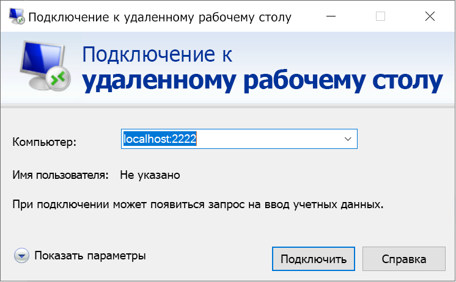

# <a name="quickstart-enable-ssh-and-rdp-over-an-iot-hub-device-stream-by-using-a-c-proxy-application-preview"></a>Краткое руководство. Подключение по протоколу SSH и RDP через поток устройств центра Интернета вещей с помощью прокси-приложения C# (предварительная версия)

[!INCLUDE [iot-hub-quickstarts-4-selector](../../includes/iot-hub-quickstarts-4-selector.md)]

Центр Интернета вещей Microsoft Azure поддерживает потоки устройств, которые сейчас доступны в режиме [предварительной версии](https://azure.microsoft.com/support/legal/preview-supplemental-terms/).

[Потоки устройств Центра Интернета вещей](iot-hub-device-streams-overview.md) позволяют службам и приложениям устройств безопасным и подходящим методом обмениваться данными с брандмауэром. Это краткое руководство включает в себя два приложения C#, которые отправляют трафик приложения клиента и сервера (например, Secure Shell [SSH] и протокол удаленного рабочего стола [RDP]) через поток устройств, установленный в центре Интернета вещей. Общие сведения о настройке см. на странице с [примером локального прокси-приложения для SSH или RDP](iot-hub-device-streams-overview.md#local-proxy-sample-for-ssh-or-rdp).

В начале этой статьи объясняется, как выполнить настройку для протокола SSH (с использованием порта 22) и как изменить настройки для протокола RDP. Так как потоки устройств не зависят от приложений и протоколов, тот же пример можно изменить для размещения других типов трафика приложений. Это изменение обычно подразумевает только изменение порта связи на тот, который используется нужным приложением.

## <a name="how-it-works"></a>Принцип работы

На рисунке, приведенном ниже, показано, как в этом примере приложения локального прокси-сервера устройств и служб обеспечивают сквозное подключение между клиентом SSH и процессами управляющей программы SSH. В данном случае предполагается, что управляющая программа запущена на том же устройстве, что и приложение локального прокси-сервера устройства.


1. Приложение локального прокси-сервера службы подключается к центру Интернета вещей, а также инициирует поток устройств в целевое устройство.

1. Приложение локального прокси-сервера устройства завершает подтверждение инициации потоковой передачи и устанавливает сквозной потоковый туннель через конечную точку потоковой передачи центра Интернета вещей на стороне службы.

1. Приложение локального прокси-сервера устройства подключается к управляющей программе SSH, ожидая передачи данных к устройству через порт 22. Этот параметр можно настроить, используя инструкции, описанные в разделе "Запуск приложения локального прокси-сервера устройства".

1. Приложение локального прокси-сервера службы ожидает новые подключения SSH от пользователя, прослушивая назначенный порт, который в этом случае является портом 2222. Этот параметр можно настроить, используя инструкции, описанные в разделе "Запуск приложения локального прокси-сервера службы". Когда пользователь подключается через клиент SSH, туннель позволяет передавать трафик приложения SSH между клиентом SSH и приложением сервера.

> [!NOTE]
> Трафик SSH, передаваемый по потоку устройств, будет туннелироваться через конечную точку потоковой передачи центра Интернета вещей, а не напрямую между службой и устройством. Дополнительные сведения см. в [списке преимуществ использования потоков устройств центра Интернета вещей](iot-hub-device-streams-overview.md#benefits).

[!INCLUDE [cloud-shell-try-it.md](../../includes/cloud-shell-try-it.md)]

Если у вас еще нет подписки Azure, [создайте бесплатную учетную запись Azure](https://azure.microsoft.com/free/?WT.mc_id=A261C142F), прежде чем начинать работу.

## <a name="prerequisites"></a>Предварительные требования

* Предварительная версия потоков устройств сейчас поддерживается только в центрах Интернета вещей, созданных в следующих регионах:

  * Центральный регион США
  * Центральная часть США (EUAP)

* Два примера приложений, запускаемые в рамках этого краткого руководства, написаны на языке C#. На компьютере, на котором ведется разработка, необходимо установить пакет SDK для .NET Core версии 2.1.0 или более поздней.

  Пакет SDK для .NET Core, предназначенный для нескольких платформ, можно скачать из [раздела, посвященного .NET](https://www.microsoft.com/net/download/all).

* Проверьте текущую версию C# на компьютере, на котором ведется разработка, используя следующую команду:

    ```
    dotnet --version
    ```

* Выполните следующую команду, чтобы добавить расширение Интернета вещей Azure для Azure CLI в экземпляр Cloud Shell. Расширение Интернета вещей добавляет в Azure CLI специальные команды Центра Интернета вещей, IoT Edge и Службы подготовки устройств к добавлению в центр Интернета вещей (DPS).

   ```azurecli-interactive
   az extension add --name azure-cli-iot-ext
   ```

* [Загрузите пример проекта C#](https://github.com/Azure-Samples/azure-iot-samples-csharp/archive/master.zip), а также извлеките ZIP-архив.

## <a name="create-an-iot-hub"></a>Создание Центра Интернета вещей

[!INCLUDE [iot-hub-include-create-hub-device-streams](../../includes/iot-hub-include-create-hub-device-streams.md)]

## <a name="register-a-device"></a>Регистрация устройства

Устройство должно быть зарегистрировано в Центре Интернета вещей, прежде чем оно сможет подключиться. В этом кратком руководстве для регистрации имитируемого устройства используется Azure Cloud Shell.

1. Чтобы создать удостоверение устройства, выполните приведенные ниже команды в Cloud Shell.

   > [!NOTE]
   > * Замените заполнитель *YourIoTHubName* именем созданного центра Интернета вещей.
   > * Используйте имя *MyDevice*, как показано в примере. Это имя, присвоенное зарегистрированному устройству. Если вы выбрали другое имя для устройства, используйте его при работе с этой статьей и обновите имя устройства в примерах приложений перед их запуском.

    ```azurecli-interactive
    az iot hub device-identity create --hub-name YourIoTHubName --device-id MyDevice
    ```

1. Выполните следующие команды в Cloud Shell, чтобы получить *строку подключения* зарегистрированного устройства.

   > [!NOTE]
   > Замените заполнитель *YourIoTHubName* именем созданного центра Интернета вещей.

    ```azurecli-interactive
    az iot hub device-identity show-connection-string --hub-name YourIoTHubName --device-id MyDevice --output table
    ```

    Запишите строку подключения устройства для последующего использования в этом кратком руководстве. Это должно выглядеть следующим образом:

   `HostName={YourIoTHubName}.azure-devices.net;DeviceId=MyDevice;SharedAccessKey={YourSharedAccessKey}`

1. Понадобится также *строка подключения к службе* из центра Интернета вещей, чтобы включить приложение на стороне службы для подключения к центру Интернета вещей и установить потоки устройств. Следующая команда получает это значение для Центра Интернета вещей:

   > [!NOTE]
   > Замените заполнитель *YourIoTHubName* именем созданного центра Интернета вещей.

    ```azurecli-interactive
    az iot hub show-connection-string --policy-name service --name YourIoTHubName
    ```

    Запишите возвращаемое значение. Оно вам понадобится для последующего использования в этом кратком руководстве. Это должно выглядеть следующим образом:

   `"HostName={YourIoTHubName}.azure-devices.net;SharedAccessKeyName=service;SharedAccessKey={YourSharedAccessKey}"`

## <a name="ssh-to-a-device-via-device-streams"></a>SSH-подключение к устройству через потоки устройств

В этом разделе показано, как установить сквозной поток для туннелирования трафика SSH.

### <a name="run-the-device-local-proxy-application"></a>Запуск приложения локального прокси-сервера устройства

Перейдите к каталогу *device-streams-proxy/device* в распакованном проекте. Держите следующие сведения под рукой:

| Имя аргумента | Значение аргумента |
|----------------|-----------------|
| `deviceConnectionString` | Строка подключения созданного ранее устройства. |
| `targetServiceHostName` | IP-адрес, который прослушивается сервером SSH. Адрес был бы `localhost`, если бы это был тот же IP-адрес, на котором работает приложение локального прокси-сервера устройства. |
| `targetServicePort` | Порт, используемый протоколом приложения (для SSH по умолчанию это будет порт 22).  |

Скомпилируйте и запустите код, как показано:

```
cd ./iot-hub/Quickstarts/device-streams-proxy/device/

# Build the application
dotnet build

# Run the application
# In Linux or macOS
dotnet run $deviceConnectionString localhost 22

# In Windows
dotnet run %deviceConnectionString% localhost 22
```

### <a name="run-the-service-local-proxy-application"></a>Запуск приложения локального прокси-сервера службы

Перейдите к `device-streams-proxy/service` в распакованной папке проекта. Вам понадобятся следующие сведения.

| Имя параметра | Значение параметра |
|----------------|-----------------|
| `iotHubConnectionString` | Строка подключения к службе Центра Интернета вещей. |
| `deviceId` | Идентификатор устройства, созданного ранее. |
| `localPortNumber` | Локальный порт, к которому будет подключаться клиент SSH. В этом примере мы используем порт 2222, но его можно задать с помощью любых других произвольных чисел. |

Скомпилируйте и запустите код, как показано:

```
cd ./iot-hub/Quickstarts/device-streams-proxy/service/

# Build the application
dotnet build

# Run the application
# In Linux or macOS
dotnet run $serviceConnectionString MyDevice 2222

# In Windows
dotnet run %serviceConnectionString% MyDevice 2222
```

### <a name="run-the-ssh-client"></a>Запуск клиента SSH

Теперь с помощью приложения клиента SSH подключитесь к приложению локального прокси-сервера службы на порте 2222 (вместо подключения напрямую через управляющую программу SSH).

```
ssh <username>@localhost -p 2222
```

На этом этапе в окне входа в SSH можно ввести учетные данные.

Вывод на консоль на стороне службы (приложение локального прокси-сервера службы прослушивает порт 2222):


Вывод на консоль в приложении локального прокси-сервера устройства, который подключается к управляющей программе SSH по *IP_address:22*:


Вывод на консоль клиентского приложения SSH Клиент SSH связывается с управляющей программой SSH, подключаясь к порту 22, который прослушивает приложение локального прокси-сервера службы:


## <a name="rdp-to-a-device-via-device-streams"></a>RDP-подключение к устройству через потоки устройств

Настройка RDP очень похожа на настройку SSH (описанную выше). Вместо этого используйте IP-адрес назначения RDP и порт 3389, а также клиент RDP (вместо клиента SSH).

### <a name="run-the-device-local-proxy-application-rdp"></a>Запуск приложения локального прокси-сервера устройства (RDP)

Перейдите к каталогу *device-streams-proxy/device* в распакованном проекте. Держите следующие сведения под рукой:

| Имя аргумента | Значение аргумента |
|----------------|-----------------|
| `DeviceConnectionString` | Строка подключения созданного ранее устройства. |
| `targetServiceHostName` | Имя узла или IP-адрес, на котором работает сервер RDP. Адрес был бы `localhost`, если бы это был тот же IP-адрес, на котором работает приложение локального прокси-сервера устройства. |
| `targetServicePort` | Порт, используемый протоколом приложения (для RDP по умолчанию это будет порт 3389).  |

Скомпилируйте и запустите код, как показано:

```
cd ./iot-hub/Quickstarts/device-streams-proxy/device

# Run the application
# In Linux or macOS
dotnet run $DeviceConnectionString localhost 3389

# In Windows
dotnet run %DeviceConnectionString% localhost 3389
```

### <a name="run-the-service-local-proxy-application-rdp"></a>Запуск приложения локального прокси-сервера службы (RDP)

Перейдите к `device-streams-proxy/service` в распакованной папке проекта. Вам понадобятся следующие сведения.

| Имя параметра | Значение параметра |
|----------------|-----------------|
| `iotHubConnectionString` | Строка подключения к службе Центра Интернета вещей. |
| `deviceId` | Идентификатор устройства, созданного ранее. |
| `localPortNumber` | Локальный порт, к которому будет подключаться клиент SSH. В этом примере мы используем порт 2222, но его можно заменить другими произвольными числами. |

Скомпилируйте и запустите код, как показано:

```
cd ./iot-hub/Quickstarts/device-streams-proxy/service/

# Build the application
dotnet build

# Run the application
# In Linux or macOS
dotnet run $serviceConnectionString MyDevice 2222

# In Windows
dotnet run %serviceConnectionString% MyDevice 2222
```

### <a name="run-rdp-client"></a>Запуск клиента RDP

Теперь с помощью приложения клиента RDP подключитесь к приложению локального прокси-сервера службы через порт 2222 (это произвольный доступный порт, который был выбран ранее).



## <a name="clean-up-resources"></a>Очистка ресурсов

[!INCLUDE [iot-hub-quickstarts-clean-up-resources](../../includes/iot-hub-quickstarts-clean-up-resources-device-streams.md)]

## <a name="next-steps"></a>Дополнительная информация

В рамках этого краткого руководства вы настроили центр Интернета вещей, зарегистрировали устройство, развернули приложение локальных прокси-серверов устройств и служб, чтобы установить поток устройств через центр Интернета вещей, а также использовали приложения прокси-сервера для туннелирования трафика SSH и RDP. Та же парадигма может размещать другие протоколы клиента или сервера (где сервер запущен на устройстве, например на управляющей программе SSH).

Дополнительные сведения о потоках устройств см. в следующей статье:

> [!div class="nextstepaction"]
> [IoT Hub Device Streams (preview)](./iot-hub-device-streams-overview.md) (Потоки устройств (предварительная версия))
