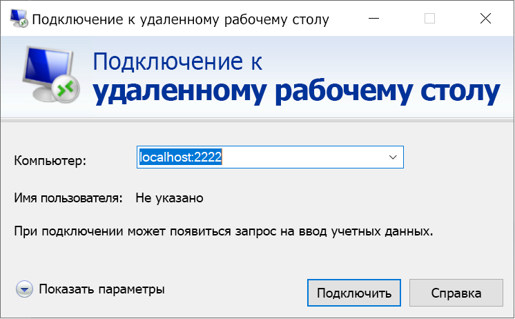

# <a name="quickstart-enable-ssh-and-rdp-over-an-iot-hub-device-stream-by-using-a-nodejs-proxy-application-preview"></a>Краткое руководство. Подключение по протоколу SSH и RDP через поток устройств Центра Интернета вещей с помощью приложения прокси Node.js (предварительная версия)

[!INCLUDE [iot-hub-quickstarts-4-selector](../../includes/iot-hub-quickstarts-4-selector.md)]

Центр Интернета вещей Microsoft Azure поддерживает потоки устройств, которые сейчас доступны в режиме [предварительной версии](https://azure.microsoft.com/support/legal/preview-supplemental-terms/).

[Потоки устройств Центра Интернета вещей](./iot-hub-device-streams-overview.md) позволяют службам и приложениям устройств безопасным и подходящим методом обмениваться данными с брандмауэром. 

В этом кратком руководстве описано, как запустить приложение прокси Node.js на стороне службы для направления трафика SSH и RDP (протокол удаленного рабочего стола) на устройство через поток устройств. Общие сведения о настройке см. в разделе с [примером локального прокси-сервера](./iot-hub-device-streams-overview.md#local-proxy-sample-for-ssh-or-rdp). 

На этапе общедоступной предварительной версии пакет SDK для Node.js поддерживает потоки устройств только на стороне службы. Поэтому в этом кратком руководстве даны инструкции по запуску приложения прокси только на стороне службы. Сведения о запуске приложения прокси на стороне устройства см. в следующих статьях:  

   * [Краткое руководство. Подключение по протоколу SSH или RDP через потоки устройств Центра Интернета вещей с помощью прокси-приложения на C (предварительная версия)](./quickstart-device-streams-proxy-c.md)
   * [Краткое руководство. Подключение по протоколу SSH или RDP через поток устройств Центра Интернета вещей с помощью прокси-приложения C#](./quickstart-device-streams-proxy-csharp.md)

В этой статье объясняется, как выполнить настройку для протокола SSH (с использованием порта 22) и как изменить настройки для протокола RDP (используется порт 3389). Так как потоки устройств не зависят от приложений и протоколов, этот пример можно изменить для других типов трафика клиент-серверных приложений (обычно путем изменения портов для обмена данными).

[!INCLUDE [cloud-shell-try-it.md](../../includes/cloud-shell-try-it.md)]

Если у вас еще нет подписки Azure, [создайте бесплатную учетную запись Azure](https://azure.microsoft.com/free/?WT.mc_id=A261C142F), прежде чем начинать работу.

## <a name="prerequisites"></a>Предварительные требования

* Предварительная версия потоков устройств сейчас поддерживается только в центрах Интернета вещей, созданных в следующих регионах:

  * Центральный регион США
  * Центральная часть США (EUAP)

* Для запуска приложения на стороне службы при работе с этим руководством вам понадобится Node.js 10.x.x или более поздней версии на компьютере разработчика.
  * Скачайте [Node.js](https://nodejs.org) для нескольких платформ.
  * Проверьте текущую версию Node.js на компьютере для разработки, используя следующую команду:

   ```
   node --version
   ```

* Чтобы добавить расширение Интернета вещей Azure для Azure CLI в экземпляр Cloud Shell, выполните приведенную ниже команду. Расширение Интернета вещей добавляет в Azure CLI специальные команды Центра Интернета вещей, IoT Edge и Службы подготовки устройств к добавлению в центр Интернета вещей (DPS).

    ```azurecli-interactive
    az extension add --name azure-cli-iot-ext
    ```

* Если вы еще не сделали этого, [скачайте пример проекта Node.js](https://github.com/Azure-Samples/azure-iot-samples-node/archive/streams-preview.zip) и извлеките ZIP-архив.

## <a name="create-an-iot-hub"></a>Создание Центра Интернета вещей

Если вы закончили работу с предыдущим руководством по [ отправке данных телеметрии с устройства в Центр Интернета вещей](quickstart-send-telemetry-node.md), можете пропустить этот шаг.

[!INCLUDE [iot-hub-include-create-hub-device-streams](../../includes/iot-hub-include-create-hub-device-streams.md)]

## <a name="register-a-device"></a>Регистрация устройства

Если вы ознакомились с [Кратким руководством по отправке данных телеметрии с устройства в Центр Интернета вещей](quickstart-send-telemetry-node.md), можете пропустить этот шаг.

Устройство должно быть зарегистрировано в Центре Интернета вещей, прежде чем оно сможет подключиться. При изучении этого раздела для регистрации имитированного устройства используется Azure Cloud Shell.

1. Чтобы создать удостоверение устройства, выполните приведенные ниже команды в Cloud Shell.

   > [!NOTE]
   > * Замените заполнитель *YourIoTHubName* именем созданного центра Интернета вещей.
   > * Для имени регистрируемого устройства рекомендуется использовать имя *MyDevice*, как показано в примере. Если вы выбрали другое имя для устройства, используйте его при работе с этой статьей и обновите имя устройства в примерах приложений перед их запуском.

    ```azurecli-interactive
    az iot hub device-identity create --hub-name {YourIoTHubName} --device-id MyDevice
    ```

1. Чтобы разрешить внутреннему приложению подключаться к центру Интернета вещей и получать сообщения, вам необходима *строка подключения к службе*. Получите эту строку для своего центра Интернета вещей с помощью следующей команды.

   > [!NOTE]
   > Замените заполнитель *YourIoTHubName* именем созданного центра Интернета вещей.

    ```azurecli-interactive
    az iot hub show-connection-string --policy-name service --name {YourIoTHubName} --output table
    ```

   Запишите возвращенную строку подключения к службе для последующего использования в этом кратком руководстве. Это должно выглядеть следующим образом:

   `"HostName={YourIoTHubName}.azure-devices.net;SharedAccessKeyName=service;SharedAccessKey={YourSharedAccessKey}"`

## <a name="ssh-to-a-device-via-device-streams"></a>SSH-подключение к устройству через потоки устройств

В этом разделе показано, как установить сквозной поток для туннелирования трафика SSH.

### <a name="run-the-device-local-proxy-application"></a>Запуск приложения локального прокси-сервера устройства

Как упоминалось ранее, пакет SDK Node.js для Центра Интернета вещей поддерживает потоки устройств только на стороне службы. Для запуска приложения на стороне устройства используйте приложение прокси, которое описано в следующих кратких руководствах:

   * [Краткое руководство. Подключение по протоколу SSH или RDP через потоки устройств Центра Интернета вещей с помощью прокси-приложения на C (предварительная версия)](./quickstart-device-streams-proxy-c.md)
   * [Краткое руководство. Подключение по протоколу SSH или RDP через поток устройств Центра Интернета вещей с помощью прокси-приложения C#](./quickstart-device-streams-proxy-csharp.md) 

Прежде чем перейти к следующему шагу, убедитесь, что приложение прокси на стороне устройства запущено.

### <a name="run-the-service-local-proxy-application"></a>Запуск приложения локального прокси-сервера службы

Когда приложение прокси на стороне устройства будет запущено, запустите приложение прокси на стороне службы, написанное на Node.js, выполнив следующее в окне терминала на локальном компьютере:

1. В качестве переменных среды укажите учетные данные службы, идентификатор целевого устройства, на котором запущена управляющая программа SSH, и номер порта для прокси-сервера, который запущен на устройстве.

   ```
   # In Linux
   export IOTHUB_CONNECTION_STRING="{ServiceConnectionString}"
   export STREAMING_TARGET_DEVICE="MyDevice"
   export PROXY_PORT=2222

   # In Windows
   SET IOTHUB_CONNECTION_STRING={ServiceConnectionString}
   SET STREAMING_TARGET_DEVICE=MyDevice
   SET PROXY_PORT=2222
   ```

   Измените заполнитель ServiceConnectionString, чтобы он соответствовал строке подключения к службе, и **MyDevice**, чтобы он соответствовал коду устройства, если вы указали другое имя.

1. Перейдите к каталогу `Quickstarts/device-streams-service` в распакованной папке проекта. Выполните следующий код, чтобы запустить приложение локального прокси-сервера службы:

   ```
   cd azure-iot-samples-node-streams-preview/iot-hub/Quickstarts/device-streams-service

   # Install the preview service SDK, and other dependencies
   npm install azure-iothub@streams-preview
   npm install

   # Run the service-local proxy application
   node proxy.js
   ```

### <a name="ssh-to-your-device-via-device-streams"></a>SSH-подключение к устройству через потоки устройств

В Linux запустите SSH, используя `ssh $USER@localhost -p 2222` в терминале. В Windows используйте клиент SSH, с которым вы работаете (например PuTTY).

Вывод на консоль на стороне службы после установления сеанса SSH (приложение прокси на стороне службы прослушивает порт 2222):


Вывод на консоль клиентского приложения SSH (клиент SSH связывается с управляющей программой SSH, подключаясь к порту 22, который прослушивается приложением прокси на стороне службы).


### <a name="rdp-to-your-device-via-device-streams"></a>RDP-подключение к устройству через потоки устройств

Теперь с помощью клиентского приложения RDP подключитесь к прокси-серверу службы через порт 2222 (это произвольный порт, который вы выбрали ранее).

> [!NOTE]
> Убедитесь, что прокси-сервер устройства правильно настроен для RDP и порта RDP 3389.



## <a name="clean-up-resources"></a>Очистка ресурсов

[!INCLUDE [iot-hub-quickstarts-clean-up-resources](../../includes/iot-hub-quickstarts-clean-up-resources-device-streams.md)]

## <a name="next-steps"></a>Дополнительная информация

Из этого краткого руководства вы узнали, как настроить центр Интернета вещей, зарегистрировать устройство и развернуть приложение прокси на стороне службы для включения RDP и SSH на устройстве Интернета вещей. Трафик RDP и SSH будет туннелироваться через поток устройств и центр Интернета вещей. Это избавляет от необходимости прямого подключения к устройству.

Дополнительные сведения о потоках устройств см. в следующей статье:

> [!div class="nextstepaction"]
> [IoT Hub Device Streams (preview)](./iot-hub-device-streams-overview.md) (Потоки устройств (предварительная версия))
