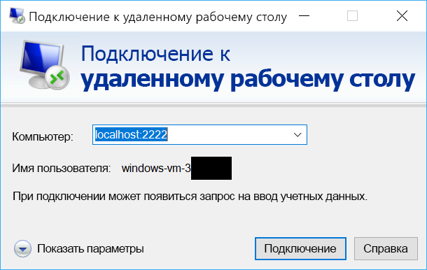

# <a name="quickstart-sshrdp-over-iot-hub-device-streams-using-nodejs-proxy-application-preview"></a>Краткое руководство. SSH/RDP через потоки устройств Центра Интернета вещей с помощью приложения прокси Node.js (предварительная версия)

[!INCLUDE [iot-hub-quickstarts-4-selector](../../includes/iot-hub-quickstarts-4-selector.md)]

Центр Интернета вещей Microsoft Azure поддерживает функцию "Потоки устройств", которая сейчас доступна в режиме [предварительной версии](https://azure.microsoft.com/support/legal/preview-supplemental-terms/).

[Потоки устройств Центра Интернета вещей](./iot-hub-device-streams-overview.md) позволяют службам и приложениям устройств безопасным и подходящим методом обмениваться данными с брандмауэром. В этом кратком руководстве описано, как запустить приложение прокси Node.js на стороне службы для направления трафика SSH и RDP в устройство через поток устройств. См. [общие сведения о настройке](./iot-hub-device-streams-overview.md#local-proxy-sample-for-ssh-or-rdp). На этапе предварительной версии пакет SDK для Node.js поддерживает только потоки устройств на стороне службы. Это краткое руководство включает только инструкции по запуску прокси-сервера на стороне службы. Вам следует запустить сопутствующий прокси-сервер на стороне устройства, который описан в кратких руководствах по [C](./quickstart-device-streams-proxy-c.md) и [C#](./quickstart-device-streams-proxy-csharp.md).

Сначала мы опишем настройку для SSH (используя порт 22). Затем опишем, как изменить настройку для RDP (используя порт 3389). Так как потоки устройств не зависят от приложений и протоколов, тот же пример можно изменить для размещения других типов трафика клиент-серверных приложений (обычно путем изменения портов для обмена данными).

[!INCLUDE [cloud-shell-try-it.md](../../includes/cloud-shell-try-it.md)]

Если у вас еще нет подписки Azure, [создайте бесплатную учетную запись Azure](https://azure.microsoft.com/free/?WT.mc_id=A261C142F), прежде чем начинать работу.

## <a name="prerequisites"></a>Предварительные требования

Предварительная версия потоков устройств сейчас поддерживается только в Центрах Интернета вещей, созданных в следующих регионах.

  - **Центральная часть США**
  - **Центральная часть США (EUAP)**

Для запуска приложения на стороне службы в этом руководстве вам понадобится Node.js версии 4.x.x и выше на компьютере разработчика.

Node.js, предназначенный для нескольких платформ, можно скачать здесь: [nodejs.org](https://nodejs.org).

Текущую версию Node.js на компьютере, на котором ведется разработка, можно проверить, используя следующую команду:

```
node --version
```

Выполните следующую команду, чтобы добавить расширение Интернета вещей Microsoft Azure для Azure CLI в экземпляр Cloud Shell. Расширение Интернета вещей добавляет в Azure CLI специальные команды Центра Интернета вещей, IoT Edge и службы подготовки устройств Интернета вещей (DPS).

```azurecli-interactive
az extension add --name azure-cli-iot-ext
```

Если вы еще не сделали это, скачайте пример проекта Node.js по адресу https://github.com/Azure-Samples/azure-iot-samples-node/archive/streams-preview.zip и извлеките ZIP-архив.

## <a name="create-an-iot-hub"></a>Создание Центра Интернета вещей

Если вы закончили работу с предыдущим руководством по [ отправке данных телеметрии с устройства в Центр Интернета вещей](quickstart-send-telemetry-node.md), можете пропустить этот шаг.

[!INCLUDE [iot-hub-include-create-hub](../../includes/iot-hub-include-create-hub-device-streams.md)]

## <a name="register-a-device"></a>Регистрация устройства

Если вы закончили работу с предыдущим руководством по [ отправке данных телеметрии с устройства в Центр Интернета вещей](quickstart-send-telemetry-node.md), можете пропустить этот шаг.

Устройство должно быть зарегистрировано в Центре Интернета вещей, прежде чем оно сможет подключиться. В этом кратком руководстве для регистрации имитируемого устройства используется Azure Cloud Shell.

1. Выполните приведенные ниже команды в Azure Cloud Shell, чтобы создать удостоверение устройства.

   **YourIoTHubName**. Замените этот заполнитель именем вашего центра Интернета вещей.

   **MyDevice**. Это имя, присвоенное зарегистрированному устройству. Используйте имя MyDevice, как показано в примере. Если вы выбрали другое имя для устройства, используйте его при работе с этим руководством и обновите имя устройства в примерах приложений перед их запуском.

    ```azurecli-interactive
    az iot hub device-identity create --hub-name YourIoTHubName --device-id MyDevice
    ```

2. Чтобы разрешить внутреннему приложению подключаться к Центру Интернета вещей и получать сообщения, вам необходима _строка подключения к службе_. Следующая команда извлекает строку подключения службы для Центра Интернета вещей:

    **YourIoTHubName**. Замените этот заполнитель именем вашего центра Интернета вещей.

    ```azurecli-interactive
    az iot hub show-connection-string --policy-name service --name YourIoTHubName
    ```

    Запомните или запишите возвращаемое значение, которое выглядит следующим образом:

   `"HostName={YourIoTHubName}.azure-devices.net;SharedAccessKeyName=service;SharedAccessKey={YourSharedAccessKey}"`

## <a name="ssh-to-a-device-via-device-streams"></a>SSH-подключение к устройству через потоки устройств

### <a name="run-the-device-local-proxy"></a>Запуск локального прокси-сервера устройства

Как упоминалось ранее, пакет SDK для Node.js Центра Интернета вещей поддерживает только потоки устройств на стороне службы. Для запуска приложения на стороне устройства используйте сопутствующие программы прокси устройства, которые описаны в кратких руководствах по [C](./quickstart-device-streams-proxy-c.md) и [C#](./quickstart-device-streams-proxy-csharp.md). Прежде чем перейти к следующему шагу, убедитесь, что прокси-сервер на стороне устройства запущен.

### <a name="run-the-service-local-proxy"></a>Запуск прокси-сервера на стороне службы

Если [прокси-сервер на стороне устройства](#run-the-device-local-proxy) запущен, выполните следующие действия, чтобы запустить прокси-сервер на стороне службы в Node.js.

- В качестве переменных среды укажите учетные данные службы, идентификатор целевого устройства, в котором запущена управляющая программа SSH, и номер порта для прокси-сервера, который запущен на устройстве.
  ```
  # In Linux
  export IOTHUB_CONNECTION_STRING="<provide_your_service_connection_string>"
  export STREAMING_TARGET_DEVICE="MyDevice"
  export PROXY_PORT=2222

  # In Windows
  SET IOTHUB_CONNECTION_STRING=<provide_your_service_connection_string>
  SET STREAMING_TARGET_DEVICE=MyDevice
  SET PROXY_PORT=2222
  ```
  Измените значения выше, чтобы сопоставить идентификатор устройства и строку подключения.

- Перейдите к папке `Quickstarts/device-streams-service` в распакованной папке проекта и запустите локальный прокси-сервер службы.
  ```
  cd azure-iot-samples-node-streams-preview/iot-hub/Quickstarts/device-streams-service

  # Install the preview service SDK, and other dependencies
  npm install azure-iothub@streams-preview
  npm install

  # Run the service-local proxy application
  node proxy.js
  ```

### <a name="ssh-to-your-device-via-device-streams"></a>SSH-подключение к устройству через потоки устройств

В Linux запустите SSH, используя `ssh $USER@localhost -p 2222` в терминале. В Windows используйте клиент SSH, с которым вы работаете (например, PuTTY).

Вывод на консоль на стороне службы после установления сеанса SSH (прокси-сервер на стороне службы прослушивает порт 2222): 

Вывод на консоль клиентской программы SSH (клиент SSH связывается с управляющей программой SSH, подключаясь к порту 22, где прослушивает локальный прокси-сервер службы): 

### <a name="rdp-to-your-device-via-device-streams"></a>RDP-подключение к устройству через потоки устройств

Теперь с помощью программы клиента RDP подключитесь к прокси-серверу службы через порт 2222 (это произвольный доступный порт, который был выбран ранее).

> [!NOTE]
> Убедитесь, что прокси-сервер устройства правильно настроен для RDP и порта RDP 3389.



## <a name="clean-up-resources"></a>Очистка ресурсов

[!INCLUDE [iot-hub-quickstarts-clean-up-resources](../../includes/iot-hub-quickstarts-clean-up-resources-device-streams.md)]

## <a name="next-steps"></a>Дополнительная информация

В этом кратком руководстве вы настроили Центр Интернета вещей, зарегистрировали устройство и развернули программу прокси-сервера службы для включения RDP и SSH на устройстве Интернета вещей. Трафик RDP и SSH будет туннелироваться через поток устройств через Центр Интернета вещей. Это избавляет от необходимости прямого соединения к устройству.

Используйте приведенные ниже ссылки для получения дополнительных сведений о потоках устройства:

> [!div class="nextstepaction"]
> [IoT Hub Device Streams (preview)](./iot-hub-device-streams-overview.md) (Потоки устройств (предварительная версия))
