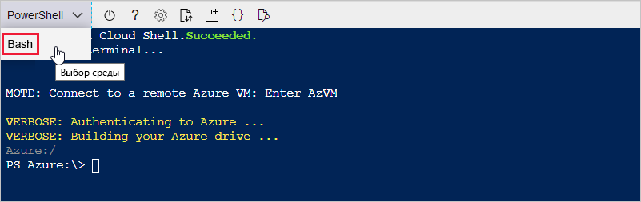
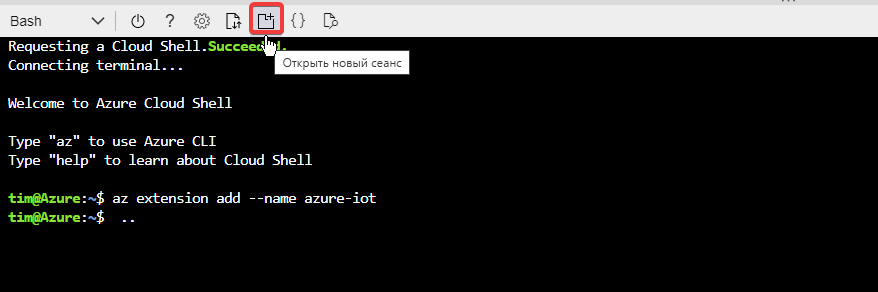
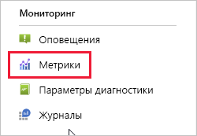
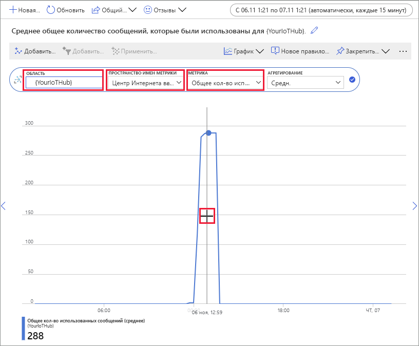

# <a name="quickstart-send-telemetry-from-a-device-to-an-iot-hub-and-monitor-it-with-the-azure-cli"></a>Краткое руководство. Отправка данных телеметрии из устройства в Центр Интернета вещей и их отслеживание с помощью Azure CLI

[!INCLUDE [iot-hub-quickstarts-1-selector](../../includes/iot-hub-quickstarts-1-selector.md)]

Центр Интернета вещей — это служба Azure, которая позволяет получать большие объемы телеметрии с ваших устройств Центра Интернета вещей в облаке на хранение или обработку. В этом кратком руководстве вы научитесь использовать Azure CLI для создания центра Интернета вещей и имитированного устройства, отправлять данные телеметрии устройства в концентратор и отправлять сообщения из облака на устройство. Портал Azure также используется для визуализации метрик устройства. Это базовый рабочий процесс для разработчиков, использующих интерфейс командной строки для взаимодействия с приложением центра Интернета вещей.

## <a name="prerequisites"></a>Предварительные требования
- Если у вас еще нет подписки Azure, [создайте бесплатную учетную запись Azure](https://azure.microsoft.com/free/?WT.mc_id=A261C142F), прежде чем начинать работу.
- Azure CLI. Вы можете выполнить все команды в этом кратком руководстве, используя Azure Cloud Shell, интерактивную оболочку CLI, которая работает в браузере. При использовании Cloud Shell вам не нужно ничего устанавливать. Если вы решили использовать CLI локально, для выполнения инструкций, приведенных в этом руководстве вам потребуется Azure CLI 2.0.76 или более поздней версии. Чтобы узнать версию, выполните команду az --version. Чтобы выполнить установку или обновление, см. сведения в статье [Установка Azure CLI]( /cli/azure/install-azure-cli).

## <a name="sign-in-to-the-azure-portal"></a>Вход на портал Azure
Войдите на портал Azure по адресу https://portal.azure.com.

Независимо от того, запускается интерфейс командной строки локально или в Cloud Shell, не закрывайте портал в браузере.  Он понадобится позже при работе с кратким руководством.

## <a name="launch-the-cloud-shell"></a>Запуск Cloud Shell
В этом разделе вы запустите экземпляр Azure Cloud Shell. Если вы используете CLI локально, перейдите к разделу [Подготовка двух сеансов CLI](#prepare-two-cli-sessions).

Чтобы запустить Cloud Shell:
1. На **портале Azure** в правом верхнем углу в строке меню нажмите кнопку Cloud Shell. 

    

    > [!NOTE]
    > Если вы используете Cloud Shell в первый раз, вам будет предложено создать хранилище, необходимое для использования Cloud Shell.  Выберите подписку для создания учетной записи хранения и общей папки для службы файлов Microsoft Azure. 

1. Выберите предпочтительную среду CLI в раскрывающемся списке **Выбор среды**. В этом кратком руководстве используется среда **Bash**. Все приведенные ниже команды интерфейса командной строки также работают в среде Powershell. 

    

## <a name="prepare-two-cli-sessions"></a>Подготовка двух сеансов CLI
В этом разделе вы подготовите два сеанса Azure CLI. Если вы используете Cloud Shell, два сеанса будут выполняться на разных вкладках браузера. При использовании локального клиента CLI необходимо запустить два отдельных экземпляра CLI. Первый сеанс будет использоваться в качестве имитированного устройства, а второй — для отслеживания и отправки сообщений. Чтобы выполнить команду, выберите **Copy** (Копировать), чтобы скопировать блок кода из этого краткого руководства, а затем вставьте его в сеанс и запустите.

Azure CLI требуется вход в учетную запись Azure. Вся связь между сеансом Azure CLI и центром IoT аутентифицируется и шифруется. В результате, этот быстрый запуск не требует дополнительной аутентификации, которую вы бы использовали с реальным устройством, например, с помощью строки подключения.

1. Выполните команду [az extension add](https://docs.microsoft.com/cli/azure/extension?view=azure-cli-latest#az-extension-add), чтобы добавить Расширение Интернета вещей Microsoft Azure для Azure CLI в оболочку CLI. Расширение Интернета вещей добавляет в Azure CLI специальные команды Центра Интернета вещей, IoT Edge и службы подготовки устройств Интернета вещей (DPS).

   ```azurecli
   az extension add --name azure-cli-iot-ext
   ```
    После установки расширения Интернета вещей Azure его нужно будет устанавливать повторно для любого сеанса Cloud Shell. 

1. Откройте второй сеанс CLI.  Если вы используете Cloud Shell, выберите **Открыть новый сеанс**. Если вы используете CLI локально, откройте второй экземпляр. 

    

## <a name="create-an-iot-hub"></a>Создание центра Интернета вещей
В этом разделе вы используете Azure CLI для создания группы ресурсов и Центра Интернета вещей.  Группа ресурсов Azure является логическим контейнером, в котором происходит развертывание ресурсов Azure и управление ими. Центр Интернета вещей действует в качестве центра сообщений для двусторонней связи между приложением Интернета вещей и устройствами. 

> [!TIP]
> При необходимости с помощью [портала Azure](iot-hub-create-through-portal.md), [Visual Studio Code](iot-hub-create-use-iot-toolkit.md) или других программных методов можно создать группу ресурсов Azure, центр Интернета вещей и другие ресурсы.  

1. Выполните команду [az group create](https://docs.microsoft.com/cli/azure/group?view=azure-cli-latest#az-group-create), чтобы создать группу ресурсов. В следующей команде создается группа ресурсов с именем *MyResourceGroup* в расположении *eastus*. 

    ```azurecli
    az group create --name MyResourceGroup --location eastus
    ```

1. Создайте Центр Интернета вещей с помощью команды [az iot hub create](https://docs.microsoft.com/cli/azure/iot/hub?view=azure-cli-latest#az-iot-hub-create). Создание Центра Интернета вещей может занять несколько минут. 

    *YourIotHubName* Замените этот заполнитель именем вашего центра Интернета вещей. Имя центра Интернета вещей должно быть уникальным по всему Azure. Этот заполнитель используется в оставшейся части этого краткого руководства в качестве имени центра Интернета вещей.

    ```azurecli
    az iot hub create --resource-group MyResourceGroup --name {YourIoTHubName}
    ```

## <a name="create-and-monitor-a-device"></a>Создание и мониторинг устройства
В этом разделе вы создадите имитированное устройство в первом сеансе CLI. Имитированное устройство отправляет данные телеметрии устройства в центр Интернета вещей. Во втором сеансе CLI вы отследите события и данные телеметрии, а также отправите сообщения из облака на имитированное устройство.

Чтобы создать и запустить имитированное устройство, выполните указанные ниже действия.
1. В первом сеансе CLI выполните команду [az iot hub device-identity create](https://docs.microsoft.com/cli/azure/ext/azure-cli-iot-ext/iot/hub/device-identity?view=azure-cli-latest#ext-azure-cli-iot-ext-az-iot-hub-device-identity-create). При этом создается удостоверение имитированного устройства. 

    *YourIotHubName* Замените этот заполнитель именем вашего центра Интернета вещей. 

    *simDevice*. Это имя можно использовать непосредственно для имитированного устройства в оставшейся части этого краткого руководства. При необходимости можете использовать другое имя. 

    ```azurecli
    az iot hub device-identity create --device-id simDevice --hub-name {YourIoTHubName} 
    ```

1. В первом сеансе CLI запустите команду [az iot device simulate](https://docs.microsoft.com/cli/azure/ext/azure-cli-iot-ext/iot/device?view=azure-cli-latest#ext-azure-cli-iot-ext-az-iot-device-simulate).  Это запускает имитированное устройство. Устройство отправляет данные телеметрии в центр Интернета вещей и получает от него сообщения.  

    *YourIotHubName* Замените этот заполнитель именем вашего центра Интернета вещей. 

    ```azurecli
    az iot device simulate -d simDevice -n {YourIoTHubName}
    ```

Для мониторинга устройства выполните указанные ниже действия.
1. Во втором сеансе CLI выполните команду [az iot hub monitor-events](https://docs.microsoft.com/cli/azure/ext/azure-cli-iot-ext/iot/hub?view=azure-cli-latest#ext-azure-cli-iot-ext-az-iot-hub-monitor-events). Начнется мониторинг имитированного устройства. В выходных данных отображаются данные телеметрии, которые имитированное устройство отправляет в центр Интернета вещей.

    *YourIotHubName* Замените этот заполнитель именем вашего центра Интернета вещей. 

    ```azurecli
    az iot hub monitor-events --output table --hub-name {YourIoTHubName}
    ```

    

1. После мониторинга имитированного устройства во втором сеансе CLI нажмите клавиши CTRL+C, чтобы прервать мониторинг. 

## <a name="use-the-cli-to-send-a-message"></a>Отправка сообщения с помощью CLI
В этом разделе вы используете второй сеанс CLI для отправки сообщения на имитированное устройство.

1. Убедитесь, что имитированное устройство запущено в первом сеансе CLI. Если устройство было остановлено, выполните следующую команду, чтобы запустить его:

    *YourIotHubName* Замените этот заполнитель именем вашего центра Интернета вещей. 

    ```azurecli
    az iot device simulate -d simDevice -n {YourIoTHubName}
    ```

1. Во втором сеансе CLI выполните команду [az iot device c2d-message send](https://docs.microsoft.com/cli/azure/ext/azure-cli-iot-ext/iot/device/c2d-message?view=azure-cli-latest#ext-azure-cli-iot-ext-az-iot-device-c2d-message-send). С ее помощью отправляется сообщение из центра Интернета вещей в виртуальное устройство. Сообщение содержит строку и две пары "ключ-значение".  

    *YourIotHubName* Замените этот заполнитель именем вашего центра Интернета вещей. 

    ```azurecli
    az iot device c2d-message send -d simDevice --data "Hello World" --props "key0=value0;key1=value1" -n {YourIoTHubName}
    ```
    При необходимости сообщения из облака на устройство можно отправить с помощью портала Azure. Для этого перейдите на страницу обзора центра Интернета вещей, выберите **Устройства Интернета вещей**, выберите имитированное устройство и нажмите **Сообщение устройству**. 

1. В первом сеансе CLI убедитесь, что имитированное устройство получило сообщение. 

    

1. После просмотра сообщения закройте второй сеанс CLI. Не закрывайте первый сеанс CLI. Его можно использовать позже для очистки ресурсов.

## <a name="view-messaging-metrics-in-the-portal"></a>Просмотр метрик обмена сообщениями на портале
Портал Azure позволяет управлять всеми аспектами устройств и центра Интернета вещей. В типичном приложении центра Интернета вещей, которое принимает данные телеметрии с устройств, может потребоваться мониторинг устройств или просмотр метрик на телеметрии устройств. 

Чтобы визуализировать метрики обмена сообщениями на портале Azure:
1. На портале в левом меню навигации выберите **Все ресурсы**. Список всех ресурсов в вашей подписке, включая созданный центр Интернета вещей. 

1. Выберите ссылку на созданный центр Интернета вещей. На портале отобразится страница обзора для центра.

1. Выберите **Метрики** в левой панели центра Интернета вещей. 

    

1. Введите имя центра Интернета вещей в **области**.

2. Выберите *стандартные метрики центра Интернета вещей* в **пространстве имен метрики**.

3. Выберите *Total number of messages used* (Общее количество используемых сообщений) в разделе **Метрика**. 

4. Наведите указатель мыши на область временной шкалы, в которой устройство отправляло сообщения. Общее количество сообщений в момент времени отображается в левом нижнем углу временной шкалы.

    

5. Кроме того, используйте раскрывающийся список **Метрика**, чтобы отобразить на имитированном устройстве другие метрики. Например, *Доставка сообщений C2d завершена* или *Всего устройств (предварительная версия)* . 

## <a name="clean-up-resources"></a>Очистка ресурсов
Если вам больше не нужны ресурсы Azure, созданные в этом кратком руководстве, используйте Azure CLI, чтобы удалить их.

Вы можете сохранить созданные ресурсы и повторно использовать их при выполнении задач в следующей рекомендуемой статье. 

> [!IMPORTANT]
> Удаление группы ресурсов — процесс необратимый. Группа ресурсов и все содержащиеся в ней ресурсы удаляются без возможности восстановления. Будьте внимательны, чтобы случайно не удалить не ту группу ресурсов или не те ресурсы. 

Удаление группы ресурсов по имени:
1. Выполните команду [az group delete](https://docs.microsoft.com/cli/azure/group?view=azure-cli-latest#az-group-delete). При этом будут удалены созданные группа ресурсов, центр Интернета вещей и регистрация устройства.

    ```azurecli
    az group delete --name MyResourceGroup
    ```
1. Выполните команду [az group list](https://docs.microsoft.com/cli/azure/group?view=azure-cli-latest#az-group-list), чтобы подтвердить удаление группы ресурсов.  

    ```azurecli
    az group list
    ```

## <a name="next-steps"></a>Дополнительная информация
В этом кратком руководстве вы использовали Azure CLI для создания центра Интернета вещей, имитированного устройства, отправки данных телеметрии, отслеживания телеметрии, отправки сообщения из облака на устройство и очистки ресурсов. Вы использовали портал Azure для визуализации метрик обмена сообщениями на устройстве.

Если вы являетесь разработчиком устройств, то следующим шагом будет ознакомление с кратким руководством по телеметрии, в котором используется Azure IoT Device SDK для C. Кроме того, вы можете ознакомится с одной из доступных статьей "Краткое руководство по телеметрии Центра Интернета вещей Azure" на выбранном вами языке или SDK.

> [!div class="nextstepaction"]
> [Краткое руководство Отправка данных телеметрии с устройства в Центр Интернета вещей (C)](quickstart-send-telemetry-c.md)
