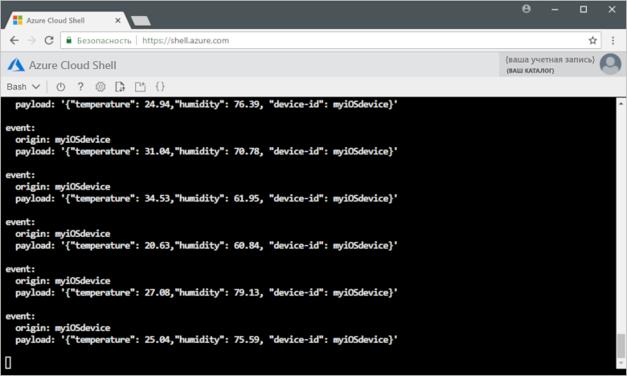

# <a name="quickstart-send-telemetry-from-a-device-to-an-iot-hub-ios"></a>Краткое руководство. Отправка данных телеметрии из устройства в центр Интернета вещей (iOS)

[!INCLUDE [iot-hub-quickstarts-1-selector](../../includes/iot-hub-quickstarts-1-selector.md)]

Центр Интернета вещей — это служба Azure, которая позволяет получать большие объемы телеметрии с ваших устройств Центра Интернета вещей в облаке на хранение или обработку. В этой статье телеметрия отправляется из приложения имитированного устройства в Центр Интернета вещей. Затем можно просмотреть данные из серверной части приложения. 

В этой статье используется предварительно написанное приложение Swift для отправки телеметрии и служебная программа CLI для чтения телеметрии из Центра Интернета вещей. 

[!INCLUDE [cloud-shell-try-it.md](../../includes/cloud-shell-try-it.md)]

Если у вас еще нет подписки Azure, [создайте бесплатную учетную запись Azure](https://azure.microsoft.com/free/?WT.mc_id=A261C142F), прежде чем начинать работу.

## <a name="prerequisites"></a>Предварительные требования

- Скачать пример кода из [примеров Azure](https://github.com/Azure-Samples/azure-iot-samples-ios/archive/master.zip). 
- Последняя версия [XCode](https://developer.apple.com/xcode/), выполняющая последнюю версию пакета SDK для iOS. Это краткое руководство протестировано с использованием версий XCode 9.3 и iOS 11.3;
- Последняя версия [CocoaPods](https://guides.cocoapods.org/using/getting-started.html).

## <a name="create-an-iot-hub"></a>Создание Центра Интернета вещей

[!INCLUDE [iot-hub-include-create-hub](../../includes/iot-hub-include-create-hub.md)]

## <a name="register-a-device"></a>Регистрация устройства

Устройство должно быть зарегистрировано в Центре Интернета вещей, прежде чем оно сможет подключиться. В этом кратком руководстве для регистрации имитируемого устройства используется Azure Cloud Shell.

1. Выполните приведенные ниже команды в Azure Cloud Shell, чтобы добавить расширение CLI Центра Интернета вещей и создать удостоверение устройства. 

   **YourIoTHubName**. Замените этот заполнитель именем вашего Центра Интернета вещей.

   **myiOSdevice**. Это имя, присвоенное зарегистрированному устройству. Используйте myiOSdevice, как показано ниже. Если вы выбрали другое имя для устройства, используйте его при работе с этим руководством и обновите имя устройства в примерах приложений перед их запуском.

   ```azurecli-interactive
   az extension add --name azure-cli-iot-ext
   az iot hub device-identity create --hub-name YourIoTHubName --device-id myiOSdevice
   ```

1. Выполните следующую команду, чтобы получить _строку подключения устройства_ для зарегистрированного устройства:

   ```azurecli-interactive
   az iot hub device-identity show-connection-string --hub-name YourIoTHubName --device-id myiOSdevice --output table
   ```

   Запишите строку подключения устройства, которая выглядит так:

   `HostName={YourIoTHubName}.azure-devices.net;DeviceId=MyNodeDevice;SharedAccessKey={YourSharedAccessKey}`

    Это значение понадобится позже в рамках этого краткого руководства.

## <a name="send-simulated-telemetry"></a>Отправка имитированной телеметрии

Тот же пример приложения выполняется на устройстве iOS, которое подключается к конечной точке конкретного устройства Центра Интернета вещей и отправляет имитированную телеметрию температуры и влажности. 

### <a name="install-cocoapods"></a>Установка CocoaPods

CocoaPods управляет зависимостями проектов iOS, которые используют сторонние библиотеки.

В окне локального терминала перейдите в папку Azure-IoT-Samples-iOS, скачанную на этапе подготовки. Перейдите к примеру проекта:

```sh
cd quickstart/sample-device
```

Убедитесь, что XCode закрыт, а затем выполните следующую команду, чтобы установить CocoaPods, объявленный в файле **podfile**:

```sh
pod install
```

Вместе с установкой модулей, необходимых для проекта, команда установки также создает файл рабочей области XCode, который уже настроен для использования pod с зависимостями. 

### <a name="run-the-sample-application"></a>Запуск примера приложения 

1. Откройте пример рабочей области в XCode.

   ```sh
   open "MQTT Client Sample.xcworkspace"
   ```

2. Разверните проект **Пример клиента MQTT**, а затем разверните папку с тем же именем.  
3. Откройте **ViewController.swift** для редактирования в XCode. 
4. Найдите переменную **connectionString** и обновите значение с помощью строки подключения устройства, записанной ранее.
5. Сохраните изменения. 
6. Выполните проект в эмуляторе устройства, нажав кнопку **Сборка и запуск** или клавиши **COMMAND+R**. 

   

7. В открывшемся эмуляторе в примере приложения выберите **Запустить**.

На следующем снимке экрана показан пример выходных данных, когда приложение отправляет имитируемую телеметрию в Центр Интернета вещей:

   

## <a name="read-the-telemetry-from-your-hub"></a>Чтение данных телеметрии из концентратора

Пример приложения, выполняемого в эмуляторе XCode, показывает данные о сообщениях, отправленных с устройства. Вы также можете просматривать данные в Центре Интернета вещей по мере их получения. Расширение CLI для Центра Интернета вещей позволяет подключить конечную точку сервера **События** к Центру Интернета вещей. Расширение получает сообщения с устройства в облако, отправленные с имитированного устройства. Внутреннее приложение Центра Интернета вещей обычно запускается в облаке, чтобы получать сообщения с устройства в облако и обрабатывать их.

Выполните следующие команды в Azure Cloud Shell, заменив `YourIoTHubName` на имя вашего центра Интернета вещей:

```azurecli-interactive
az iot hub monitor-events --device-id myiOSdevice --hub-name YourIoTHubName
```

На следующем снимке экрана показан пример выходных данных, когда расширение получает данные телеметрии, отправленные в центр имитированным устройством:

На следующем снимке экрана показан тип телеметрии, используемый в окне терминала на локальном компьютере:



## <a name="clean-up-resources"></a>Очистка ресурсов

[!INCLUDE [iot-hub-quickstarts-clean-up-resources](../../includes/iot-hub-quickstarts-clean-up-resources.md)]

## <a name="next-steps"></a>Дополнительная информация

В этой статье вы настраивали Центр Интернета вещей, регистрировали устройство, отправляли имитируемую телеметрию в концентратор из устройства iOS, а также читали телеметрию из концентратора. 

Чтобы узнать, как управлять имитированным устройством из внутреннего приложения, перейдите к следующему краткому руководству.

> [!div class="nextstepaction"]
> [Краткое руководство. Управление подключенным к Центру Интернета вещей устройством](quickstart-control-device-node.md)

<!-- Links -->
[lnk-process-d2c-tutorial]: tutorial-routing.md
[lnk-device-management]: iot-hub-node-node-device-management-get-started.md
[lnk-iot-edge]: ../iot-edge/tutorial-simulate-device-linux.md
[lnk-connect-device]: https://azure.microsoft.com/develop/iot/
