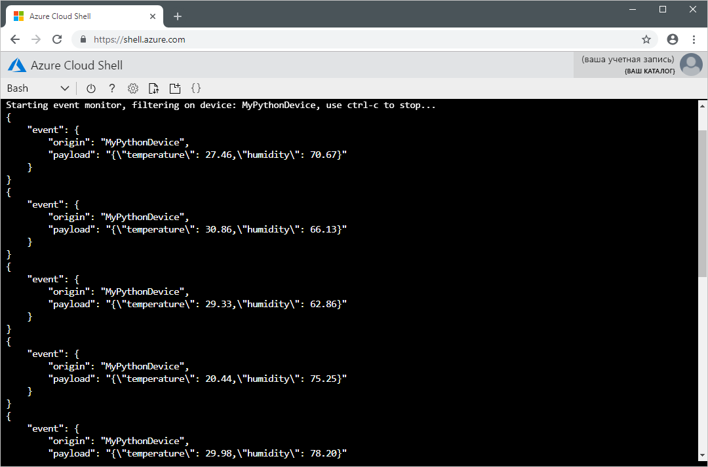

# <a name="quickstart-send-telemetry-from-a-device-to-an-iot-hub-and-read-it-with-a-back-end-application-python"></a>Краткое руководство. Отправка данных телеметрии из устройства в Центр Интернета вещей и их чтение с помощью внутреннего приложения (Python)

[!INCLUDE [iot-hub-quickstarts-1-selector](../../includes/iot-hub-quickstarts-1-selector.md)]

В рамках этого краткого руководства вы отправите данные телеметрии из приложения имитированного устройства через Центр Интернета вещей Azure во внутреннее приложение для обработки. Центр Интернета вещей — это служба Azure, которая позволяет получать большие объемы телеметрии с ваших устройств Центра Интернета вещей в облаке на хранение или обработку. В рамках этого краткого руководства используется заранее разработанное приложение Python для отправки телеметрии и служебная программа CLI для чтения телеметрии из центра. Прежде чем запускать эти приложения, создайте Центр Интернета вещей и зарегистрируйте устройство в центре.

## <a name="prerequisites"></a>Предварительные требования

* Учетная запись Azure с активной подпиской. [Создайте бесплатно](https://azure.microsoft.com/free/?ref=microsoft.com&utm_source=microsoft.com&utm_medium=docs&utm_campaign=visualstudio).

* [Python версии 3.7 и выше](https://www.python.org/downloads/). Сведения о других поддерживаемых версиях Python см. в разделе о [возможностях устройств Azure IoT](https://github.com/Azure/azure-iot-sdk-python/tree/master/azure-iot-device#azure-iot-device-features).

* [Пример проекта Python](https://github.com/Azure-Samples/azure-iot-samples-python/archive/master.zip).

* Порт 8883, открытый в брандмауэре. Пример устройства в этом кратком руководстве использует протокол MQTT, который передает данные через порт 8883. В некоторых корпоративных и академических сетях этот порт может быть заблокирован. Дополнительные сведения и способы устранения этой проблемы см. в разделе о [подключении к Центру Интернета вещей по протоколу MQTT](iot-hub-mqtt-support.md#connecting-to-iot-hub).

[!INCLUDE [cloud-shell-try-it.md](../../includes/cloud-shell-try-it.md)]

### <a name="add-azure-iot-extension"></a>Добавление расширения Azure IoT

Выполните следующую команду, чтобы добавить расширение Интернета вещей Microsoft Azure для Azure CLI в экземпляр Cloud Shell. Расширение Интернета вещей добавляет в Azure CLI специальные команды Центра Интернета вещей, IoT Edge и службы подготовки устройств Интернета вещей (DPS).

```azurecli-interactive
az extension add --name azure-iot
```

[!INCLUDE [iot-hub-cli-version-info](../../includes/iot-hub-cli-version-info.md)]

## <a name="create-an-iot-hub"></a>Создание Центра Интернета вещей

[!INCLUDE [iot-hub-include-create-hub](../../includes/iot-hub-include-create-hub.md)]

## <a name="register-a-device"></a>Регистрация устройства

Устройство должно быть зарегистрировано в Центре Интернета вещей, прежде чем оно сможет подключиться. В этом кратком руководстве для регистрации имитируемого устройства используется Azure Cloud Shell.

1. Выполните приведенные ниже команды в Azure Cloud Shell, чтобы создать удостоверение устройства.

    **YourIoTHubName**. Замените этот заполнитель именем вашего центра Интернета вещей.

    **MyPythonDevice**. Это имя регистрируемого устройства. Рекомендуется использовать **MyPythonDevice**, как показано ниже. Если вы выбрали другое имя для устройства, используйте его при работе с этим руководством и обновите имя устройства в примерах приложений перед их запуском.

    ```azurecli-interactive
    az iot hub device-identity create --hub-name {YourIoTHubName} --device-id MyPythonDevice
    ```

1. Выполните приведенную ниже команду в Azure Cloud Shell, чтобы получить _строку подключения_ зарегистрированного устройства.

    **YourIoTHubName**. Замените этот заполнитель именем вашего центра Интернета вещей.

    ```azurecli-interactive
    az iot hub device-identity show-connection-string --hub-name {YourIoTHubName} --device-id MyPythonDevice --output table
    ```

    Запишите строку подключения устройства, которая выглядит так:

   `HostName={YourIoTHubName}.azure-devices.net;DeviceId=MyPythonDevice;SharedAccessKey={YourSharedAccessKey}`

    Это значение понадобится позже при работе с этим кратким руководством.

## <a name="send-simulated-telemetry"></a>Отправка имитированной телеметрии

Приложение имитированного устройства подключается к конечной точке конкретного устройства Центра Интернета вещей и отправляет имитированную телеметрию температуры и влажности.

1. В окне терминала на локальном компьютере перейдите в корневую папку примера проекта Python. Затем перейдите в папку **iot-hub\Quickstarts\simulated-device**.

1. Откройте файл **SimulatedDevice.py** в любом текстовом редакторе.

    Замените значение переменной `CONNECTION_STRING` записанной ранее строкой подключения к устройству. Сохраните изменения в файле **SimulatedDevice.py**.

1. Установите необходимые библиотеки для приложения имитированного устройства, выполнив в окне терминала на локальном компьютере следующие команды:

    ```cmd/sh
    pip install azure-iot-device
    ```

1. Запустите приложение имитированного устройства, выполнив в окне терминала на локальном компьютере следующие команды:

    ```cmd/sh
    python SimulatedDevice.py
    ```

    На следующем снимке экрана показан пример выходных данных, когда приложение имитированного устройства отправляет данные телеметрии в Центр Интернета вещей:

    


## <a name="read-the-telemetry-from-your-hub"></a>Чтение данных телеметрии из концентратора

Расширение CLI для Центра Интернета вещей позволяет подключить конечную точку сервера **События** к Центру Интернета вещей. Расширение получает сообщения с устройства в облако, отправленные с имитированного устройства. Внутреннее приложение Центра Интернета вещей обычно запускается в облаке, чтобы получать сообщения с устройства в облако и обрабатывать их.

Выполните следующие команды в Azure Cloud Shell, заменив `YourIoTHubName` на имя вашего центра Интернета вещей:

```azurecli-interactive
az iot hub monitor-events --hub-name {YourIoTHubName} --device-id MyPythonDevice 
```

На следующем снимке экрана показан пример выходных данных, когда расширение получает данные телеметрии, отправленные в центр имитированным устройством:



## <a name="clean-up-resources"></a>Очистка ресурсов

[!INCLUDE [iot-hub-quickstarts-clean-up-resources](../../includes/iot-hub-quickstarts-clean-up-resources.md)]

## <a name="next-steps"></a>Дальнейшие действия

При работе с этим кратким руководством вы настроили центр Интернета вещей, зарегистрировали устройство, отправили имитированные данные телеметрии в центр с помощью приложения Python, а также считали данные телеметрии из центра, используя простое внутреннее приложение.

Чтобы узнать, как управлять имитированным устройством из внутреннего приложения, перейдите к следующему краткому руководству.

> [!div class="nextstepaction"]
> [Краткое руководство. Управление подключенным к Центру Интернета вещей устройством](quickstart-control-device-python.md)
