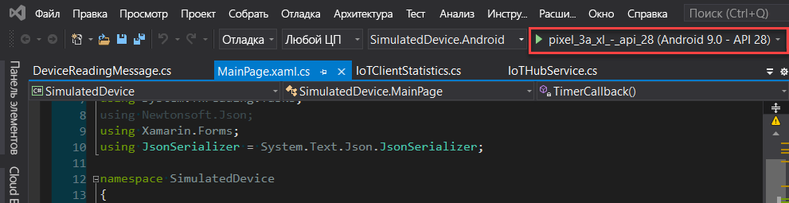
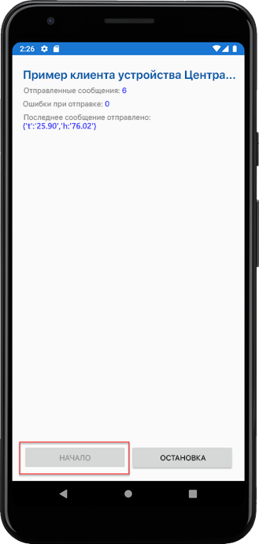

# <a name="quickstart-send-telemetry-from-a-device-to-an-iot-hub-xamarinforms"></a>Краткое руководство. Отправка данных телеметрии с устройства в центр Интернета вещей (Xamarin.Forms)

[!INCLUDE [iot-hub-quickstarts-1-selector](../../includes/iot-hub-quickstarts-1-selector.md)]

Центр Интернета вещей — это служба Azure, которая позволяет получать большие объемы телеметрии с ваших устройств Центра Интернета вещей в облаке на хранение или обработку. В этой статье телеметрия отправляется из приложения имитированного устройства в Центр Интернета вещей. Затем можно просмотреть данные из серверной части приложения.

В этой статье используется предварительно написанное приложение Xamarin.Forms для отправки телеметрии и служебная программа CLI для считывания телеметрии из Центра Интернета вещей.

[!INCLUDE [cloud-shell-try-it.md](../../includes/cloud-shell-try-it.md)]

Если у вас еще нет подписки Azure, [создайте бесплатную учетную запись](https://azure.microsoft.com/free/?WT.mc_id=A261C142F), прежде чем начинать работу.


## <a name="prerequisites"></a>Предварительные требования

- Скачать пример кода из [примеров Azure](https://github.com/Azure-Samples/azure-iot-samples-xamarin/archive/master.zip).

- Последняя версия [Visual Studio 2019](https://visualstudio.microsoft.com/) или [Visual Studio для Mac](https://visualstudio.microsoft.com/) с установленными инструментами Xamarin.Forms. Примеры из этого краткого руководства выполнялись в Visual Studio 16.6.0.

- Убедитесь, что в брандмауэре открыт порт 8883. Пример устройства в этом кратком руководстве использует протокол MQTT, который передает данные через порт 8883. В некоторых корпоративных и академических сетях этот порт может быть заблокирован. Дополнительные сведения и способы устранения этой проблемы см. в разделе о [подключении к Центру Интернета вещей по протоколу MQTT](iot-hub-mqtt-support.md#connecting-to-iot-hub).

- Выполните следующую команду, чтобы добавить расширение Интернета вещей Microsoft Azure для Azure CLI в экземпляр Cloud Shell. Расширение Интернета вещей добавляет в Azure CLI специальные команды Центра Интернета вещей, IoT Edge и службы подготовки устройств Интернета вещей (DPS).

   ```azurecli-interactive
   az extension add --name azure-iot
   ```

   [!INCLUDE [iot-hub-cli-version-info](../../includes/iot-hub-cli-version-info.md)]

## <a name="create-an-iot-hub"></a>Создание Центра Интернета вещей

[!INCLUDE [iot-hub-include-create-hub](../../includes/iot-hub-include-create-hub.md)]

## <a name="register-a-device"></a>Регистрация устройства

Устройство должно быть зарегистрировано в Центре Интернета вещей, прежде чем оно сможет подключиться. В этом кратком руководстве для регистрации имитируемого устройства используется Azure Cloud Shell.

1. Выполните приведенные ниже команды в Azure Cloud Shell, чтобы создать удостоверение устройства.

   **YourIoTHubName**. Замените этот заполнитель именем вашего центра Интернета вещей.

   **myXamarinDevice.** Это имя регистрируемого устройства. Рекомендуется использовать **myXamarinDevice**, как показано ниже. Если вы выбрали другое имя для устройства, используйте его при работе с этим руководством и обновите имя устройства в примерах приложений перед их запуском.

   ```azurecli-interactive
   az iot hub device-identity create --hub-name {YourIoTHubName} --device-id myXamarinDevice
   ```

1. Выполните следующую команду в Azure Cloud Shell, чтобы получить _строку подключения_ зарегистрированного устройства:

   **YourIoTHubName**. Замените этот заполнитель именем вашего центра Интернета вещей.

   ```azurecli-interactive
   az iot hub device-identity show-connection-string --hub-name {YourIoTHubName} --device-id myXamarinDevice --output table
   ```

   Запишите строку подключения устройства, которая выглядит так:

   `HostName={YourIoTHubName}.azure-devices.net;DeviceId=myXamarinDevice;SharedAccessKey={YourSharedAccessKey}`

    Это значение понадобится позже при работе с этим кратким руководством.

## <a name="send-simulated-telemetry"></a>Отправка имитированной телеметрии

Пример приложения выполняется в Windows с помощью приложения UWP, на устройстве или в симуляторе iOS, а также на устройстве или в симуляторе Android, которые подключаются к конечной точке устройства в центре Интернета вещей и отправляют сгенерированную телеметрию с данными о температуре и влажности. 

1. Откройте пример рабочей области в Visual Studio или Visual Studio для Mac.
2. Разверните проект **SimulatedDevice**.  
3. Откройте **IoTHubService.cs** для редактирования в Visual Studio. 
4. Найдите переменную **_iotHubConnectionString** и обновите значение, используя записанную ранее строку подключения устройства.
5. Сохраните изменения. 
6. Запустите проект в эмуляторе устройства или на реальном устройстве, нажав кнопку **Сборка и запуск** или клавиши **F5** в Windows и **COMMAND+r** на Mac. 

   

7. В открывшемся эмуляторе в примере приложения выберите **Запустить**.

На следующем снимке экрана показан пример выходных данных, когда приложение отправляет имитируемую телеметрию в Центр Интернета вещей: 

## <a name="read-the-telemetry-from-your-hub"></a>Чтение данных телеметрии из концентратора

Пример приложения, выполняемого в эмуляторе XCode, показывает данные о сообщениях, отправленных с устройства. Вы также можете просматривать данные в Центре Интернета вещей по мере их получения. Расширение CLI для Центра Интернета вещей позволяет подключить конечную точку сервера **События** к Центру Интернета вещей. Расширение получает сообщения с устройства в облако, отправленные с имитированного устройства. Внутреннее приложение Центра Интернета вещей обычно запускается в облаке, чтобы получать сообщения с устройства в облако и обрабатывать их.

Выполните следующие команды в Azure Cloud Shell, заменив `YourIoTHubName` на имя вашего центра Интернета вещей:

```azurecli-interactive
az iot hub monitor-events --device-id myXamarinDevice --hub-name {YourIoTHubName}
```

На следующем снимке экрана показан пример выходных данных, когда расширение получает данные телеметрии, отправленные в центр имитированным устройством:

На следующем снимке экрана показан тип телеметрии, используемый в окне терминала на локальном компьютере: 

## <a name="clean-up-resources"></a>Очистка ресурсов

[!INCLUDE [iot-hub-quickstarts-clean-up-resources](../../includes/iot-hub-quickstarts-clean-up-resources.md)]

## <a name="next-steps"></a>Дальнейшие действия

С помощью этого краткого руководства вы настроили центр Интернета вещей, зарегистрировали устройство, отправили сгенерированную телеметрию в центр из приложения Xamarin.Forms, а также считали телеметрию из центра. 

Чтобы узнать, как управлять имитированным устройством из внутреннего приложения, перейдите к следующему краткому руководству.

> [!div class="nextstepaction"]
> [Краткое руководство. Управление подключенным к Центру Интернета вещей устройством](quickstart-control-device-node.md)
