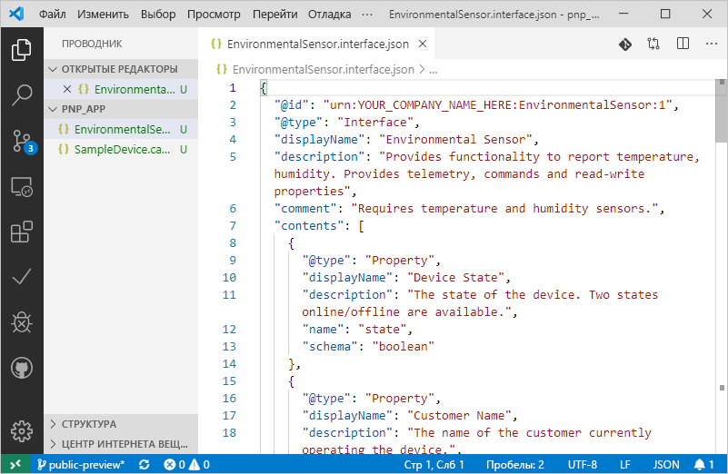
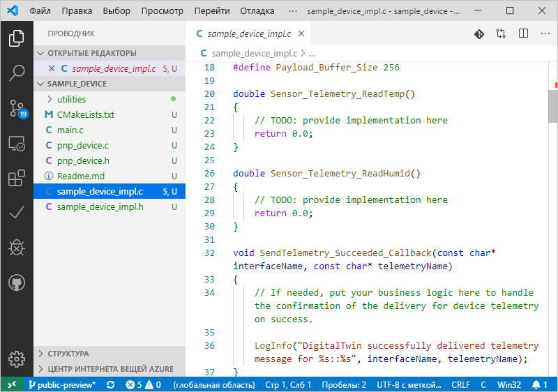

# <a name="quickstart-use-a-device-capability-model-to-create-an-iot-plug-and-play-preview-device-linux"></a>Краткое руководство. Создание устройства IoT Plug and Play (предварительная версия) в Linux с помощью модели возможностей устройства

_Модель возможностей устройства_ (DCM) описывает возможности устройства IoT Plug and Play. DCM часто связана с номером SKU продукта. Возможности, определенные в DCM, упорядочены в многократно используемые интерфейсы. Вы можете создать каркас кода устройства на основе DCM. В этом кратком руководстве показано, как создать устройство IoT Plug and Play с помощью DCM в VS Code в Ubuntu Linux.

## <a name="prerequisites"></a>Предварительные требования

В этом кратком руководстве предполагается, что вы используете Ubuntu Linux со средой рабочего стола. Действия, описанные в этом руководстве, были протестированы в Ubuntu 18.04.

Для выполнения инструкций, указанных в этом кратком руководстве, вам необходимо установить на локальный компьютер Linux следующее программное обеспечение:

* Установите **GCC**, **Git**, **cmake** и все зависимости с помощью команды `apt-get`.

    ```sh
    sudo apt-get update
    sudo apt-get install -y git cmake build-essential curl libcurl4-openssl-dev libssl-dev uuid-dev
    ```

    Убедитесь, что версия `cmake` выше **2.8.12**, а версия **GCC** выше **4.4.7**.

    ```sh
    cmake --version
    gcc --version
    ```

* [Visual Studio Code](https://code.visualstudio.com/).

### <a name="install-azure-iot-tools"></a>Установка средств Azure IoT

Чтобы установить пакет расширения [Azure IoT Tools для VS Code](https://marketplace.visualstudio.com/items?itemName=vsciot-vscode.azure-iot-tools), выполните следующие действия:

1. В VS Code выберите вкладку **Расширения**.
1. Выполните поиск **Azure IoT Tools**.
1. Щелкните **Установить**.

### <a name="get-the-connection-string-for-your-company-model-repository"></a>Получение строки подключения для репозитория моделей компании

_Строку подключения к репозиторию моделей компании_ можно найти на [портале Microsoft Azure Certified for IoT](https://preview.catalog.azureiotsolutions.com) при входе с помощью рабочей или учебной учетной записи Майкрософт или ИД партнера Майкрософт, если таковой имеется. Выполнив вход, выберите **Company repository** (Корпоративный репозиторий), а затем **Connection strings** (Строки подключения).

[!INCLUDE [cloud-shell-try-it.md](../../includes/cloud-shell-try-it.md)]

## <a name="prepare-an-iot-hub"></a>Подготовка Центра Интернета вещей

Для выполнения инструкций, приведенных в этом кратком руководстве, также необходим Центр Интернета вещей Azure в подписке Azure. Если у вас еще нет подписки Azure, [создайте бесплатную учетную запись Azure](https://azure.microsoft.com/free/?WT.mc_id=A261C142F), прежде чем начинать работу. Если у вас нет центра Интернета вещей, создайте его, следуя приведенным ниже указаниям.

Если вы используете Azure CLI локально, версия `az` должна быть **2.0.75** или выше. В Azure Cloud Shell используется последняя версия. Используйте команду `az --version`, чтобы проверить версию, установленную на компьютере.

Выполните следующую команду, чтобы добавить расширение Интернета вещей Microsoft Azure для Azure CLI в экземпляр Cloud Shell:

```azurecli-interactive
az extension add --name azure-cli-iot-ext
```

Для выполнения действий, описанных в этом кратком руководстве, требуется расширение версии **0.8.5** или более поздней версии. Используйте команду `az extension list`, чтобы проверить установленную версию, а также команду `az extension update`, чтобы выполнить обновление, если это необходимо.

Если у вас нет центра Интернета вещей, создайте его с помощью приведенных ниже команд, заменив `<YourIoTHubName>` уникальным именем. Если вы выполняете эти команды локально, сначала войдите в подписку Azure с помощью `az login`. Если вы используете эти команды в Azure Cloud Shell, то вход выполнен автоматически.

  ```azurecli-interactive
  az group create --name pnpquickstarts_rg --location centralus
  az iot hub create --name <YourIoTHubName> \
    --resource-group pnpquickstarts_rg --sku S1
  ```

Предыдущие команды создают группу ресурсов `pnpquickstarts_rg` и центр Интернета вещей в центральном регионе США.

> [!IMPORTANT]
> На этапе общедоступной предварительной версии функции IoT Plug and Play доступны только в центрах Интернета вещей, созданных в таких регионах, как **Центральная часть США**, **Северная Европа** и **Восточная Япония**.

Выполните приведенную ниже команду, чтобы создать удостоверение устройства в Центре Интернета вещей. Замените заполнители **YourIoTHubName** и **YourDevice** фактическими именами.

```azurecli-interactive
az iot hub device-identity create --hub-name <YourIoTHubName> --device-id <YourDevice>
```

Выполните приведенные ниже команды, чтобы получить _строку подключения к только что зарегистрированному устройству_.

```azurecli-interactive
az iot hub device-identity show-connection-string --hub-name <YourIoTHubName> --device-id <YourDevice> --output table
```

## <a name="author-your-model"></a>Создание модели

В этом кратком руководстве используется имеющийся пример модели возможностей устройства и связанные интерфейсы.

1. На локальном диске создайте каталог `pnp_app`. Эта папка используется для файлов модели устройства и заглушки кода устройства.

    ```bash
    cd ~
    mkdir pnp_app
    ```

1. Скачайте модель возможностей устройства и файлы примеров интерфейса в папку `pnp_app`.

    ```bash
    cd pnp_app
    curl -O -L https://raw.githubusercontent.com/Azure/IoTPlugandPlay/master/samples/SampleDevice.capabilitymodel.json
    curl -O -L https://raw.githubusercontent.com/Azure/IoTPlugandPlay/master/samples/EnvironmentalSensor.interface.json
    ```

1. Откройте папку `pnp_app` ​​с помощью VS Code. Файлы можно просмотреть с помощью IntelliSense.

    

1. В скачанных файлах замените `<YOUR_COMPANY_NAME_HERE>` в полях `@id` и `schema` уникальным значением. Используйте только символы a–z, A–Z, 0–9 и знак подчеркивания. Дополнительные сведения см. в статье [о формате идентификаторов цифровых двойников](https://github.com/Azure/IoTPlugandPlay/tree/master/DTDL#digital-twin-identifier-format).

## <a name="generate-the-c-code-stub"></a>Создание заглушки кода C

Теперь у вас есть модель DCM и связанные с ней интерфейсы, и вы можете сгенерировать код устройства, который реализует модель. Чтобы создать заглушку кода C в VS Code, сделайте следующее.

1. Откройте папку `pnp_app` в VS Code, нажмите клавиши **CTRL+SHIFT+P**, чтобы открыть палитру команд, введите **IoT Plug and Play** и выберите **Generate Device Code Stub** (Создать заглушку кода устройства).

    > [!NOTE]
    > При первом использовании служебной программы IoT Plug and Play Code Generator скачивание и автоматическая установка занимают несколько секунд.

1. Выберите файл **SampleDevice.capabilitymodel.json**, который будет использоваться для создания заглушки кода устройства.

1. Введите название проекта **sample_device**. Это будет именем вашего устройства.

1. Выберите **ANSI C** в качестве языка.

1. В качестве способа подключения выберите **Via IoT Hub device connection string** (Через строку подключения к устройству Центра Интернета вещей).

1. Выберите **CMake Project on Linux** в качестве шаблона проекта.

1. Выберите **Via Source Code** (С помощью исходного кода) в качестве способа добавления пакета SDK для устройств.

1. Новая папка **sample_device** создается в том же расположении, что и файл DCM, и в ней создаются файлы заглушки кода устройства. VS Code открывает новое окно для их отображения.
    

## <a name="build-and-run-the-code"></a>Сборка и выполнение кода

Вы используете исходный код пакета SDK для устройств для сборки созданной заглушки кода устройства. Создаваемое приложение имитирует устройство, которое подключается к Центру Интернета вещей. Оно отправляет данные телеметрии и свойства, а также получает команды.

1. Выполните следующие команды, чтобы скачать исходный код пакета SDK для устройств.

    ```bash
    cd ~/pnp_app/sample_device
    git clone https://github.com/Azure/azure-iot-sdk-c --recursive -b public-preview
    ```

1. Создайте папку сборки **CMake** для приложения **sample_device**.

    ```bash
    cd ~/pnp_app/sample_device
    mkdir cmake
    cd cmake
    ```

1. Запустите CMake, чтобы выполнить сборку приложения с помощью пакета SDK.

    ```bash
    cmake .. -Duse_prov_client=ON -Dhsm_type_symm_key:BOOL=ON -Dskip_samples:BOOL=ON
    cmake --build .
    ```

1. После успешного выполнения сборки запустите приложение, передав в качестве параметра строку подключения к устройству Центра Интернета вещей.

    ```sh
    cd ~/pnp_app/sample_device/cmake
    ./sample_device "<device connection string>"
    ```

1. Приложение устройства начнет отправку данных в Центр Интернета вещей.

    

## <a name="validate-the-code"></a>Проверка кода

### <a name="publish-device-model-files-to-model-repository"></a>Публикация файлов модели устройства в репозитории моделей

Чтобы проверить код устройства с помощью интерфейса командной строки **az**, необходимо опубликовать файлы в репозитории моделей.

1. В открытой папке `pnp_app` нажмите клавиши **CTRL+SHIFT+P**, чтобы открыть палитру команд, введите и выберите **IoT Plug & Play: Submit files to Model Repository** (Отправка файлов в репозиторий моделей IoT Plug and Play).

1. Выберите файлы `SampleDevice.capabilitymodel.json` и `EnvironmentalSensor.interface.json`.

1. Введите строку подключения к репозиторию моделей компании.

    > [!NOTE]
    > Строка подключения требуется только при первом подключении к репозиторию.

1. В окне вывода и уведомлений VS Code можно проверить, успешно ли опубликованы файлы.

    > [!NOTE]
    > При возникновении ошибок во время публикации файлов модели устройств можно попробовать использовать команду **IoT Plug and Play: Sign out Model Repository** (Выход из репозитория моделей IoT Plug and Play), чтобы выйти и повторить шаги.

### <a name="use-the-azure-iot-cli-to-validate-the-code"></a>Проверка кода с помощью интерфейса командной строки Azure IoT

После запуска примера клиента устройства с помощью Azure CLI можно убедиться, что он работает.

Используйте следующую команду для просмотра данных телеметрии, отправляемых примером устройства. Чтобы увидеть полученные данные телеметрии, может потребоваться подождать одну или две минуты.

```azurecli-interactive
az iot dt monitor-events --hub-name <YourIoTHubNme> --device-id <YourDevice>
```

Чтобы просмотреть все свойства, отправленные устройством, используйте следующую команду.

```azurecli-interactive
az iot dt list-properties --device-id <YourDevice> --hub-name <YourIoTHubNme> --source private --repo-login "<Your company model repository connection string>"
```

## <a name="next-steps"></a>Дополнительная информация

Из этого краткого руководства вы узнали, как создать устройство IoT Plug and Play с помощью DCM.

Чтобы узнать больше о DCM и о том, как создавать собственные модели, перейдите к следующему руководству:

> [!div class="nextstepaction"]
> [Руководство. Создание и тестирование моделей возможностей устройства с помощью Visual Studio Code](tutorial-pnp-visual-studio-code.md)
