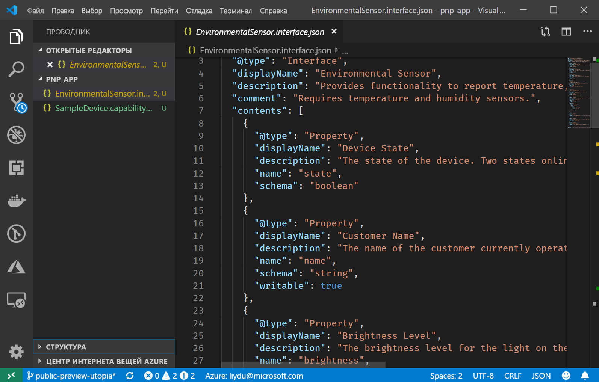
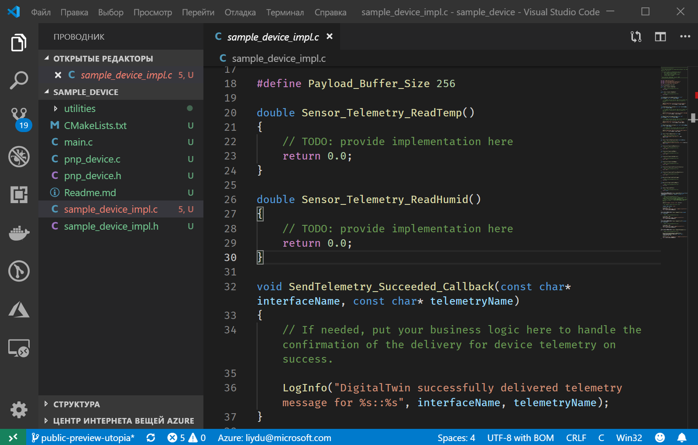

# <a name="quickstart-use-a-device-capability-model-to-create-an-iot-plug-and-play-preview-device-windows"></a>Краткое руководство. Создание устройства IoT Plug and Play (предварительная версия) в Windows с помощью модели возможностей устройства

_Модель возможностей устройства_ (DCM) описывает возможности устройства IoT Plug and Play. DCM часто связана с номером SKU продукта. Возможности, определенные в DCM, упорядочены в многократно используемые интерфейсы. Вы можете создать каркас кода устройства на основе DCM. В этом кратком руководстве показано, как создать устройство IoT Plug and Play с помощью DCM в VS Code в Windows.

## <a name="prerequisites"></a>Предварительные требования

Для выполнения инструкций, указанных в этом кратком руководстве, вам необходимо установить на локальный компьютер следующее программное обеспечение:

* [Средства сборки для Visual Studio](https://visualstudio.microsoft.com/thank-you-downloading-visual-studio/?sku=BuildTools&rel=16) с рабочими нагрузками **средств сборки C++** и **компонентов диспетчера пакетов NuGet**. Допускается также [Visual Studio 2019, Visual Studio 2017 или Visual Studio 2015 (выпуски Community, Professional или Enterprise)](https://visualstudio.microsoft.com/downloads/) с теми же рабочими нагрузками.
* [Git](https://git-scm.com/download/).
* [CMake](https://cmake.org/download/).
* [Visual Studio Code](https://code.visualstudio.com/).

### <a name="install-azure-iot-tools"></a>Установка средств Azure IoT

Чтобы установить пакет расширения [Azure IoT Tools для VS Code](https://marketplace.visualstudio.com/items?itemName=vsciot-vscode.azure-iot-tools), выполните следующие действия:

1. В VS Code выберите вкладку **Расширения**.
1. Выполните поиск **Azure IoT Tools**.
1. Щелкните **Установить**.

### <a name="install-the-azure-iot-explorer"></a>Установка обозревателя Azure IoT

Скачайте и установите последний выпуск **обозревателя Azure IoT** со страницы [репозитория](https://github.com/Azure/azure-iot-explorer/releases) инструментов, выбрав MSI-файл в разделе "Assets" (Ресурсы) для последнего обновления.

### <a name="get-the-connection-string-for-your-company-model-repository"></a>Получение строки подключения для репозитория моделей компании

_Строку подключения к репозиторию моделей компании_ можно найти на [портале Microsoft Azure Certified for IoT](https://preview.catalog.azureiotsolutions.com) при входе с помощью рабочей или учебной учетной записи Майкрософт или ИД партнера Майкрософт, если таковой имеется. Выполнив вход, выберите **Company repository** (Корпоративный репозиторий), а затем **Connection strings** (Строки подключения).

[!INCLUDE [cloud-shell-try-it.md](../../includes/cloud-shell-try-it.md)]

[!INCLUDE [iot-pnp-prepare-iot-hub-windows.md](../../includes/iot-pnp-prepare-iot-hub-windows.md)]

## <a name="prepare-the-development-environment"></a>Подготовка среды разработки

В этом кратком руководстве используется диспетчер библиотек [Vcpkg](https://github.com/microsoft/vcpkg) для установки пакета SDK для устройств Azure IoT для C в среде разработки.

1. Откройте окно командной строки. Выполните указанную ниже команду, чтобы установить Vcpkg.

    ```cmd
    git clone https://github.com/Microsoft/vcpkg.git
    cd vcpkg

    .\bootstrap-vcpkg.bat
    ```

    Затем, чтобы подключить [интеграцию](https://github.com/microsoft/vcpkg/blob/master/docs/users/integration.md) на уровне пользователя, выполните следующую команду (примечание: при первом использовании требуются привилегии администратора).

    ```cmd
    .\vcpkg.exe integrate install
    ```

1. Установите Vcpkg для пакета SDK для устройств Azure IoT для C.

    ```cmd
    .\vcpkg.exe install azure-iot-sdk-c[public-preview,use_prov_client]
    ```

## <a name="author-your-model"></a>Создание модели

В этом кратком руководстве используется имеющийся пример модели возможностей устройства и связанные интерфейсы.

1. На локальном диске создайте каталог `pnp_app`. Эта папка используется для файлов модели устройства и заглушки кода устройства.

1. Скачайте [модель возможностей устройства, файлы примеров интерфейса](https://github.com/Azure/IoTPlugandPlay/blob/master/samples/SampleDevice.capabilitymodel.json) и [пример интерфейса](https://github.com/Azure/IoTPlugandPlay/blob/master/samples/EnvironmentalSensor.interface.json) в папку `pnp_app`.

    > [!TIP]
    > Чтобы скачать файл с сайта GitHub, перейдите к файлу, щелкните правой кнопкой мыши **Необработанный**, а затем выберите **Сохранить ссылку как**.

1. Откройте папку `pnp_app` ​​с помощью VS Code. Файлы можно просмотреть с помощью IntelliSense.

    

1. В скачанных файлах замените `<YOUR_COMPANY_NAME_HERE>` в полях `@id` и `schema` уникальным значением. Используйте только символы a–z, A–Z, 0–9 и знак подчеркивания. Дополнительные сведения см. в статье [о формате идентификаторов цифровых двойников](https://github.com/Azure/IoTPlugandPlay/tree/master/DTDL#digital-twin-identifier-format).

## <a name="generate-the-c-code-stub"></a>Создание заглушки кода C

Теперь у вас есть модель DCM и связанные с ней интерфейсы, и вы можете сгенерировать код устройства, который реализует модель. Чтобы создать заглушку кода C в VS Code, сделайте следующее.

1. Откройте папку `pnp_app` в VS Code, нажмите клавиши **CTRL+SHIFT+P**, чтобы открыть палитру команд, введите **IoT Plug and Play** и выберите **Generate Device Code Stub** (Создать заглушку кода устройства).

    > [!NOTE]
    > При первом использовании интерфейса командной строки CodGen для IoT Plug and Play скачивание и автоматическая установка занимают несколько секунд.

1. Выберите файл **SampleDevice.capabilitymodel.json**, который будет использоваться для создания заглушки кода устройства.

1. Введите название проекта **sample_device**. Это будет именем вашего устройства.

1. Выберите **ANSI C** в качестве языка.

1. В качестве способа подключения выберите **Via IoT Hub device connection string** (Через строку подключения к устройству Центра Интернета вещей).

1. Выберите **CMake Project on Windows** в качестве шаблона проекта.

1. Выберите **Via Vcpkg** (С помощью Vcpkg) в качестве способа добавления пакета SDK для устройств.

1. Новая папка **sample_device** создается в том же расположении, что и файл DCM, и в ней создаются файлы заглушки кода устройства. VS Code открывает новое окно для их отображения.
    

## <a name="build-and-run-the-code"></a>Сборка и выполнение кода

Вы используете исходный код пакета SDK для устройств для сборки созданной заглушки кода устройства. Создаваемое приложение имитирует устройство, которое подключается к Центру Интернета вещей. Оно отправляет данные телеметрии и свойства, а также получает команды.

1. Создайте подкаталог `cmake` в папке `sample_device` и перейдите в эту папку.

    ```cmd
    mkdir cmake
    cd cmake
    ```

1. Выполните приведенные ниже команды, чтобы выполнить сборку заглушки кода (заменив заполнитель каталогом репозитория Vcpkg).

    ```cmd
    cmake .. -G "Visual Studio 16 2019" -A Win32 -Duse_prov_client=ON -Dhsm_type_symm_key:BOOL=ON -DCMAKE_TOOLCHAIN_FILE="<directory of your Vcpkg repo>\scripts\buildsystems\vcpkg.cmake"

    cmake --build .
    ```
    
    > [!NOTE]
    > При использовании Visual Studio 2017 или Visual Studio 2015 необходимо указать генератор CMake в соответствии с используемыми средствами сборки.
    >```cmd
    ># Either
    >cmake .. -G "Visual Studio 15 2017" -Duse_prov_client=ON -Dhsm_type_symm_key:BOOL=ON -DCMAKE_TOOLCHAIN_FILE="{directory of your Vcpkg repo}\scripts\buildsystems\vcpkg.cmake"
    ># or
    >cmake .. -G "Visual Studio 14 2015" -Duse_prov_client=ON -Dhsm_type_symm_key:BOOL=ON -DCMAKE_TOOLCHAIN_FILE="{directory of your Vcpkg repo}\scripts\buildsystems\vcpkg.cmake"
    >```

    > [!NOTE]
    > Если cmake не может найти ваш компилятор C++, при запуске предыдущей команды отобразятся ошибки сборки. В этом случае попробуйте выполнить эту команду в [командной строке Visual Studio](https://docs.microsoft.com/dotnet/framework/tools/developer-command-prompt-for-vs).

1. После успешного выполнения сборки запустите приложение, передав в качестве параметра строку подключения к устройству центра Интернета вещей.

    ```cmd
    .\Debug\sample_device.exe "<device connection string>"
    ```

1. Приложение устройства начнет отправку данных в Центр Интернета вещей.

    

## <a name="validate-the-code"></a>Проверка кода

### <a name="publish-device-model-files-to-model-repository"></a>Публикация файлов модели устройства в репозитории моделей

Чтобы проверить код устройства с помощью **обозревателя Интернета вещей Azure**, необходимо опубликовать файлы в репозитории моделей.

1. В открытой папке `pnp_app` нажмите клавиши **CTRL+SHIFT+P**, чтобы открыть палитру команд, введите и выберите **IoT Plug & Play: Submit files to Model Repository** (Отправка файлов в репозиторий моделей IoT Plug and Play).

1. Выберите файлы `SampleDevice.capabilitymodel.json` и `EnvironmentalSensor.interface.json`.

1. Введите строку подключения к репозиторию моделей компании.

    > [!NOTE]
    > Строка подключения требуется только при первом подключении к репозиторию.

1. В окне вывода и уведомлений VS Code можно проверить, успешно ли опубликованы файлы.

    > [!NOTE]
    > При возникновении ошибок во время публикации файлов модели устройств можно попробовать использовать команду **IoT Plug and Play: Sign out Model Repository** (Выход из репозитория моделей IoT Plug and Play), чтобы выйти и повторить шаги.

### <a name="use-the-azure-iot-explorer-to-validate-the-code"></a>Проверка кода с помощью обозревателя Azure IoT

1. Откройте обозреватель Azure IoT. Отобразится страница **конфигураций приложения**.

1. Введите _строку подключения к Центру Интернета вещей_ и щелкните **Подключить**.

1. После подключения откроется **страница обзора устройства**.

1. Чтобы добавить репозиторий своей компании, выберите **Settings** (Параметры), затем — **+ Add module definition source** (Добавить источник определений модулей), а затем — **Company repository** (Корпоративный репозиторий). Добавьте строку подключения к репозиторию моделей компании и выберите **Save and Connect** (Сохранить и подключиться).

1. На странице обзора **устройства** найдите созданное ранее удостоверение устройства. Если приложение устройства по-прежнему выполняется в командной строке, убедитесь, что **состояние подключения устройства** в обозревателе Интернета вещей Azure — _Подключено_ (в противном случае нажимайте кнопку **Refresh** (Обновить), пока это состояние не появится). Выберите устройство, чтобы просмотреть дополнительные сведения.

1. Разверните интерфейс с идентификатором **urn:<ИМЯ_ИНТЕРФЕЙСА>:EnvironmentSensor:1**, чтобы увидеть примитивы IoT Plug and Play: свойства, команды и данные телеметрии. Отображаемое имя интерфейса — это имя, которое вы ввели при создании модели.

1. Выберите страницу **Telemetry** (Телеметрия) и щелкните _Start_ (Запустить), чтобы просмотреть данные телеметрии, которые отправляет устройство.

1. Выберите страницу **Properties(non-writable)​​** (Свойства (недоступные для записи)), чтобы просмотреть недоступные для записи свойства, сообщаемые устройством.

1. Выберите страницу **Properties(writable)** (Свойства (доступные для записи)), чтобы просмотреть доступные для записи свойства, которые можно обновить.

1. Разверните свойство **name**, укажите в качестве его значения новое имя и выберите **Update writeable property** (Обновить свойство, доступное для записи). 

1. Чтобы увидеть новое имя в столбце **Передаваемое свойство**, нажмите кнопку **Обновить** в верхней части страницы.

1. Выберите страницу **команд**, чтобы просмотреть все команды, поддерживаемые устройством.

1. Разверните команду **​​blink** и установите новый интервал времени мигания. Выберите **Send command** (Отправить команду), чтобы вызвать команду на устройстве.

1. Перейдите к командной строке имитированного устройства и просмотрите подтверждающие сообщения, чтобы проверить, выполнена ли команда должным образом.

[!INCLUDE [iot-pnp-clean-resources.md](../../includes/iot-pnp-clean-resources.md)]

## <a name="next-steps"></a>Дополнительная информация

Из этого краткого руководства вы узнали, как создать устройство IoT Plug and Play с помощью DCM.

Чтобы узнать больше о DCM и о том, как создавать собственные модели, перейдите к следующему руководству:

> [!div class="nextstepaction"]
> [Руководство. Создание и тестирование моделей возможностей устройства с помощью Visual Studio Code](tutorial-pnp-visual-studio-code.md)
