# Интеграция Azure Key Vault с Политикой Azure

[Политика Azure](../governance/policy/index.yml) — это средство управления, которое дает пользователям возможность выполнять аудит и управлять средой Azure в нужном масштабе. Политика Azure позволяет разместить ограничители на ресурсах Azure, чтобы убедиться, что ресурсы соответствуют назначенным правилам политики. Она позволяет пользователям выполнять аудит, принудительное применение в режиме реального времени и исправление среды Azure. Результаты аудита, выполненные политикой, будут доступны пользователям на панели мониторинга соответствия, где они смогут увидеть углубленную детализацию того, какие ресурсы и компоненты соответствуют требованиям, а какие нет.  Дополнительные сведения см. в статье [Обзор службы "Политика Azure"](../governance/policy/overview.md)

Примеры сценариев использования:

- Вы хотите повысить уровень безопасности компании, реализовав требования к минимальным размерам ключей и максимальному сроку действия сертификатов в хранилищах ключей вашей компании, но не зная, какие группы будут соответствовать требованиям, а какие — нет. 
- В настоящее время у вас нет решения для проведения аудита в вашей организации, разве что можете выполнить аудит вручную, задавая индивидуальным командам в организации отчет о соответствии. Вы ищете способ автоматизации этой задачи, выполняете аудит в режиме реального времени и гарантируете точность аудита.
- Вы хотите применить политики безопасности компании и запретить пользователям создавать самозаверяющиеся сертификаты, но у вас нет автоматизированного способа заблокировать их создание. 
- Вы хотите смягчить некоторые требования к командам, проводящим тестирования, но при этом хотите сохранить жесткий контроль над своей производственной средой. Вам необходим простой автоматизированный способ разделения ограничений на ресурсы. 
- Необходимо убедиться, что в случае проблемы с активным сайтом вы сможете выполнить откат новых политик. Вам нужно решение для отключения принудительного применения политики одним щелчком. 
- Вы полагаетесь на стороннее решение для аудита среды и хотите использовать внутреннее предложение Майкрософт. 

## Типы действий и руководств политики

**Аудит**: Если для политики задано значение "аудит", то политика не приведет к критическим изменениям в среде. Он оповещает вас о таких компонентах, как сертификаты, не соответствующие определениям политик в пределах указанной области, помечая эти компоненты как несоответствующие на панели мониторинга соответствия политике. Если влияния политики не выбрано, аудит выполняется по умолчанию. 

**Запретить**: Если действие политики имеет значение "запретить", то политика будет блокировать создание новых компонентов, таких как сертификаты, а также блокировать новые версии существующих компонентов, которые не соответствуют определению политики. Существующие несоответствующие ресурсы в хранилище ключей не затрагиваются. Возможности "аудит" будут продолжать функционировать.

## Доступные "встроенные" определения политики

Key Vault создал набор политик, которые можно назначить для типичных сценариев управления сертификатами. Эти политики являются "встроенными", что значит, что они не требуют написания каких-либо пользовательских файлов JSON для включения, и чтобы они были доступны на портале Azure для назначения. Вы по-прежнему можете настраивать определенные параметры в соответствии с потребностями вашей организации. 

Ниже приведены восемь предварительных версий политик.

### Управление сроком действия сертификата (предварительный просмотр)

Эта политика позволяет вам управлять максимальным сроком действия сертификатов, хранящихся в хранилище ключей. Рекомендуется ограничить максимальный срок действия сертификатов в соответствии с требованиями безопасности. Если секретный ключ вашего сертификата будет взломан без обнаружения, использование кратковременных сертификатов минимизирует временные рамки для текущего повреждения и снижает ценность сертификата для злоумышленника. 

### Управление разрешенными типами ключей сертификатов (предварительный просмотр)
Эта политика позволяет ограничивать тип сертификатов, которые могут находиться в хранилище ключей. Вы можете использовать эту политику, чтобы убедиться, что ваши закрытые ключи сертификата защищены RSA, ECC или поддерживают HSM. Вы можете выбрать из следующего списка разрешенных типов сертификатов.
- RSA
- RSA — HSM
- ECC 
- ECC — HSM 

### Управление триггерами действия времени существования сертификата (предварительная версия)

Эта политика позволяет управлять действием времени существования, определенным для сертификатов, которые либо находятся в течение определенного количества дней после истечения срока действия, либо достигли определенного процента полезного срока службы. 

### Управление сертификатами, выданными интегрированным центром сертификации (предварительная версия)

Если вы используете интегрированный центр сертификации Key Vault (Digicert или GlobalSign) и хотите, чтобы пользователи пользовались услугами одного или одного из двух поставщиков, вы можете использовать эту политику для аудита или принудительного исполнения вашего выбора. Эта политика также может использоваться для аудита или отказа в создании самоуправляющихся сертификатов в хранилище ключей. 

### Управление сертификатами, выданными интегрированным центром сертификации (предварительная версия)

Если вы используете внутренний центр сертификации или центр сертификации, не интегрированный с хранилищем ключей, и хотите, чтобы пользователи использовали центр сертификации из списка, который вы предоставляете, вы можете использовать эту политику для создания списка разрешенных центров сертификации по имени издателя. Эта политика также может использоваться для аудита или отказа в создании самоуправляющихся сертификатов в хранилище ключей. 

### Управление разрешенными именами кривых для сертификатов шифрования на основе эллиптических кривых (предварительная версия)
Если вы используете шифрование на основе эллиптических кривых или сертификаты ECC, вы можете настроить список разрешенных имен эллиптических кривых из списка ниже. Параметр по умолчанию позволяет выполнять все указанные ниже имена кривых. 
- P-256
- P-256K
- P-384
- P-521

### Управление минимальным размером ключа для сертификатов RSA (предварительная версия)
При использовании сертификатов RSA можно выбрать минимальный размер ключа, который должен иметь сертификаты. Вы можете выбрать один из вариантов из приведенного ниже списка. 
- 2048 bit
- 3072 bit
- 4096 bit

### Управление сертификатами, срок действия которых истекает за указанное число дней (предварительная версия)
Если сертификат, не прошедший надлежащий контроль, не будет заменен до истечения срока его действия, у вас может произойти сбой в работе службы. Эта политика очень важна для того, чтобы убедиться, что ваши сертификаты, хранящиеся в хранилище ключей, находятся под контролем. Эту политику рекомендуется применять несколько раз с разными порогами истечения срока действия, например, с порогами 180, 90, 60 и 30 дней. Эту политику можно использовать для мониторинга и рассмотрения срока действия сертификата в вашей организации. 

## Пример сценария

Вы управляете хранилищем ключей, используемым несколькими командами, которое содержит 100 сертификатов, и хотите убедиться, что ни один из сертификатов в хранилище ключей не будет действителен более 2 лет.

1. Вы назначаете политику [Управление сроком действия сертификата](#manage-certificate-validity-period-preview), указываете, что максимальный срок действия сертификата составляет 24 месяца, и устанавливаете для него значение "аудит". 
1. При просмотре [отчета о соответствии на портале Azure ](#view-compliance-results)вы обнаружите, что 20 сертификатов не соответствуют требованиям и действительны в течение более 2 лет. 
1. Вы связываетесь с владельцами этих сертификатов и сообщаете о новом требовании безопасности, согласно которому срок действия сертификатов не может превышать 2 года. Некоторые команды ответили и 15 сертификатов были обновлены с максимальным сроком действия 2 года или меньше. Другие команды не отвечают, и у вас по-прежнему есть 5 несоответствующих сертификатов в хранилище ключей.
1. Вы изменяете действие политики, присваивая значение "запретить". 5 несоответствующих сертификатов не отменяются и продолжают функционировать. Однако их невозможно продлить на период действия более 2 лет. 

## Включение политики Key Vault и управление ею с помощью портала Azure

### Выбор назначения определения политики

1. Войдите на портал Azure. 
1. В строке поиска "Политика" найдите и выберите **Политика**.

    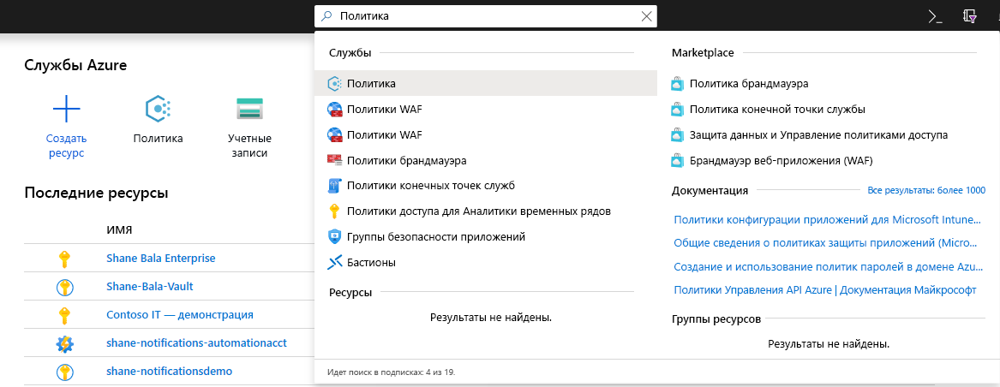

1. В окне "Политика" выберите **Определения**.

    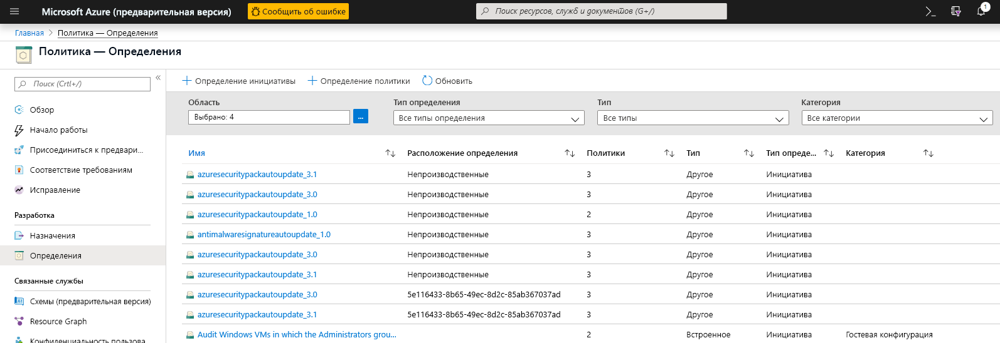

1. В фильтре категорий снимите флажок **Выбрать все** и выберите **Key Vault**. 

    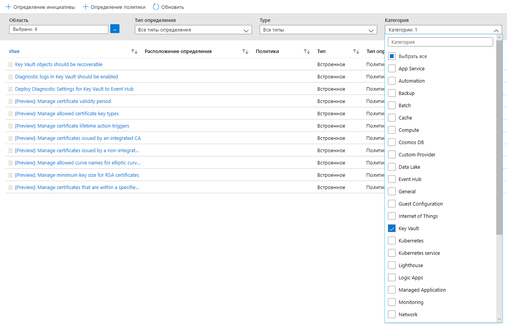

1. Теперь вы сможете просмотреть все политики, доступные для общедоступной предварительной версии Azure Key Vault. Убедитесь, что вы прочитали и поняли раздел руководств по политике, приведенный выше, затем выберите политику, которую нужно назначить для области.  

    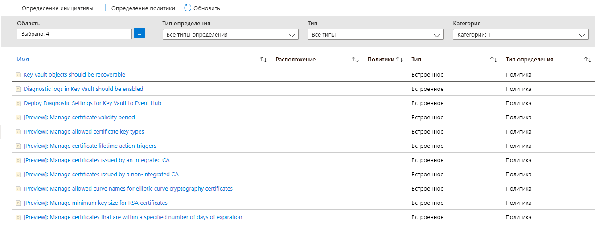

### Назначение политики для области 

1. Выберите политику, которую хотите применить. В этом примере показана политика **Управление сроком действия сертификата**. Нажмите кнопку "Назначить" в левом верхнем углу.

    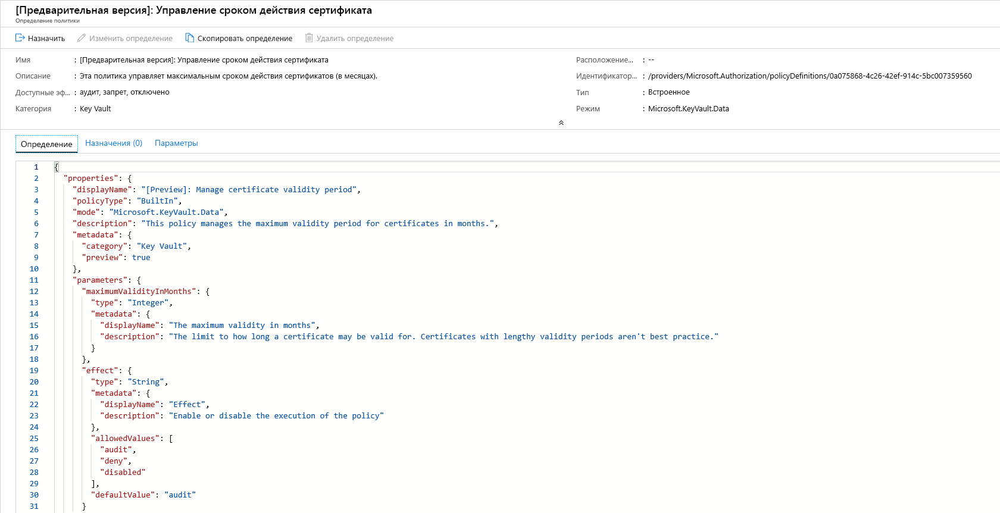
  
1. Выберите подписку, в которой необходимо применить политику. Вы можете выбрать ограничение области только для одной группы ресурсов в рамках подписки. Если вы хотите применить политику ко всей подписке и исключить некоторые группы ресурсов, можно также настроить список исключений. Установите для параметра принудительного применения политики значение **Enabled** (Включено), если хотите, чтобы применить политику (аудит или запрет), или **Disabled** (Отключено), чтобы отключить эффект (аудит или отрицание). 

    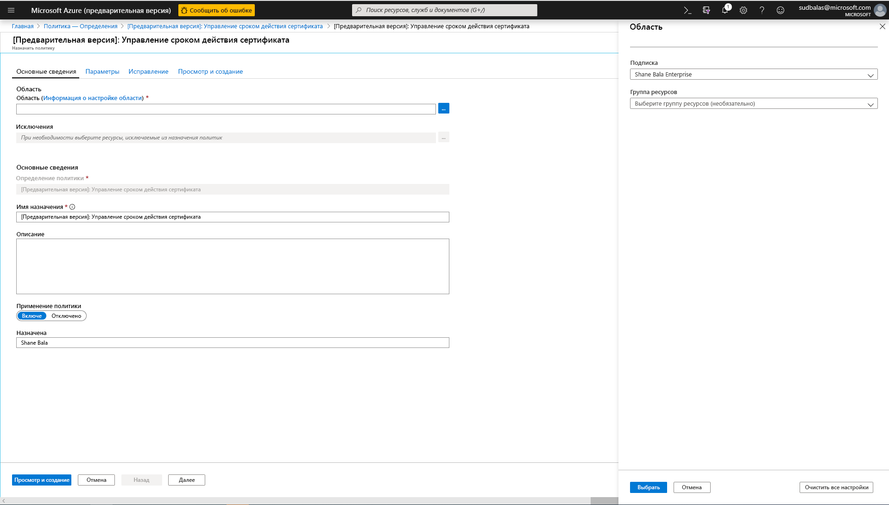

1. Щелкните вкладку "Параметры" в верхней части экрана, чтобы указать максимальный срок действия в месяцах. Выберите **аудит** или **запретить** в отношении действия политики, следуя указаниям в разделах выше. Потом выберите кнопку "Просмотреть и создать". 

    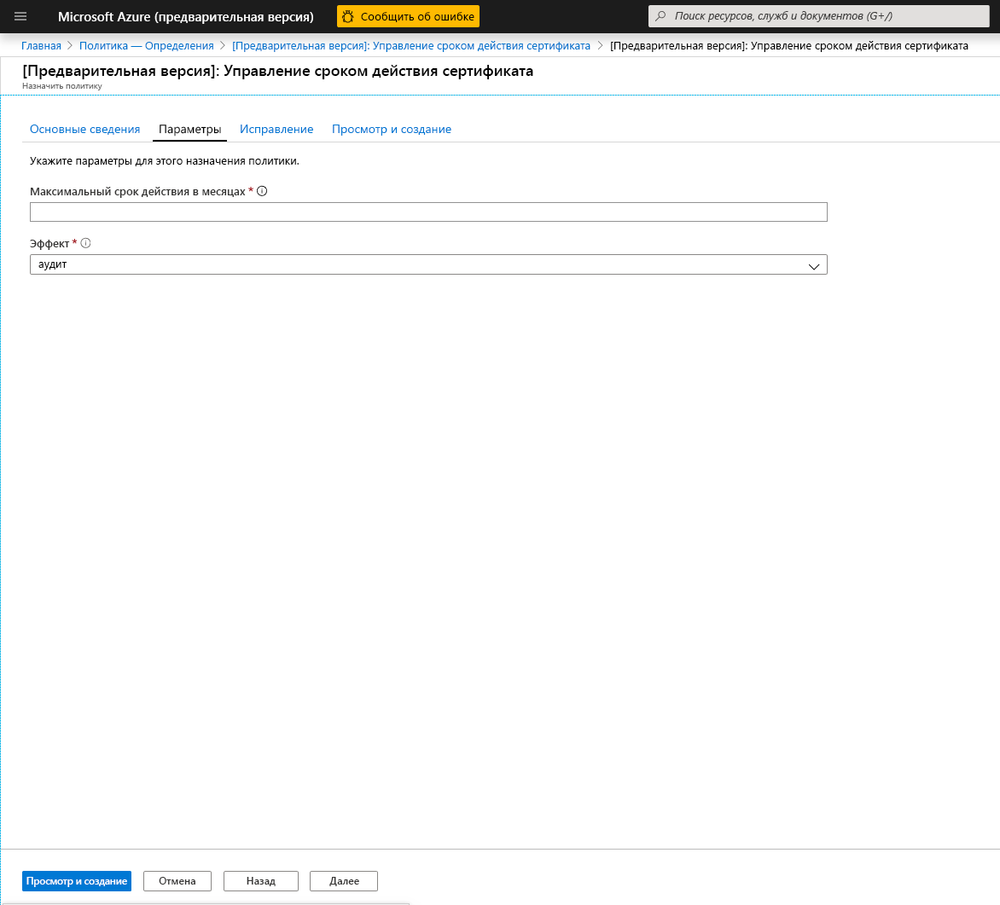

### Просмотр результатов соответствия

1. Вернитесь на вкладку "Политика" и перейдите на вкладку соответствия. Нажмите на задание политики, для которого нужно просмотреть результаты соответствия.

    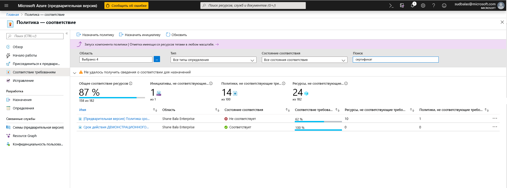

1. На этой странице вы можете фильтровать результаты по соответствующим или несоответствующим хранилищам. Здесь в области назначения политики можно просмотреть список несоответствующих хранилищ ключей. Хранилище считается несоответствующим, если какой-либо из компонентов (сертификатов) в хранилище не соответствует требованиям. Вы можете выбрать отдельное хранилище, чтобы просмотреть отдельные несоответствующие компоненты (сертификаты). 

    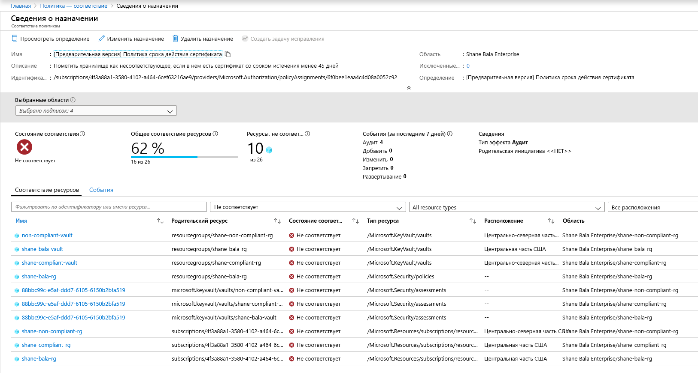

1. Просмотр названия несоответствующих компонентов в хранилище

    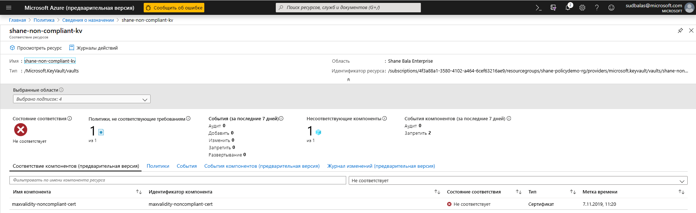

1. Если вам нужно проверить, не запрещено ли пользователям создавать ресурсы в хранилище ключей, выберите вкладку **События компонентов (предварительный просмотр)** , чтобы просмотреть сводку запрещенных сертификатов со сведениями о запрашивающей стороне и метками времени запросов. 

    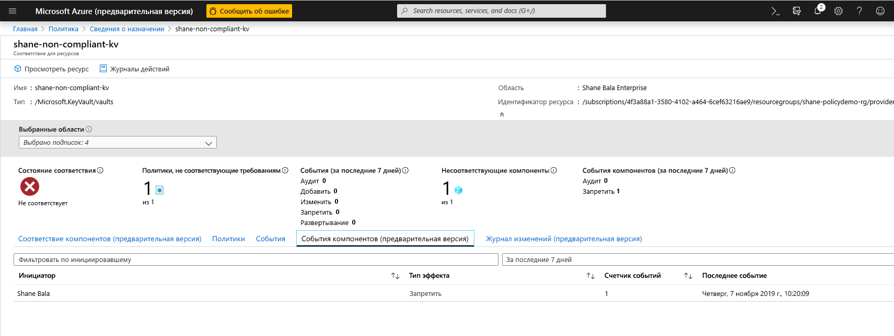

## Ограничения функции

При назначении "запрещенной" политики запуск запрета на создание несоответствующих ресурсов может занять до 30 минут (в среднем) и 1 час (в худшем случае). Оценка политики существующих компонентов хранилища может занять до 1 часа (в среднем) и 2 часов (в худшем случае), прежде чем результаты проверки будут доступны для просмотра в пользовательском интерфейсе портала. Если результаты проверки соответствия отображаются как "Не запущено", это может указывать на то, что:
- Оценка политики еще не завершена. В худшем случае задержка оценки может занять до 2 часов. 
- В области назначения политики нет хранилищ ключей.
- В области назначения политики нет хранилищ ключей с сертификатами. 

## Дальнейшие действия

- Дополнительные сведения о [службе "Политика Azure"](../governance/policy/overview.md)
- См. пример: [хранилища Key Vault без конечных точек виртуальной сети](../governance/policy/samples/keyvault-no-vnet-rules.md)

