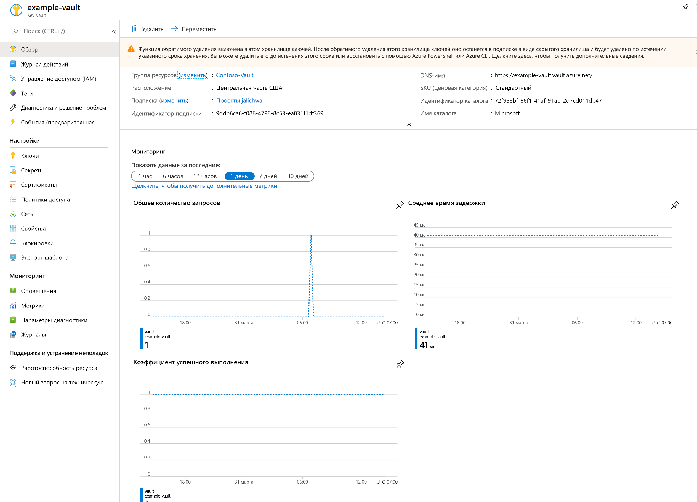
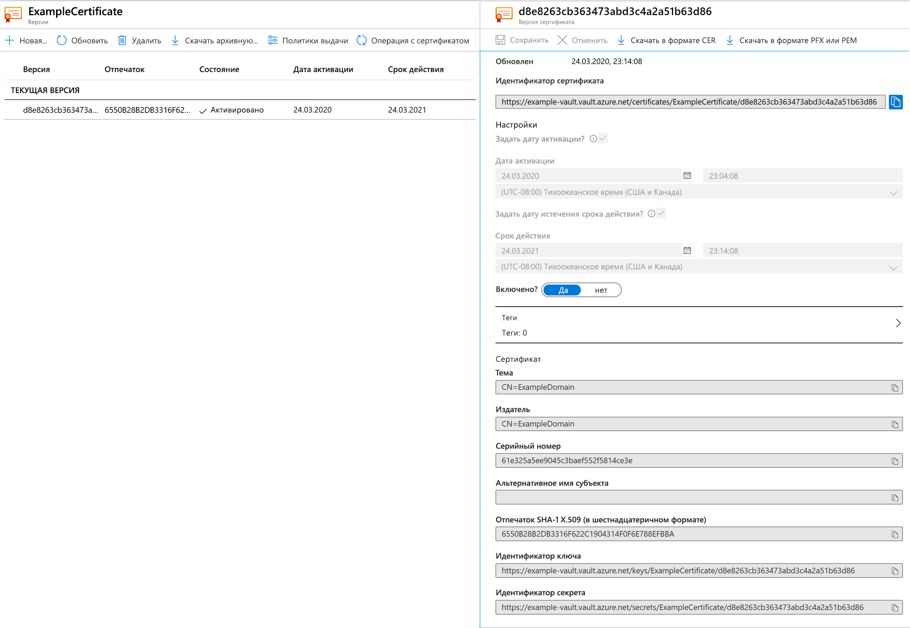
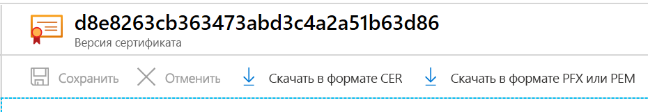

# Краткое руководство. Настройка и получение сертификата из Azure Key Vault с помощью портала Azure

Azure Key Vault — это облачная служба, которая предоставляет защищенное хранилище для секретов. Вы можете безопасно хранить ключи, пароли, сертификаты и другие секреты. Создать хранилища Azure Key Vault и управлять ими можно на портале Azure. В рамках этого краткого руководства вы создадите хранилище ключей, используемое для хранения сертификата. См. дополнительные сведения о [Key Vault](../general/overview.md).

Если у вас еще нет подписки Azure, [создайте бесплатную учетную запись](https://azure.microsoft.com/free/?WT.mc_id=A261C142F), прежде чем начинать работу.

## Вход в Azure

Войдите на портал Azure по адресу https://portal.azure.com.

## Создание хранилища

1. На **домашней странице** или в меню портала Azure выберите команду **Создать ресурс**.
2. В поле поиска введите **Key Vault**.
3. В списке результатов выберите **Key Vault**.
4. В разделе Key Vault выберите **Создать**.
5. В разделе **Создать Key Vault** введите приведенные ниже сведения.
    - **Name** (Имя). Укажите уникальное имя. В нашем примере это **Example-Vault**. 
    - **Подписка**: Выберите подписку.
    - В разделе **Группа ресурсов** выберите **Создать** и введите имя группы ресурсов.
    - В раскрывающемся меню **Расположение** выберите расположение.
    - Для других параметров оставьте значения по умолчанию.
6. Указав приведенные выше сведения, выберите **Создать**.

Запишите значения двух указанных ниже свойств.

* **Имя хранилища.** В нашем примере это **Example-Vault**. Вы будете использовать это имя для выполнения других этапов.
* **URI хранилища**. В нашем примере это `https://example-vault.vault.azure.net/`. Необходимо, чтобы приложения, использующие ваше хранилище через REST API, использовали этот URI.

На этом этапе операции в новом хранилище ключей может выполнять только учетная запись Azure.

## Добавление сертификата в Key Vault

Чтобы добавить сертификат в хранилище, вам нужно выполнить несколько дополнительных действий. В нашем примере мы добавим самозаверяющий сертификат, который может использоваться приложением. Имя сертификата — **ExampleCertificate**.

1. На странице свойств Key Vault выберите **Сертификаты**.
2. Щелкните **Generate/Import** (Создать или импортировать).
3. На экране **Создание сертификата** выберите следующие значения:
    - **Метод создания сертификата**: Сформировать.
    - **Имя сертификата**: ExampleCertificate.
    - **Субъект**: CN=ExampleDomain
    - Оставьте другие значения по умолчанию. Нажмите кнопку **Создать**.

Получив сообщение об успешном создании сертификата, вы можете выбрать его в списке. Затем можно просмотреть некоторые свойства. Если щелкнуть текущую версию, отобразится значение, указанное на предыдущем этапе.

## Экспорт сертификата из Key Vault
Чтобы скачать сертификат, нажмите кнопку "Скачать в формате CER" либо "Скачать в формате PFX или PEM". 

## Очистка ресурсов

Другие руководства о Key Vault созданы на основе этого документа. Если вы планируете продолжить работу с последующими краткими руководствами и статьями, эти ресурсы можно не удалять.
Удалите ненужную группу ресурсов. Key Vault и связанные ресурсы будут также удалены. Чтобы удалить группу ресурсов на портале, сделайте следующее:

1. В поле поиска в верхней части портала введите имя группы ресурсов. Если в результатах поиска отображается группа ресурсов, используемая в этом кратком руководстве, выберите ее.
2. Выберите **Удалить группу ресурсов**.
3. В поле **Введите имя группы ресурсов:** введите имя группы ресурсов и выберите **Удалить**.

## Дальнейшие действия

Из этого краткого руководства вы узнали, как создать Key Vault и сохранить в нем сертификат. Дополнительные сведения о Key Vault и его интеграции в приложения см. в следующих статьях.

- [Обзор Azure Key Vault](../general/overview.md)
- [Руководство разработчика Azure Key Vault](../general/developers-guide.md)
- [Рекомендации по Azure Key Vault](../general/best-practices.md)
