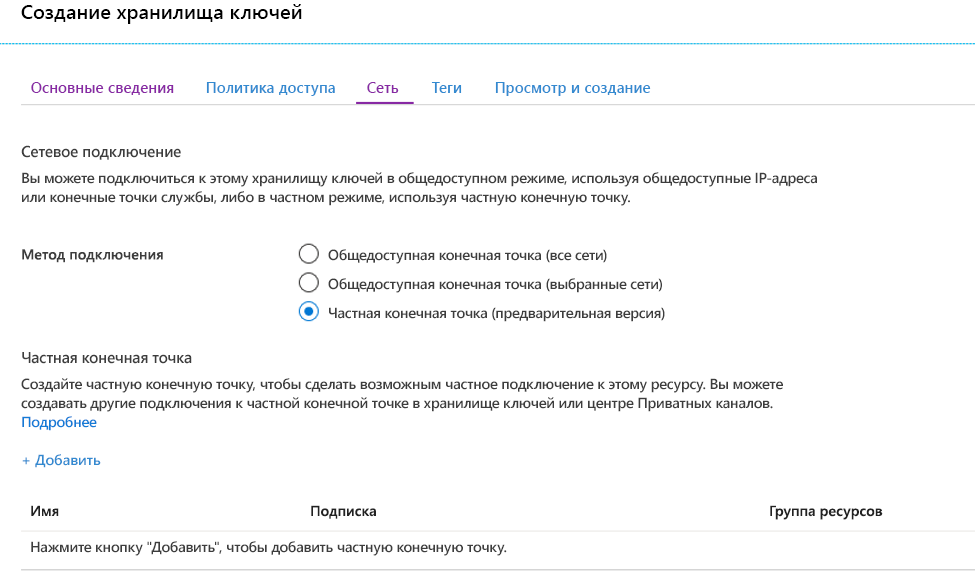
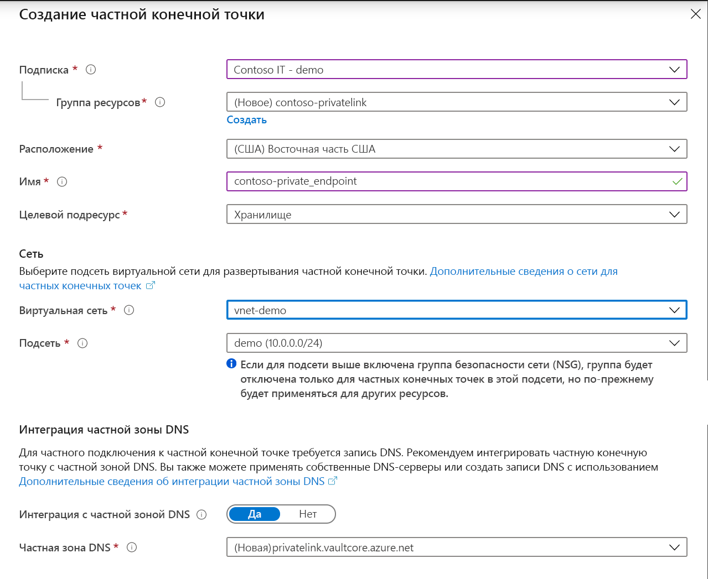
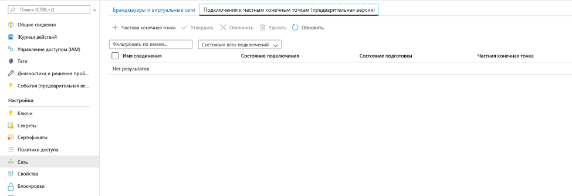
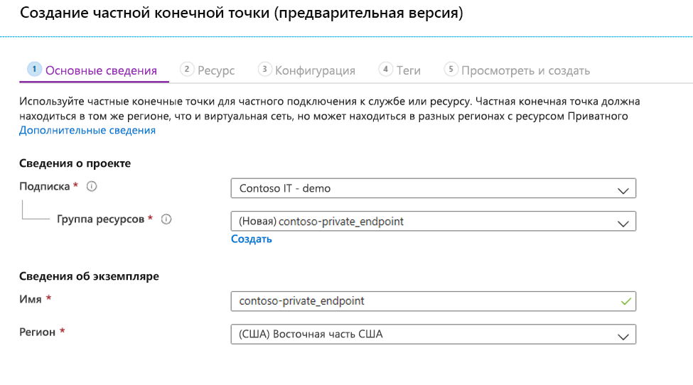
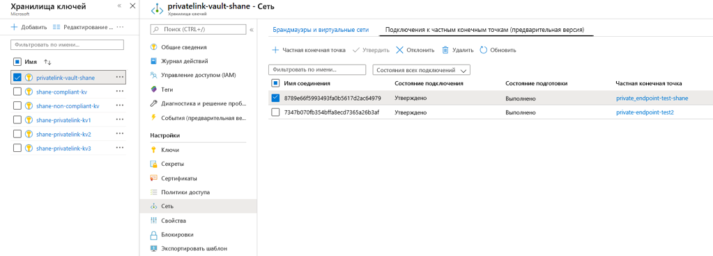

# <a name="integrate-key-vault-with-azure-private-link"></a>Интеграция Key Vault со службой "Приватный канал Azure"

Приватный канал Azure обеспечивает доступ к службам Azure (например, к Azure Key Vault, службе хранилища Azure и Azure Cosmos DB), а также размещенным в Azure службам клиентов или партнеров через частную конечную точку виртуальной сети.

Частная конечная точка Azure — это сетевой интерфейс, который защищенно и надежно подключается к службе через Приватный канал Azure. Частная конечная точка использует частный IP-адрес из виртуальной сети, по сути перемещая службу в виртуальную сеть. Весь трафик к службе может маршрутизироваться через частную конечную точку, поэтому шлюзы, устройства преобразования сетевых адресов (NAT), подключения ExpressRoute и VPN, а также общедоступные IP-адреса не требуются. Трафик между виртуальной сетью и службой проходит через магистральную сеть Майкрософт, что позволяет избежать рисков общедоступного Интернета. Вы можете подключиться к экземпляру ресурса Azure, обеспечивая наивысшую степень детализации в управлении доступом.

Дополнительные сведения см. в статье [Что такое Приватный канал Azure](../../private-link/private-link-overview.md).

## <a name="prerequisites"></a>Предварительные требования

Чтобы интегрировать хранилище ключей с Приватным каналом Azure, вам потребуется следующее:

- Хранилище ключей.
- Виртуальная сеть Azure.
- Подсеть в виртуальной сети.
- Разрешения владельца или участника для хранилища ключей и виртуальной сети.

Частная конечная точка и виртуальная сеть должны находиться в одном регионе. При выборе региона для частной конечной точки с помощью портала будут автоматически фильтроваться только виртуальные сети в этом регионе. Хранилище ключей может находиться в другом регионе.

Частная конечная точка использует частный IP-адрес в виртуальной сети.

# <a name="azure-portal"></a>[Портал Azure](#tab/portal)

## <a name="establish-a-private-link-connection-to-key-vault-using-the-azure-portal"></a>Установка подключения Приватного канала к хранилищу ключей с помощью портала Azure 

Сначала создайте виртуальную сеть, выполнив действия, описанные в статье [Краткое руководство. Создание виртуальной сети с помощью портала Azure](../../virtual-network/quick-create-portal.md).

Затем можно или создать хранилище ключей, либо установить подключение Приватного канала к существующему хранилищу ключей.

### <a name="create-a-new-key-vault-and-establish-a-private-link-connection"></a>Создание хранилища ключей и установка подключения Приватного канала

Вы можете создать хранилище ключей с помощью [портала Azure](../general/quick-create-portal.md), [Azure CLI](../general/quick-create-cli.md) или [Azure PowerShell](../general/quick-create-powershell.md).

После настройки основных компонентов хранилища ключей перейдите на вкладку "Сеть" и выполните следующие шаги:

1. Выберите переключатель "Частная конечная точка" на вкладке "Сеть".
1. Нажмите кнопку "+ Добавить", чтобы добавить частную конечную точку.

    
 
1. В колонке "Создание частной конечной точки" в поле "Расположение" выберите регион, в котором расположена ваша виртуальная сеть. 
1. В поле "Имя" введите описательное имя. По нему вы сможете найти эту частную конечную точку. 
1. В раскрывающемся меню выберите виртуальную сеть и подсеть, в которых нужно создать эту частную конечную точку. 
1. Оставьте без изменений переключатель Integrate with the private zone DNS (Интегрировать с частной зоной DNS).  
1. Нажмите «ОК».

    
 
После этого вы сможете увидеть настроенную частную конечную точку. Теперь у вас есть возможность удалить и изменить эту частную конечную точку. Нажмите кнопку "Просмотр и создание" и создайте хранилище ключей. Развертывание может занять 5–10 минут. 

### <a name="establish-a-private-link-connection-to-an-existing-key-vault"></a>Установка подключения Приватного канала к существующему хранилищу ключей

Если у вас уже есть хранилище ключей, можно создать подключение Приватного канала к нему, выполнив следующие действия:

1. Войдите на портал Azure. 
1. В строке поиска введите "хранилища ключей".
1. Выберите в списке хранилище ключей, для которого необходимо добавить частную конечную точку.
1. Выберите вкладку "Сеть" в разделе "Параметры".
1. Выберите вкладку "Подключения к частным конечным точкам" в верхней части страницы.
1. Нажмите кнопку "+ Private Endpoint" (+ Частная конечная точка) в верхней части страницы.

     

Вы можете создать частную конечную точку для любого ресурса Azure, используя эту колонку. Можно использовать раскрывающиеся меню, чтобы выбрать тип ресурса и ресурс в каталоге, или подключиться к любому ресурсу Azure, используя идентификатор ресурса. Оставьте без изменений переключатель Integrate with the private zone DNS (Интегрировать с частной зоной DNS).  


При создании частной конечной точки подключение должно быть утверждено. Если ресурс, для которого создается частная конечная точка, расположен в вашем каталоге, вы сможете одобрить запрос на подключение при наличии необходимых разрешений. При подключении к ресурсу Azure из другого каталога необходимо дождаться, пока владелец этого ресурса не одобрит запрос на подключение.

Существует четыре состояния подготовки:

| Действие предоставления службы | Состояние частной конечной точки объекта-получателя службы | Описание |
|--|--|--|
| None | Ожидает | Подключение создается вручную и ожидает утверждения от владельца ресурса Приватного канала. |
| Утверждение | Approved | Подключение утверждено автоматически или вручную и готово к использованию. |
| Reject | Отклонено | Подключение отклонил владелец ресурса Приватного канала. |
| Удалить | Отключено | Подключение удалил владелец ресурса Приватного канала. Частная конечная точка станет информативной и подлежит удалению для очистки. |

### <a name="how-to-manage-a-private-endpoint-connection-to-key-vault-using-the-azure-portal"></a>Управление подключением частной конечной точки к Key Vault с помощью портала Azure 

1. Войдите на портал Azure.
1. В строке поиска введите "хранилища ключей".
1. Выберите хранилище ключей для управления.
1. Перейдите на вкладку "Сеть".
1. Если есть какие-либо подключения в состоянии подготовки, вы увидите такое подключение в списке с состоянием подготовки "В ожидании". 
1. Выберите частную конечную точку, которую вы хотите утвердить.
1. Нажмите кнопку "Утвердить".
1. Если есть подключения к частным конечным точкам, которые вы хотите отклонить (по запросу в ожидании или существующее подключение), выберите подключение и нажмите кнопку "Отклонить".

    

# <a name="azure-cli"></a>[Azure CLI](#tab/cli)

## <a name="establish-a-private-link-connection-to-key-vault-using-cli-initial-setup"></a>Установка подключения приватного канала к Key Vault с помощью интерфейса командой строки (начальная настройка)

```console
az login                                                         # Login to Azure CLI
az account set --subscription {SUBSCRIPTION ID}                  # Select your Azure Subscription
az group create -n {RESOURCE GROUP} -l {REGION}                  # Create a new Resource Group
az provider register -n Microsoft.KeyVault                       # Register KeyVault as a provider
az keyvault create -n {VAULT NAME} -g {RG} -l {REGION}           # Create a Key Vault
az keyvault update -n {VAULT NAME} -g {RG} --default-action deny # Turn on Key Vault Firewall
az network vnet create -g {RG} -n {vNet NAME} -location {REGION} # Create a Virtual Network

    # Create a Subnet
az network vnet subnet create -g {RG} --vnet-name {vNet NAME} --name {subnet NAME} --address-prefixes {addressPrefix}

    # Disable Virtual Network Policies
az network vnet subnet update --name {subnet NAME} --resource-group {RG} --vnet-name {vNet NAME} --disable-private-endpoint-network-policies true

    # Create a Private DNS Zone
az network private-dns zone create --resource-group {RG} --name privatelink.vaultcore.azure.net

    # Link the Private DNS Zone to the Virtual Network
az network private-dns link vnet create --resource-group {RG} --virtual-network {vNet NAME} --zone-name privatelink.vaultcore.azure.net --name {dnsZoneLinkName} --registration-enabled true

```

### <a name="add-private-dns-records"></a>Добавление записей Частной зоны DNS
```console
# https://docs.microsoft.com/en-us/azure/dns/private-dns-getstarted-cli#create-an-additional-dns-record
az network private-dns zone list -g $rg_name
az network private-dns record-set a add-record -g $rg_name -z "privatelink.vaultcore.azure.net" -n $vault_name -a $kv_network_interface_private_ip
az network private-dns record-set list -g $rg_name -z "privatelink.vaultcore.azure.net"

# From home/public network, you wil get a public IP. If inside a vnet with private zone, nslookup will resolve to the private ip.
nslookup $vault_name.vault.azure.net
nslookup $vault_name.privatelink.vaultcore.azure.net
```

### <a name="create-a-private-endpoint-automatically-approve"></a>Создание частной конечной точки (автоматическое утверждение) 
```console
az network private-endpoint create --resource-group {RG} --vnet-name {vNet NAME} --subnet {subnet NAME} --name {Private Endpoint Name}  --private-connection-resource-id "/subscriptions/{AZURE SUBSCRIPTION ID}/resourceGroups/{RG}/providers/Microsoft.KeyVault/vaults/ {KEY VAULT NAME}" --group-ids vault --connection-name {Private Link Connection Name} --location {AZURE REGION}
```

### <a name="create-a-private-endpoint-manually-request-approval"></a>Создание частной конечной точки (запрос утверждения вручную) 
```console
az network private-endpoint create --resource-group {RG} --vnet-name {vNet NAME} --subnet {subnet NAME} --name {Private Endpoint Name}  --private-connection-resource-id "/subscriptions/{AZURE SUBSCRIPTION ID}/resourceGroups/{RG}/providers/Microsoft.KeyVault/vaults/ {KEY VAULT NAME}" --group-ids vault --connection-name {Private Link Connection Name} --location {AZURE REGION} --manual-request
```

### <a name="manage-private-link-connections"></a>Управление подключениями приватного канала

```console
# Show Connection Status
az network private-endpoint show --resource-group {RG} --name {Private Endpoint Name}

# Approve a Private Link Connection Request
az keyvault private-endpoint-connection approve --approval-description {"OPTIONAL DESCRIPTION"} --resource-group {RG} --vault-name {KEY VAULT NAME} –name {PRIVATE LINK CONNECTION NAME}

# Deny a Private Link Connection Request
az keyvault private-endpoint-connection reject --rejection-description {"OPTIONAL DESCRIPTION"} --resource-group {RG} --vault-name {KEY VAULT NAME} –name {PRIVATE LINK CONNECTION NAME}

# Delete a Private Link Connection Request
az keyvault private-endpoint-connection delete --resource-group {RG} --vault-name {KEY VAULT NAME} --name {PRIVATE LINK CONNECTION NAME}
```

---

## <a name="validate-that-the-private-link-connection-works"></a>Проверка работоспособности подключения Приватного канала

Необходимо убедиться, что ресурсы в одной подсети ресурса частной конечной точки подключаются к хранилищу ключей по частному IP-адресу и что они правильно интегрируются с частной зоной DNS.

Сначала создайте виртуальную машину, выполнив действия, описанные в статье [Краткое руководство. Создание виртуальной машины Windows на портале Azure](../../virtual-machines/windows/quick-create-portal.md).

На вкладке "Сеть" выполните следующее:

1. Укажите виртуальную сеть и подсеть. Можно создать виртуальную сеть или выбрать существующую. При выборе существующей сети убедитесь, что регион соответствует.
1. Укажите ресурс общедоступного IP-адреса.
1. В списке "Группа безопасности сети сетевого адаптера" выберите "Нет".
1. В поле "Балансировка нагрузки" выберите "Нет".

Откройте командную строку и выполните следующую команду:

```console
nslookup <your-key-vault-name>.vault.azure.net
```

Если выполните команду nslookup, чтобы разрешить IP-адрес хранилища ключей через общедоступную конечную точку, вы увидите следующий результат:

```console
c:\ >nslookup <your-key-vault-name>.vault.azure.net

Non-authoritative answer:
Name:    
Address:  (public IP address)
Aliases:  <your-key-vault-name>.vault.azure.net
```

Если выполните команду nslookup, чтобы разрешить IP-адрес хранилища ключей через частную конечную точку, вы увидите следующий результат:

```console
c:\ >nslookup your_vault_name.vault.azure.net

Non-authoritative answer:
Name:    
Address:  10.1.0.5 (private IP address)
Aliases:  <your-key-vault-name>.vault.azure.net
          <your-key-vault-name>.privatelink.vaultcore.azure.net
```

## <a name="troubleshooting-guide"></a>Руководство по устранению неполадок

* Убедитесь, что частная конечная точка находится в состоянии утверждено. 
    1. Это можно проверить и исправить на портале Azure. Откройте ресурс Key Vault и выберите параметр сети. 
    2. Затем выберите вкладку подключения частной конечной точки. 
    3. Убедитесь, что подключение находится в состоянии "Утверждено", а состояние подготовки — "Успешно". 
    4. Кроме того вы можете перейти к ресурсу частной конечной точки и просмотреть там некоторые свойства, а также еще раз проверить, соответствует ли виртуальная сеть той, которую используете.

* Убедитесь, что у вас есть ресурс Частной зоны DNS. 
    1. Необходимо иметь ресурс Частной зоны DNS с точным именем: privatelink.vaultcore.azure.net. 
    2. Чтобы узнать, как это сделать, перейдите по следующей ссылке. [Частные зоны DNS](https://docs.microsoft.com/azure/dns/private-dns-privatednszone)
    
* Убедитесь, что Частная зона DNS не связана с виртуальной сетью. Эта проблема может быть вызвана тем, что вы по-прежнему получаете общедоступный IP-адрес. 
    1. Если Частная зона DNS не связана с виртуальной сетью, запрос DNS, исходящий из виртуальной сети, возвратит общедоступный IP-адрес хранилища ключей. 
    2. Перейдите к ресурсу Частной зоны DNS на портале Azure и щелкните параметр связей виртуальных сетей. 
    4. Должна быть указана виртуальная сеть, которая будет выполнять вызовы к хранилищу ключей. 
    5. Если она отсутствует, добавьте ее. 
    6. Подробные инструкции см. в разделе о[связывании виртуальной сети с Частной зоной DNS](https://docs.microsoft.com/azure/dns/private-dns-getstarted-portal#link-the-virtual-network).

* Убедитесь, что в Частной зоне DNS указана запись А для хранилища ключей. 
    1. Перейдите на страницу Частной зоны DNS. 
    2. Щелкните "Обзор" и проверьте, есть ли запись A с простым именем вашего хранилища ключей (например, Fabrikam). Не указывайте суффиксы.
    3. Проверьте правильность написания, а затем создайте или исправьте запись A. Значение срока жизни может быть 3600 секунд (1 час). 
    4. Необходимо указать правильный Частный IP-адрес. 
    
* Убедитесь, что запись A имеет правильный IP-адрес. 
    1. Вы можете проверить IP-адрес, открыв ресурс частной конечной точки на портале Azure.
    2. Перейдите к ресурсу Microsoft.Network/privateEndpoints на портале Azure (а не в ресурсе Key Vault).
    3. На странице обзора найдите сетевой интерфейс и щелкните соответствующую ссылку. 
    4. Отобразится обзор ресурса сетевой карты, который содержит частный IP-адрес свойства. 
    5. Убедитесь, что это правильный IP-адрес, который указан в записи A.

## <a name="limitations-and-design-considerations"></a>Проблемы и ограничения разработки

> [!NOTE]
> Количество хранилищ ключей с включенными частными конечными точками для каждой подписки можно настраивать. Ниже приведено ограничение по умолчанию. Если вы хотите запросить увеличение ограничения для вашей службы, отправьте электронное письмо по адресу akv-privatelink@microsoft.com. Мы одобряем эти запросы в зависимости от индивидуальной ситуации.

**Цены**. Сведения о ценах на службу "Приватный канал Azure" см. [здесь](https://azure.microsoft.com/pricing/details/private-link/).

**Ограничения**.  Частная конечная точка для Azure Key Vault поддерживается только в общедоступных регионах Azure.

**Максимальное число частных конечных точек на Key Vault**: 64

**Число хранилищ ключей с частными конечными точками на одну подписку по умолчанию**: 400.

Дополнительные сведения см. в разделе [Azure Private Link service: Limitations](../../private-link/private-link-service-overview.md#limitations) (Служба "Приватный канал Azure". Ограничения)

## <a name="next-steps"></a>Next Steps

- Дополнительные сведения о службе [Приватный канал Azure](../../private-link/private-link-service-overview.md)
- См. дополнительные сведения об [Azure Key Vault](overview.md).
