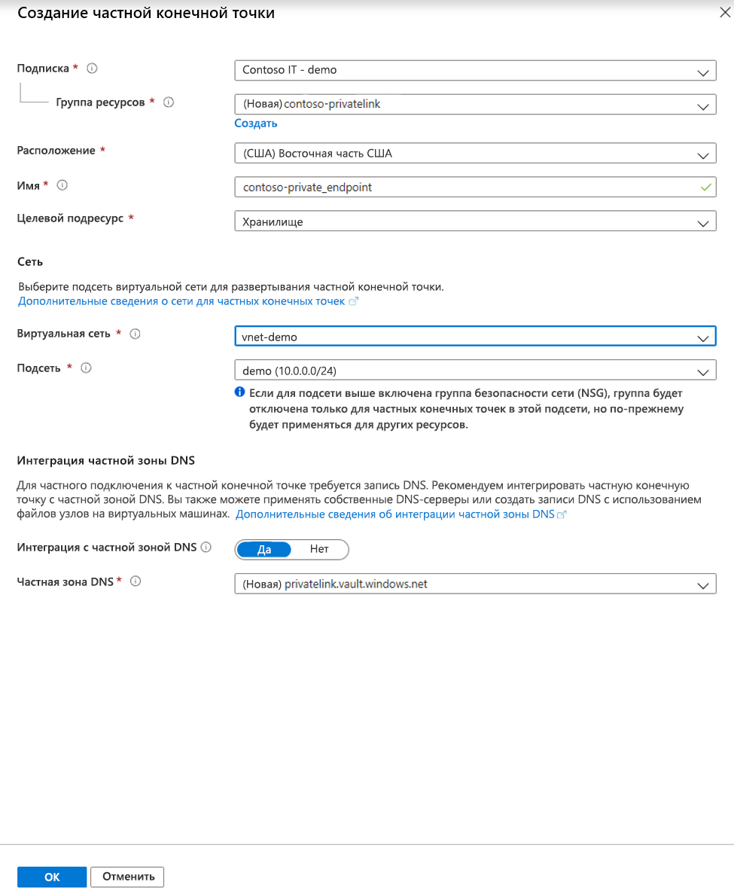

# <a name="integrate-key-vault-with-azure-private-link-preview"></a>Интеграция Key Vault со службой "Приватный канал Azure" (предварительная версия)

Приватный канал Azure обеспечивает доступ к службам Azure (например, к Azure Key Vault, службе хранилища Azure и Azure Cosmos DB), а также размещенным в Azure службам клиентов или партнеров через частную конечную точку виртуальной сети.

Частная конечная точка Azure — это сетевой интерфейс, который защищенно и надежно подключается к службе через Приватный канал Azure. Частная конечная точка использует частный IP-адрес из виртуальной сети, по сути перемещая службу в виртуальную сеть. Весь трафик к службе может маршрутизироваться через частную конечную точку, поэтому шлюзы, устройства преобразования сетевых адресов (NAT), подключения ExpressRoute и VPN, а также общедоступные IP-адреса не требуются. Трафик между виртуальной сетью и службой проходит через магистральную сеть Майкрософт, что позволяет избежать рисков общедоступного Интернета. Вы можете подключиться к экземпляру ресурса Azure, обеспечивая наивысшую степень детализации в управлении доступом.

Дополнительные сведения см. в статье [What is Azure Private Link? (Preview)](../private-link/private-link-overview.md) (Что такое Приватный канал Azure (предварительная версия)?)

## <a name="prerequisites"></a>Предварительные требования

Чтобы интегрировать хранилище ключей с Приватным каналом Azure (предварительная версия), вам потребуется следующее:

- Хранилище ключей.
- Виртуальная сеть Azure.
- Подсеть в виртуальной сети.
- Разрешения владельца или участника для хранилища ключей и виртуальной сети.

Частная конечная точка и виртуальная сеть должны находиться в одном регионе. При выборе региона для частной конечной точки с помощью портала будут автоматически фильтроваться только виртуальные сети в этом регионе. Хранилище ключей может находиться в другом регионе.

Частная конечная точка использует частный IP-адрес в виртуальной сети.

## <a name="establish-a-private-link-connection-to-key-vault"></a>Установка подключения Приватного канала к хранилищу ключей

Сначала создайте виртуальную сеть, выполнив действия, описанные в статье [Краткое руководство. Создание виртуальной сети с помощью портала Azure](../virtual-network/quick-create-portal.md).

Затем можно или создать хранилище ключей, либо установить подключение Приватного канала к существующему хранилищу ключей.

### <a name="create-a-new-key-vault-and-establish-a-private-link-connection"></a>Создание хранилища ключей и установка подключения Приватного канала

Вы можете создать хранилище ключей, выполнив действия, описанные в статье [Краткое руководство. Настройка и получение секрета из Azure Key Vault с помощью портала Azure](quick-create-portal.md).

После настройки основных компонентов хранилища ключей перейдите на вкладку "Сеть" и выполните следующие шаги:

1. Выберите переключатель "Частная конечная точка (предварительная версия)" на вкладке "Сеть".
1. Нажмите кнопку "+ Добавить", чтобы добавить частную конечную точку.

    
 
1. В колонке "Создание частной конечной точки" в поле "Расположение" выберите регион, в котором расположена ваша виртуальная сеть. 
1. В поле "Имя" введите описательное имя. По нему вы сможете найти эту частную конечную точку. 
1. В раскрывающемся меню выберите виртуальную сеть и подсеть, в которых нужно создать эту частную конечную точку. 
1. Оставьте без изменений переключатель Integrate with the private zone DNS (Интегрировать с частной зоной DNS).  
1. Нажмите «ОК».

    
 
После этого вы сможете увидеть настроенную частную конечную точку. Теперь у вас есть возможность удалить и изменить эту частную конечную точку. Нажмите кнопку "Просмотр и создание" и создайте хранилище ключей. Развертывание может занять 5–10 минут. 

### <a name="establish-a-private-link-connection-to-an-existing-key-vault"></a>Установка подключения Приватного канала к существующему хранилищу ключей

Если у вас уже есть хранилище ключей, можно создать подключение Приватного канала к нему, выполнив следующие действия:

1. Войдите на портал Azure. 
1. В строке поиска введите "хранилища ключей".
1. Выберите в списке хранилище ключей, для которого необходимо добавить частную конечную точку.
1. Выберите вкладку "Сеть" в разделе "Параметры".
1. Выберите вкладку "Подключения к частным конечным точкам" (предварительная версия) в верхней части страницы.
1. Нажмите кнопку "+ Private Endpoint" (+ Частная конечная точка) в верхней части страницы.

     

Вы можете создать частную конечную точку для любого ресурса Azure, используя эту колонку. Можно использовать раскрывающиеся меню, чтобы выбрать тип ресурса и ресурс в каталоге, или подключиться к любому ресурсу Azure, используя идентификатор ресурса. Оставьте без изменений переключатель Integrate with the private zone DNS (Интегрировать с частной зоной DNS).  


## <a name="manage-private-link-connection"></a>Управление подключением Приватного канала

При создании частной конечной точки подключение должно быть утверждено. Если ресурс, для которого создается частная конечная точка, расположен в вашем каталоге, вы сможете одобрить запрос на подключение при наличии необходимых разрешений. При подключении к ресурсу Azure из другого каталога необходимо дождаться, пока владелец этого ресурса не одобрит запрос на подключение.

Существует четыре состояния подготовки:

| Действие предоставления службы | Состояние частной конечной точки объекта-получателя службы | Описание |
|--|--|--|
| None | Ожидает | Подключение создается вручную и ожидает утверждения от владельца ресурса Приватного канала. |
| Утверждение | Approved | Подключение утверждено автоматически или вручную и готово к использованию. |
| Reject | Отклонено | Подключение отклонил владелец ресурса Приватного канала. |
| Удалить | Отключено | Подключение удалил владелец ресурса Приватного канала. Частная конечная точка станет информативной и подлежит удалению для очистки. |
 
###  <a name="how-to-manage-a-private-endpoint-connection-to-key-vault"></a>Управление подключением частной конечной точки к хранилищу ключей

1. Войдите на портал Azure.
1. В строке поиска введите "хранилища ключей".
1. Выберите хранилище ключей для управления.
1. Перейдите на вкладку "Сеть".
1. Если есть какие-либо подключения в состоянии подготовки, вы увидите такое подключение в списке с состоянием подготовки "В ожидании". 
1. Выберите частную конечную точку, которую вы хотите утвердить.
1. Нажмите кнопку "Утвердить".
1. Если есть подключения к частным конечным точкам, которые вы хотите отклонить (по запросу в ожидании или существующее подключение), выберите подключение и нажмите кнопку "Отклонить".

    

## <a name="validate-that-the-private-link-connection-works"></a>Проверка работоспособности подключения Приватного канала

Необходимо убедиться, что ресурсы в одной подсети ресурса частной конечной точки подключаются к хранилищу ключей по частному IP-адресу и что они правильно интегрируются с частной зоной DNS.

Сначала создайте виртуальную машину, выполнив действия, описанные в статье [Краткое руководство. Создание виртуальной машины Windows на портале Azure](../virtual-machines/windows/quick-create-portal.md).

На вкладке "Сеть" выполните следующее:

1. Укажите виртуальную сеть и подсеть. Можно создать виртуальную сеть или выбрать существующую. При выборе существующей сети убедитесь, что регион соответствует.
1. Укажите ресурс общедоступного IP-адреса.
1. В списке "Группа безопасности сети сетевого адаптера" выберите "Нет".
1. В поле "Балансировка нагрузки" выберите "Нет".

Откройте командную строку и выполните следующую команду:

```console
nslookup <your-key-vault-name>.vault.azure.net
```

Если выполните команду nslookup, чтобы разрешить IP-адрес хранилища ключей через общедоступную конечную точку, вы увидите следующий результат:

```console
c:\ >nslookup <your-key-vault-name>.vault.azure.net

Non-authoritative answer:
Name:    
Address:  (public IP address)
Aliases:  <your-key-vault-name>.vault.azure.net
```

Если выполните команду nslookup, чтобы разрешить IP-адрес хранилища ключей через частную конечную точку, вы увидите следующий результат:

```console
c:\ >nslookup your_vault_name.vault.azure.net

Non-authoritative answer:
Name:    
Address:  10.1.0.5 (private IP address)
Aliases:  <your-key-vault-name>.vault.azure.net
          <your-key-vault-name>.privatelink.vaultcore.azure.net
```

## <a name="limitations-and-design-considerations"></a>Проблемы и ограничения разработки

**Цены**. Сведения о ценах для Приватного канала Azure (предварительная версия) см. [здесь](https://azure.microsoft.com/pricing/details/private-link/).

**Ограничения**.  Частная конечная точка для Azure Key Vault есть в общедоступной предварительной версии. Эта возможность есть во всех общедоступных регионах Azure.

**Максимальное число частных конечных точек на Key Vault**: 64

**Максимальное число хранилищ ключей с частными конечными точками на одну подписку**: 64

Дополнительные сведения см. в разделе [Azure Private Link service: Limitations](../private-link/private-link-service-overview.md#limitations) (Служба "Приватный канал Azure". Ограничения)

## <a name="next-steps"></a>Next Steps

- См. дополнительные сведения о службе [Приватный канал Azure (предварительная версия)](../private-link/private-link-service-overview.md).
- См. дополнительные сведения об [Azure Key Vault](key-vault-overview.md).
