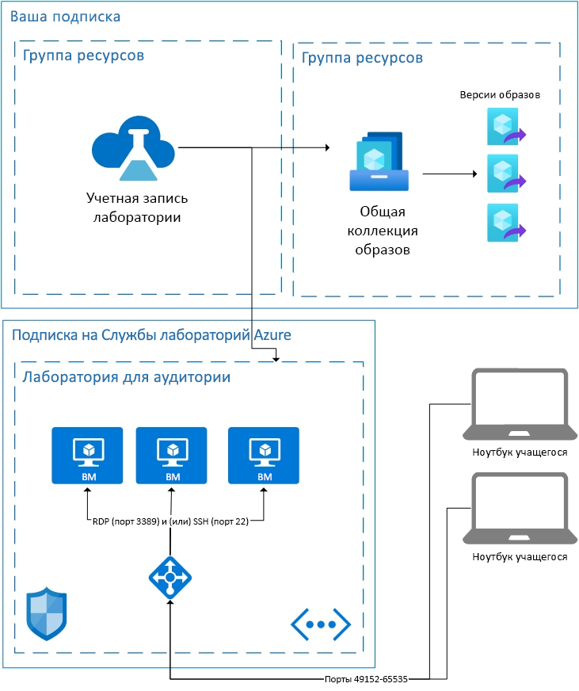

# Общие понятия об архитектуре в Службе лабораторий Azure

Службы лабораторий Azure предоставляются в формате SaaS (программное обеспечение как услуга), а значит все необходимые Службам лабораторий ресурсы обслуживаются без вашего участия. В этой статье рассматриваются важнейшие ресурсы, используемые Службами лабораторий, и базовая архитектура лаборатории.  

Службы лабораторий Azure для некоторых случаев предоставляют возможность применять собственные ресурсы в сочетании со Службами лабораторий.  Дополнительные сведения об использовании виртуальных машин в собственной сети см. в статье [об одноранговой связи с виртуальной сетью](how-to-connect-peer-virtual-network.md).  Сведения о повторном использовании образов из Общей коллекции образов см. в статье [Подключение Общей коллекции образов](how-to-attach-detach-shared-image-gallery.md).

Ниже представлена базовая архитектура лаборатории для аудитории.  Учетная запись лаборатории размещается в вашей подписке. Виртуальные машины учащихся, а также необходимые ресурсы для поддержки виртуальных машин размещаются в подписке, принадлежащей Службам лабораторий. Давайте более подробно рассмотрим содержимое подписок Службы лабораторий.

## Размещенные ресурсы

Ресурсы, необходимые для работы лаборатории для аудиторий, размещаются в одной из управляемых корпорацией Майкрософт подписок Azure.  К таким ресурсам относятся шаблон виртуальной машины для инструктора, виртуальная машина для каждого учащегося и сетевые элементы, например подсистема балансировки нагрузки, виртуальная сеть и группа безопасности сети.  Для этих подписок отслеживаются подозрительные действия.  Здесь важно отметить, что такой мониторинг выполняется не самими виртуальными машинами, а извне — через расширение виртуальной машины или мониторинг сетевых шаблонов.  Если включена функция [выключения при отсоединении](how-to-enable-shutdown-disconnect.md), на виртуальной машине работает диагностическое расширение. Это расширение позволяет Службам лабораторий получать сведения о событиях отключения сеанса протокола удаленного рабочего стола (RDP).

## Виртуальная сеть

Каждая лаборатория изолирована в собственной виртуальной сети.  Если лаборатория использует [одноранговую виртуальную сеть](how-to-connect-peer-virtual-network.md), то каждая лаборатория изолирована в собственной подсети.  Учащиеся подключаются к своим виртуальным машинам через подсистему балансировки нагрузки.  Ни одна из виртуальных машин для учащихся не получает общедоступный IP-адрес. Каждая из них использует только частный IP-адрес.  Строка подключения для учащегося содержит общедоступный IP-адрес подсистемы балансировки нагрузки и произвольный порт в диапазоне от 49152 до 65535.  Правила для входящего трафика в подсистеме балансировки нагрузки перенаправляют подключение (в зависимости от операционной системы) на порт 22 (SSH) или 3389 (RDP) соответствующей виртуальной машины. Группа безопасности сети запрещает передачу любого исходящего трафика по другим портам.

## Контроль доступа к виртуальным машинам

Службы лабораторий обеспечивают учащимся возможность выполнять такие действия, как запуск виртуальных машин и завершение их работы.  Также они управляют доступом к информации о подключении к виртуальной машине.

Службы лабораторий поддерживают регистрацию учащихся в службе. В настоящее время существует два разных уровня доступа: "ограниченный" и "неограниченный". Дополнительные сведения см. статье об [управлении пользователями лаборатории](how-to-configure-student-usage.md#send-invitations-to-users). Ограниченный доступ означает, что Службы лабораторий проверяют регистрацию учащегося в качестве пользователя, прежде чем разрешить доступ. Неограниченный доступ означает, что зарегистрироваться может любой желающий, у которого есть соответствующая ссылка, пока в лаборатории остается доступная емкость. Неограниченный доступ удобен для событий в формате хакатона.

Для виртуальных машин учащихся, размещенных в лаборатории для аудитории, создатель лаборатории задает имя пользователя и пароль.  Есть и другой вариант: создатель лаборатории может разрешить зарегистрированным учащимся самостоятельно выбирать пароль при первом входе в систему.  

## Дальнейшие действия

Дополнительные сведения о доступных функциях в Службах лабораторий, см. в статьях с [основными понятиями при работе со Службами лабораторий Azure](classroom-labs-concepts.md) и [общими сведениями о Службах лабораторий Azure](classroom-labs-overview.md).
