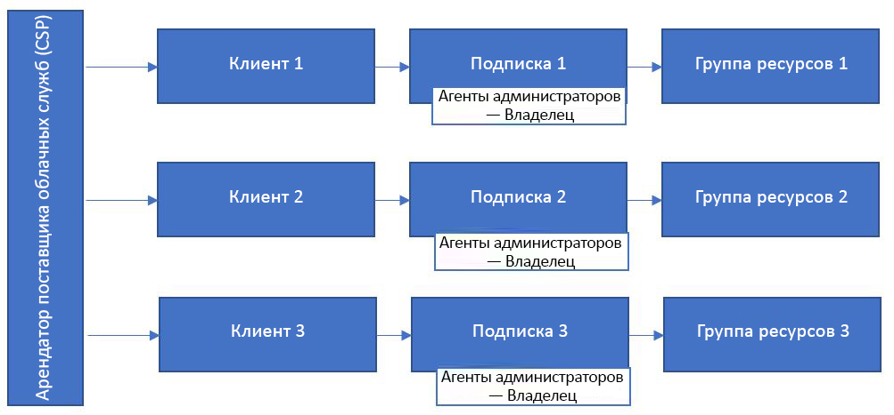
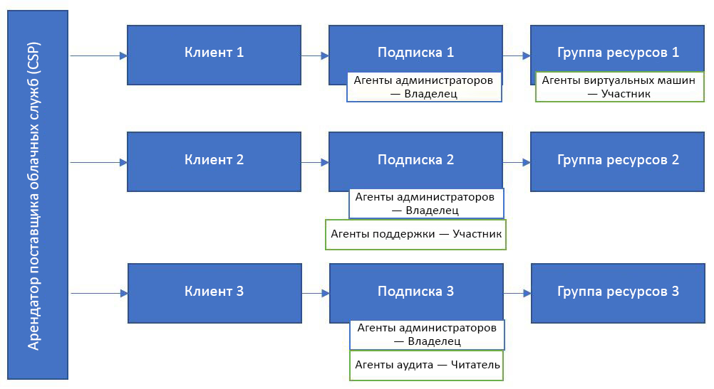

# Azure Lighthouse и программа поставщиков облачных решений

Если вы — [CSP (поставщик облачных решений)](https://docs.microsoft.com/partner-center/csp-overview), то можете получить доступ к подпискам Azure, созданным для своих клиентов в программе CSP, с помощью функции [Администрирование от имени (AOBO)](https://channel9.msdn.com/Series/cspdev/Module-11-Admin-On-Behalf-Of-AOBO). Это позволяет непосредственно обслуживать и настраивать подписки клиентов, а также управлять ими.

Механизм AOBO предоставляет полный доступ к средам клиентов. Использование делегированного управления ресурсами Azure вместе с AOBO помогает повысить безопасность, позволяя сократить ненужный доступ путем предоставления более детальных разрешений для своих пользователей. 

## Администрирование от имени (AOBO)

С AOBO любой пользователь с ролью [агента администратора](https://docs.microsoft.com/partner-center/permissions-overview#manage-commercial-transactions-in-partner-center-azure-ad-and-csp-roles) в своем арендаторе будет иметь доступ AOBO к подпискам Azure, которые создаются с помощью программы CSP. Пользователи, которым нужен доступ к подпискам клиентов, должны быть членами этой группы. AOBO не позволяет гибко создавать отдельные группы, которые работают с разными клиентами, или разрешать разные роли для групп или пользователей.

## Делегированное управление ресурсами Azure

Используя делегированное управление ресурсами Azure, можно назначать разные группы разным клиентам или ролям, как продемонстрировано на схеме ниже. Поскольку пользователи будут иметь соответствующий уровень доступа благодаря делегированному управлению ресурсами Azure, можно уменьшить количество пользователей, имеющих роль администратора (и, таким образом, полный доступ к AOBO). Это обеспечивает большую безопасность, ограничивая ненужный доступ к ресурсам клиентов. Это также предоставляет больше возможностей для управления несколькими клиентами в нужном масштабе.

Чтобы подключить подписку, созданную с помощью программы CSP, выполните действия, описанные в разделе [Onboard a customer to Azure delegated resource management](../how-to/onboard-customer.md) (Подключение клиента к делегированному управлению ресурсами Azure). Любой пользователь, имеющий роль агента администратора в своем арендаторе, может выполнить это подключение.

Учтите, что для подписок, созданных с помощью программ CSP, запросы в службу поддержки могут генерировать только пользователи с ролью агента администратора в арендаторе поставщика услуг. Пользователи, добавленные с помощью делегированного управления ресурсами Azure, не смогут подавать запросы в службу поддержки для делегированных ресурсов в этих подписках.

## Ссылка администратора партнера

Вы можете связать свой идентификатор Microsoft Partner Network (MPN) со встроенными подписками, чтобы отслеживать свое влияние на задействование клиентов.

После [публикации предложения управляемых служб в Azure Marketplace](../how-to/publish-managed-services-offers.md), идентификатор MPN связывается с профилем издателя и автоматически связывается с этим предложением. Доход, полученный ресурсами Azure с помощью этого предложения, будет затем связан со счетом вашей организации. В системах отчетов партнеров, таких как Центр партнеров или MPN, определение принадлежности будет отображаться как ссылка администратора партнера (PAL).

При [подключении клиента к делегированному управлению ресурсами Azure](../how-to/onboard-customer.md) все равно можно связать свой идентификатор MPN, чтобы получить свидетельство своего влияния на задействование клиентов, но делать это придется вручную. Дополнительные сведения см. в статье [Link a partner ID to your Azure accounts](https://docs.microsoft.com/azure/billing/billing-partner-admin-link-started) (Привязка идентификатора партнера к учетной записи Azure). 

## Дополнительная информация

- Узнайте больше об [интерфейсах управления для различных клиентов](cross-tenant-management-experience.md).
- Узнайте больше о [программе для поставщиков облачных решений](https://docs.microsoft.com/partner-center/csp-overview).
