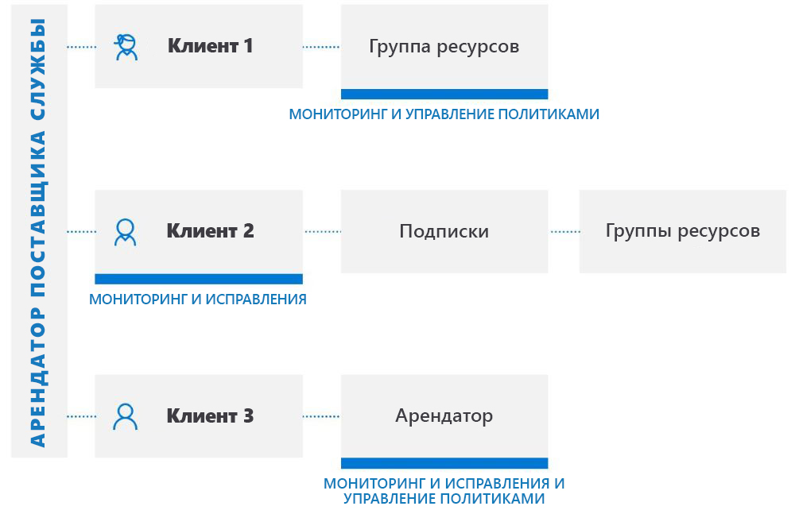

# Интерфейсы управления для различных клиентов

Вы, как поставщик услуг, можете использовать [делегированное управление ресурсами Azure](../concepts/azure-delegated-resource-management.md), чтобы управлять ресурсами Azure для нескольких клиентов из собственного арендатора на [портале Azure](https://portal.azure.com). Большинство задач и служб могут выполняться для делегированных ресурсов Azure в управляемых арендаторах. В этой статье описываются некоторые расширенные сценарии, в которых можно эффективно использовать делегированное управление ресурсами Azure.

> [!NOTE]
> Делегированное управление ресурсами Azure также можно использовать на предприятии, имеющем несколько собственных клиентов, чтобы упростить их администрирование.

## Общие сведения о клиентах пользователей

В Azure Active Directory (Azure AD) клиент представляет организацию. Это выделенный экземпляр Azure AD, который организация получает при создании связи с корпорацией Майкрософт, подписавшись на Azure, Microsoft 365 или другие службы. Каждый клиент Azure AD отделен от остальных клиентов Azure AD и имеет собственный идентификатор клиента (GUID). Дополнительные сведения см. в статье [Что такое Azure Active Directory](https://docs.microsoft.com/azure/active-directory/fundamentals/active-directory-whatis).

Как правило, чтобы управлять ресурсами Azure для клиента, поставщики услуг должны будут входить на портал Azure, используя учетную запись, связанную с клиентом этого пользователя. При этом необходимо будет, чтобы администратор в клиенте пользователя создавал учетные записи пользователей и управлял ими для поставщика услуг.

Благодаря системе делегированного управления ресурсами Azure процесс подключения указывает пользователей в клиенте поставщика услуг, которые смогут получать доступ к подпискам, группам ресурсов и ресурсам и управлять ими в клиенте пользователя. Эти пользователи могут затем войти на портал Azure, используя собственные учетные данные. На портале Azure они могут управлять ресурсами, принадлежащими всем клиентам, к которым у них есть доступ. Это можно сделать, посетив страницу [Мои клиенты](../how-to/view-manage-customers.md) на портале Azure или работая напрямую в контексте подписки этого клиента на портале Azure или через API.

Система делегированного управления ресурсами Azure обеспечивает большую гибкость в управлении ресурсами для нескольких клиентов без необходимости входа в разные учетные записи разных клиентов. Например, у поставщика услуг может быть три клиента с разными обязанностями и уровнями доступа, как показано ниже:

Используя систему делегированного управления ресурсами Azure, авторизованные пользователи могут войти в клиент поставщика услуг для получения доступа к этим ресурсам, как показано ниже:

## Поддержка интерфейсов API и средств управления

Вы можете выполнять задачи управления делегированными ресурсами непосредственно на портале или с помощью интерфейсов API и средств управления (таких как Azure CLI и Azure PowerShell). Все существующие API можно использовать для работы с делегированными ресурсами, если их функциональные возможности поддерживаются для распределенного управления арендаторами и у пользователя есть соответствующие разрешения.

Мы также предоставляем интерфейсы API для выполнения задач делегированного управления ресурсами Azure. Дополнительные сведения см. в разделе **Справочные материалы**.

## Расширенные службы и сценарии

Большинство задач и служб могут выполняться для делегированных ресурсов в управляемых арендаторах. Ниже приведены некоторые основные сценарии, в которых распределенное управление арендаторами может быть эффективным.

[Azure Arc для серверов (предварительная версия)](https://docs.microsoft.com/azure/azure-arc/servers/overview).

- [Подключение компьютеров под управлением Windows Server или Linux извне Azure](https://docs.microsoft.com/azure/azure-arc/servers/quickstart-onboard-portal) к делегированным подпискам и (или) группам ресурсов в Azure.
- Управление подключенными компьютерами с помощью конструкций Azure, таких как Политика Azure и добавление тегов.

[Служба автоматизации Azure](https://docs.microsoft.com/azure/automation/).

- Использование учетных записей службы автоматизации для получения доступа к делегированным ресурсам клиента и работы с ними.

[Azure Backup.](https://docs.microsoft.com/azure/backup/)

- Резервное копирование и восстановление данных пользователей в клиентах.

[Служба Azure Kubernetes (AKS)](https://docs.microsoft.com//azure/aks/).

- Управление размещенными средами Kubernetes, а также развертывание контейнерных приложений и управление ими в клиентах пользователей.

[Azure Monitor](https://docs.microsoft.com/azure/azure-monitor/).

- Просмотр оповещений для делегированных подписок с возможностью просмотра оповещений во всех подписках.
- Просмотр сведений журнала действий для делегированных подписок.
- Log analytics: Query data from remote customer workspaces in multiple tenants
- Создание оповещений в арендаторах клиентов, которые инициируют автоматизацию (например, Runbook службы автоматизации Azure или Функции Azure) в арендаторе поставщика службы через веб-перехватчики.

[Политика Azure](https://docs.microsoft.com/azure/governance/policy/).

- Моментальные снимки соответствия, отображающие сведения о назначенных политиках в делегированных подписках.
- Создание и изменение определений политики в делегированной подписке.
- Назначение пользовательских определений политики в делегированной подписке.
- Клиенты видят политики, созданные поставщиком услуг, наряду с политиками, которые они создали сами.
- Может [исправлять ошибки deployIfNotExists или изменят назначения в арендаторе клиента](../how-to/deploy-policy-remediation.md).

[Azure Resource Graph](https://docs.microsoft.com/azure/governance/resource-graph/).

- Теперь включает идентификатор клиента в возвращенные результаты запроса, позволяя определить, принадлежит ли подписка клиенту пользователя или клиенту поставщика услуг.

[Центр безопасности Azure](https://docs.microsoft.com/azure/security-center/).

- Видимость различных клиентов
  - Мониторинг соответствия политикам безопасности и обеспечение безопасности для всех ресурсов клиентов.
  - Непрерывный мониторинг соответствия нормативным требованиям для нескольких клиентов в одном представлении.
  - Мониторинг, рассмотрение и определение приоритетных практических рекомендаций по безопасности с вычислением оценки безопасности.
- Управление состоянием безопасности для различных клиентов.
  - Управление политиками безопасности.
  - Выполнение действий с ресурсами, которые не соответствуют практическим рекомендациям по безопасности.
  - Сбор и хранение данных, связанных с безопасностью.
- Обнаружение угроз для различных клиентов и защита от них.
  - Обнаружение угроз в ресурсах клиентов.
  - Применение дополнительных элементов управления защитой от угроз, таких как JIT-доступ к виртуальной машине.
  - Повышение уровня защиты конфигурации группы безопасности сети с помощью адаптивной защиты сети.
  - Обеспечение работы только тех приложений и процессов на серверах, которые должны использоваться с адаптивными элементами управления приложениями.
  - Мониторинг изменений важных файлов и записей реестра с помощью мониторинга целостности файлов (FIM).

[Azure Sentinel](https://docs.microsoft.com/azure/sentinel/multiple-tenants-service-providers):

- управление ресурсами Azure Sentinel в клиентах

[Работоспособность служб Azure](https://docs.microsoft.com/azure/service-health/).

- Мониторинг работоспособности ресурсов клиента с помощью службы "Работоспособность ресурсов Azure".
- Отслеживание работоспособности служб Azure, которые используют клиенты.

[Azure Site Recovery](https://docs.microsoft.com/azure/site-recovery/).

- Управление параметрами аварийного восстановления для виртуальных машин Azure в пользовательских клиентах (обратите внимание, что учетные записи RunAs нельзя использовать для копирования расширений виртуальных машин).

[Виртуальные машины Azure](https://docs.microsoft.com/azure/virtual-machines/).

- Использование расширений виртуальных машин для выполнения задач настройки и автоматизации после развертывания виртуальных машин Azure в пользовательских клиентах.
- Использование диагностики загрузки для устранения неполадок с виртуальными машинами Azure в пользовательских клиентах.
- Получение доступа к виртуальным машинам с помощью последовательной консоли в пользовательских клиентах.
- Обратите внимание, что вы не можете использовать Azure Active Directory для удаленного входа в виртуальную машину и не можете интегрировать виртуальную машину с Key Vault для паролей, секретов или криптографических ключей для шифрования диска.

[Виртуальная сеть Azure.](https://docs.microsoft.com/azure/virtual-network/)

- Развертывание виртуальных сетей и виртуальных сетевых карт (vNIC), а также управление ими в пользовательских клиентах.

Запросы в службу поддержки.

- Откройте запросы в службу поддержки для делегированных ресурсов с помощью колонки **Справка и поддержка** на портале Azure (выбирая план поддержки, доступный для делегированной области).

## Текущие ограничения
Во всех сценариях необходимо учитывать следующие текущие ограничения.

- Запросы, обрабатываемые службой Azure Resource Manager, можно выполнять с помощью делегированного управления ресурсами Azure. URI операций для этих запросов начинаются с `https://management.azure.com`. Однако запросы, которые обрабатываются экземпляром типа ресурса (например, доступ к секретам KeyVault или доступ к данным хранилища), не поддерживаются с системой делегированного управления ресурсами Azure. URI операций для этих запросов обычно начинаются с адреса, уникального для вашего экземпляра, например `https://myaccount.blob.core.windows.net` или `https://mykeyvault.vault.azure.net/`. Последние также обычно являются операциями с данными, а не операциями управления. 
- При назначении ролей должны использоваться [встроенные роли](https://docs.microsoft.com/azure/role-based-access-control/built-in-roles) управления доступом на основе ролей (RBAC). В настоящее время все встроенные роли поддерживаются для делегированного управления ресурсами Azure, за исключением роли "Владелец" и любых встроенных ролей с разрешением [DataActions](https://docs.microsoft.com/azure/role-based-access-control/role-definitions#dataactions). Роль "Администратор доступа пользователей" поддерживается только для [назначения ролей управляемым удостоверениям](../how-to/deploy-policy-remediation.md#create-a-user-who-can-assign-roles-to-a-managed-identity-in-the-customer-tenant).  Пользовательские роли и [роли классического администратора подписки](https://docs.microsoft.com/azure/role-based-access-control/classic-administrators) не поддерживаются.
- В настоящее время вы не можете подключить подписку (или группу ресурсов в подписке) для системы делегированного управления ресурсами Azure, если в подписке используется Azure Databricks. Аналогичным образом, если подписка зарегистрирована для подключения к поставщику ресурсов **Microsoft.ManagedServices**, вы не сможете на данный момент создать рабочее пространство Databricks для этой подписки.
- Хотя вы можете подключить подписки и группы ресурсов для делегированного управления ресурсами Azure, которые имеют блокировки ресурсов, эти блокировки не будут препятствовать выполнению действий в управляющем клиенте. [Запрет назначений](https://docs.microsoft.com/azure/role-based-access-control/deny-assignments), защищающий управляемые системой ресурсы, такие как созданные управляемыми приложениями Azure или Azure Blueprints (назначенные системой запреты назначений), не позволяет пользователям в управляющем клиенте работать с этими ресурсами. Однако в настоящее время пользователи в клиенте не могут создавать собственные запреты назначений (назначенные пользователем запреты назначений).

## Дальнейшие действия

- Подключите клиентов к делегированному управлению ресурсами Azure с помощью [шаблонов Azure Resource Manager](../how-to/onboard-customer.md) или путем [публикации предложения частных или общедоступных управляемых служб в Azure Marketplace](../how-to/publish-managed-services-offers.md).
- [Просматривайте клиентов и управляйте ими](../how-to/view-manage-customers.md), перейдя в раздел **Мои клиенты** на портале Azure.
