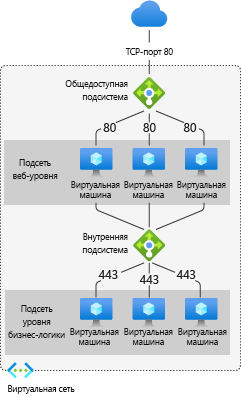
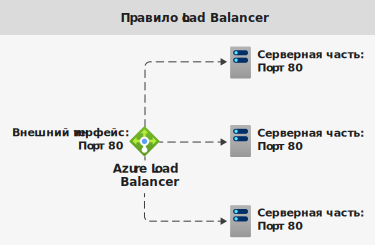
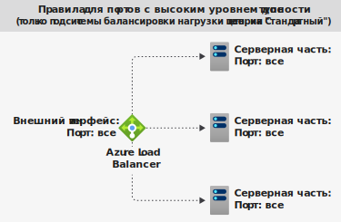
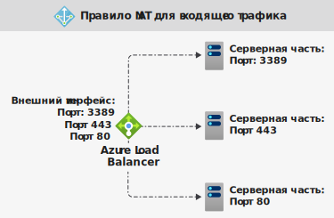

# Компоненты Azure Load Balancer

Azure Load Balancer включает несколько важных компонентов. Эти компоненты можно настроить в подписке с помощью таких инструментов:

* Портал Azure
* Azure CLI
* Azure PowerShell
* Шаблоны Resource Manager

## Конфигурация IP внешнего интерфейса 

IP-адрес Azure Load Balancer. Это точка взаимодействия с клиентами. Эти IP-адреса могут относиться к следующим категориям:

- **Общедоступный IP-адрес**
- **Частные IP-адреса**

Тип IP-адреса определяет **тип** создаваемой подсистемы балансировки нагрузки. Если выбрать частный IP-адрес, создается внутренняя подсистема балансировки нагрузки. Если выбрать общедоступный IP-адрес, создается общедоступная подсистема балансировки нагрузки.

|  | Общедоступная подсистема балансировки нагрузки  | Внутренний балансировщик нагрузки |
| ---------- | ---------- | ---------- |
| **Конфигурация IP внешнего интерфейса**| Общедоступный IP-адрес | Частный IP-адрес|
| **Описание** | Общедоступная подсистема балансировки нагрузки сопоставляет общедоступный IP-адрес и порт входящего трафика с частным IP-адресом и портом виртуальной машины. Ответный трафик от виртуальной машины сопоставляется подсистемой балансировки нагрузки обратным образом. Применяя правила балансировки нагрузки, можно распределять определенные типы трафика между несколькими различными виртуальными машинами или службами. Например, можно распределить нагрузку от трафика веб-запросов на несколько веб-серверов.| Внутренняя подсистема балансировки нагрузки распределяет трафик между ресурсами, находящимися в виртуальной сети. Azure ограничивает доступ к интерфейсным IP-адресам виртуальной сети, к которым применяется балансировка нагрузки. IP-адреса внешнего интерфейса и виртуальные сети никогда не предоставляются напрямую конечной точке Интернета. Внутренние бизнес-приложения выполняются в Azure и доступны из Azure или из локальных ресурсов. |
| **Поддерживаемые номера SKU** | "Базовый", "Стандартный" | "Базовый", "Стандартный" |

Load Balancer может иметь несколько интерфейсных IP-адресов. Дополнительные сведения о [нескольких внешних интерфейсах](load-balancer-multivip-overview.md).

## Серверный пул

Группа виртуальных машин или экземпляров в масштабируемом наборе виртуальных машин, которая обрабатывает входящий запрос. Для экономичного масштабирования до больших объемов входящего трафика обычно рекомендуется добавить дополнительные экземпляры в серверный пул.

Load Balancer мгновенно изменяет свою конфигурацию при вертикальном увеличении или уменьшении масштаба для числа экземпляров. Добавление или удаление виртуальных машин из серверного пула перенастраивает подсистему балансировки нагрузки без дополнительных операций. Область серверного пула — это любая виртуальная машина в виртуальной сети.

Вы можете спроектировать серверный пул, содержащий наименьшее количество ресурсов, чтобы оптимизировать длительность операций управления. Нет никаких различий в производительности или масштабировании плоскости данных.

## Пробы работоспособности

Пробы работоспособности помогают определить работоспособность экземпляров во внутреннем пуле. При создании подсистемы балансировки нагрузки настройте проверку работоспособности для использования этой подсистемой.  Эта проба работоспособности будет определять, является ли экземпляр работоспособным и может ли он принимать трафик.

Вы можете настроить для проб работоспособности пороговое значение состояния неработоспособности. Если проба не может получить ответ, Load Balancer прекращает передавать подключения на неработоспособные экземпляры. Сбой пробы не влияет на существующие подключения. Подключение будет продолжаться до следующего приложения:

- завершает последовательность;
- появляется время ожидания простоя;
- виртуальная машина завершает работу.

Load Balancer предоставляет разные типы проверки работоспособности для конечных точек: TCP, HTTP и HTTPS. [Подробнее о пробах работоспособности Load Balancer](load-balancer-custom-probe-overview.md).

Load Balancer ценовой категории "Базовый" не поддерживает пробы работоспособности для протокола HTTPS. Load Balancer ценовой категории "Базовый" закрывает также все TCP-подключения (включая установленные).

## Правила балансировки нагрузки

Правило Load Balancer позволяет определить метод распределения трафика между **всеми** экземплярами внутреннего пула. Правило балансировки нагрузки сопоставляет каждую отдельную интерфейсную IP-конфигурацию и порт с несколькими внутренними IP-адресами и портами.

Например, используйте правило балансировки нагрузки для порта 80, чтобы направить трафик с интерфейсного IP-адреса на порт 80 внутренних экземпляров.

  

*Рисунок. Правила балансировки нагрузки*

## Порты с высоким уровнем доступности

Правило подсистемы балансировки нагрузки, для которого настроены значения **protocol — all и port — 0**. 

Это позволяет указать единое правило балансировки нагрузки для всех потоков TCP и UDP, поступающих на все порты внутренней подсистемы Load Balancer (цен. категория "Стандартный"). 

Решение о распределении нагрузки принимается отдельно для каждого потока. Это действие основано на следующем соединении с пятью кортежами: 

1. Исходный IP-адрес
2. Исходный порт
3. Конечный IP-адрес
4. Порт назначения
5. protocol

Правила балансировки нагрузки портов с высоким уровнем доступности помогают в критически важных сценариях. Например, они обеспечивают высокий уровень доступности и масштабирование для виртуальных сетевых модулей в виртуальных сетях. Они позволяют распределять нагрузку между большим количеством портов.

  

*Рисунок. Правила для портов с высоким уровнем доступности*

См. дополнительные сведения о [портах с высоким уровнем доступности](load-balancer-ha-ports-overview.md).

## Правила преобразования сетевых адресов для входящих подключений

Правило NAT для входящего трафика обеспечивает перенаправление входящего трафика, отправленного на определенную пару интерфейсного IP-адреса и порта. Трафик отправляется в **конкретную** виртуальную машину или экземпляр внутреннего пула. К перенаправлению портов применяется такое же распределение на основе хэша, что и для балансировки нагрузки.

Например, сеансы протокола удаленного рабочего стола (RDP) или Secure Shell (SSH) можно направлять на разные экземпляры виртуальных машин во внутреннем пуле. Несколько внутренних конечных точек можно сопоставить с разными портами на одном интерфейсном IP-адресе. Интерфейсные IP-адреса можно использовать для удаленного администрирования виртуальных машин без дополнительного коммутатора.

  

*Рисунок. Правила NAT для входящего трафика*

Правила NAT для входящего трафика в контексте Масштабируемых наборов виртуальных машин являются входящими пулами NAT. Узнайте больше о [компонентах Load Balancer и масштабируемых наборах виртуальных машин](../virtual-machine-scale-sets/virtual-machine-scale-sets-networking.md#azure-virtual-machine-scale-sets-with-azure-load-balancer).

## Правила для исходящего трафика

Правило для исходящего трафика позволяет настроить преобразование сетевых адресов (NAT) для всех виртуальных машин или экземпляров, которые входят в серверный пул. Это правило позволяет экземплярам серверной части отправлять запросы в Интернет или другие конечные точки.

Дополнительные сведения об [исходящих подключениях и правилах](load-balancer-outbound-connections.md).

Подсистема балансировки нагрузки (номер SKU "Базовый") не поддерживает правила для исходящего трафика.

## Дальнейшие действия

- Чтобы приступить к работе с Load Balancer, см. [Create a public Standard Load Balancer](quickstart-load-balancer-standard-public-portal.md) (Создание общедоступного Load Balancer (цен. категория "Стандартный")).
- [Дополнительные сведения об Azure Load Balancer](load-balancer-overview.md).
- Сведения об [общедоступном IP-адресе](https://docs.microsoft.com/azure/virtual-network/virtual-network-public-ip-address).
- Сведения о [частном IP-адресе](https://docs.microsoft.com/azure/virtual-network/virtual-network-ip-addresses-overview-arm#private-ip-addresses).
- Дополнительные сведения о [Load Balancer (цен. категория "Стандартный") и зонах доступности](load-balancer-standard-availability-zones.md).
- [Metrics and health diagnostics for Standard Load Balancer](load-balancer-standard-diagnostics.md) (Метрики и проверки работоспособности Load Balancer уровня "Стандартный")
- Сведения о [сбросе TCP-подключений при простое](load-balancer-tcp-reset.md).
- Дополнительные сведения об [использовании Load Balancer (цен. категория "Стандартный") с правилами балансировки нагрузки портов высокого уровня доступности](load-balancer-ha-ports-overview.md).
- Узнайте больше о [группах безопасности сети](../virtual-network/security-overview.md).
- Дополнительные сведения об [ограничениях подсистемы балансировки нагрузки](https://docs.microsoft.com/azure/azure-resource-manager/management/azure-subscription-service-limits#load-balancer).
- Сведения об использовании [перенаправления портов](https://docs.microsoft.com/azure/load-balancer/tutorial-load-balancer-port-forwarding-portal).
