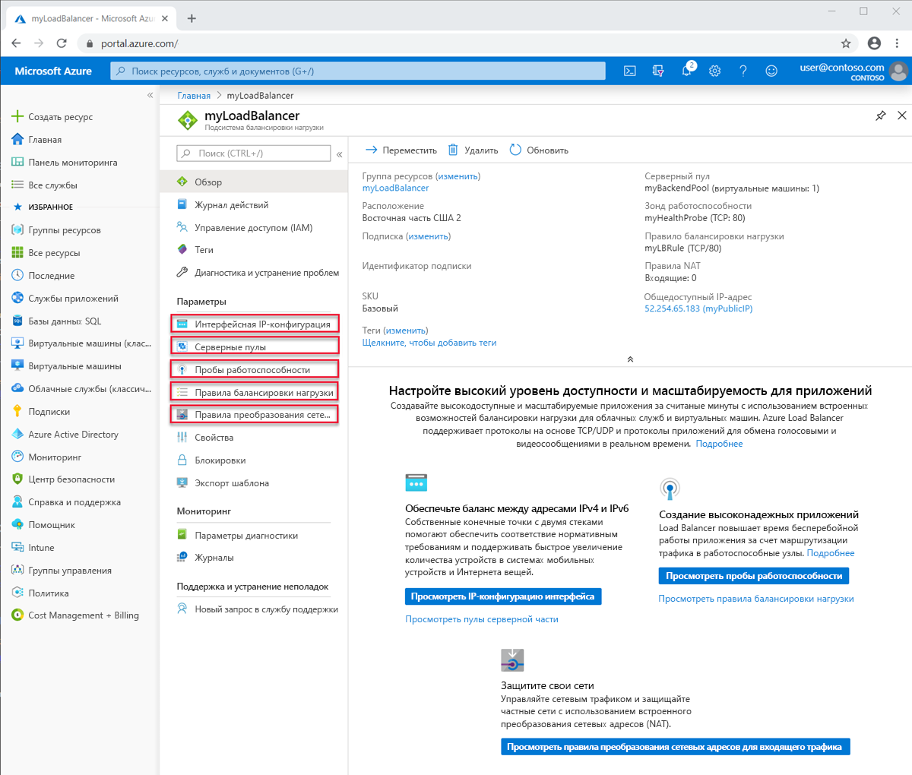

# Компоненты и ограничения Azure Load Balancer
Azure Load Balancer содержит несколько ключевых компонентов для работы.  Эти компоненты можно настроить в подписке с помощью портала Azure, Azure CLI или Azure PowerShell.  

## Компоненты Load Balancer

* **Конфигурации IP для интерфейса**. IP-адрес экземпляра Load Balancer. Это точка взаимодействия с клиентами. Эти адреса могут быть, например: 

    - **[Общедоступный IP-адрес](https://docs.microsoft.com/azure/virtual-network/virtual-network-public-ip-address)**
    - **[Частный IP-адрес](https://docs.microsoft.com/azure/virtual-network/virtual-network-ip-addresses-overview-arm#private-ip-addresses)**

* **Серверный пул**. Группа виртуальных машин или экземпляров в масштабируемом наборе виртуальных машин, которые будут обрабатывать входящие запросы. Для экономичного масштабирования до больших объемов входящего трафика обычно рекомендуется добавить дополнительные экземпляры в серверный пул. Load Balancer мгновенно изменяет свою конфигурацию при масштабировании числа экземпляров. Добавление или удаление виртуальных машин из серверного пула перенастраивает Load Balancer без дополнительных операций. Область серверного пула — это любая виртуальная машина в виртуальной сети. Серверный пул может иметь до 1000 серверных экземпляров или конфигураций IP.
Load Balancer (цен. категория "Базовый") имеют ограниченную область (группа доступности), которая позволяет масштабировать до 300 конфигураций IP. Дополнительные сведения об ограничениях Load Balancer см. в [этой статье](https://docs.microsoft.com/azure/azure-resource-manager/management/azure-subscription-service-limits#load-balancer). Вы можете спроектировать серверный пул, содержащий наименьшее количество ресурсов, чтобы в дальнейшем оптимизировать длительность операций управления. Нет никаких различий в производительности или масштабировании плоскости данных.
* **Пробы работоспособности**. **[Пробы работоспособности](https://docs.microsoft.com/azure/load-balancer/load-balancer-custom-probe-overview)** помогают определить работоспособность экземпляров в серверном пуле. Вы можете настроить для проб работоспособности пороговое значение состояния неработоспособности. Если проверка не отвечает, балансировщик нагрузки Azure прекращает отправлять новое подключение неработоспособным экземплярам. Сбой пробы не влияет на существующие подключения. 
    
    Подключение будет продолжаться до следующего приложения: 
    - завершает последовательность;
    - появляется время ожидания простоя;
    - виртуальная машина завершает работу.

    Load Balancer предоставляет разные типы проверки работоспособности для конечных точек:
    - TCP
    - HTTP
    - HTTPS (проба HTTP с оболочкой TLS).
     
     Load Balancer (цен. категория "Базовый") не поддерживает пробы HTTPS. Кроме того, Load Balancer (цен. категория "Базовый") будет завершать все TCP-подключения (включая установленные). 
    Дополнительные сведения см. в разделе [Типы проб](load-balancer-custom-probe-overview.md#types).

* **Правила балансировки нагрузки**. Правила балансировки нагрузки позволяют определять, что и когда нужно делать подсистеме балансировки нагрузки. 
* **Правила преобразования сетевых адресов для входящего трафика**. Правило NAT для входящего трафика перенаправляет трафик с определенного порта определенного IP-адреса внешнего интерфейса на определенный порт определенного экземпляра серверной части в виртуальной сети. **[К перенаправлению портов](https://docs.microsoft.com/azure/load-balancer/tutorial-load-balancer-port-forwarding-portal)** применяется такое же распределение на основе хэша, что и для балансировки нагрузки. Распространенными сценариями этой возможности являются сеансы протокола удаленного рабочего стола или Secure Shell для отдельных экземпляров виртуальной машины в виртуальной сети Azure. Несколько внутренних конечных точек можно сопоставить с портами в том же IP-адресе внешнего интерфейса. Внешние IP-адреса можно использовать для удаленного администрирования виртуальных машин без дополнительных переходов.
* **Правила для исходящего трафика**. **[Правило для исходящего трафика](https://docs.microsoft.com/azure/load-balancer/load-balancer-outbound-rules-overview)** позволяет настроить NAT для отображения в интерфейсе всех виртуальных машин или экземпляров, которые входят в серверный пул Load Balancer (цен. категория "Стандартный").
Load Balancer (цен. категория "Базовый") не поддерживает правила для исходящего трафика.

## Основные понятия Load Balancer

Load Balancer предоставляет следующие основные возможности для приложений TCP и UDP:

* **Алгоритм балансировки нагрузки**. С помощью Azure Load Balancer можно создать правило балансировки нагрузки, чтобы распределять входящий трафик внешнего интерфейса между экземплярами внутреннего пула. Load Balancer использует алгоритм хэширования для распределения входящих потоков (не в байтах) и соответствующим образом перезаписывает заголовки потоков экземпляров внутреннего пула. Сервер может получать новые потоки, когда в результате проверки работоспособности получается работоспособная серверная конечная точка.
По умолчанию Load Balancer использует хэш с 5 кортежами. 

   Хэш включает перечисленные ниже компоненты. 

   - **Исходный IP-адрес**
   - **Исходный порт**
   - **Конечный IP-адрес**
   - **Порт назначения**
   - **Номер протокола IP для сопоставления потоков на доступные серверы** 

Используя хэш с 2 или 3 кортежами для данного правила, можно создать сходство с исходным IP-адресом. Все пакеты из одного потока пакетов поступают на один и тот же экземпляр за внешним интерфейсом с балансировкой нагрузки. При запуске клиентом нового потока из того же исходного IP-адреса меняется исходный порт. В результате использование хэша с 5-ю кортежами может привести к тому, что трафик перейдет к другой конечной точке серверной части.
Дополнительные сведения см. в разделе [Настройка режима распределения для Azure Load Balancer](./load-balancer-distribution-mode.md). 

На представленном ниже рисунке показано распределение на основе хэша.

  

  *Рисунок. Распространение на основе хэша*

* **Прозрачность и независимость от приложения** Load Balancer не взаимодействует напрямую с протоколом TCP или UDP или уровнем приложения. Поддерживается любой сценарий приложения TCP или UDP. Load Balancer не завершает или не исправляет потоки, не взаимодействует с полезными данными потока или предоставляет любую функцию шлюза на уровне приложения. Подтверждения протокола всегда происходят непосредственно между клиентом и экземпляром пула серверной части. Ответом на входящий поток всегда является ответ от виртуальной машины. Когда поток поступает в виртуальную машину, исходный IP-адрес источника также сохраняется.
  * На каждый запрос конечной точки поступает ответ только от виртуальной машины. Например, подтверждение TCP всегда возникает между клиентом и выбранной серверной виртуальной машиной. Ответ на запрос к внешнему интерфейсу — это ответ, созданный серверной виртуальной машиной. При успешной проверке связи с внешним интерфейсом вы проверяете сквозное соединение по крайней мере с одной серверной виртуальной машиной.
  * Полезные данные приложения прозрачны для Load Balancer. Поддерживается любое приложение UDP или TCP.
  * Поскольку Load Balancer не взаимодействует с полезными данными TCP и обеспечивают разгрузку TLS, вы можете создавать комплексные зашифрованные сценарии. Использование Load Balancer значительно повышает масштаб для приложений TLS, завершая подключение TLS на самой виртуальной машине. Например, емкости ключей в сеансах TLS ограничиваются только типом и числом виртуальных машин, добавленных в серверный пул.

* **Исходящие подключения**. Все исходящие потоки из частных IP-адресов в виртуальной сети к общедоступным IP-адресам в Интернете можно преобразовать во внешние IP-адреса подсистемы балансировки нагрузки. Если общедоступный внешний интерфейс привязан к серверной виртуальной машине с помощью правила балансировки нагрузки, Azure преобразует исходящие подключения в общедоступный IP-адрес внешнего интерфейса. Такая конфигурация обеспечивает следующие преимущества.
  * Упрощенное обновление и аварийное восстановление служб, так как внешний интерфейс можно динамически сопоставить с другим экземпляром службы.
  * Упрощение управления списком управления доступом (ACL). ACL, выраженные как IP-адреса внешнего интерфейса, не меняются по мере увеличения или уменьшения масштаба или при повторном развертывании служб. Преобразование исходящих подключений для получения меньшего числа IP-адресов, чем количество компьютеров, может упростить ведение списка надежных получателей.

  Load Balancer (цен. категория "Стандартный") использует [надежный, масштабируемый и предсказуемый алгоритм SNAT](load-balancer-outbound-connections.md#snat). Ниже приведены ключевые принципы, которые следует помнить при работе с Load Balancer (цен. категория "Стандартный"):

    - Правила балансировки нагрузки определяют способ программирования SNAT. Правила балансировки нагрузки зависят от протокола. SNAT зависит от протокола, и конфигурация должна это отражать, а не создавать побочный эффект.

    - **Несколько внешних интерфейсов**. Когда доступно несколько внешних интерфейсов, все они используются и каждый из них увеличивает количество доступных SNAT-портов. Если вам нужно больше портов SNAT, так как вы ожидаете или уже получаете большое количество запросов на исходящие подключения, можно добавить дополнительный порт SNAT путем настройки дополнительных внешних интерфейсов, правил и серверных пулов для тех же ресурсов виртуальных машин.

    - **Выбор внешнего интерфейса, который будет использоваться для исходящего трафика**. Если вы не хотите, чтобы какой-либо определенный внешний интерфейс использовался для исходящих подключений, вы можете исключить это. Если необходимо ограничить исходящие подключения до исходящих только из определенного интерфейсного IP-адреса, можно отключить исходящие SNAT-подключения в правиле, которое выражает исходящие сопоставления.

    - **Управление исходящими подключениями**. Исходящие сценарии — явные, а исходящих подключений не существует, пока они не были указаны. Load Balancer уровня "Стандартный" существует в контексте виртуальной сети.  Это изолированная частная сеть.  Если связь с общедоступным IP-адресом отсутствует, подключение к общедоступным сетям запрещено.  К [конечным точкам службы виртуальной сети](../virtual-network/virtual-network-service-endpoints-overview.md) можно получить доступ, так как они находятся внутри и расположены локально в виртуальной сети.  Если вы хотите установить исходящее подключение к пункту назначения извне виртуальной сети, у вас есть два варианта:
        - присвоить ресурсу виртуальной машины общедоступный IP-адрес SKU "Стандартный" в качестве общедоступного IP-адреса уровня экземпляра или
        - разместить ресурс виртуальной машины в серверном пуле общедоступного Load Balancer уровня "Стандартный".

        Оба варианта позволяют выполнять исходящие подключения из виртуальной сети за ее пределы. 

        Если у вас есть _только_ внутренний Load Balancer уровня "Стандартный", связанный с серверным пулом, в котором расположен ресурс виртуальной машины, ваша виртуальная машина может получить доступ только к ресурсам виртуальной машины и [конечным точкам службы виртуальной сети](../virtual-network/virtual-network-service-endpoints-overview.md).  Чтобы создать исходящее подключение, следуйте действиям, описанным в этом разделе выше.

        Исходящее подключение к ресурсу виртуальной машины, не связанному со SKU "Стандартный", остается прежним.

        Ознакомьтесь со статьей [Исходящие подключения в Azure](load-balancer-outbound-connections.md).

* **Зоны доступности**. Load Balancer уровня "Стандартный" поддерживает дополнительные возможности в регионах, где доступны зоны доступности. Эти функции являются добавочными для всех Load Balancer уровня "Стандартный".  Конфигурации зон доступности доступны для общедоступных и внутренних Load Balancer (цен. категория "Стандартный").
 Внешний интерфейс, избыточный между зонами, выдерживает сбой зоны и обслуживается выделенной инфраструктурой во всех зонах одновременно. 
Кроме того, вы можете гарантировать использование внешнего интерфейса в определенной зоне. Зональные внешние интерфейсы разделяют участь соответствующей зоны и обслуживаются только выделенной инфраструктурой в одной зоне.
Для серверного пула доступна межзональная балансировка нагрузки, а любой ресурс виртуальной машины в виртуальной сети может быть частью серверного пула.
Load Balancer (цен. категория "Базовый") не поддерживает зоны.
Дополнительные сведения см. в разделе с [подробным описанием возможностей, связанных с Зонами доступности](load-balancer-standard-availability-zones.md), и в [обзорной статье о Зонах доступности](../availability-zones/az-overview.md).

* **Порты высокого уровня доступности**. Вы можете настроить правила балансировки нагрузки, чтобы масштабировать приложение и сделать его более надежным. При использовании правила балансировки нагрузки портов НА Load Balancer (цен. категория "Стандартный") предоставляет балансировку нагрузки по каждому потоку на каждом временном порту интерфейсного IP-адреса внутреннего Load Balancer (цен. категория "Стандартный").  Эта функция также полезна для других сценариев, где нецелесообразно или нежелательно указывать отдельные порты. Правило балансировки нагрузки портов НА позволяет создавать сценарии n+1 в режиме "активный — пассивный" или "активный — активный" для виртуальных сетевых модулей и любых приложений, которым требуются большие диапазоны входящих портов.  Проверку работоспособности можно использовать для определения того, какие серверные части должны получать новые потоки.  Группу безопасности сети можно использовать для эмуляции сценария с диапазоном портов. Load Balancer (цен. категория "Базовый") не поддерживает порты высокого уровня доступности.
Ознакомьтесь со статьей [Общие сведения о портах с высоким уровнем доступности](load-balancer-ha-ports-overview.md).
>[!IMPORTANT]
> Если вы планируете использовать виртуальный сетевой модуль, обратитесь к своему поставщику, чтобы узнать, был ли его продукт протестирован с использованием портов HA, и выполните предоставленные им конкретные рекомендации по реализации. 

* **Несколько внешних интерфейсов**. Load Balancer поддерживает несколько правил с несколькими внешними интерфейсами.  В Load Balancer уровня "Стандартный" их можно использовать в сценариях исходящих подключений.  Сценарии исходящих подключений по существу являются противоположностью правила балансировки нагрузки входящих подключений.  Правило балансировки нагрузки входящих подключений также создает связь для исходящих подключений. Load Balancer (цен. категория "Стандартный") использует все внешние интерфейсы, связанные с ресурсом виртуальной машины, через правило балансировки нагрузки.  Кроме того, в правиле балансировки нагрузки есть параметр, позволяющий отключить это правило для исходящих подключений. Также можно выбрать определенные внешние интерфейсы или не выбирать никаких.

Для сравнения: Load Balancer уровня "Базовый" случайным образом выбирает один внешний интерфейс и невозможно узнать, какой из них был выбран.
## Типы Load Balancer

### Общедоступный Load Balancer

Общедоступный Load Balancer сопоставляет общедоступный IP-адрес и порт входящего трафика с частным IP-адресом и портом виртуальной машины. Трафик ответа от виртуальной машины сопоставляется Load Balancer другим способом. Применяя правила балансировки нагрузки, можно распределять определенные типы трафика между несколькими различными виртуальными машинами или службами. Например, можно распределить нагрузку от трафика веб-запросов на несколько веб-серверов.

>[!NOTE]
>Для каждой группы доступности можно реализовать только одну общедоступную подсистему балансировки нагрузки и одну внутреннюю подсистему балансировки нагрузки.

На следующем рисунке показана конечная точка с балансировкой нагрузки для веб-трафика, которая является общей для трех виртуальных машин на общедоступном TCP-порту 80. Эти три виртуальные машины находятся в наборе балансировки нагрузки.

*Рисунок. Балансировка веб-трафика с помощью общедоступной подсистемы балансировки нагрузки*

Клиенты Интернета отправляют запросы веб-страниц по общедоступному IP адресу веб-приложения, подключенному через порт TCP 80. Azure Load Balancer распределяет запросы между тремя виртуальными машинами в наборе балансировки нагрузки. Дополнительные сведения об алгоритмах Load Balancer см. в статье [об основных понятиях Load Balancer](concepts-limitations.md#load-balancer-concepts).

Azure Load Balancer распределяет сетевой трафик между несколькими экземплярами виртуальных машин, по умолчанию. Кроме того, можно настроить сходство сеансов. Дополнительные сведения см. в разделе [Настройка режима распределения для Azure Load Balancer](load-balancer-distribution-mode.md).

### Внутренний Load Balancer

Внутренняя подсистема балансировки нагрузки направляет трафик к тем ресурсам, которые находятся внутри виртуальной сети или используют VPN для доступа к инфраструктуре Azure, в отличие от общедоступной Load Balancer. Инфраструктура Azure ограничивает доступ к интерфейсным IP-адресам (с балансировкой нагрузки) виртуальной сети. IP-адреса внешнего интерфейса и виртуальные сети никогда не предоставляются напрямую конечной точке Интернета. Внутренние бизнес-приложения выполняются в Azure и доступны из Azure или из локальных ресурсов.

Внутренняя подсистема балансировки нагрузки реализует следующие типы балансировки нагрузки:

* **В виртуальной сети:** распределение нагрузки между виртуальными машинами в виртуальной сети и набором виртуальных машин, которые находятся в той же виртуальной сети.
* **Для распределенной виртуальной сети:** балансировка нагрузки между локальными компьютерами и набором виртуальных машин, которые находятся в той же виртуальной сети.
* **Для многоуровневых приложений:** балансировка нагрузки для многоуровневых приложений с доступом в Интернет, где серверные уровни не имеют доступа к Интернету. Серверные уровни требуют балансировки нагрузки трафика уровня с выходом в Интернет. См. следующий рисунок.
* **Для бизнес-приложений:** Балансировка нагрузки для бизнес-приложений, размещенных в Azure без дополнительного оборудования или программного обеспечения подсистемы балансировки нагрузки. Сценарий включает в себя локальные серверы в наборе компьютеров, чей трафик балансируется.

*Рисунок. Балансировка многоуровневых приложений с помощью общедоступных и внутренних Load Balancer*

## Сравнение SKU Load Balancer

Load Balancer поддерживает SKU уровня "Базовый" и "Стандартный". Эти SKU различаются по масштабу сценария, возможностям и цене. Любой сценарий, который можно выполнить в рамках Load Balancer уровня "Базовый", также можно создать с помощью Load Balancer уровня "Стандартный". API обоих SKU аналогичны и вызываются через спецификацию SKU. API для поддержки SKU для Load Balancer и общедоступного IP-адреса доступны, начиная с API `2017-08-01`. Оба SKU совместно используют один общий API и структуру.

В зависимости от SKU, полный сценарий конфигурации может несколько отличаться. Документация Load Balancer вызывается, когда статья применима только к определенному SKU. Ознакомьтесь со следующей таблицей, чтобы сравнить сведения и понять различия. Дополнительные сведения см. в статье [Обзор Azure Load Balancer уровня "Стандартный"](load-balancer-standard-overview.md) на портале Azure.

>[!NOTE]
> Корпорация Майкрософт рекомендует использовать Load Balancer (цен. категория "Стандартный").
Изолированные виртуальные машины, наборы доступности и масштабируемые наборы виртуальных машин можно подключить только к одному SKU, но никогда к обоим. При использовании общедоступных IP-адресов номера SKU Load Balancer и IP-адреса должны совпадать. SKU Load Balancer и общедоступные IP-адреса неизменяемы.

[!INCLUDE [comparison table](../../includes/load-balancer-comparison-table.md)]

Дополнительные сведения см. в статье [Ограничения подсистемы балансировки нагрузки Azure](https://docs.microsoft.com/azure/azure-resource-manager/management/azure-subscription-service-limits#load-balancer). Для Load Balancer уровня "Стандартный" см. [общие сведения](load-balancer-standard-overview.md), а также [сведения о ценах](https://aka.ms/lbpricing) и [Соглашении об уровне обслуживания](https://aka.ms/lbsla).

## Ограничения

- Номера SKU неизменяемы. Вы не можете изменить номер SKU существующего ресурса.
- Изолированный ресурс виртуальной машины, ресурс группы доступности или ресурс масштабируемого набора виртуальных машин могут ссылаться на один SKU, но никогда на оба.
- Правило Load Balancer не может охватывать две виртуальные сети.  Внешние интерфейсы и связанные серверные экземпляры должны быть расположены в одной виртуальной сети.  
- [Операции перемещения подписки](../azure-resource-manager/management/move-resource-group-and-subscription.md) не поддерживаются для ресурсов Load Balancer (цен. категория "Стандартный") и общедоступных IP-адресов.
- Рабочие роли без виртуальной сети и других служб платформы Майкрософт могут быть доступны из экземпляров, расположенных только за внутренним экземпляром Load Balancer (цен. категория "Стандартный"). Вы не должны полагаться на это, так как соответствующая служба или базовая платформа могут измениться без уведомления. Вы всегда должны предполагать, что вам при необходимости нужно явно создать [исходящее подключение](load-balancer-outbound-connections.md) при использовании только Load Balancer уровня "Стандартный".

- Load Balancer обеспечивает балансировку нагрузки и перенаправление портов для конкретных протоколов TCP или UDP. Правила балансировки нагрузки и правила NAT для входящего трафика поддерживают TCP и UDP, но не другие протоколы IP, включая ICMP.

  Load Balancer не завершает полезные данные потока UDP или TCP, не отвечает на них и не взаимодействует с ними каким-либо другим способом. Это не прокси-сервер. Успешная проверка подключения к внешнему интерфейсу должна выполняться через сеть с тем же протоколом, который использовался в правилах для балансировки нагрузки или NAT для входящего трафика. Чтобы клиент мог видеть ответ с внешнего сервера, по крайней мере одна из ваших виртуальных машин должна генерировать ответ.

  Если ответ по каналу от внешнего интерфейса Load Balancer не получен, это означает, что виртуальные машины не смогли дать ответ. Взаимодействие с внешним интерфейсом Load Balancer невозможно без ответа виртуальной машины. Этот принцип также применим к исходящим подключениям, в которых SNAT с маскировкой портов поддерживается только для TCP и UDP. Любые другие IP-протоколы, включая ICMP, завершаются ошибкой. Чтобы обойти эту проблему, назначьте общедоступный IP-адрес на уровне экземпляра. Дополнительные сведения см. в статье [Общие сведения о SNAT и PAT](load-balancer-outbound-connections.md#snat).

- Внутренние подсистемы балансировки нагрузки не преобразуют исходящие подключения к внешнему интерфейсу внутреннего Load Balancer, так как оба они находятся в диапазоне частных IP-адресов. Общедоступные подсистемы балансировки нагрузки предоставляют [исходящие подключения](load-balancer-outbound-connections.md) от частных IP-адресов внутри виртуальной сети к общедоступным IP-адресам. Для внутренних подсистем балансировки нагрузки этот подход исключает вероятность возникновения нехватки портов SNAT в рамках уникального диапазона внутренних IP-адресов, в котором не требуется проводить преобразование.

  Побочным эффектом является то, что если исходящий поток из виртуальной машины в серверном пуле направляется к внешнему интерфейсу внутреннего балансировщика нагрузки, в пуле которого она находится, _и_ сопоставляется с собой, и два элемента потока не совпадают. Так как они не совпадают, происходит сбой потока. Поток передается успешно, если в серверном пуле он не сопоставляется с той же виртуальной машиной, которая создала поток к внешнему интерфейсу.

  Когда поток сопоставляется с собой, получается, что исходящий поток передается из виртуальной машины на внешний интерфейс, а соответствующий входящий поток поступает от виртуальной машины к себе. С точки зрения гостевой операционной системы входящие и исходящие части того же потока не совпадают в виртуальной машине. Стек TCP не будет распознавать эти половины одного потока как часть того же потока. Источник и назначение не совпадают. При сопоставлении потока с любой другой виртуальной машиной в серверном пуле половины потока будут соответствовать друг другу, и виртуальная машина сможет реагировать на поток.

  Симптомом этого сценария является периодическое истечение времени ожидания подключения, когда поток возвращается к той же серверной части, из которой он возник. К общим обходным решениям относятся вставка уровня прокси-сервера за внутренней подсистемой балансировки нагрузки и использование правил прямого ответа от сервера (DSR). Дополнительные сведения см. в статье [Несколько внешних интерфейсов для Azure Load Balancer](load-balancer-multivip-overview.md).

  Вы можете объединить внутреннюю систему балансировки нагрузки со сторонним прокси-сервером или использовать внутренний [шлюз приложений](../application-gateway/application-gateway-introduction.md) для сценариев прокси-сервера с протоколами HTTP и HTTPS. Хотя вы можете использовать общедоступный Load Balancer в качестве обходного решения, полученный сценарий подвержен [исчерпанию SNAT](load-balancer-outbound-connections.md#snat). Избегайте этого второго подхода, если не сможете осуществить его тщательно.

- В общем, перенаправление IP-фрагментов не поддерживается в правилах балансировки нагрузки. В правилах балансировки нагрузки не поддерживается фрагментация IP-пакетов UDP и TCP. Для перенаправления существующих IP-фрагментов можно использовать правила балансировки нагрузки портов высокой доступности. Дополнительные сведения см. в разделе [Обзор портов высокой доступности](load-balancer-ha-ports-overview.md).

## Дальнейшие действия

- Чтобы приступить к работе с подсистемой балансировки нагрузки, создайте ее, создайте виртуальные машины с установленным пользовательским расширением IIS и распределяйте нагрузку веб-приложения между виртуальными машинами, как описано в статье [Краткое руководство. Создание Load Balancer (цен. категория "Стандартный") с помощью Azure CLI для распределения нагрузки между виртуальными машинами](quickstart-load-balancer-standard-public-portal.md).
- [Дополнительные сведения об Azure Load Balancer](load-balancer-overview.md).
- Дополнительные сведения о [Load Balancer (цен. категория "Стандартный") и зонах доступности](load-balancer-standard-availability-zones.md).
- Дополнительные сведения о [пробах работоспособности](load-balancer-custom-probe-overview.md).
- [Metrics and health diagnostics for Standard Load Balancer](load-balancer-standard-diagnostics.md) (Метрики и проверки работоспособности Load Balancer уровня "Стандартный")
- Дополнительные сведения о [Load Balancer для исходящих подключений](load-balancer-outbound-connections.md).
- Сведения о [правилах для исходящего трафика](load-balancer-outbound-rules-overview.md).
- Сведения о [сбросе TCP-подключений при простое](load-balancer-tcp-reset.md).
- Дополнительные сведения об [использовании Load Balancer (цен. категория "Стандартный") с правилами балансировки нагрузки портов высокого уровня доступности](load-balancer-ha-ports-overview.md).
- Дополнительные сведения об [использовании Load Balancer с несколькими внешними интерфейсами](load-balancer-multivip-overview.md).
- Узнайте больше о [группах безопасности сети](../virtual-network/security-overview.md).
