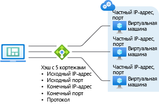
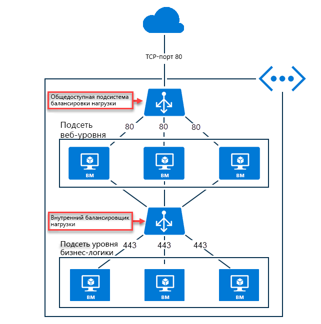

# Что такое Azure Load Balancer

*Балансировка нагрузки* обозначает процесс эффективного распределения нагрузки или входящего сетевого трафика в группе серверных ресурсов или серверов. Azure предоставляет [несколько технологий балансировки нагрузки](https://docs.microsoft.com/azure/architecture/guide/technology-choices/load-balancing-overview), из которых вы можете выбрать наиболее подходящую для конкретных задач. В этом документе описывается Azure Load Balancer.

Служба Azure Load Balancer работает на уровне 4 модели OSI (Open Systems Interconnection). Она служит единственной точкой взаимодействия с клиентами. Load Balancer распределяет новые входящие потоки, поступающие на внешний интерфейс подсистемы балансировки нагрузки, в экземпляры серверных пулов в соответствии с указанными правилами балансировки нагрузки и проб работоспособности. В серверный пул могут входить виртуальные машины Azure или экземпляры масштабируемого набора виртуальных машин. 

C помощью Azure Load Balancer можно масштабировать приложения и создавать службы с высоким уровнем доступности. Load Balancer поддерживает как входящий, так и исходящий трафик, обеспечивает низкую задержку и высокую пропускную способность, а также увеличение масштаба до миллионов потоков для всех приложений, которые используют протоколы TCP и UDP.

**[Общедоступная подсистема балансировки нагрузки](#publicloadbalancer)** может предоставить исходящие подключения для виртуальных машин в рамках виртуальной сети путем преобразования их частных IP-адресов в общедоступные IP-адреса. Общедоступные подсистемы балансировки нагрузки используются для балансировки трафика, направленного из Интернета к виртуальным машинам.

**[Внутреннюю (частную) подсистему балансировки нагрузки](#internalloadbalancer)** можно использовать в тех сценариях, когда для интерфейсной части могут использоваться только частные IP-адреса. Внутренние подсистемы балансировки нагрузки используются для балансировки трафика внутри виртуальной сети. Кроме того, можно подключиться к внешнему интерфейсу Load Balancer из локальной сети в гибридном сценарии.

## Компоненты Load Balancer
* **Конфигурации IP для интерфейса**. IP-адрес экземпляра Load Balancer. Это точка взаимодействия с клиентами. В этой роли может использоваться частный или общедоступный IP-адрес, что соответствует внутренней или общедоступной подсистеме балансировки нагрузки.
* **Серверный пул**. Группа виртуальных машин или экземпляров в масштабируемом наборе виртуальных машин, которые будут обрабатывать входящие запросы. Для экономичного масштабирования до больших объемов входящего трафика обычно рекомендуется добавить дополнительные экземпляры в серверный пул. Load Balancer мгновенно изменяет свою конфигурацию при масштабировании числа экземпляров. Добавление или удаление виртуальных машин из серверного пула перенастраивает подсистему балансировки нагрузки без дополнительных операций в ресурсе подсистемы балансировки нагрузки.
* **Пробы работоспособности**. Пробы работоспособности помогают определить работоспособность экземпляров в серверном пуле. Вы можете настроить для проб работоспособности пороговое значение состояния неработоспособности. Если проверка не отвечает, балансировщик нагрузки Azure прекращает отправлять новое подключение неработоспособным экземплярам. Сбой пробы не влияет на существующие подключения. Подключение будет продолжаться до тех пор, пока приложение не завершит поток, не истечет время ожидания простоя или виртуальная машина не завершит работу. Load Balancer предоставляет разные типы проверки работоспособности для конечных точек TCP, HTTP и HTTPS. Дополнительные сведения см. в разделе [Типы проб](load-balancer-custom-probe-overview.md#types).
* **Правила балансировки нагрузки**. Правила балансировки нагрузки позволяют определять, что и когда нужно делать подсистеме балансировки нагрузки. 
* **Правила преобразования сетевых адресов для входящего трафика**. Правило NAT для входящего трафика перенаправляет трафик с определенного порта определенного IP-адреса внешнего интерфейса на определенный порт определенного экземпляра серверной части в виртуальной сети. К перенаправлению портов применяется такое же распределение на основе хэша, что и для балансировки нагрузки. Распространенными сценариями этой возможности являются сеансы протокола удаленного рабочего стола или Secure Shell для отдельных экземпляров виртуальной машины в виртуальной сети Azure. Несколько внутренних конечных точек можно сопоставить с портами в том же IP-адресе внешнего интерфейса. Внешние IP-адреса можно использовать для удаленного администрирования виртуальных машин без дополнительных переходов.
* **Правила для исходящего трафика**. Правило для исходящего трафика позвоялет настроить NAT для отображения в интерфейсе всех виртуальных машин или экземпляров, которые входят в серверный пул.

## Основные понятия подсистемы балансировки нагрузки

Load Balancer предоставляет следующие основные возможности для приложений TCP и UDP:

* **Алгоритм балансировки нагрузки**. С помощью Azure Load Balancer можно создать правило балансировки нагрузки, чтобы распределять входящий трафик внешнего интерфейса между экземплярами внутреннего пула. Load Balancer использует алгоритм на основе хэша для распределения входящих потоков и соответствующим образом перезаписывает заголовки потоков экземпляров внутреннего пула. Сервер может получать новые потоки, когда в результате проверки работоспособности получается работоспособная серверная конечная точка.
По умолчанию Load Balancer использует хэш с 5 кортежами. Для сопоставления потоков с доступными серверами используется хэш, включающий исходный IP-адрес, порт источника, IP-адрес назначения, порт назначения и номер протокола IP. Используя хэш с 2 или 3 кортежами для данного правила, можно создать сходство с исходным IP-адресом. Все пакеты из одного потока пакетов поступают на один и тот же экземпляр за внешним интерфейсом с балансировкой нагрузки. При инициации клиентом нового потока из того же исходного IP-адреса меняется исходный порт. В результате использование хэша с 5-ю кортежами может привести к тому, что трафик перейдет к другой конечной точке серверной части.
Дополнительные сведения см. в разделе [Настройка режима распределения для Azure Load Balancer](load-balancer-distribution-mode.md). На представленном ниже рисунке показано распределение на основе хэша.

  

  *Рисунок. Распространение на основе хэша*

* **Прозрачность и независимость от приложения** Load Balancer не взаимодействует напрямую с протоколом TCP или UDP или уровнем приложения. Поддерживается любой сценарий приложения TCP или UDP. Load Balancer не завершает или не исправляет потоки, не взаимодействует с полезными данными потока или предоставляет любую функцию шлюза на уровне приложения. Подтверждения протокола всегда происходят непосредственно между клиентом и экземпляром пула серверной части. Ответом на входящий поток всегда является ответ от виртуальной машины. Когда поток поступает в виртуальную машину, исходный IP-адрес источника также сохраняется.
  * На каждый запрос конечной точки поступает ответ только от виртуальной машины. Например, подтверждение TCP всегда возникает между клиентом и выбранной серверной виртуальной машиной. Ответ на запрос к внешнему интерфейсу — это ответ, созданный серверной виртуальной машиной. При успешной проверке связи с внешним интерфейсом вы проверяете сквозное соединение по крайней мере с одной серверной виртуальной машиной.
  * Полезные данные приложения прозрачны для Load Balancer. Поддерживается любое приложение UDP или TCP.
  * Поскольку Load Balancer не взаимодействует с полезными данными TCP и обеспечивают разгрузку TLS, вы можете создавать комплексные зашифрованные сценарии. Использование Load Balancer значительно повышает масштаб для приложений TLS, прерывая подключение TLS на самой виртуальной машине. Например, емкости ключей в сеансах TLS ограничиваются только типом и числом виртуальных машин, добавленных в серверный пул.

* **Исходящие подключения (SNAT)** . Все исходящие потоки из частных IP-адресов в виртуальной сети к общедоступным IP-адресам в Интернете можно преобразовать во внешние IP-адреса Load Balancer. Если общедоступный внешний интерфейс привязан к серверной виртуальной машине с помощью правила балансировки нагрузки, Azure преобразует исходящие подключения в общедоступный IP-адрес внешнего интерфейса. Такая конфигурация обеспечивает следующие преимущества.
  * Упрощенное обновление и аварийное восстановление служб, так как внешний интерфейс можно динамически сопоставить с другим экземпляром службы.
  * Упрощение управления списком управления доступом (ACL). ACL, выраженные как IP-адреса внешнего интерфейса, не меняются по мере увеличения или уменьшения масштаба или при повторном развертывании служб. Преобразование исходящих подключений для получения меньшего числа IP-адресов, чем количество компьютеров, может упростить ведение списка надежных получателей.
Дополнительные сведения см. в статье [Исходящие подключения в Azure](load-balancer-outbound-connections.md).
Load Balancer уровня "Стандартный" имеет дополнительные возможности, связанные со SKU, которые не относятся к этим принципам, как описано ниже.

## Сравнение SKU Load Balancer

Load Balancer поддерживает SKU уровня "Базовый" и "Стандартный". Эти SKU различаются по масштабу сценария, возможностям и цене. Любой сценарий, который можно выполнить в рамках Load Balancer уровня "Базовый", также можно создать с помощью Load Balancer уровня "Стандартный". API обоих SKU аналогичны и вызываются через спецификацию SKU. API для поддержки SKU для Load Balancer и общедоступного IP-адреса доступны, начиная с API `2017-08-01`. Оба SKU совместно используют один общий API и структуру.

В зависимости от SKU, полный сценарий конфигурации может несколько отличаться. Документация Load Balancer вызывается, когда статья применима только к определенному SKU. Ознакомьтесь со следующей таблицей, чтобы сравнить сведения и понять различия. Дополнительные сведения см. в статье [Обзор Azure Load Balancer уровня "Стандартный"](load-balancer-standard-overview.md) на портале Azure.

>[!NOTE]
> Корпорация Майкрософт рекомендует использовать Load Balancer (цен. категория "Стандартный").
Изолированные виртуальные машины, наборы доступности и масштабируемые наборы виртуальных машин можно подключить только к одному SKU, но никогда к обоим. При использовании общедоступных IP-адресов номера SKU Load Balancer и IP-адреса должны совпадать. SKU Load Balancer и общедоступные IP-адреса неизменяемы.

[!INCLUDE [comparison table](../../includes/load-balancer-comparison-table.md)]

Дополнительные сведения см. в статье [Ограничения подсистемы балансировки нагрузки Azure](https://aka.ms/lblimits). Для Load Balancer уровня "Стандартный" см. [общие сведения](load-balancer-standard-overview.md), а также [сведения о ценах](https://aka.ms/lbpricing) и [Соглашении об уровне обслуживания](https://aka.ms/lbsla).

## Типы Load Balancer

### Общедоступный Load Balancer

Общедоступный Load Balancer сопоставляет общедоступный IP-адрес и порт входящего трафика с частным IP-адресом и портом виртуальной машины. Трафик ответа от виртуальной машины сопоставляется Load Balancer другим способом. Применяя правила балансировки нагрузки, можно распределять определенные типы трафика между несколькими различными виртуальными машинами или службами. Например, можно распределить нагрузку от трафика веб-запросов на несколько веб-серверов.

>[!NOTE]
>Для каждой группы доступности можно реализовать только одну общедоступную подсистему балансировки нагрузки и одну внутреннюю подсистему балансировки нагрузки.

На следующем рисунке показана конечная точка с балансировкой нагрузки для веб-трафика, которая является общей для трех виртуальных машин на общедоступном TCP-порту 80. Эти три виртуальные машины находятся в наборе балансировки нагрузки.

*Рисунок. Балансировка веб-трафика с помощью общедоступной подсистемы балансировки нагрузки*

Клиенты Интернета отправляют запросы веб-страниц по общедоступному IP адресу веб-приложения, подключенному через порт TCP 80. Azure Load Balancer распределяет запросы между тремя виртуальными машинами в наборе балансировки нагрузки. Дополнительные сведения об алгоритмах Load Balancer см. в статье [об основных понятиях Load Balancer](load-balancer-overview.md##load-balancer-concepts).

Azure Load Balancer распределяет сетевой трафик между несколькими экземплярами виртуальных машин, по умолчанию. Кроме того, можно настроить сходство сеансов. Дополнительные сведения см. в разделе [Настройка режима распределения для Azure Load Balancer](load-balancer-distribution-mode.md).

### Внутренний Load Balancer

Внутренняя подсистема балансировки нагрузки направляет трафик к тем ресурсам, которые находятся внутри виртуальной сети или используют VPN для доступа к инфраструктуре Azure, в отличие от общедоступной Load Balancer. Инфраструктура Azure ограничивает доступ к интерфейсным IP-адресам (с балансировкой нагрузки) виртуальной сети. IP-адреса внешнего интерфейса и виртуальные сети никогда не предоставляются напрямую конечной точке Интернета. Внутренние бизнес-приложения выполняются в Azure и доступны из Azure или из локальных ресурсов.

Внутренняя подсистема балансировки нагрузки реализует следующие типы балансировки нагрузки:

* **В виртуальной сети:** распределение нагрузки между виртуальными машинами в виртуальной сети и набором виртуальных машин, которые находятся в той же виртуальной сети.
* **Для распределенной виртуальной сети:** балансировка нагрузки между локальными компьютерами и набором виртуальных машин, которые находятся в той же виртуальной сети.
* **Для многоуровневых приложений:** балансировка нагрузки для многоуровневых приложений с доступом в Интернет, где серверные уровни не имеют доступа к Интернету. Серверные уровни требуют балансировки нагрузки трафика уровня с выходом в Интернет. См. следующий рисунок.
* **Для бизнес-приложений:** Балансировка нагрузки для бизнес-приложений, размещенных в Azure без дополнительного оборудования или программного обеспечения подсистемы балансировки нагрузки. Сценарий включает в себя локальные серверы в наборе компьютеров, чей трафик балансируется.

*Рисунок. Балансировка многоуровневых приложений с помощью общедоступных и внутренних подсистем балансировки нагрузки*

## Цены

За использование Load Balancer (цен. категория "Стандартный") взимается плата, размер которой зависит от таких факторов:

* Число настроенных правил для балансировки нагрузки и исходящего трафика. Правила NAT для входящего трафика не учитываются в общем количестве правил.
* Объем обработанных входящих и исходящих данных независимо от правил.

Сведения о ценах на Load Balancer уровня "Стандартный" см. раздел [Цены на Load Balancer](https://azure.microsoft.com/pricing/details/load-balancer/).

Load Balancer уровня "Базовый" предоставляется бесплатно.

## Соглашение об уровне обслуживания

Дополнительные сведения для Load Balancer уровня "Стандартный" см. в разделе [Соглашение об уровне обслуживания для Load Balancer](https://aka.ms/lbsla).

## Ограничения

* Load Balancer обеспечивает балансировку нагрузки и перенаправление портов для конкретных протоколов TCP или UDP. Правила балансировки нагрузки и правила NAT для входящего трафика поддерживают TCP и UDP, но не другие протоколы IP, включая ICMP.

  Load Balancer не завершает полезные данные потока UDP или TCP, не отвечает на них и не взаимодействует с ними каким-либо другим способом. Это не прокси-сервер. Успешная проверка подключения к внешнему интерфейсу должна выполняться через сеть с тем же протоколом, который использовался в правилах для балансировки нагрузки или NAT для входящего трафика. Чтобы клиент мог видеть ответ с внешнего сервера, по крайней мере одна из ваших виртуальных машин должна генерировать ответ.

  Если ответ по каналу от внешнего интерфейса Load Balancer не получен, это означает, что виртуальные машины не смогли дать ответ. Взаимодействие с внешним интерфейсом Load Balancer невозможно без ответа виртуальной машины. Этот принцип также применим к исходящим подключениям, в которых SNAT с маскировкой портов поддерживается только для TCP и UDP. Любые другие IP-протоколы, включая ICMP, завершаются ошибкой. Чтобы обойти эту проблему, назначьте общедоступный IP-адрес на уровне экземпляра. Дополнительные сведения см. в статье [Общие сведения о SNAT и PAT](load-balancer-outbound-connections.md#snat).

* Внутренние подсистемы балансировки нагрузки не преобразуют исходящие подключения к внешнему интерфейсу внутреннего Load Balancer, так как оба они находятся в диапазоне частных IP-адресов. Общедоступные подсистемы балансировки нагрузки предоставляют [исходящие подключения](load-balancer-outbound-connections.md) от частных IP-адресов внутри виртуальной сети к общедоступным IP-адресам. Для внутренних подсистем балансировки нагрузки этот подход исключает вероятность возникновения нехватки портов SNAT в рамках уникального диапазона внутренних IP-адресов, в котором не требуется проводить преобразование.

  Побочным эффектом является то, что если исходящий поток из виртуальной машины в серверном пуле направляется к внешнему интерфейсу внутреннего балансировщика нагрузки, в пуле которого она находится, _и_ сопоставляется с собой, и два элемента потока не совпадают. Так как они не совпадают, происходит сбой потока. Поток передается успешно, если в серверном пуле он не сопоставляется с той же виртуальной машиной, которая создала поток к внешнему интерфейсу.

  Когда поток сопоставляется с собой, получается, что исходящий поток передается из виртуальной машины на внешний интерфейс, а соответствующий входящий поток поступает от виртуальной машины к себе. С точки зрения гостевой операционной системы входящие и исходящие части того же потока не совпадают в виртуальной машине. Стек TCP не будет распознавать эти половины одного потока как часть того же потока. Источник и назначение не совпадают. При сопоставлении потока с любой другой виртуальной машиной в серверном пуле половины потока будут соответствовать друг другу, и виртуальная машина сможет реагировать на поток.

  Симптомом этого сценария является периодическое истечение времени ожидания подключения, когда поток возвращается к той же серверной части, из которой он возник. К общим обходным решениям относятся вставка уровня прокси-сервера за внутренней подсистемой балансировки нагрузки и использование правил прямого ответа от сервера (DSR). Дополнительные сведения см. в статье [Несколько внешних интерфейсов для Azure Load Balancer](load-balancer-multivip-overview.md).

  Вы можете объединить внутреннюю систему балансировки нагрузки со сторонним прокси-сервером или использовать внутренний [шлюз приложений](../application-gateway/application-gateway-introduction.md) для сценариев прокси-сервера с протоколами HTTP и HTTPS. Хотя вы можете использовать общедоступный Load Balancer в качестве обходного решения, полученный сценарий подвержен [исчерпанию SNAT](load-balancer-outbound-connections.md#snat). Избегайте этого второго подхода, если не сможете осуществить его тщательно.

* В общем, перенаправление IP-фрагментов не поддерживается в правилах балансировки нагрузки. В правилах балансировки нагрузки не поддерживается фрагментация IP-пакетов UDP и TCP. Для перенаправления существующих IP-фрагментов можно использовать правила балансировки нагрузки портов высокой доступности. Дополнительные сведения см. в разделе [Обзор портов высокой доступности](load-balancer-ha-ports-overview.md).

## Дополнительная информация

Чтобы приступить к работе с подсистемой балансировки нагрузки, создайте ее, создайте виртуальные машины с установленным пользовательским расширением IIS и распределяйте нагрузку веб-приложения между виртуальными машинами, как описано в статье [Краткое руководство. Создание Load Balancer (цен. категория "Стандартный") с помощью Azure CLI для распределения нагрузки между виртуальными машинами](quickstart-load-balancer-standard-public-portal.md).
