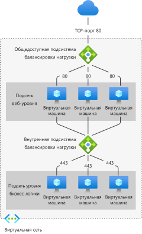

# Что такое Azure Load Balancer?

*Балансировка нагрузки* обозначает процесс равномерного распределения нагрузки (входящего сетевого трафика) в группе серверных ресурсов или серверов. 

Служба Azure Load Balancer работает на уровне 4 модели OSI (Open Systems Interconnection). Она служит единственной точкой взаимодействия с клиентами. Load Balancer распределяет входящие потоки, поступающие на внешний интерфейс подсистемы балансировки нагрузки, в экземпляры серверных пулов. Эти потоки соответствуют настроенным правилам балансировки нагрузки и пробам работоспособности. В серверный пул могут входить Виртуальные машины Azure или экземпляры масштабируемого набора виртуальных машин.

**[Общедоступный Load Balancer](./components.md#frontend-ip-configurations)** обеспечивает исходящие подключения для виртуальных машин в виртуальной сети. Эти подключения выполняются путем преобразования их частных IP-адресов в общедоступные. Общедоступные Load Balancer используются для балансировки трафика, направленного из Интернета к виртуальным машинам.

**[Внутренний (или частный) Load Balancer](./components.md#frontend-ip-configurations)** используется там, где частные IP-адреса необходимы только в интерфейсной части. Внутренние Load Balancer используются для балансировки трафика внутри виртуальной сети. В гибридном сценарии ко внешнему интерфейсу Load Balancer можно подключиться из локальной сети.

  

*Рисунок. Балансировка многоуровневых приложений с помощью общедоступных и внутренних Load Balancer*

Дополнительные сведения об отдельных компонентах Load Balancer см. в статье [Компоненты Azure Load Balancer](./components.md).

## Зачем нужен Azure Load Balancer?
C помощью Load Balancer (цен. категория "Стандартный") можно масштабировать приложения и создавать службы с высоким уровнем доступности. Load Balancer поддерживает сценарии как входящих так и исходящих подключений. Load Balancer обеспечивает низкую задержку и высокую пропускную способность, а также увеличение масштаба до миллионов потоков для всех приложений, которые используют протоколы TCP и UDP.

Ниже перечислены основные сценарии, которые можно выполнить с помощью подсистемы Load Balancer (цен. категория "Стандартный").

- Балансировка нагрузки **[внутреннего](https://docs.microsoft.com/azure/load-balancer/tutorial-load-balancer-standard-internal-portal)** и **[внешнего](https://docs.microsoft.com/azure/load-balancer/tutorial-load-balancer-standard-manage-portal)** трафика на виртуальных машинах Azure.

- Повышение доступности за счет распределения ресурсов **[в пределах зон](https://docs.microsoft.com/azure/load-balancer/tutorial-load-balancer-standard-public-zonal-portal)** и **[между](https://docs.microsoft.com/azure/load-balancer/tutorial-load-balancer-standard-public-zone-redundant-portal)** ними.

- Настройка **[исходящего подключения](https://docs.microsoft.com/azure/load-balancer/load-balancer-outbound-connections)** для виртуальных машин Azure.

- Использование **[проб работоспособности](https://docs.microsoft.com/azure/load-balancer/load-balancer-custom-probe-overview)** для мониторинга ресурсов с балансировкой нагрузки.

- Использование **[перенаправления портов](https://docs.microsoft.com/azure/load-balancer/tutorial-load-balancer-port-forwarding-portal)** , чтобы получить доступ к виртуальным машинам в виртуальной сети по общедоступному IP-адресу и порту.

- Включение поддержки **[балансировки нагрузки](https://docs.microsoft.com/azure/virtual-network/virtual-network-ipv4-ipv6-dual-stack-standard-load-balancer-powershell)** **[IPv6](https://docs.microsoft.com/azure/virtual-network/ipv6-overview)** .

- Load Balancer уровня "Стандартный" предоставляет многомерные метрики через [Azure Monitor](https://docs.microsoft.com/azure/azure-monitor/overview).  Эти метрики можно отфильтровать, сгруппировать и разбить по предоставленным измерениям.  Они предоставляют текущие и исторические сведения о производительности и работоспособности службы.  Также поддерживается служба "Работоспособность ресурсов". Дополнительные сведения см. **[Диагностика Load Balancer (цен. категория "Стандартный") с помощью метрик, оповещений и сведений о работоспособности ресурсов](load-balancer-standard-diagnostics.md)** .

- Службы балансировки нагрузки на **[нескольких портах, нескольких IP-адресах или обоих](https://docs.microsoft.com/azure/load-balancer/load-balancer-multivip-overview)** .

- Перемещение **[внутренних](https://docs.microsoft.com/azure/load-balancer/move-across-regions-internal-load-balancer-portal)** и **[внешних](https://docs.microsoft.com/azure/load-balancer/move-across-regions-external-load-balancer-portal)** ресурсов Load Balancer в регионах Azure.

- Балансировка нагрузки потоков TCP и UDP на всех портах одновременно с использованием **[Портов высокой доступности](https://docs.microsoft.com/azure/load-balancer/load-balancer-ha-ports-overview)** .

### Обеспечение безопасности по умолчанию

Load Balancer (цен. категория "Стандартный") построен на основе модели безопасности сети с нулевым доверием. Load Balancer (цен. категория "Стандартный") защищен по умолчанию и является частью вашей виртуальной сети. Это виртуальная сеть является частной и изолированной сетью.  Это означает, что Load Balancer (цен. категории "Стандартный") и стандартные общедоступные IP-адреса будут закрыты для входящих потоков, если их не открыть с помощью групп безопасности сети. Группы безопасности сети используются для явного разрешения допустимого трафика.  Если у вас нет NSG в подсети или сетевого интерфейса ресурса виртуальной машины, трафик не может достичь этого ресурса. Дополнительные сведения о группах безопасности сети и способах их применения в вашем сценарии см. в статье [Фильтрация сетевого трафика с помощью групп безопасности сети](../virtual-network/security-overview.md).
В Load Balancer (цен. категория "Базовый") по умолчанию открыт доступ к Интернету.

## Цены и соглашение об уровне обслуживания

Сведения о ценах на Load Balancer уровня "Стандартный" см. раздел [Цены на Load Balancer](https://azure.microsoft.com/pricing/details/load-balancer/).
Load Balancer уровня "Базовый" предоставляется бесплатно.
См. [Соглашение об уровне обслуживания для Load Balancer](https://aka.ms/lbsla). Load Balancer уровня "Базовый" не имеет Соглашения об уровне обслуживания (SLA).

## Дальнейшие действия
См. сведения об [обновлении Load Balancer ценовой категории "Базовый" до ценовой категории "Стандартный"](upgrade-basic-standard.md).

Чтобы приступить к работе с Load Balancer, см. [Create a public Standard Load Balancer](quickstart-load-balancer-standard-public-portal.md) (Создание общедоступного Load Balancer (цен. категория "Стандартный")).

Дополнительные сведения об ограничениях и компонентах Azure Load Balancer см. в статьях [Компоненты Azure Load Balancer](./components.md) и [Концепции Azure Load Balancer](./concepts.md).

Сравнение параметров балансировки нагрузки Azure см. в статье [Общие сведения о параметрах балансировки нагрузки в Azure](https://docs.microsoft.com/azure/architecture/guide/technology-choices/load-balancing-overview).
