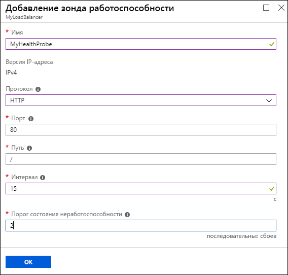
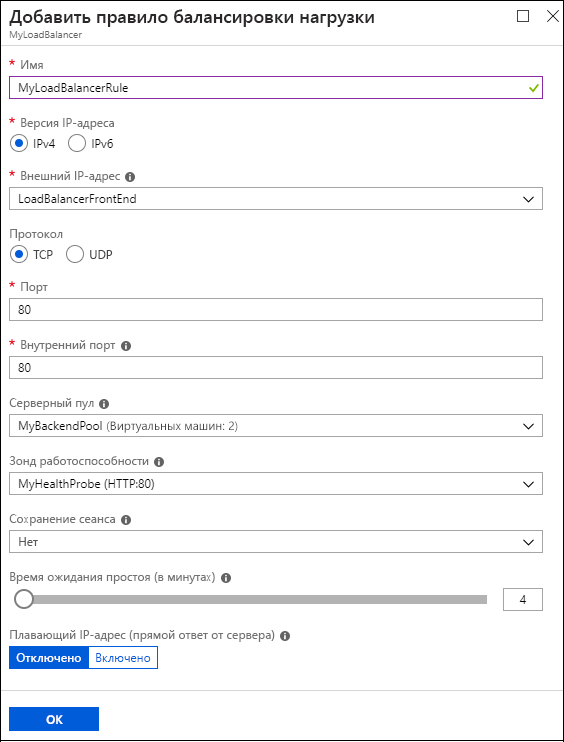

# Краткое руководство. Создание Load Balancer категории "Базовый" на портале Azure

Балансировка нагрузки обеспечивает более высокий уровень доступности и масштабирования за счет распределения входящих запросов между виртуальными машинами. Вы можете использовать портал Azure для создания подсистемы балансировки нагрузки и балансировки трафика между виртуальными машинами. В этом кратком руководстве показано, как создать и настроить подсистему балансировки нагрузки, внутренние серверы и сетевые ресурсы уровня "Базовый".

Если у вас еще нет подписки Azure, [создайте бесплатную учетную запись Azure](https://azure.microsoft.com/free/?WT.mc_id=A261C142F), прежде чем начинать работу. 

Для выполнения задач в этом кратком руководстве войдите на [портал Azure](https://portal.azure.com).

## Создание подсистемы балансировки нагрузки уровня "Базовый"

Сначала создайте Load Balancer категории "Базовый" с помощью портала. Имя и общедоступный IP-адрес, созданный вами, автоматически настроен в качестве внешнего интерфейса подсистемы балансировки нагрузки.

1. В верхней левой части экрана выберите **Создать ресурс** > **Сети** > **Балансировщик нагрузки**.
2. На вкладке **Основные сведения** страницы **Создание подсистемы балансировки нагрузки** введите или выберите следующие сведения, примите значения по умолчанию для остальных параметров и нажмите кнопку **Review + create** (Проверить и создать).

    | Параметр                 | Значение                                              |
    | ---                     | ---                                                |
    | Подписка               | Выберите свою подписку.    |    
    | Группа ресурсов         | Выберите **Создать** и введите *MyResourceGroupLB* в текстовом поле.|
    | ИМЯ                   | *myLoadBalancer*                                   |
    | Регион         | Выберите **Западная Европа**.                                        |
    | type          | Щелкните **Общедоступный**.                                        |
    | SKU           | Выберите **Базовый**.                          |
    | Общедоступный IP-адрес | Выберите **Создать**. |
    | Имя общедоступного IP-адреса              | *MyPublicIP*   |
    | Назначение| Статическое|

3. На вкладке **Отзыв и создание** щелкните **Создать**.   

## Создание внутренних серверов

Далее создайте виртуальную сеть и две виртуальные машины для серверного пула подсистемы балансировки нагрузки уровня "Базовый". 

### Создать виртуальную сеть

1. Вверху с левой стороны портала выберите **Создать ресурс** > **Сети** > **Виртуальная сеть**.
   
1. На панели **Создание виртуальной сети** введите или выберите следующие значения:
   
   - **Имя**. Введите *MyVNet*.
   - **Группа ресурсов**: В раскрывающемся списке **	Выбрать существующую** выберите **MyResourceGroupLB**. 
   - **Подсеть** > **Имя**. Введите *myBackendSubnet*.
   
1. Нажмите кнопку **Создать**.

   

### Создание виртуальных машин

1. В верхней левой части портала выберите **Создать ресурс** > **Вычисления** > **Windows Server 2016 Datacenter**. 
   
1. В разделе **Создание виртуальной машины** введите или выберите следующие значения на вкладке **Основные сведения**:
   - **Подписка** > **Группа ресурсов**. В раскрывающемся списке выберите **MyResourceGroupLB**.
   - **Сведения об экземпляре** > **Имя виртуальной машины**. Введите *MyVM1*.
   - **Сведения об экземпляре** > **Параметры доступности**. 
     1. Раскройте список и выберите **Группа доступности**. 
     2. Выберите **Создать новый**, введите *MyAvailabilitySet* и нажмите кнопку **ОК**.
  
1. Выберите вкладку **Сеть** или **Далее: диски**, затем **Далее: сеть**. 
   
   Выберите следующее:
   - **Виртуальная сеть**: **MyVnet**
   - **Подсеть**: **MyBackendSubnet**.
   - **Общедоступный IP-адрес**: **MyVM1-ip**.
   
   Чтобы создать группу безопасности сети (NSG) типа брандмауэра, в разделе **Группа безопасности сети** выберите **Дополнительно**. 
   1. В поле **Настройка группы безопасности сети** выберите **Создать новый**. 
   1. Введите *MyNetworkSecurityGroup* и нажмите кнопку **ОК**. 
   
1. Выберите вкладку **Управление** или **Далее** > **Управление**. В разделе **Мониторинг** задайте **Выкл.** для параметра **Диагностика загрузки**.
   
1. Выберите **Review + create** (Просмотреть и создать).
   
1. Проверьте параметры, а затем нажмите кнопку **Создать**. 

1. Выполните действия, чтобы создать вторую виртуальную машину с именем *MyVM2* с **общедоступным IP-адресом** *MyVM2-ip* и с такими же остальными параметры, как у MyVM1. 

### Создание правил NSG для виртуальных машин

В этом разделе вы создадите правила группы безопасности сети (NSG) для виртуальных машин, чтобы разрешить входящие интернет-подключения (HTTP) и подключения удаленного рабочего стола (RDP).

1. Выберите **Все ресурсы** в меню слева. В списке ресурсов выберите **MyNetworkSecurityGroup** в группе ресурсов **MyResourceGroupLB**.
   
1. В разделе **Параметры** выберите **Правила безопасности для входящего трафика**, а затем щелкните **Добавить**.
   
1. В диалоговом окне **Добавление правила безопасности для входящего трафика** для правила HTTP введите или выберите следующее:
   
   - **Источник**. Выберите **Service Tag** (Тег службы).  
   - **Тег службы источника**. Выберите **Интернет**. 
   - **Диапазоны портов назначения**. Введите *80*.
   - **Протокол**. Выберите **TCP**. 
   - **Действие**. Выберите **Разрешить**.  
   - **Приоритет**. Введите *100*. 
   - **Имя**. Введите *MyHTTPRule*. 
   - **Описание** Введите *Разрешить HTTP*. 
   
1. Выберите **Добавить**. 
   
   
   
1. Повторите шаги для входящего правила протокола удаленного рабочего стола со следующими другими значениями.
   - **Диапазоны портов назначения**. Введите *3389*.
   - **Приоритет**. Введите *200*. 
   - **Имя**. Введите *MyRDPRule*. 
   - **Описание** Введите *Разрешить RDP*. 

## Создание ресурсов подсистемы балансировки нагрузки

В этом разделе описано, как настроить параметры подсистемы балансировки нагрузки для серверного пула адресов, пробы работоспособности, а также правила подсистемы балансировки нагрузки.

### Создание внутреннего пула адресов

Для распределения трафика между виртуальными машинами подсистема балансировки нагрузки использует серверный пул адресов. Серверный пул адресов содержит IP-адреса виртуальных сетевых интерфейсов (сетевых карт), подключенных к подсистеме балансировки нагрузки. 

**Создание серверного пула адресов, включающего VM1 и VM2:**

1. Щелкните **Все ресурсы** в меню слева, а затем из списка ресурсов выберите **MyLoadBalancer**.
   
1. В разделе **Параметры** выберите **Серверные пулы**, а затем щелкните **Добавить**.
   
1. На странице **Добавление серверного пула** введите или выберите следующие значения:
   
   - **Имя**. Введите *MyBackendPool*.
   - **Сопоставлено с**. Раскройте список и выберите **Группа доступности**.
   - **Группа доступности**. Выберите **MyAvailabilitySet**.
   
1. Выберите **Add a target network IP configuration** (Добавить целевую IP-конфигурацию сети). 
   1. Добавьте в серверный пул каждую созданную виртуальную машину (**MyVM1** и **MyVM2**).
   2. После добавления каждого компьютера раскройте список и выберите его **сетевую IP-конфигурацию**. 
   
1. Нажмите кнопку **ОК**.
   
   
   
1. На странице **Серверные пулы** разверните узел **MyBackendPool** и убедитесь, что там перечислены обе виртуальные машины (**VM1** и **VM2**).

### Создание пробы работоспособности

Чтобы подсистема балансировки нагрузки могла отслеживать состояние виртуальной машины, необходимо настроить пробу работоспособности. Проба работоспособности динамически добавляет или удаляет виртуальные машины из балансировщика нагрузки на основе их ответа на проверки работоспособности. 

**Создание пробы работоспособности для отслеживания работоспособности виртуальных машин:**

1. Щелкните **Все ресурсы** в меню слева, а затем из списка ресурсов выберите **MyLoadBalancer**.
   
1. В разделе **Параметры** выберите **Зонды работоспособности**, а затем щелкните **Добавить**.
   
1. На странице **Add a health probe** (Добавление пробы работоспособности) введите или выберите следующие значения:
   
   - **Имя**. Введите *MyHealthProbe*.
   - **Протокол**. В раскрывающемся списке выберите **HTTP**. 
   - **Порт**. Введите *80*. 
   - **Путь**. Примите */* для универсального кода ресурса (URI) по умолчанию. Это значение можно заменить любым другим URI. 
   - **Интервал**. Введите *15*. Интервал — количество секунд между попытками выполнения пробы.
   - **Пороговое значение сбоя**. Введите *2*. Это значение количества последовательных сбоев пробы, которые произойдут, прежде чем виртуальная машина будет считаться неработоспособной.
   
1. Нажмите кнопку **ОК**.
   
   

### Создание правила балансировщика нагрузки

Правило подсистемы балансировки нагрузки определяет режим распределения трафика между виртуальными машинами. Правило определяет интерфейсную конфигурацию IP-адресов для входящего трафика и серверный пул IP-адресов для приема трафика, а также требуемый порт источника и назначения. 

Правило подсистемы балансировки нагрузки с именем **MyLoadBalancerRule** прослушивает порт 80 во внешнем интерфейсе **LoadBalancerFrontEnd**. Это правило перенаправляет трафик к серверному пулу адресов **MyBackendPool** (также на порт 80). 

**Создание правила подсистемы балансировки нагрузки:**

1. Щелкните **Все ресурсы** в меню слева, а затем из списка ресурсов выберите **MyLoadBalancer**.
   
1. В разделе **Параметры** выберите **Правила балансировки нагрузки**, а затем щелкните **Добавить**.
   
1. На странице **Добавить правило балансировки нагрузки** введите или выберите следующие значения:
   
   - **Имя**. Введите *MyLoadBalancerRule*.
   - **Внешний IP-адрес**. Введите *LoadBalancerFrontend*.
   - **Протокол**. Выберите **TCP**.
   - **Порт**. Введите *80*.
   - **Серверный порт**. Введите *80*.
   - **Серверный пул**. Выберите **MyBackendPool**.
   - **Зонд работоспособности**. Выберите **MyHealthProbe**. 
   
1. Нажмите кнопку **ОК**.
   
   

## Тестирование подсистемы балансировки нагрузки

Общедоступный IP-адрес будет использоваться для тестирования подсистемы балансировки нагрузки на виртуальных машинах. 

На портале на странице **Обзор** в разделе **Общедоступный IP-адрес** найдите общедоступный IP-адрес **MyLoadBalancer**. Наведите указатель на адрес и выберите значок **Копировать**, чтобы скопировать его. 

### Установка служб IIS на виртуальные машины

Установите службы IIS на виртуальные машины для тестирования подсистемы балансировки нагрузки.

**Чтобы подключиться к виртуальной машине с помощью удаленного рабочего стола (RDP):**

1. На портале в меню слева выберите **Все ресурсы**. В списке ресурсов выберите **MyVM1** в группе ресурсов **MyResourceGroupLB**.
   
1. На странице **Обзор** выберите **Подключиться**, а затем — **Скачать RDP-файл**. 
   
1. Откройте скачанный RDP-файл и выберите **Подключиться**.
   
1. На экране безопасности Windows выберите **More choices** (Дополнительные варианты) и нажмите **Использовать другую учетную запись**. 
   
   Введите имя пользователя и пароль, а затем нажмите кнопку **ОК**.
   
1. Ответьте **Да** для любого запроса сертификата. 
   
   В новом окне откроется рабочий стол виртуальной машины. 
   
**Чтобы установить службы IIS на виртуальную машину:**

1. Если **диспетчер сервера** еще не открыт на рабочем столе сервера, выберите **Средства администрирования Windows** > **Диспетчер сервера**.
   
1. В **диспетчере сервера** выберите **Добавить роли и компоненты**.
   
   
   
1. В **мастере добавления ролей и компонентов**:
   1. На странице **Выбор типа установки** выберите **Установка ролей или компонентов**.
   1. На странице **Выбор целевого сервера** выберите **MyVM1**.
   1. На странице **Выберите роль сервера** щелкните **Веб-сервер (IIS)**. 
   1. Чтобы установить необходимые инструменты, выберите в запросе **Добавить компоненты**. 
   1. Примите значения по умолчанию и выберите **Установить**. 
   1. После окончания установки компонентов нажмите кнопку **Закрыть**. 
   
1. Повторите эти шаги для виртуальной машины **MyVM2**, кроме настройки целевого сервера для **MyVM2**.

### Тестирование подсистемы балансировки нагрузки

Откройте окно браузера и вставьте общедоступный IP-адрес подсистемы балансировки нагрузки в адресную строку. В браузере появится страница веб-сервера IIS по умолчанию.

Чтобы увидеть, как балансировщик нагрузки распределяет трафик между тремя виртуальными машинами, на которых выполняется приложение, принудительно обновите веб-браузер.
## Очистка ресурсов

Чтобы удалить подсистему балансировки нагрузки и все связанные ресурсы, если они больше не нужны, откройте группу ресурсов **MyResourceGroupLB** и выберите **Удалить группу ресурсов**.

## Дальнейшие действия

В этом кратком руководстве вы создали подсистему балансировки нагрузки уровня "Базовый". Вы создали и настроили группу ресурсов, сетевые ресурсы, внутренние серверы, пробу работоспособности и правила для использования с подсистемой балансировки нагрузки. Вы установили службы IIS на виртуальных машинах и использовали их для проверки подсистемы балансировки нагрузки. 

Чтобы узнать больше об Azure Load Balancer, ознакомьтесь с другими руководствами.

> [!div class="nextstepaction"]
> [Руководства по Azure Load Balancer](tutorial-load-balancer-basic-internal-portal.md)
