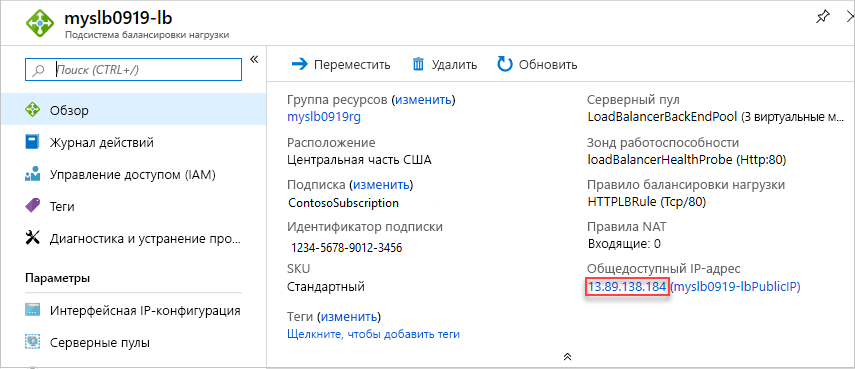

# <a name="quickstart-create-a-standard-load-balancer-to-load-balance-vms-by-using-azure-resource-manager-template"></a>Краткое руководство. Создание Load Balancer (цен. категория "Стандартный") с помощью шаблона Azure Resource Manager для распределения нагрузки между виртуальными машинами

Балансировка нагрузки обеспечивает более высокий уровень доступности и масштабирования за счет распределения входящих запросов между несколькими виртуальными машинами. В этом кратком руководстве показано, как развернуть шаблон Azure Resource Manager, с помощью которого создается Load Balancer (цен. категория "Стандартный") для распределения нагрузки между виртуальными машинами. При использовании шаблона Resource Manager выполняется меньшее количество действий по сравнению с другими методами развертывания.

[Шаблон Resource Manager](../azure-resource-manager/template-deployment-overview.md) является файлом нотации объектов JavaScript (JSON), определяющими инфраструктуру и конфигурацию вашего проекта. Шаблон использует декларативный синтаксис, который позволяет указать объект, который вы собираетесь развернуть. При этом, для развертывания объекта, не нужно писать последовательность команд. Дополнительные сведения о разработке шаблонов Resource Manager см. в разделе [Документация по Azure Resource Manager](/azure/azure-resource-manager/) и в [справочнике по шаблонам](/azure/templates/microsoft.network/loadbalancers).

Если у вас еще нет подписки Azure, [создайте бесплатную учетную запись Azure](https://azure.microsoft.com/free/?WT.mc_id=A261C142F), прежде чем начинать работу.

## <a name="create-a-standard-load-balancer"></a>Создание подсистемы балансировки нагрузки уровня "Стандартный"

Load Balancer (цен. категория "Стандартный") поддерживает только стандартные общедоступные IP-адреса. Вместе с Load Balancer (цен. категория "Стандартный") необходимо также создать стандартный общедоступный IP-адрес, настроенный в качестве интерфейсного для Load Balancer (цен. категория "Стандартный").

В этом кратком руководстве используется [шаблон быстрого запуска](https://raw.githubusercontent.com/Azure/azure-quickstart-templates/master/101-load-balancer-standard-create/azuredeploy.json).

[!code-json[<Azure Resource Manager template create standard load balancer>](~/quickstart-templates/101-load-balancer-standard-create/azuredeploy.json)]

В шаблоне определено несколько ресурсов Azure:

- **Microsoft.Network/loadBalancers**
- **Microsoft.Network/publicIPAddresses**: для подсистемы балансировки нагрузки;
- **Microsoft.Network/networkSecurityGroups**
- **Microsoft.Network/virtualNetworks**
- **Microsoft.Compute/virutalMachines** (3 из них);
- **Microsoft.Network/publicIPAddresses** (3 из них): для каждой из трех виртуальных машин;
- **Microsoft.Network/networkInterfaces** (3 из них);
- **Microsoft.Compute/virtualMachine/extensions** (3 из них): используется для настройки служб IIS и веб-страниц.

Чтобы найти дополнительные связанные шаблоны Azure Load Balancer, перейдите на страницу [Шаблоны быстрого запуска Azure](https://azure.microsoft.com/resources/templates/?resourceType=Microsoft.Network&pageNumber=1&sort=Popular).

1. Выберите **Попробовать** в следующем блоке кода, чтобы открыть Azure Cloud Shell, и следуйте отображающимся инструкциям, чтобы войти в Azure.

   ```azurepowershell-interactive
   $projectName = Read-Host -Prompt "Enter a project name with 12 or less letters or numbers that is used to generate Azure resource names"
   $location = Read-Host -Prompt "Enter the location (i.e. centralus)"
   $adminUserName = Read-Host -Prompt "Enter the virtual machine administrator account name"
   $adminPassword = Read-Host -Prompt "Enter the virtual machine administrator password" -AsSecureString

   $resourceGroupName = "${projectName}rg"
   $templateUri = "https://raw.githubusercontent.com/Azure/azure-quickstart-templates/master/101-load-balancer-standard-create/azuredeploy.json"

   New-AzResourceGroup -Name $resourceGroupName -Location $location
   New-AzResourceGroupDeployment -ResourceGroupName $resourceGroupName -TemplateUri $templateUri -projectName $projectName -location $location -adminUsername $adminUsername -adminPassword $adminPassword

   Write-Host "Press [ENTER] to continue."
   ```

   Подождите, пока появится запрос из консоли.

1. Выберите **Копировать** из предыдущего блока кода, чтобы скопировать сценарий PowerShell.

1. Щелкните правой кнопкой в области консоли оболочки и выберите **Вставить**.

1. Введите значения.

   При развертывании шаблона создается три зоны доступности. Зоны доступности поддерживаются только в [определенных регионах](../availability-zones/az-overview.md). Используйте один из поддерживаемых регионов. Если у вас есть сомнения, введите **centralus**.

   Имя группы ресурсов — это имя проекта с добавлением **rg**. Имя группы ресурсов потребуется в следующем разделе.

Развертывание шаблона занимает около 10 минут. По завершении выходные данные должны быть следующего вида:


Для развертывания шаблона используется Azure PowerShell. В дополнение к Azure PowerShell можно также использовать портал Azure, Azure CLI и REST API. Дополнительные сведения о других методах развертывания см. в статье о [развертывании с использованием шаблонов](../azure-resource-manager/resource-group-template-deploy-portal.md).

## <a name="test-the-load-balancer"></a>Тестирование подсистемы балансировки нагрузки

1. Войдите на [портале Azure](https://portal.azure.com).

1. В области слева выберите **Группы ресурсов**.

1. Выберите группу ресурсов, созданную при работе с предыдущим разделом. Имя группы ресурсов по умолчанию — это имя проекта с добавлением **rg**.

1. Выберите подсистему балансировки нагрузки. Имя по умолчанию — это имя проекта с добавлением **-lb**.

1. Скопируйте только часть общедоступного IP-адреса и вставьте его в адресную строку браузера.

   

    В браузере отобразится страница по умолчанию веб-сервера службы IIS.

   

Чтобы увидеть, как Load Balancer распределяет трафик между тремя виртуальными машинами, можно принудительно обновить веб-браузер на клиентском компьютере.

## <a name="clean-up-resources"></a>Очистка ресурсов

Ставшие ненужными группу ресурсов, подсистему балансировки нагрузки и все связанные ресурсы можно удалить. Для этого на портале Azure выберите группу ресурсов, содержащую Load Balancer, и щелкните **Удалить группу ресурсов**.

## <a name="next-steps"></a>Дополнительная информация

Из этого краткого руководства вы узнали, как создать систему Load Balancer (цен. категория "Стандартный"), подключить к ней виртуальные машины, настроить правило трафика Load Balancer, выполнить пробу работоспособности, а также протестировать Load Balancer.

Чтобы узнать больше об Azure Load Balancer, ознакомьтесь с соответствующими учебниками.

> [!div class="nextstepaction"]
> [Руководства по Azure Load Balancer](tutorial-load-balancer-standard-public-zone-redundant-portal.md)
