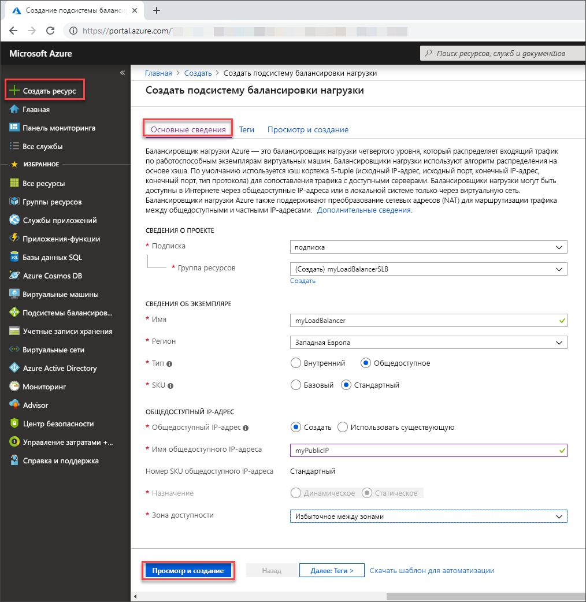

# <a name="tutorial-load-balance-internet-traffic-to-vms-using-the-azure-portal"></a>Руководство. Балансировка интернет-трафика на виртуальных машинах с помощью портала Azure

Балансировка нагрузки обеспечивает более высокий уровень доступности и масштабирования за счет распределения входящих запросов между несколькими виртуальными машинами. Из этого руководства вы узнаете о различных компонентах Azure Load Balancer ценовой категории "Стандартный", которые распределяют интернет-трафик на виртуальных машинах и обеспечивают высокий уровень доступности. Вы узнаете, как выполнять следующие задачи:


> [!div class="checklist"]
> * создание Azure Load Balancer;
> * создание ресурсов Load Balancer;
> * создание виртуальных машин и установка сервера IIS;
> * наблюдение за работой Load Balancer;
> * добавление и удаление виртуальных машин из Load Balancer.

Если у вас еще нет подписки Azure, [создайте бесплатную учетную запись Azure](https://azure.microsoft.com/free/?WT.mc_id=A261C142F), прежде чем начинать работу. 

## <a name="sign-in-to-the-azure-portal"></a>Вход на портал Azure

Войдите на портал Azure по адресу [https://portal.azure.com](https://portal.azure.com).

## <a name="create-a-standard-load-balancer"></a>Создание подсистемы балансировки нагрузки уровня "Стандартный"

В этом разделе вы создадите службу Load Balancer (цен. категория "Стандартный"), помогающую распределять нагрузку виртуальных машин. Подсистема балансировки нагрузки уровня "Стандартный" поддерживает только стандартные общедоступные IP-адреса. Вместе с подсистемой балансировки нагрузки категории "Стандартный" необходимо также создать новый стандартный общедоступный IP-адрес, настроенный в качестве интерфейсного (с именем *LoadBalancerFrontend* по умолчанию). 

1. В верхней левой части экрана выберите **Создать ресурс** > **Сети** > **Балансировщик нагрузки**.
2. На вкладке **Основные сведения** страницы **Создание подсистемы балансировки нагрузки** введите или выберите следующие сведения, примите значения по умолчанию для остальных параметров и нажмите кнопку **Review + create** (Проверить и создать).

    | Параметр                 | Значение                                              |
    | ---                     | ---                                                |
    | Подписка               | Выберите свою подписку.    |    
    | Группа ресурсов         | Выберите **Создать** и в текстовом поле введите *myResourceGroupSLB*.|
    | ИМЯ                   | *myLoadBalancer*                                   |
    | Регион         | Выберите **Западная Европа**.                                        |
    | type          | Щелкните **Общедоступный**.                                        |
    | SKU           | Выберите **Стандартная**.                          |
    | Общедоступный IP-адрес | Выберите **Создать**. |
    | Имя общедоступного IP-адреса              | Введите *myPublicIP* в текстовом поле.   |
    |Зона доступности| Выберите **Zone redundant** (Избыточно в пределах зоны).    |

3. На вкладке **Просмотр и создание** щелкните **Создать**.

   

## <a name="create-load-balancer-resources"></a>Создание ресурсов Load Balancer

В этом разделе описано, как настроить параметры Load Balancer для внутреннего пула адресов и пробы работоспособности, а также как указать правила балансировки нагрузки.

### <a name="create-a-backend-address-pool"></a>Создание внутреннего пула адресов

Для распределения трафика между виртуальными машинами внутренний пул адресов содержит IP-адреса виртуальных сетевых карт, подключенных к Load Balancer. Создайте внутренний пул адресов *myBackendPool*, чтобы включить виртуальные машины для балансировки нагрузки интернет-трафика.

1. В меню слева щелкните **Все службы**, выберите **Все ресурсы**, а затем из списка ресурсов выберите **myLoadBalancer**.
2. В разделе **Параметры** выберите **Серверные пулы** и нажмите кнопку **Добавить**.
3. На странице **Добавление серверного пула** введите имя *myBackEndPool* для серверного пула и выберите **Добавить**.

### <a name="create-a-health-probe"></a>Создание пробы работоспособности

Чтобы Load Balancer мог следить за состоянием приложения, необходимо использовать пробу работоспособности. Проба работоспособности динамически добавляет или удаляет виртуальные машины из Load Balancer на основе их ответа на проверки работоспособности. Создайте зонд работоспособности *myHealthProbe*, чтобы отслеживать работоспособность виртуальных машин.

1. В меню слева щелкните **Все службы**, выберите **Все ресурсы**, а затем из списка ресурсов выберите **myLoadBalancer**.
2. В разделе **Параметры** щелкните **Зонды работоспособности** и нажмите кнопку **Добавить**.
3. Для создания зонда работоспособности используйте следующие значения:
     
    | Параметр | Значение |
    | ------- | ----- |
    | ИМЯ | Введите *myHealthProbe*. |
    | Протокол | Выберите **HTTP**. |
    | Порт | Введите *80*.|
    | Интервал | В качестве **интервала** между попытками выполнения пробы (в секундах) введите *15*. |
    | Пороговое значение сбоя | Выберите *2* в качестве значения **порога неработоспособности** или количества последовательных сбоев пробы, после которых виртуальная машина будет считаться неработоспособной.|
    | Проверка работоспособности | Выберите *myHealthProbe*. |
    
4. Нажмите кнопку **ОК**.

### <a name="create-a-load-balancer-rule"></a>Создание правила подсистемы балансировки нагрузки

Правило подсистемы балансировки нагрузки позволяет определить распределение трафика между виртуальными машинами. Вы определяете конфигурацию внешнего IP-адреса для входящего трафика и пул внутренних IP-адресов для приема трафика, а также требуемый порт источника и назначения. Создайте правило Load Balancer *myLoadBalancerRuleWeb* для прослушивания порта 80 в интерфейсном сервере *FrontendLoadBalancer* и отправки сетевого трафика со сбалансированной нагрузкой во внутренний пул адресов *myBackEndPool*, также используя порт 80.

1. В меню слева щелкните **Все службы**, выберите **Все ресурсы**, а затем из списка ресурсов выберите **myLoadBalancer**.
2. В разделе **Параметры** выберите **Правила балансировки нагрузки**, а затем щелкните **Добавить**.
3. Для настройки правила балансировки нагрузки используйте следующие значения.

    | Параметр | Значение |
    | ------- | ----- |
    | ИМЯ | Введите *myHTTPRule*. |
    | Протокол | Выберите **TCP**. |
    | Порт | Введите *80*.|
    | Серверный порт | Введите *80*. |
    | Серверный пул | Выберите *myBackendPool*.|
    | Проверка работоспособности | Выберите *myHealthProbe*. |
    
4. Сохраните остальные значения по умолчанию и нажмите кнопку **ОК**.

## <a name="create-backend-servers"></a>Создание внутренних серверов

В этом разделе описано, как создать виртуальную сеть, три виртуальные машины для внутреннего пула Load Balancer и установить службы IIS на виртуальных машинах для проверки Load Balancer.

### <a name="create-a-virtual-network"></a>Создать виртуальную сеть

1. Вверху с левой стороны экрана последовательно выберите **Создать ресурс** > **Сети** > **Виртуальная сеть**.
2. В подменю **Создать виртуальную сеть** введите или выберите следующую информацию:

    | Параметр | Значение |
    | ------- | ----- |
    | ИМЯ | Введите *myVNet*. |
    | Пространство адресов | Введите *10.1.0.0/16*. |
    | Подписка | Выберите свою подписку.|
    | Группа ресурсов | Выберите существующий ресурс *myResourceGroupSLB*. |
    | Расположение | Выберите **Западная Европа**.|
    | Имя подсети | Введите *myBackendSubnet*. |
    | Диапазон адреса подсети | Введите *10.1.0.0/24*. |
    
3. Сохраните остальные значения по умолчанию и нажмите кнопку **Создать**.

### <a name="create-virtual-machines"></a>Создание виртуальных машин

Load Balancer (цен. категория "Стандартный") поддерживает только виртуальные машины со стандартными IP-адресами во внутреннем пуле адресов. В этом разделе вы создадите три виртуальные машины (*myVM1*, *myVM2* и *myVM3*) со стандартным общедоступным IP-адресом в трех различных зонах (*зона 1*, *зона 2* и *зона 3*), которые добавляются в созданный ранее внутренний пул Load Balancer (цен. категория "Стандартный").

1. В верхней левой части портала выберите **Создать ресурс** > **Вычисления** > **Windows Server 2016 Datacenter**. 
   
1. В разделе **Создание виртуальной машины** введите или выберите следующие значения на вкладке **Основные сведения**:
   - **Подписка** > **Группа ресурсов**. Выберите **myResourceGroupSLB**.
   - **Сведения об экземпляре** > **Имя виртуальной машины**. Введите *myVM1*.
   - **Сведения об экземпляре** > **Регион**, затем выберите **Западная Европа**.
   - **Сведения об экземпляре** > **Параметры доступности**, затем выберите **Зоны доступности**. 
   - **Сведения об экземпляре** > **Зона доступности**, затем выберите **1**.
  
1. Выберите вкладку **Сеть** или **Далее: диски**, затем **Далее: сеть**. 
   
   - Выберите следующее:
       - **Виртуальная сеть**: **myVnet**.
       - **Подсеть**: **myBackendSubnet**.
       - Выберите **Общедоступный IP-адрес**, затем — **Создать**, в окне **Создать общедоступный IP-адрес** для **SKU** выберите **Стандартный**, а для **Зона доступности** — **Избыточное между зонами**.
      
   - Чтобы создать группу безопасности сети (NSG) типа брандмауэра, в разделе **Группа безопасности сети** выберите **Дополнительно**. 
       1. В поле **Настройка группы безопасности сети** выберите **Создать новый**. 
       1. Введите *myNetworkSecurityGroup* и нажмите кнопку **ОК**.

   - Выполните следующие действия, чтобы сделать виртуальную машину частью внутреннего пула Load Balancer.
        - В разделе **Балансировка нагрузки** для параметра **Настроить эту виртуальную машину для работы с существующим решением по балансировке нагрузки?** выберите **Да**.
        - В разделе **Параметры балансировки нагрузки** для **параметров балансировки нагрузки** выберите **Балансировщик нагрузки Azure**.
        - Для параметра **Выберите подсистему балансировки нагрузки** выберите *myLoadBalancer*. 
1. Выберите вкладку **Управление** или **Далее** > **Управление**. В разделе **Мониторинг** задайте **Выкл.** для параметра **Диагностика загрузки**. 
1. Выберите **Review + create** (Просмотреть и создать).   
1. Проверьте параметры, а затем нажмите кнопку **Создать**.
1. Выполните действия, чтобы создать еще две виртуальные машины (*myVM2* и *myVM3*) с общедоступным IP-адресом с номером SKU (цен. категория "Стандартный") в **зонах доступности** **2** и **3** соответственно, а также всеми остальными параметрами, как и для *myVM1*.  

### <a name="create-network-security-group-rule"></a>Создание правила группы безопасности сети

В этом разделе описано, как создать правило группы безопасности сети, чтобы разрешить входящие подключения по протоколу HTTP.

1. В меню слева щелкните **Все службы**, выберите **Все ресурсы**, а затем в списке ресурсов выберите группу **myNetworkSecurityGroup**, расположенную в группе ресурсов **myResourceGroupSLB**.
2. В разделе **Параметры** щелкните **Правила безопасности для входящего трафика**, а затем — **Добавить**.
3. Введите (выберите) следующие значения для правила безопасности для входящего трафика с именем *myHTTPRule*, чтобы разрешить входящие подключения HTTP через порт 80:
    - *Service Tag* — для **источника**;
    - *Internet* — для **тега службы источника**;
    - *80* — для **диапазонов портов назначения**;
    - *TCP* — для **протокола**;
    - *Разрешить* — для **действия**;
    - *100* — для значения **приоритета**;
    - *myHTTPRule* — для имени;
    - *Разрешить HTTP* — для описания.
4. Выберите **Добавить**.

### <a name="install-iis-on-vms"></a>Установка служб IIS на виртуальные машины

1. В меню слева щелкните **Все службы**, выберите **Все ресурсы**, а затем в списке ресурсов выберите виртуальную машину **myVM1**, расположенную в группе ресурсов *myResourceGroupSLB*.
2. На странице **обзора** щелкните **Подключить**, чтобы подключиться по протоколу RDP к виртуальной машине.
3. Во всплывающем окне **Подключение к виртуальной машине** выберите **Скачать RDP-файл**, а затем откройте скачанный RDP-файл.
4. В окне **Remote Desktop Connection** (Подключение к удаленному рабочему столу) выберите **Подключиться**.
5. Войдите в виртуальную машину, используя учетные данные, указанные во время ее создания. Откроется сеанс удаленного рабочего стола с виртуальной машиной *myVM1*.
6. На рабочем столе сервера перейдите к **Средства администрирования Windows**>**Windows PowerShell**.
7. В окне PowerShell выполните следующие команды, чтобы установить сервер IIS, удалить файл по умолчанию iisstart.htm и добавить новый файл iisstart.htm с именем виртуальной машины:

   ```azurepowershell-interactive
    
    # install IIS server role
    Install-WindowsFeature -name Web-Server -IncludeManagementTools
    
    # remove default htm file
     remove-item  C:\inetpub\wwwroot\iisstart.htm
    
    # Add a new htm file that displays server name
     Add-Content -Path "C:\inetpub\wwwroot\iisstart.htm" -Value $("Hello World from " + $env:computername)
   ```
6. Закройте сеанс RDP для *myVM1*.
7. Повторите шаги 1–6, чтобы установить IIS и добавить обновленный файл iisstart.htm на *myVM2* и *myVM3*.

## <a name="test-the-load-balancer"></a>Тестирование Load Balancer
1. Найдите общедоступный IP-адрес для подсистемы балансировки нагрузки на экране **обзора**. В меню слева щелкните **Все службы**, выберите **Все ресурсы**, а затем — **myPublicIP**.

2. Скопируйте общедоступный IP-адрес и вставьте его в адресную строку браузера. В браузере отобразится страница по умолчанию веб-сервера IIS.

      

Чтобы проверить, как Load Balancer распределяет трафик между тремя виртуальными машинами, на которых выполняется приложение, принудительно обновите страницу в браузере.

## <a name="remove-or-add-vms-from-the-backend-pool"></a>Добавление виртуальных машин в серверный пул и удаление их из него
На виртуальных машинах, выполняющих приложение, может потребоваться выполнить обслуживание, например установить обновления операционной системы. Для обработки большего объема трафика в приложении необходимо добавить дополнительные виртуальные машины. В этом разделе показано, как удалить или добавить виртуальную машину (*myVM1*) в Load Balancer.

### <a name="remove-vm-from-a-backend-pool"></a>Удаление виртуальной машины из внутреннего пула
Выполните следующие действия, чтобы удалить *myVM1* из внутреннего пула.

1. В меню слева щелкните **Все службы**, выберите **Все ресурсы**, а затем из списка ресурсов выберите **myLoadBalancer**.
2. В разделе **Параметры** щелкните **Серверные пулы**, затем в списке серверных пулов выберите **myBackendPool**.
3. На странице **myBackendPool**, чтобы удалить *VM1*, выберите значок "Удалить" в конце строки, в которой отображается *myVM1*, а затем нажмите кнопку **Сохранить**.

Теперь *myVM1* не входит в серверный пул адресов, и вы можете выполнять для *myVM1* любые задачи обслуживания, например установить обновления программного обеспечения. При отсутствии *VM1* вся нагрузка распределяется между *myVM2* и *myVM3*. 

### <a name="add-vm-to-a-backend-pool"></a>Добавление виртуальной машины во внутренний пул
Выполните следующие действия, чтобы вернуть *myVM1* во внутренний пул.

1. В меню слева щелкните **Все службы**, выберите **Все ресурсы**, а затем из списка ресурсов выберите **myVM1**.
2. В разделе **Параметры** страницы **VM1** выберите **Сеть**.
3. На странице **Сеть** щелкните вкладку **Балансировка нагрузки**, а затем выберите **Добавить балансировку нагрузки**.
4. На странице **Добавить балансировку нагрузки** выполните следующие действия.
   1. В списке **Параметры балансировки нагрузки** выберите **Балансировщик нагрузки Azure**.
   2. Для параметра **Выберите подсистему балансировки нагрузки** выберите *myLoadBalancer*.
   3. Для параметра **Выберите серверный пул** выберите *myBackendPool*. 

## <a name="clean-up-resources"></a>Очистка ресурсов

Удалите группу ресурсов, Load Balancer и все связанные с ними ресурсы, когда надобность в них отпадет. Для этого выберите группу ресурсов *myResouceGroupSLB*, содержащую Load Balancer, и щелкните **Удалить**.

## <a name="next-steps"></a>Дополнительная информация

Из этого руководства вы узнали, как создать Load Balancer (цен. категория "Стандартный"), подключить виртуальные машины, настроить правило трафика Load Balancer и пробу работоспособности, а также протестировать Load Balancer. Также здесь показано, как удалить виртуальную машину из набора балансировки нагрузки и добавить ее во внутренний пул адресов. Чтобы узнать больше об Azure Load Balancer, ознакомьтесь с другими руководствами по этой службе.

> [!div class="nextstepaction"]
> [Руководства по Azure Load Balancer](tutorial-load-balancer-standard-public-zone-redundant-portal.md)
