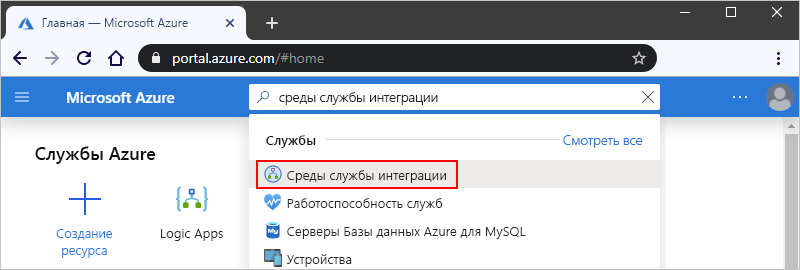
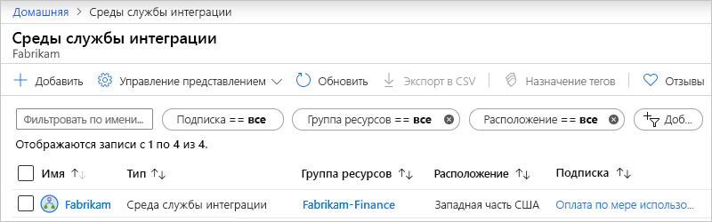

# Управление средой службы интеграции (ISE) в Azure Logic Apps

Чтобы проверить работоспособность сети для [среды службы интеграции (ISE)](../logic-apps/connect-virtual-network-vnet-isolated-environment-overview.md) и управлять приложениями логики, подключениями, учетными записями интеграции и соединителями, которые существуют в интегрированной среде сценариев, выполните действия, описанные в этом разделе. Чтобы добавить эти артефакты в интегрированную среду сценариев, ознакомьтесь с разрешениями [Добавление артефактов к среде службы интеграции](../logic-apps/add-artifacts-integration-service-environment-ise.md).

## Просмотр интегрированной среды сценариев

1. Войдите на [портале Azure](https://portal.azure.com).

1. В поле поиска на портале введите "среды службы интеграции", а затем выберите **среды службы интеграции**.

   

1. В списке результатов выберите среду службы интеграции.

   

1. Перейдите к следующим разделам, чтобы найти приложения логики, подключения, соединители или учетные записи интеграции в интегрированной среде сценариев.

## Проверка работоспособности сети

В меню интегрированной среды сценариев в разделе **Параметры**выберите **работоспособность сети**. В этой области отображаются сведения о состоянии работоспособности для подсетей и исходящих зависимостей от других служб.

## Управление приложениями логики

Вы можете просматривать приложения логики, которые находятся в интегрированной среде сценариев, и управлять ими.

1. В меню интегрированной среды сценариев в разделе **Параметры**выберите пункт **приложения логики**.

   

1. Чтобы удалить приложения логики, которые больше не нужны в интегрированной среде сценариев, выберите эти приложения логики, а затем нажмите кнопку **Удалить**. Чтобы подтвердить удаление, выберите **Да**.

## Управление подключениями API

Вы можете просматривать и управлять подключениями, созданными приложениями логики, работающими в интегрированной среде сценариев.

1. В меню интегрированной среды сценариев в разделе **Параметры**выберите **подключения API**.

   

1. Чтобы удалить подключения, которые больше не нужны в интегрированной среде сценариев, выберите эти подключения и нажмите кнопку **Удалить**. Чтобы подтвердить удаление, выберите **Да**.

## Управление соединителями ISE

Вы можете просматривать соединители API, развернутые в интегрированной среде сценариев, и управлять ими.

1. В меню интегрированной среды сценариев в разделе **Параметры**выберите **управляемые соединители**.

   

1. Чтобы удалить соединители, которые не должны быть доступны в интегрированной среде сценариев, выберите эти соединители и нажмите кнопку **Удалить**. Чтобы подтвердить удаление, выберите **Да**.

## Управление пользовательскими соединителями

Вы можете просматривать настраиваемые соединители, развернутые в интегрированной среде сценариев, и управлять ими.

1. В меню интегрированной среды сценариев в разделе **Параметры**выберите **пользовательские соединители**.

   

1. Чтобы удалить настраиваемые соединители, которые больше не нужны в интегрированной среде сценариев, выберите эти соединители и нажмите кнопку **Удалить**. Чтобы подтвердить удаление, выберите **Да**.

## Управление учетными записями интеграции

1. В меню интегрированной среды сценариев в разделе **Параметры**выберите **учетные записи интеграции**.

   

1. Чтобы удалить учетные записи интеграции из интегрированной среды сценариев, если они больше не нужны, выберите эти учетные записи интеграции и нажмите кнопку **Удалить**.

## Следующие шаги

* Узнайте, как [подключаться к виртуальным сетям Azure из изолированных приложений логики](../logic-apps/connect-virtual-network-vnet-isolated-environment.md).
