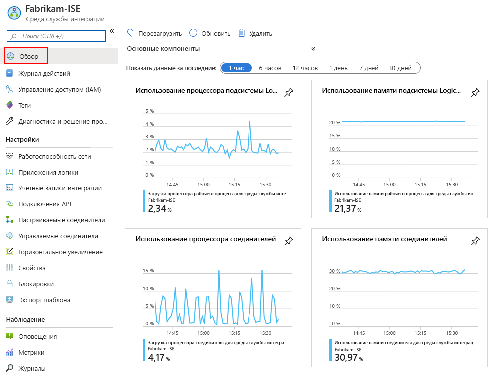
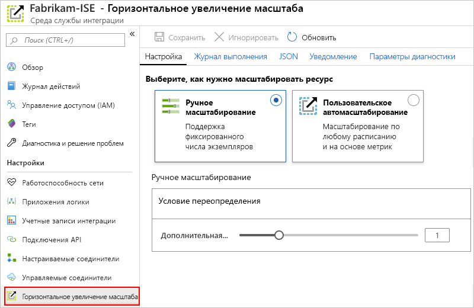
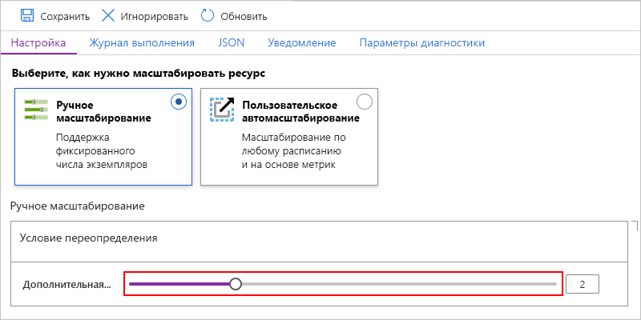
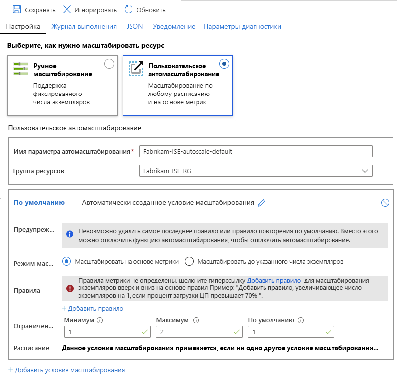

# Управление средой службы интеграции в Azure Logic Apps

В этой статье показано, как выполнять задачи управления для [среды службы интеграции (ISE)](../logic-apps/connect-virtual-network-vnet-isolated-environment-overview.md), например:

* Управляйте ресурсами, такими как приложения логики, подключения, учетные записи интеграции и соединители в интегрированной среде сценариев.

* Проверьте работоспособность сети интегрированной среды сценариев.

* Добавьте емкость, перезапустите интегрированную среду сценариев или удалите интегрированную среду сценариев, выполнив действия, описанные в этом разделе. Чтобы добавить эти артефакты в интегрированную среду сценариев, ознакомьтесь с разрешениями [Добавление артефактов к среде службы интеграции](../logic-apps/add-artifacts-integration-service-environment-ise.md).

## Просмотр интегрированной среды сценариев

1. Войдите на [портал Azure](https://portal.azure.com).

1. В поле поиска на портале введите "среды службы интеграции", а затем выберите **среды службы интеграции** .

   

1. В списке результатов выберите среду службы интеграции.

   

1. Перейдите к следующим разделам, чтобы найти приложения логики, подключения, соединители или учетные записи интеграции в интегрированной среде сценариев.

## Проверка работоспособности сети

В меню интегрированной среды сценариев в разделе **Параметры** выберите **работоспособность сети** . В этой области отображаются сведения о состоянии работоспособности для подсетей и исходящих зависимостей от других служб.

> [!CAUTION]
> Если сеть ISE становится неработоспособной, внутренняя Среда службы приложений (ASE), используемая ИНТЕГРИРОВАНной средой, также может стать неработоспособной. Если ASE находится в неработоспособном состоянии более семи дней, ASE приостанавливается. Чтобы устранить это состояние, проверьте настройку виртуальной сети. Устраните все найденные проблемы и перезапустите интегрированную среду сценариев. В противном случае после 90 дней приостановленный ASE удаляется, и интегрированная среда сценариев становится непригодной для использования. Поэтому убедитесь, что интегрированная среда сценариев работоспособна, чтобы обеспечить необходимый трафик.
> 
> Дополнительные сведения см. в следующих статьях:
>
> * [Общие сведения о диагностике в службе приложений Azure](../app-service/overview-diagnostics.md)
> * [Ведение журнала сообщений для Среда службы приложений Azure](../app-service/environment/using-an-ase.md#logging)

## Управление приложениями логики

Вы можете просматривать приложения логики, которые находятся в интегрированной среде сценариев, и управлять ими.

1. В меню интегрированной среды сценариев в разделе **Параметры** выберите пункт **приложения логики** .

   

1. Чтобы удалить приложения логики, которые больше не нужны в интегрированной среде сценариев, выберите эти приложения логики, а затем нажмите кнопку **Удалить** . Чтобы подтвердить удаление, выберите **Да** .

> [!NOTE]
> При удалении и повторном создании дочернего приложения логики необходимо повторно сохранить родительское приложение логики. Повторно созданное дочернее приложение будет иметь разные метаданные.
> Если вы не пересохраняете родительское приложение логики после повторного создания своего дочернего приложения, вызов дочернего приложения логики завершится ошибкой "несанкционированный". Это поведение относится к приложениям логики родительского и дочернего приложения, например к тем, которые используют артефакты в учетных записях интеграции или вызывают функции Azure.

## Управление подключениями API

Вы можете просматривать и управлять подключениями, созданными приложениями логики, работающими в интегрированной среде сценариев.

1. В меню интегрированной среды сценариев в разделе **Параметры** выберите **подключения API** .

   

1. Чтобы удалить подключения, которые больше не нужны в интегрированной среде сценариев, выберите эти подключения и нажмите кнопку **Удалить** . Чтобы подтвердить удаление, выберите **Да** .

## Управление соединителями ISE

Вы можете просматривать соединители API, развернутые в интегрированной среде сценариев, и управлять ими.

1. В меню интегрированной среды сценариев в разделе **Параметры** выберите **управляемые соединители** .

   

1. Чтобы удалить соединители, которые не должны быть доступны в интегрированной среде сценариев, выберите эти соединители и нажмите кнопку **Удалить** . Чтобы подтвердить удаление, выберите **Да** .

## Управление пользовательскими соединителями

Вы можете просматривать настраиваемые соединители, развернутые в интегрированной среде сценариев, и управлять ими.

1. В меню интегрированной среды сценариев в разделе **Параметры** выберите **пользовательские соединители** .

   

1. Чтобы удалить настраиваемые соединители, которые больше не нужны в интегрированной среде сценариев, выберите эти соединители и нажмите кнопку **Удалить** . Чтобы подтвердить удаление, выберите **Да** .

## Управление учетными записями интеграции

1. В меню интегрированной среды сценариев в разделе **Параметры** выберите **учетные записи интеграции** .

   

1. Чтобы удалить учетные записи интеграции из интегрированной среды сценариев, если они больше не нужны, выберите эти учетные записи интеграции и нажмите кнопку **Удалить** .

## Добавьте емкость ISE.

Базовая единица "Премиум" ИНТЕГРИРОВАНа с фиксированной емкостью, поэтому, если требуется дополнительная пропускная способность, можно добавить дополнительные единицы масштабирования во время создания или позже. SKU для разработчиков не включают в себя возможность добавления единиц масштабирования.

1. В [портал Azure](https://portal.azure.com)перейдите к интегрированной среде сценариев.

1. Чтобы просмотреть метрики использования и производительности интегрированной среды сценариев, в меню интегрированной среды сценариев выберите **Обзор** .

   

1. В разделе **Параметры** выберите **масштабное развертывание** . На панели **Настройка** выберите следующие параметры:

   * [**Масштабирование вручную**](#manual-scale). масштабирование на основе числа единиц обработки, которые вы хотите использовать.
   * [**Настраиваемое Автомасштабирование**](#custom-autoscale): масштабирование на основе метрик производительности путем выбора из различных критериев и указания пороговых условий для удовлетворения этих условий.

   

### Ручное масштабирование

1. Выбрав **параметр масштабировать вручную** , чтобы получить **Дополнительные** сведения о емкости, выберите нужное количество единиц масштабирования.

   

1. Когда все будет готово, нажмите кнопку **Сохранить** .

### Пользовательское автомасштабирование

1. После выбора параметра **Настраиваемый Автомасштабирование** в **поле Имя параметров автомасштабирования** укажите имя для параметра и при необходимости выберите группу ресурсов Azure, в которой он указан.

   

1. Для условия **по умолчанию** выберите **масштабирование на основе метрики** или **масштабирование до определенного числа экземпляров** .

   * Если выбрано значение на основе экземпляра, введите число единиц обработки, которое является значением от 0 до 10.

   * Если выбрано значение на основе метрик, выполните следующие действия.

     1. В разделе **правила** выберите **Добавить правило** .

     1. На панели **правило масштабирования** настройте критерии и действия, которые будут выполняться при срабатывании правила.

     1. Для **пределов экземпляра** укажите следующие значения:

        * **Минимум** : минимальное число единиц обработки, которое следует использовать
        * **Максимум** : максимальное число используемых единиц обработки
        * **По умолчанию** : Если при чтении метрик ресурсов возникают проблемы, а текущая емкость меньше, чем емкость по умолчанию, автомасштабирование масштабируется до количества единиц обработки по умолчанию. Однако если текущая емкость превышает емкость по умолчанию, Автомасштабирование не масштабируется.

1. Чтобы добавить еще одно условие, выберите **Добавить условие масштабирования** .

1. Завершив работу с параметрами автомасштабирования, сохраните изменения.

## Перезапуск интегрированной среды сценариев

При изменении DNS-сервера или его параметров необходимо перезапустить среду службы интеграции, чтобы среда службы интеграции могла получить эти изменения. Перезапуск интегрированной среды сценариев Premium не приводит к простою из-за избыточности и компонентов, которые перезапускаются во время повторного запуска. Однако в ИНТЕГРИРОВАНной среде разработки для разработчиков используется простой, поскольку избыточность не существует. Дополнительные сведения см. в статье [номера SKU интегрированной среды сценариев](../logic-apps/connect-virtual-network-vnet-isolated-environment-overview.md#ise-level).

1. В [портал Azure](https://portal.azure.com)перейдите к интегрированной среде сценариев.

1. В меню интегрированной среды сценариев выберите **Обзор** . На панели инструментов обзора **перезапустите** .

   

## Удалите ISE.

Прежде чем удалить интегрированную среду, которая больше не нужна, или группу ресурсов Azure, содержащую интегрированную среду сценариев, убедитесь, что у вас нет политик или блокировок в группе ресурсов Azure, содержащей эти ресурсы, или в виртуальной сети Azure, так как эти элементы могут блокировать удаление.

После удаления интегрированной среды сценариев может потребоваться подождать до 9 часов, прежде чем вы попытаетесь удалить виртуальную сеть или подсети Azure.

## Дальнейшие действия

* [Добавление ресурсов в среды службы интеграции](../logic-apps/add-artifacts-integration-service-environment-ise.md)
