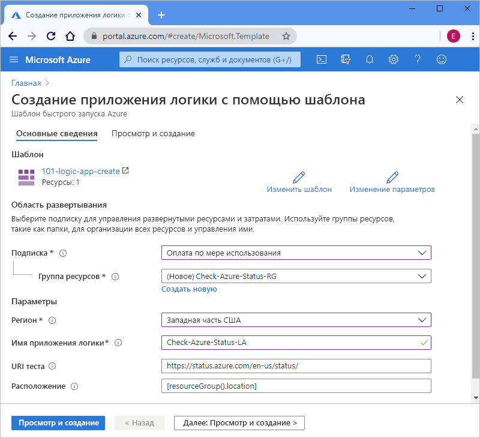

# <a name="quickstart-create-and-deploy-a-logic-app-workflow-by-using-an-arm-template"></a>Краткое руководство. Создание и развертывание рабочего процесса приложения логики с помощью шаблона ARM

[Azure Logic Apps](../logic-apps/logic-apps-overview.md) — это облачная служба, которая помогает создавать и запускать автоматизированные рабочие процессы для интеграции данных, приложений, облачных служб и локальных систем путем выбора из [сотен соединителей](/connectors/connector-reference/connector-reference-logicapps-connectors). В этом кратком руководстве показано, как развернуть шаблон Azure Resource Manager (шаблон ARM), чтобы создать базовое приложение логики, которое ежечасно проверяет состояние для Azure. 

[!INCLUDE [About Azure Resource Manager](../../includes/resource-manager-quickstart-introduction.md)]

Если среда соответствует предварительным требованиям и вы знакомы с использованием шаблонов ARM, нажмите кнопку **Развертывание в Azure**. Шаблон откроется на портале Azure.

[](https://portal.azure.com/#create/Microsoft.Template/uri/https%3a%2f%2fraw.githubusercontent.com%2fAzure%2fazure-quickstart-templates%2fmaster%2f101-logic-app-create%2fazuredeploy.json)

## <a name="prerequisites"></a>Предварительные требования

Если у вас еще нет подписки Azure, создайте [бесплатную учетную запись Azure](https://azure.microsoft.com/free/?WT.mc_id=A261C142F), прежде чем начинать работу.

## <a name="review-the-template"></a>Изучение шаблона

В этом кратком руководстве используется шаблон [**Создание приложения логики**](https://azure.microsoft.com/resources/templates/101-logic-app-create/), который можно найти в [коллекции шаблонов быстрого запуска Azure](https://azure.microsoft.com/resources/templates). Здесь он не приводится, так как он слишком длинный. Но вы можете просмотреть файл [azuredeploy.json](https://github.com/Azure/azure-quickstart-templates/blob/master/101-logic-app-create/azuredeploy.json) в коллекции шаблонов.

Шаблон быстрого запуска создает рабочий процесс приложения логики, который использует триггер повторения, настроенный на запуск каждый час, а также [*встроенное* действие](../connectors/apis-list.md#connector-types) HTTP, которое вызывает URL-адрес для получения состояния для Azure. Встроенное действие является нативным для платформы Azure Logic Apps.

Этот шаблон создает следующий ресурс Azure:

* [**Microsoft.Logic/workflows**](/azure/templates/microsoft.logic/workflows), который создает рабочий процесс для приложения логики.

Чтобы найти дополнительные шаблоны быстрого запуска для Azure Logic Apps, изучите шаблоны [Microsoft.Logic](https://azure.microsoft.com/resources/templates/?resourceType=Microsoft.Logic) в коллекции.

<a name="deploy-template"></a>

## <a name="deploy-the-template"></a>Развертывание шаблона

Следуйте указаниям по развертыванию шаблона быстрого запуска:

| Параметр | Описание |
|--------|-------------|
| [Портал Azure](../logic-apps/quickstart-create-deploy-azure-resource-manager-template.md?tabs=azure-portal#deploy-template) | Если среда Azure соответствует предварительным требованиям и вы раньше использовали шаблоны ARM, эти действия помогут вам войти в Azure и открыть шаблон быстрого запуска на портале Azure. Дополнительные сведения см. в статье [Развертывание ресурсов с помощью шаблонов ARM на портале Azure](../azure-resource-manager/templates/deploy-portal.md). |
| [Azure CLI](../logic-apps/quickstart-create-deploy-azure-resource-manager-template.md?tabs=azure-cli#deploy-template) | Интерфейс командной строки (Azure CLI) — это набор команд для создания ресурсов Azure и управления ими. Для выполнения этих команд вам понадобится Azure CLI 2.6 или более поздней версии. Чтобы проверить используемую версию CLI, выполните `az --version`. Дополнительные сведения см. в следующих статьях: <p><p>- [Что такое Azure CLI](/cli/azure/what-is-azure-cli?view=azure-cli-latest) <br>- [Начало работы с Azure CLI](/cli/azure/get-started-with-azure-cli?view=azure-cli-latest) |
| [Azure PowerShell](../logic-apps/quickstart-create-deploy-azure-resource-manager-template.md?tabs=azure-powershell#deploy-template) | В Azure PowerShell доступен набор командлетов, которые используют модель Azure Resource Manager для управления ресурсами Azure. Дополнительные сведения см. в следующих статьях: <p><p>- [Обзор Azure PowerShell](/powershell/azure/azurerm/overview) <br>- [Знакомство с модулем Az для Azure PowerShell](/powershell/azure/new-azureps-module-az) <br>- [Начало работы с Azure PowerShell](/powershell/azure/get-started-azureps) |
| [REST API управления ресурсами Azure](../logic-apps/quickstart-create-deploy-azure-resource-manager-template.md?tabs=rest-api#deploy-template) | В Azure доступны REST API (API передачи репрезентативного состояния). Это конечные точки службы, которые поддерживают набор операций HTTP (методов) и предоставляют доступ на создание, получение, обновление или удаление ресурсов сервера. Подробные сведения см. в статье [Справочник по REST API Azure](/rest/api/azure/). |
|||

<a name="deploy-azure-portal"></a>

#### <a name="portal"></a>[Портал](#tab/azure-portal)

1. Выберите следующее изображение, чтобы войти с помощью учетной записи Azure, и откройте шаблон быстрого запуска на портале Azure:

   [](https://portal.azure.com/#create/Microsoft.Template/uri/https%3a%2f%2fraw.githubusercontent.com%2fAzure%2fazure-quickstart-templates%2fmaster%2f101-logic-app-create%2fazuredeploy.json)

1. На портале на странице **Создание приложения логики с помощью шаблона** введите или выберите следующие значения:

   | Свойство | Значение | Описание |
   |----------|-------|-------------|
   | **Подписка** | <*Azure-subscription-name*> | Имя подписки Azure, которую нужно использовать. |
   | **Группа ресурсов** | <*имя_группы_ресурсов_Azure*> | Имя новой или существующей группы ресурсов Azure. В этом примере используется `Check-Azure-Status-RG`. |
   | **Регион** | <*Azure-region*> | Регион центра обработки данных Azure для использования приложения логики. В этом примере используется `West US`. |
   | **Имя приложения логики** | <*logic-app-name*> | Имя, используемое для приложения логики. В этом примере используется `Check-Azure-Status-LA`. |
   | **URI теста** | <*test-URI*> | Универсальный код ресурса (URI) для вызываемой службы на основе определенного расписания. В этом примере используется `https://status.azure.com/en-us/status/` (страница состояния Azure). |
   | **Расположение** |  <*Azure-region-for-all-resources*> | Регион Azure, используемый для всех ресурсов, если он отличается от значения по умолчанию. В этом примере используется значение по умолчанию `[resourceGroup().location]` (расположение группы ресурсов). |
   ||||

   Ниже показано, как выглядит страница со значениями, используемыми в этом примере:

   

1. Когда все будет готово, выберите **Просмотр и создание**.

1. Выполните действия, описанные в разделе [Обзор развернутых ресурсов](#review-deployed-resources).

#### <a name="cli"></a>[CLI](#tab/azure-cli)

```azurecli-interactive
read -p "Enter a project name name to use for generating resource names:" projectName &&
read -p "Enter the location, such as 'westus':" location &&
templateUri="https://raw.githubusercontent.com/Azure/azure-quickstart-templates/master/101-logic-app-create/azuredeploy.json" &&
resourceGroupName="${projectName}rg" &&
az group create --name $resourceGroupName --location "$location" &&
az deployment group create --resource-group $resourceGroupName --template-uri  $templateUri &&
echo "Press [ENTER] to continue ..." &&
read
```

Дополнительные сведения см. в следующих статьях:

* [Azure CLI: az deployment group](/cli/azure/deployment/group)
* [Развертывание ресурсов с помощью шаблонов ARM и Azure CLI](../azure-resource-manager/templates/deploy-cli.md)

#### <a name="powershell"></a>[PowerShell](#tab/azure-powershell)

```azurepowershell-interactive
$projectName = Read-Host -Prompt "Enter a project name to use for generating resource names"
$location = Read-Host -Prompt "Enter the location, such as 'westus'"
$templateUri = "https://raw.githubusercontent.com/Azure/azure-quickstart-templates/master/101-logic-app-create/azuredeploy.json"

$resourceGroupName = "${projectName}rg"

New-AzResourceGroup -Name $resourceGroupName -Location "$location"
New-AzResourceGroupDeployment -ResourceGroupName $resourceGroupName -TemplateUri $templateUri

Read-Host -Prompt "Press [ENTER] to continue ..."
```

Дополнительные сведения см. в следующих статьях:

* [Azure PowerShell: New-AzResourceGroup](/powershell/module/az.resources/new-azresourcegroup)
* [Azure PowerShell: New-AzResourceGroupDeployment](/powershell/module/az.resources/new-azresourcegroupdeployment)
* [Развертывание ресурсов с помощью шаблонов ARM и Azure PowerShell](../azure-resource-manager/templates/deploy-powershell.md)

#### <a name="rest-api"></a>[REST API](#tab/rest-api)

1. Если вы не хотите использовать существующую группу ресурсов Azure, создайте новую, следуя приведенному ниже синтаксису для запроса, который отправляется в REST API управления ресурсами:

   ```http
   PUT https://management.azure.com/subscriptions/{subscriptionId}/resourcegroups/{resourceGroupName}?api-version=2019-10-01
   ```

   | Значение | Описание |
   |-------|-------------|
   | `subscriptionId`| GUID для подписки Azure, которую вы хотите использовать |
   | `resourceGroupName` | Имя создаваемой группы ресурсов Azure. В этом примере используется `Check-Azure-Status-RG`. |
   |||

   Пример:

   ```http
   PUT https://management.azure.com/subscriptions/xxxxXXXXxxxxXXXXX/resourcegroups/Check-Azure-Status-RG?api-version=2019-10-01
   ```

   Дополнительные сведения см. в следующих статьях:

   * [Справочник по REST API Azure. Вызов REST API Azure](/rest/api/azure/)
   * [REST API управления ресурсами. Группы ресурсов — создание или обновление](/rest/api/resources/resourcegroups/createorupdate)

1. Чтобы развернуть шаблон быстрого запуска в группе ресурсов, выполните следующий синтаксис для запроса, отправляемого в REST API управления ресурсами:

   ```http
   PUT https://management.azure.com/subscriptions/{subscriptionId}/resourcegroups/{resourceGroupName}/providers/Microsoft.Resources/deployments/{deploymentName}?api-version=2019-10-01
   ```

   | Значение | Описание |
   |-------|-------------|
   | `subscriptionId`| GUID для подписки Azure, которую вы хотите использовать |
   | `resourceGroupName` | Имя используемой группы ресурсов Azure. В этом примере используется `Check-Azure-Status-RG`. |
   | `deploymentName` | Имя, используемое для развертывания. В этом примере используется `Check-Azure-Status-LA`. |
   |||

   Пример:

   ```http
   PUT https://management.azure.com/subscriptions/xxxxXXXXxxxxXXXXX/resourcegroups/Check-Azure-Status-RG/providers/Microsoft.Resources/deployments/Check-Azure-Status-LA?api-version=2019-10-01
   ```

   Подробные сведения см. в статье [REST API управления ресурсами. Развертывания — создание или обновление](/rest/api/resources/deployments/createorupdate).

1. Вы можете предоставить значения, которые будут использоваться для развертывания, такие как регион Azure, а также ссылки на шаблон быстрого запуска и [файл параметров](../azure-resource-manager/templates/template-parameters.md), который содержит значения для шаблона быстрого запуска, используемого при развертывании. Для этого используйте следующий синтаксис для текста запроса, отправляемого в REST API управления ресурсами:

   ```json
   {
      "location": "{Azure-region}",
      "properties": {
         "templateLink": {
            "uri": "{quickstart-template-URL}",
            "contentVersion": "1.0.0.0"
         },
         "parametersLink": {
            "uri": "{quickstart-template-parameter-file-URL}",
            "contentVersion": "1.0.0.0"
         },
         "mode": "Incremental"
      }
   }
   ```

   | Свойство | Значение | Описание |
   |----------|-------|-------------|
   | `location`| <*Azure-region*> | Регион Azure, который будет использоваться для развертывания. В этом примере используется `West US`. |
   | `templateLink` : `uri` | <*quickstart-template-URL*> | URL-адрес шаблона быстрого запуска, используемого для развертывания: <p><p>`https://raw.githubusercontent.com/Azure/azure-quickstart-templates/master/101-logic-app-create/azuredeploy.json`. |
   | `parametersLink` : `uri` | <*quickstart-template-parameter-file-URL*> | URL-адрес для файла параметров шаблона быстрого запуска, используемого для развертывания: <p><p>`https://raw.githubusercontent.com/Azure/azure-quickstart-templates/master/101-logic-app-create/azuredeploy.parameters.json` <p><p>Дополнительные сведения о файле параметров Resource Manager см. в следующих статьях: <p><p>- [Создание файла параметров Resource Manager](../azure-resource-manager/templates/parameter-files.md) <br>- [Руководство. Использование файлов параметров для развертывания шаблона ARM](../azure-resource-manager/templates/template-tutorial-use-parameter-file.md) |
   | `mode` | <*deployment-mode*> | Выполните добавочное обновление или полное обновление. В этом примере используется `Incremental` (значение по умолчанию). Подробные сведения см. в статье [Режимы развертывания Azure Resource Manager](../azure-resource-manager/templates/deployment-modes.md). |
   |||

   Пример:

   ```json
   {
      "location": "West US",
      "properties": {
         "templateLink": {
            "uri": "https://raw.githubusercontent.com/Azure/azure-quickstart-templates/master/101-logic-app-create/azuredeploy.json",
            "contentVersion": "1.0.0.0"
         },
         "parametersLink": {
            "uri": "https://raw.githubusercontent.com/Azure/azure-quickstart-templates/master/101-logic-app-create/azuredeploy.parameters.json",
            "contentVersion": "1.0.0.0"
         },
         "mode": "Incremental"
      }
   }
   ```

Дополнительные сведения см. в следующих статьях:

* [REST API управления ресурсами](/rest/api/resources/)
* [Развертывание ресурсов с помощью шаблонов ARM и REST API Resource Manager](../azure-resource-manager/templates/deploy-rest.md)

---

<a name="review-deployed-resources"></a>

## <a name="review-deployed-resources"></a>Просмотр развернутых ресурсов

Чтобы просмотреть приложение логики, вы можете использовать портал Azure, выполнить скрипт, созданный с помощью Azure CLI или Azure PowerShell, либо использовать REST API приложения логики.

### <a name="portal"></a>[Портал](#tab/azure-portal)

1. В поле поиска на портале Azure введите имя приложения логики (в нашем примере — `Check-Azure-Status-LA`). В списке результатов выберите ваше приложение логики.

1. На портале Azure найдите и выберите приложение логики (в нашем примере — `Check-Azure-Status-RG`).

1. После открытия конструктора приложений логики изучите приложение логики, созданное с помощью шаблона быстрого запуска.

1. Чтобы проверить приложение логики, на панели инструментов конструктора щелкните **Запустить**.

### <a name="cli"></a>[CLI](#tab/azure-cli)

```azurecli-interactive
echo "Enter your logic app name:" &&
read logicAppName &&
az logic workflow show --name $logicAppName &&
echo "Press [ENTER] to continue ..."
```

Подробные сведения см. в разделе [Azure CLI: az logic workflow show](/cli/azure/ext/logic/logic/workflow?view=azure-cli-latest#ext-logic-az-logic-workflow-show).

### <a name="powershell"></a>[PowerShell](#tab/azure-powershell)

```azurepowershell-interactive
$logicAppName = Read-Host -Prompt "Enter your logic app name"
Get-AzLogicApp -Name $logicAppName
Write-Host "Press [ENTER] to continue..."
```

Подробные сведения см. в статье [Azure PowerShell: Get-AzLogicApp](/powershell/module/az.logicapp/get-azlogicapp).

### <a name="rest-api"></a>[REST API](#tab/rest-api)

```http
GET https://management.azure.com/subscriptions/{subscriptionId}/resourceGroups/{resourceGroupName}/providers/Microsoft.Logic/workflows/{workflowName}?api-version=2016-06-01
```

| Значение | Описание |
|-------|-------------|
| `subscriptionId`| GUID подписки Azure, в которой развернут шаблон быстрого запуска. |
| `resourceGroupName` | Имя группы ресурсов Azure, в которой развернут шаблон быстрого запуска. В этом примере используется `Check-Azure-Status-RG`. |
| `workflowName` | Имя развернутого приложения логики. В этом примере используется `Check-Azure-Status-LA`. |
|||

Пример:

```http
GET https://management.azure.com/subscriptions/xxxxXXXXxxxxXXXXX/resourceGroups/Check-Azure-Status-RG/providers/Microsoft.Logic/workflows/Check-Azure-Status-LA?api-version=2016-06-01
```

Подробные сведения см. в статье [REST API приложений логики. Рабочие процессы — Get](/rest/api/logic/workflows/get).

---

## <a name="clean-up-resources"></a>Очистка ресурсов

Если вы планируете продолжать работу с последующими краткими руководствами и статьями, эти ресурсы можно не удалять. Если приложение логики больше не требуется, удалите группу ресурсов с помощью портала Azure, Azure CLI, Azure PowerShell или REST API управления ресурсами.

### <a name="portal"></a>[Портал](#tab/azure-portal)

1. На портале Azure найдите и выберите группу ресурсов, которую необходимо удалить (в нашем примере — `Check-Azure-Status-RG`).

1. При необходимости в меню группы ресурсов выберите **Обзор**. На странице обзора выберите **Удалить группу ресурсов**.

1. Для подтверждения введите имя группы ресурсов.

Подробные сведения см. в разделе [Удаление группы ресурсов](../azure-resource-manager/management/delete-resource-group.md?tabs=azure-portal#delete-resource-group).

### <a name="cli"></a>[CLI](#tab/azure-cli)

```azurecli-interactive
echo "Enter your resource group name:" &&
read resourceGroupName &&
az group delete --name $resourceGroupName &&
echo "Press [ENTER] to continue ..."
```

Подробные сведения см. в разделе [Azure CLI: az group delete](/cli/azure/group?view=azure-cli-latest#az-group-delete).

### <a name="powershell"></a>[PowerShell](#tab/azure-powershell)

```azurepowershell-interactive
$resourceGroupName = Read-Host -Prompt "Enter the resource group name"
Remove-AzResourceGroup -Name $resourceGroupName
Write-Host "Press [ENTER] to continue..."
```

Подробные сведения см. в статье [Azure PowerShell: Remove-AzResourceGroup](/powershell/module/azurerm.resources/remove-azurermresourcegroup).

### <a name="rest-api"></a>[REST API](#tab/rest-api)

```http
DELETE https://management.azure.com/subscriptions/{subscriptionId}/resourcegroups/{resourceGroupName}?api-version=2019-10-01
```

| Значение | Описание |
|-------|-------------|
| `subscriptionId`| GUID подписки Azure, в которой развернут шаблон быстрого запуска. |
| `resourceGroupName` | Имя группы ресурсов Azure, в которой развернут шаблон быстрого запуска. В этом примере используется `Check-Azure-Status-RG`. |
|||

Пример:

```http
GET https://management.azure.com/subscriptions/xxxxXXXXxxxxXXXXX/resourceGroups/Check-Azure-Status-RG?api-version=2019-10-01
```

Подробные сведения см. в статье [REST API управления ресурсами. Группы ресурсов — удаление](/rest/api/resources/resourcegroups/delete).

---

## <a name="next-steps"></a>Дальнейшие действия

> [!div class="nextstepaction"]
> [Руководство. Создание и развертывание первого шаблона ARM](../azure-resource-manager/templates/template-tutorial-create-first-template.md)
