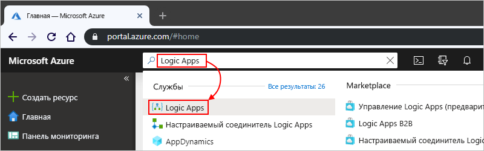
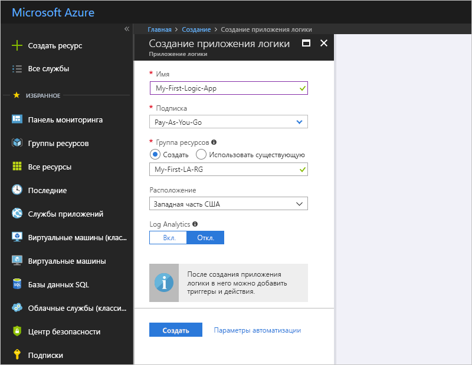
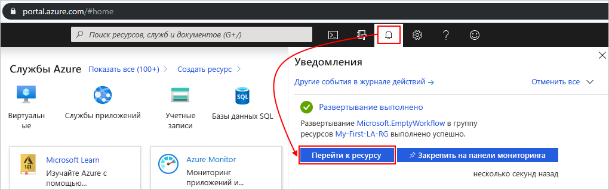
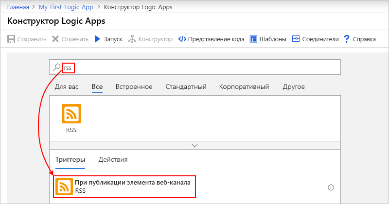
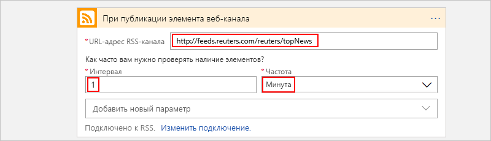
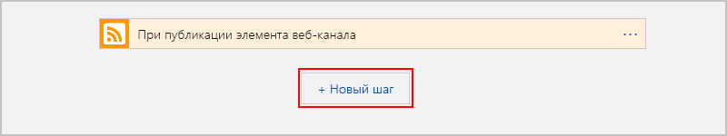
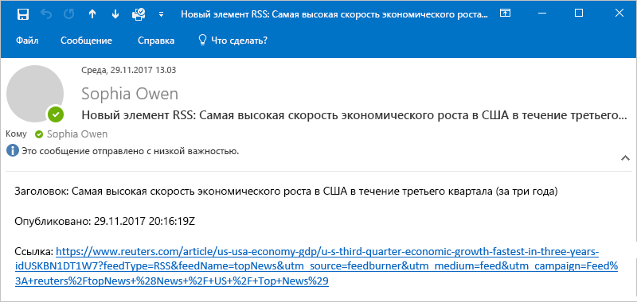
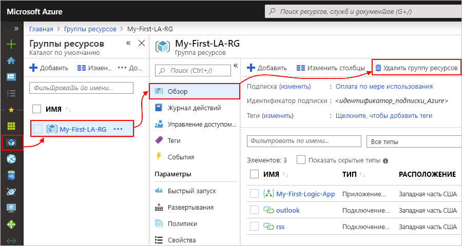
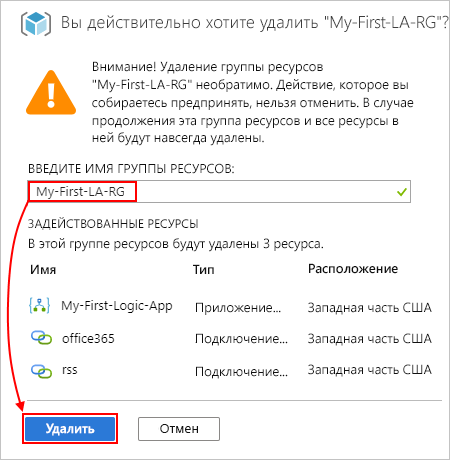

# Краткое руководство. Создание первого рабочего процесса Logic Apps на портале Azure

В этом кратком руководстве содержатся сведения о том, как создать первый рабочий процесс в [Azure Logic Apps](logic-apps-overview.md), используя [портал Azure](https://portal.azure.com). В нем также объясняются базовые концепции службы Logic Apps, в том числе способы создания нового приложения логики, добавление триггера и действия в приложение логики и тестирование приложения логики. Следуйте инструкциям из этого руководства, чтобы создать пример приложения логики, который будет регулярно проверять веб-канал RSS и отправлять уведомления по электронной почте при наличии новых элементов. На следующем снимке экрана показан высокоуровневый рабочий процесс примера приложения логики:

Если вы хотите научиться создавать приложения логики и управлять ими через другие интерфейсы и приложения, см. другие краткие руководства по Logic Apps: 

* [Создание приложений логики и управление ими с помощью Azure CLI](quickstart-logic-apps-azure-cli.md)
* [Создание определений рабочих процессов приложения логики и управление ими с помощью Visual Studio Code](quickstart-create-logic-apps-visual-studio-code.md)
* [Создание автоматизированных задач, операций и рабочих процессов с помощью Azure Logic Apps в Visual Studio](quickstart-create-logic-apps-with-visual-studio.md)

## Предварительные требования

* Подписка Azure. Если у вас нет подписки, [зарегистрируйтесь, чтобы получить бесплатную пробную учетную запись Azure](https://azure.microsoft.com/free/?WT.mc_id=A261C142F).
* Учетная запись электронной почты службы, поддерживаемой в Logic Apps (например, Office 365 Outlook или Outlook.com). Сведения о других поддерживаемых поставщиках электронной почты см. в [списке соединителей](/connectors/).

    > [!IMPORTANT]
    > Если вы используете соединитель [Gmail](/connectors/gmail/), учтите, что использовать этот соединитель в Logic Apps без ограничений могут только учетные записи G Suite. Если у вас есть учетная запись объекта-получателя Gmail, вы можете использовать этот соединитель только с определенными утвержденными Google службами. Кроме того, вы можете [создать клиентское приложение Google, которое будет использоваться для проверки подлинности в соединителе Gmail](/connectors/gmail/#authentication-and-bring-your-own-application). Дополнительные сведения см. в статье [Политики безопасности и конфиденциальности данных для соединителей Google в Azure Logic Apps](../connectors/connectors-google-data-security-privacy-policy.md).

## Создание приложения логики

1. Войдите на [портал Azure](https://portal.azure.com) с помощью учетных данных учетной записи Azure.

1. В поле поиска на портале Azure введите строку `logic apps` и выберите **Logic Apps**.

   

1. На странице **Logic Apps** нажмите **Добавить**.

   

1. В области **Logic App** укажите основные сведения и параметры для приложения логики. Создайте [группу ресурсов](../azure-resource-manager/management/overview.md#terminology) для этого примера приложения логики.
    
   | Свойство | Значение | Описание |
   |----------|-------|-------------|
   | **имя**; | <*logic-app-name*> | Название приложения логики должно быть уникальным между регионами. Имя может содержать только буквы, цифры, дефисы (`-`), символы подчеркивания (`_`), круглые скобки (`(`, `)`) и точки (`.`). В этом примере используется имя My-First-Logic-App. |
   | **Подписка** | <*Azure-subscription-name*> | Название подписки Azure. |
   | **Группа ресурсов** | <*имя_группы_ресурсов_Azure*> | Название [группы ресурсов Azure](../azure-resource-manager/management/overview.md#terminology), в которой вы создаете приложение логики. Имя группы ресурсов должно быть уникальным между регионами. В этом примере используется имя My-First-LA-RG. |
   | **Расположение** | <*Azure-region*> | Регион Azure для хранения данных приложения логики. В этом примере используется регион "Западная часть США". |
   | **Служба Log Analytics** | Выключено | Параметр для ведения журнала диагностики, который по умолчанию имеет значение **Выкл.** Для целей примера в качестве значения для этого параметра следует оставить **Выкл.** |
   ||||

   

1. Когда все будет готово, выберите **Просмотр и создание**. Подтвердите указанные сведения и выберите **Создать**.

1. После успешного развертывания приложения Azure выберите **Перейти к ресурсу**. Вы также можете найти и выбрать приложение логики, введя его имя в поле поиска.

   

   Открывается конструктор Logic Apps и отображается страница с вводным видео и часто используемыми триггерами. В разделе **Шаблоны** выберите **Пустое приложение логики**.

   

Добавьте триггер [в приложение логики](#add-rss-trigger).

## Добавление триггера RSS

Каждое приложение логики должно начинаться с [триггера](../logic-apps/logic-apps-overview.md#how-do-logic-apps-work), который срабатывает на событие или при выполнении конкретного условия. Находя новые элементы, триггер срабатывает, и обработчик Logic Apps создает экземпляр приложения логики, который запускает и выполняет рабочий процесс. Если триггер не находит новых элементов, то он не срабатывает, не создает экземпляр и не запускает рабочий процесс при этой проверке.

При прохождении этого примера краткого руководства после [создания приложения логики](#create-your-logic-app) вы добавите триггер, который будет проверять наличие новых элементов в веб-канале RSS и срабатывать при их наличии. Вы также можете создавать приложения логики с разными типами триггеров, например с описанными в учебнике по [созданию автоматических рабочих процессов на основе утверждений](tutorial-process-mailing-list-subscriptions-workflow.md).

1. В **конструкторе приложений логики** под полем поиска выберите **Все**.

1. Чтобы найти соединитель RSS, в поле поиска введите `rss`. В списке **Триггеры** выберите триггер RSS **При публикации элемента веб-канала**.

   

1. Укажите URL-адрес веб-канала RSS для триггера. Затем определите расписание триггера, задав интервал и частоту.

   | Свойство | Значение | Описание |
   | -------- | ----- | ----------- |
   | **URL-адрес RSS-канала** | <*RSS-feed-URL*> | URL-адрес веб-канала RSS, который нужно отслеживать. В этом примере используется веб-канал RSS журнала Wall Street Journal по адресу `https://feeds.a.dj.com/rss/RSSMarketsMain.xml`. Однако для этого примера можно использовать любой веб-канал RSS, который не требует авторизации HTTP. Чтобы упростить тестирование приложения логики позже, выберите веб-канал RSS, который часто публикуется. |
   | **Интервал** | 1 | Количество интервалов ожидания между проверками веб-канала RSS. В этом примере используется интервал в 1 минуту. |
   | **Частота** | Минута | Единица измерения времени для каждого интервала между проверками веб-канала RSS. В этом примере используется интервал в 1 минуту. |
   ||||

   

1. Сверните сведения о триггере, щелкнув заголовок окна.

   

1. Сохраните приложение логики, выбрав **Сохранить** на панели инструментов конструктора.

Теперь приложение логики активно, но оно только проверяет веб-канал RSS. Затем [добавьте действие](#add-email-action), чтобы определить, что будет происходить при срабатывании триггера.

## Добавление действия "отправить сообщение"

[Добавив триггер для приложения логики](#add-rss-trigger), необходимо добавить [действие](../logic-apps/logic-apps-overview.md#logic-app-concepts), чтобы определить ответ на обнаружение приложением логики в веб-канале RSS нового элемента. Вы также можете создавать приложения логики с гораздо более сложными действиями, например, с действиями, описанными в руководстве по [обработке сообщений электронной почты с помощью Logic Apps, Функций Azure и службы хранилища Azure](./tutorial-process-email-attachments-workflow.md).

> [!NOTE]
> В этом примере в качестве службы электронной почты используется Office 365 Outlook. Если вы используете другую поддерживаемую службу электронной почты в приложении логики, пользовательский интерфейс может отличаться. Однако основные понятия, связанные с подключением к другой службе электронной почты, будут такими же.

1. В разделе триггера **При публикации элемента веб-канала** выберите **Новый шаг**.

   

1. В разделе **Выберите действие** под полем поиска выберите **Все**.

1. В поле поиска введите `send an email`, чтобы найти соединители, которые предлагают это действие. Чтобы отфильтровать список действий для определенного приложения или службы, можно сначала выбрать это приложение или службу.

   Например, если вы используете рабочую или учебную учетную запись Майкрософт и хотите использовать Office 365 Outlook, выберите **Office 365 Outlook**. Если вы используете личную учетную запись Майкрософт, можно выбрать Outlook.com. Далее в этом примере используется Office 365 Outlook.

   

   Теперь можно легко найти и выбрать требуемое действие, например `send an email`.

   

1. Если выбранный соединитель электронной почты запрашивает подтверждение подлинности идентификатора, выполните этот шаг сейчас. Чтобы этот пример работал, необходимо создать подключение между приложением логики и службой электронной почты. 

    > [!NOTE]
    > В этом примере содержатся сведения о ручной проверке подлинности для соединителя Office 365 Outlook. Однако другие соединители могут поддерживать разные типы проверки подлинности.
    > Проверку подлинности для приложений логики также можно выполнять различными способами в зависимости от варианта использования. Например, если для развертывания используется шаблон Azure Resource Manager, можно параметризовать и улучшить защиту входных данных, которые часто меняются, например сведения о подключении. Дополнительные сведения см. в следующих статьях:
   > * [Параметры шаблона для развертывания](../logic-apps/logic-apps-azure-resource-manager-templates-overview.md#template-parameters)
   > * [Авторизация подключений OAuth](../logic-apps/logic-apps-deploy-azure-resource-manager-templates.md#authorize-oauth-connections)
   > * [Аутентификация для доступа на основе управляемых удостоверений](../logic-apps/create-managed-service-identity.md)
   > * [Аутентификация для подключения при развертывании приложения логики](../logic-apps/logic-apps-azure-resource-manager-templates-overview.md#authenticate-connections)

1. На странице действия **Отправить сообщение электронной почты** укажите сведения, которые нужно добавить в уведомление по электронной почте.

   1. В поле **Кому** введите адрес электронной почты получателя. Используйте для этого примера адрес электронной почты.

        > [!NOTE]
        > Список **Добавить динамическое содержимое** отображается, если щелкнуть внутри поля **К** и некоторых других полей ввода в конструкторе Logic Apps. В этом примере динамическое содержимое используется на более позднем этапе. В списке **Добавить динамическое содержимое** отображаются все доступные выходные данные из предыдущего шага, которые можно использовать в качестве входных данных для текущего действия.

   1. В поле **Тема** введите тему уведомления по электронной почте. Для этого примера введите следующий текст с завершающим пробелом: `New RSS item: `

      

   1. В списке **Добавить динамическое содержимое** выберите пункт **Название веб-канала**, данные которого являются выходными данными триггера **При публикации элемента веб-канала**. Уведомление по электронной почте использует эти выходные данные для получения названия элемента RSS.

      

      > [!TIP]
      > Если в списке динамического содержимого не отображаются выходные данные триггера **При публикации элемента веб-канала**, выберите пункт **Дополнительно** рядом с заголовком действия.
      > 
      > 

      В конечном итоге тема сообщения будет выглядеть примерно так:

      

      Если в конструкторе появляется цикл "Для всех", значит вы выбрали маркер для массива; например маркер **categories-Item**. Для этих типов маркеров конструктор автоматически добавляет цикл к действию, которое ссылается на конкретный маркер. Таким образом приложение логики будет выполнять это действие для каждого элемента массива. Чтобы удалить цикл, нажмите кнопку с **многоточием** (**...**) на панели заголовка цикла, а затем выберите **Удалить**.

   1. В поле **Текст** введите содержимое для текста электронного сообщения. В этом примере содержимое содержит три свойства с описательным текстом для каждого из них: `Title:`, свойство **Название веб-канала**; `Date published:`, свойство **Веб-канал опубликован**; `Link:`, свойство **Ссылка основного веб-канала**. Чтобы добавить пустые строки в поле редактирования, нажмите Shift + ВВОД.

      | Свойство | Описание |
      |----------|-------------|
      | **Название веб-канала** | Заголовок элемента |
      | **Веб-канал опубликован** | Время и дата публикации элемента |
      | **Ссылка основного веб-канала** | URL-адрес для элемента |
      |||

      

1. Сохраните приложение логики. В меню конструктора выберите **Сохранить**.

Затем [проверьте, работает ли приложение логики](#test-logic-app).

## Запуск приложения логики

После создания примера приложения логики убедитесь, что рабочий процесс настроен правильно. Вы можете подождать, пока приложение логики проверит веб-канал RSS по указанному расписанию. Или же вручную запустите приложение логики, выбрав **Запустить** на панели инструментов конструктора Logic Apps, как показано на следующем снимке экрана. 

Если в RSS-канале есть новые элементы, приложение логики отправляет сообщение электронной почты для каждого нового элемента. В противном случае приложение логики будет ожидать следующего интервала для повторной проверки веб-канала RSS. 

На следующем снимке экрана показан пример уведомления по электронной почте из этого примера приложения логики. Сообщение электронной почты содержит сведения для каждого элемента веб-канала RSS, выбранного в конструкторе, а также описательный текст, добавленный для каждого из них.

Если вы не получили уведомления по электронной почте от приложения логики, как ожидалось:

* Проверьте папку нежелательных сообщений электронной почты. Возможно, сообщение было ошибочно отфильтровано.
* Убедитесь, что веб-канал RSS, который вы используете, содержит опубликованные элементы с момента последней запланированной или ручной проверки.

## Очистка ресурсов

Завершив тестирование этого примера приложения логики, очистите приложение логики и все связанные с ним ресурсы, удалив группу ресурсов, созданную для этого примера.

> [!NOTE]
> При [удалении приложения логики](manage-logic-apps-with-azure-portal.md#delete-logic-apps) экземпляры новых запусков не создаются. Всех выполняющиеся и ожидающие выполнения запуски будут отменены. При наличии тысяч операций запуска отмена может занять значительное время.

1. В поле поиска Azure введите `resource groups`, а затем выберите **Группы ресурсов**.

   

1. Найдите и выберите группу ресурсов приложения логики. На вкладке **Обзор** выберите **Удалить группу ресурсов**.

   

1. Когда отобразится панель подтверждения, введите имя группы ресурсов и выберите **Удалить**.

   

## Дальнейшие действия

При прохождении этого краткого руководства вы создали на портале Azure приложение логики, которое проверяет наличие обновлений в веб-канале RSS и отправляет уведомление о каждом новом элементе веб-канала по электронной почте. 

Сведения о создании в Logic Apps более сложных рабочих процессов на основе расписания см. в следующем руководстве:

> [!div class="nextstepaction"]
> [Проверка загрузки дорог при помощи приложения логики на основе планировщика](../logic-apps/tutorial-build-schedule-recurring-logic-app-workflow.md)