# <a name="quickstart-create-and-manage-logic-app-workflow-definitions-by-using-visual-studio-code"></a>Краткое руководство. Создание определений рабочих процессов приложения логики и управление ими с помощью Visual Studio Code

С помощью [Azure Logic Apps](../logic-apps/logic-apps-overview.md) и Visual Studio Code можно создать приложения логики, которые автоматизируют задачи, рабочие процессы и процессы для интеграции приложений, данных, систем и служб по предприятиям и организациям, и управлять ими. В этом кратком руководстве показано, как создать и изменить базовые определения рабочего процесса, которые используют нотацию объектов JavaScript (JSON) для приложений логики через взаимодействие на основе кода. Вы также можете работать с приложениями логики, уже развернутыми в Azure.

Несмотря на то, что эти задачи можно выполнять на [портале Azure](https://portal.azure.com) и в Visual Studio, Visual Studio Code позволяет быстрее приступить к работе если вы уже знакомы с приложением логики и хотите работать непосредственно в коде. Например, также можно отключать, включать, удалять и обновлять уже созданные приложения логики. Кроме того, вы можете работать в приложениях логики и учетных записях интеграции на любой платформе разработки с поддержкой Visual Studio Code, например Linux, Windows и Mac.

В этой статье вы можете создать то же приложение логики из этого [краткого руководства](../logic-apps/quickstart-create-first-logic-app-workflow.md), которое демонстрирует основные понятия. В Visual Studio Code приложение логики выглядит так, как показано в следующем примере.


Прежде чем начать, убедитесь, что у вас есть эти элементы:

* Если у вас нет учетной записи и подписки Azure, [зарегистрируйтесь для получения бесплатной учетной записи Azure](https://azure.microsoft.com/free/).

* Базовые знания об [определениях рабочих процессов приложения логики](../logic-apps/logic-apps-workflow-definition-language.md) и их структуре, как описано для JSON.

  Если вы не знакомы с Logic Apps, попробуйте использовать это [краткое руководство](../logic-apps/quickstart-create-first-logic-app-workflow.md), где описывается создание первых приложений логики на портале Azure и которое посвящено основным понятиям.

* Доступ к Интернету для входа в Azure и в подписку Azure.

* Скачайте и установите эти средства, если вы еще этого не сделали:

  * бесплатная [версия Visual Studio Code 1.25.1 или более поздняя версия](https://code.visualstudio.com/);

  * расширение Visual Studio Code для Azure Logic Apps.

    Это расширение можно скачать и установить из [Visual Studio Marketplace](https://marketplace.visualstudio.com/items?itemName=ms-azuretools.vscode-logicapps) или непосредственно из Visual Studio Code. Перезапустите Visual Studio Code после установки.

    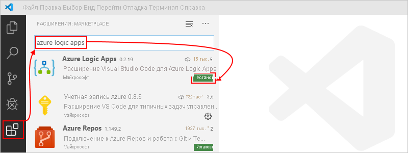

    Выбрав значок Azure на панели инструментов Visual Studio Code, можно узнать, что расширение установлено правильно.

    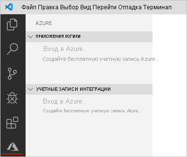

    Дополнительные сведения см. на странице [Extension Marketplace](https://code.visualstudio.com/docs/editor/extension-gallery) (Расширения в Marketplace). Чтобы внести изменения в эту версию расширения с открытым кодом, посетите веб-страницу [расширения Azure Logic Apps для Visual Studio Code на веб-сайте GitHub](https://github.com/Microsoft/vscode-azurelogicapps).

<a name="sign-in-azure"></a>

## <a name="sign-in-to-azure"></a>Вход в Azure

1. Откройте Visual Studio Code. На панели инструментов Visual Studio Code щелкните значок Azure.

   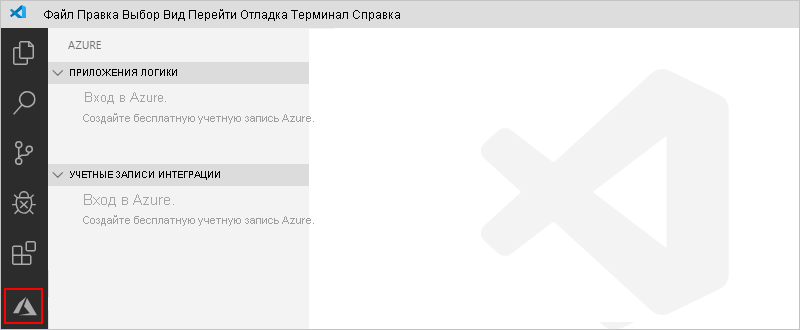

1. В окне Azure в разделе **Logic Apps** выберите пункт **Sign in to Azure** (Войти в Azure). Когда отобразится запрос страницы входа Майкрософт, войдите с помощью учетной записи Azure.

   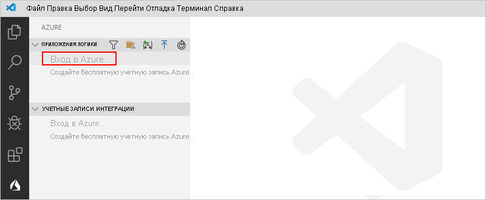

   1. Если вход выполняется дольше обычного, Visual Studio Code предлагает выполнить вход через веб-сайт проверки подлинности Майкрософт, предоставив код устройства. Чтобы выполнить вход с помощью кода, нажмите кнопку **Use Device Code** (Использовать код устройства).

      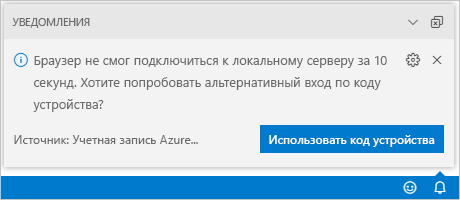

   1. Чтобы скопировать код, нажмите кнопку **Copy & Open** (Копировать и открыть).

      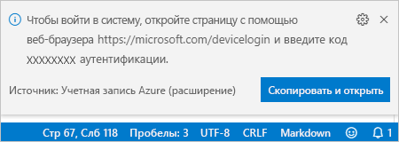

   1. Чтобы открыть новое окно браузера и перейти на веб-сайт проверки подлинности, нажмите кнопку **Открыть ссылку**.

      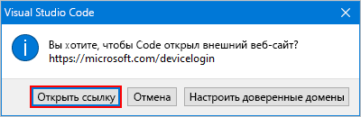

   1. На странице **Войдите в учетную запись** введите код проверки подлинности и нажмите кнопку **Далее**.

      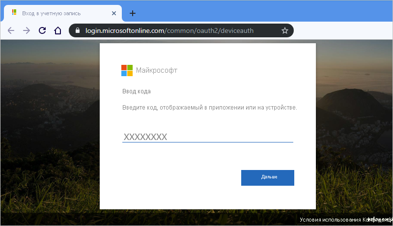

1. Выберите учетную запись Azure. После входа можно закрыть браузер и вернуться в Visual Studio Code.

   На панели Azure в разделе **Logic Apps** и **Учетные записи интеграции** теперь отображаются подписки Azure, связанные с вашей учетной записью. Однако если вы не видите нужных подписок или если в разделах отображается слишком много подписок, сделайте следующее:

   1. Наведите указатель мыши на метку **Logic Apps**. Когда появится панель инструментов, выберите параметр **Выбор подписок** (значок фильтра).

      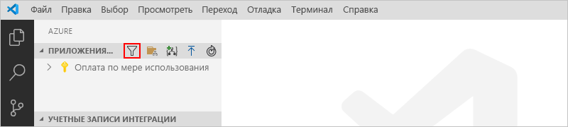

   1. В появившемся списке выберите подписки, которые должны отображаться.

1. В разделе **Logic Apps** выберите нужную подписку. Узел подписки разворачивается и отображает все приложения логики, которые существуют в этой подписке.

   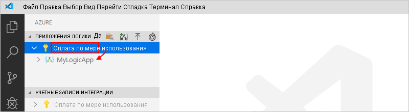

   > [!TIP]
   > В разделе **Учетные записи интеграции** при выборе подписки отображаются все учетные записи интеграции, которые существуют в этой подписке.

<a name="create-logic-app"></a>

## <a name="create-new-logic-app"></a>Создание приложения логики

1. Если вы еще не вошли в учетную запись Azure и подписку из Visual Studio Code, выполните [предыдущие действия, чтобы войти](#sign-in-azure).

1. В Visual Studio Code в разделе **Logic Apps** откройте контекстное меню своей подписки и выберите параметр **Создание приложения логики**.

   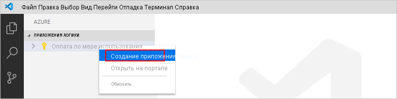

   Появится список, в котором отобразятся все группы ресурсов Azure в вашей подписке.

1. В списке группы ресурсов выберите пункт **Создать группу ресурсов** или имеющуюся группу ресурсов. В этом примере создайте группу ресурсов.

   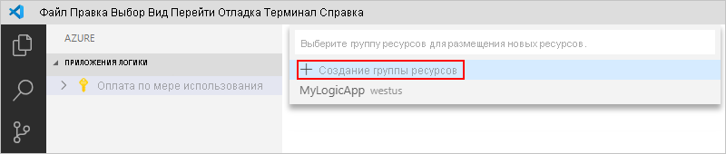

1. Укажите имя для группы ресурсов Azure и нажмите клавишу ВВОД.

   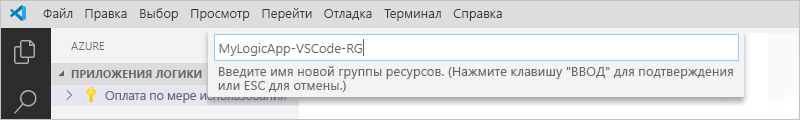

1. Выберите регион Azure, в котором необходимо сохранить метаданные приложения логики.

   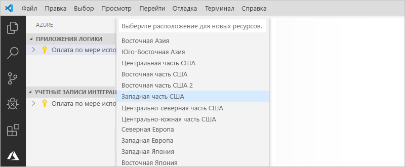

1. Укажите имя приложения логики и нажмите клавишу ВВОД.

   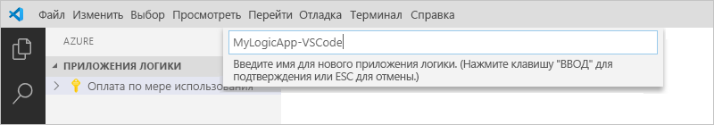

   В окне Azure в подписке Azure появится новое и пустое приложение логики. Visual Studio Code также открывает файл JSON (.logicapp.json), который содержит схему определения рабочего процесса для приложения логики. Теперь можно вручную выполнить разработку определения рабочего процесса приложения логики в этом JSON-файле. Технические справочные сведения о структуре и синтаксисе определения рабочего процесса см. в разделе [Schema reference guide for the Workflow Definition Language in Azure Logic Apps](../logic-apps/logic-apps-workflow-definition-language.md) (Справочное руководство по схеме для языка определения рабочих процессов в Azure Logic Apps).

   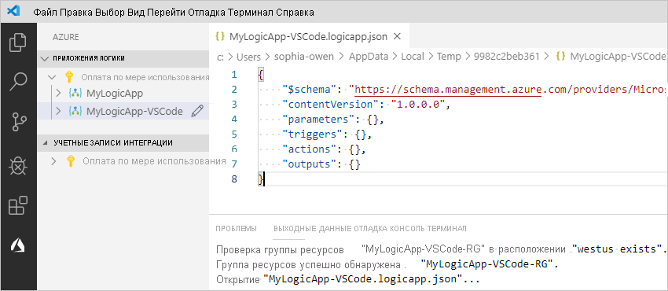

   Например, ниже приведен пример определения рабочего процесса приложения логики, который начинается с триггера RSS и действия Office 365 Outlook. Обычно элементы JSON отображаются в каждом разделе в алфавитном порядке. Однако в этом примере эти элементы отображаются приблизительно в том порядке, в котором в конструкторе отображаются шаги приложения логики.

   > [!IMPORTANT]
   > Если вы хотите повторно использовать этот пример определения приложения логики, вам потребуется учетная запись организации Office 365, например @fabrikam.com. Обязательно замените вымышленный адрес электронной почты своим. Чтобы использовать другой соединитель электронной почты, например Outlook.com или Gmail, замените действие `Send_an_email_action` аналогичным действием, доступным в [соединителе электронной почты, поддерживаемом Azure Logic Apps](../connectors/apis-list.md).

   ```json
   {
      "$schema": "https://schema.management.azure.com/providers/Microsoft.Logic/schemas/2016-06-01/workflowdefinition.json#",
      "contentVersion": "1.0.0.0",
      "parameters": {
         "$connections": {
            "defaultValue": {},
            "type": "Object"
         }
      },
      "triggers": {
         "When_a_feed_item_is_published": {
            "recurrence": {
               "frequency": "Minute",
               "interval": 1
            },
            "splitOn": "@triggerBody()?['value']",
            "type": "ApiConnection",
            "inputs": {
               "host": {
                  "connection": {
                     "name": "@parameters('$connections')['rss']['connectionId']"
                  }
               },
               "method": "get",
               "path": "/OnNewFeed",
               "queries": {
                  "feedUrl": "http://feeds.reuters.com/reuters/topNews"
               }
            }
         }
      },
      "actions": {
         "Send_an_email_(V2)": {
            "runAfter": {},
            "type": "ApiConnection",
            "inputs": {
               "body": {
                  "Body": "<p>Title: @{triggerBody()?['title']}<br>\n<br>\nDate published: @{triggerBody()?['updatedOn']}<br>\n<br>\nLink: @{triggerBody()?['primaryLink']}</p>",
                  "Subject": "RSS item: @{triggerBody()?['title']}",
                  "To": "sophia-owen@fabrikam.com"
               },
               "host": {
                  "connection": {
                     "name": "@parameters('$connections')['office365']['connectionId']"
                  }
               },
               "method": "post",
               "path": "/v2/Mail"
            }
         }
      },
      "outputs": {}
   }
   ```

1. Когда все будет готово, сохраните определение рабочего процесса приложения логики. (Меню "Файл > Сохранить" или нажмите клавиши CTRL + S)

1. Когда появится запрос на отправку приложения логики в подписку Azure, выберите пункт **Отправить**.

   На этом этапе приложение логики публикуется на [портале Azure](https://portal.azure.com), а логика запускается в Azure.

   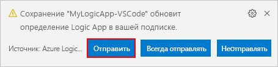

## <a name="view-logic-app-in-designer"></a>Просмотр приложения логики в конструкторе

В Visual Studio Code можно открыть приложение логики в режиме конструктора только для чтения. Несмотря на то, что приложение логики нельзя изменить в конструкторе, вы можете просмотреть рабочий процесс приложения логики в режиме конструктора.

В окне Azure в разделе **Logic Apps** откройте контекстное меню приложения логики и выберите пункт **Open in Designer** (Открыть в конструкторе).

Конструктор в режиме только для чтения открывается в отдельном окне и показывает рабочий процесс приложения логики, например:

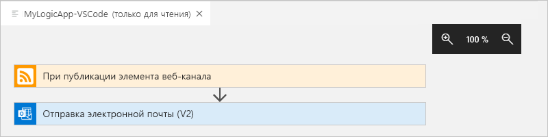

## <a name="view-in-azure-portal"></a>Просмотр на портале Azure

Чтобы просмотреть приложение логики на портале Azure, сделайте следующее:

1. Войдите на [портал Azure](https://portal.azure.com) с помощью той же учетной записи и подписки Azure, которая связана с приложением логики.

1. В поле поиска портала Azure введите имя приложения логики. В списке результатов выберите ваше приложение логики.

   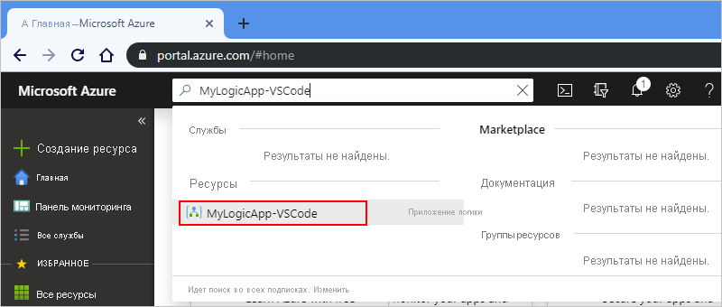

<a name="disable-enable-logic-app"></a>

## <a name="disable-or-enable-logic-app"></a>Отключение и включение приложения логики

Если вы изменяете опубликованное приложение логики и сохраняете изменения в Visual Studio Code, уже развернутое приложение *перезаписывается*. Чтобы не нарушать работу приложения логики в рабочей среде и сократить период такого нарушения, сначала отключите приложение логики. Убедившись, что приложение логики работает нормально, вы можете повторно активировать его.

1. Если вы еще не вошли в учетную запись Azure и подписку из Visual Studio Code, выполните [предыдущие действия, чтобы войти](#sign-in-azure).

1. В окне Azure в разделе **Logic Apps** разверните подписку Azure, чтобы можно было просмотреть все приложения логики в этой подписке.

   1. Чтобы отключить нужное приложение логики, откройте меню приложения логики и выберите пункт **Отключить**.

      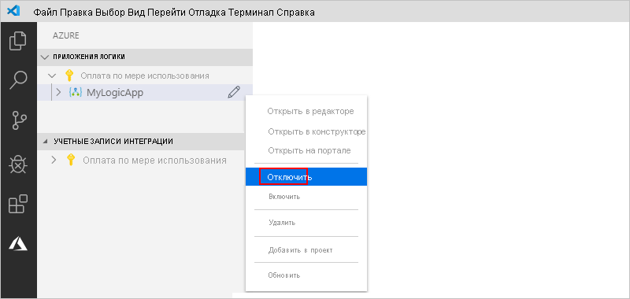

   1. Когда вы будете готовы к повторной активации приложения логики, откройте меню приложения логики и выберите пункт **Включить**.

      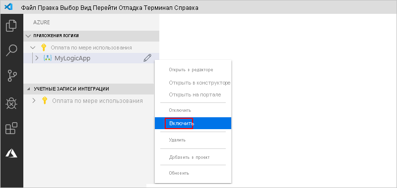

<a name="edit-logic-app"></a>

## <a name="edit-deployed-logic-app"></a>Изменение развернутого приложения логики

В Visual Studio Code можно открыть и изменить определение рабочего процесса для развернутого приложения логики в Azure.

> [!IMPORTANT] 
> Прежде чем изменять работающее приложение логики в рабочей среде, устраните риск нарушения работы этого приложения логики и сократите период такого нарушения, [отключив его](#disable-enable-logic-app).

1. Если вы еще не вошли в учетную запись Azure и подписку из Visual Studio Code, выполните [предыдущие действия, чтобы войти](#sign-in-azure).

1. В окне Azure в разделе **Logic Apps** разверните подписку Azure и выберите нужное приложение логики.

1. Откройте меню приложения логики и выберите пункт **Открыть в редакторе**. Или рядом с именем приложения логики щелкните значок редактирования.

   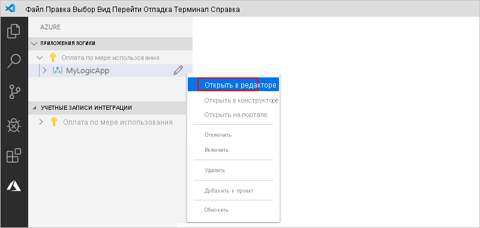

   Visual Studio Code открывает файл .logicapp.json в локальной временной папке, чтобы можно было просмотреть определение рабочего процесса приложения логики.

   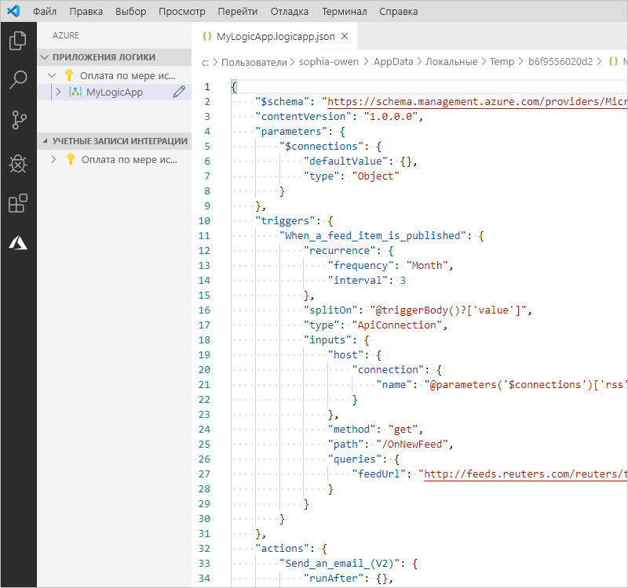

1. Внесите изменения в определение рабочего процесса приложения логики.

1. Сохраните изменения, когда закончите. (Меню "Файл > Сохранить" или нажмите клавиши CTRL + S)

1. При появлении запроса на отправку изменений и *перезапись* имеющегося приложения логики на портале Azure выберите пункт **Отправить**.

   На этом этапе обновления для приложения логики публикуются на [портале Azure](https://portal.azure.com).

   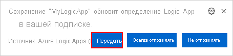

## <a name="view-or-promote-other-versions"></a>Просмотр или повышение уровня других версий

В Visual Studio Code можно открыть и проверить более ранние версии приложения логики, а также повысить уровень версии с более ранней на текущую.

> [!IMPORTANT] 
> Прежде чем изменять работающее приложение логики в рабочей среде, устраните риск нарушения работы этого приложения логики и сократите период такого нарушения, [отключив его](#disable-enable-logic-app).

1. В окне Azure в разделе **Logic Apps** разверните подписку Azure, чтобы можно было просмотреть все приложения логики в этой подписке.

1. Разверните приложение логики в подписке и узел **Версии**.

   В списке **Версии** отображаются более ранние версии приложения логики, если они существуют.

   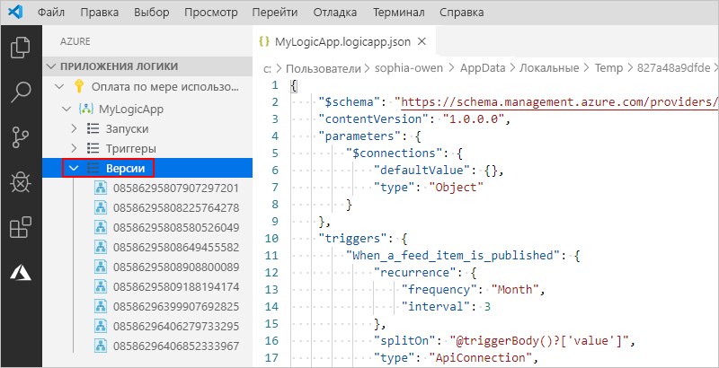

1. Чтобы просмотреть более раннюю версию, выберите одно из следующих действий:

   * Чтобы просмотреть определение JSON, в разделе **Версии** выберите номер версии для этого определения. Вы также можете открыть контекстное меню этой версии и выбрать пункт **Open in Editor** (Открыть в редакторе).

     На локальном компьютере откроется новый файл, в котором будет показано определение JSON этой версии.

   * Чтобы просмотреть версию в режиме конструктора только для чтения, откройте контекстное меню этой версии и выберите пункт **Open in Designer** (Открыть в конструкторе).

1. Чтобы повысить уровень версии с более раннего на текущий, сделайте следующее:

   1. В разделе **Версии** откройте контекстное меню более ранней версии и выберите пункт **Повысить уровень**.

      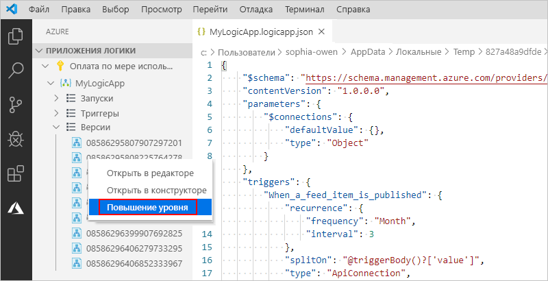

   1. Visual Studio Code запросит подтверждение. Чтобы продолжить, нажмите кнопку **Да**.

      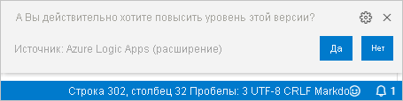

      Visual Studio Code повышает уровень выбранной версии до уровня текущей версии и присваивает этой версии новый номер. Ранее текущая версия отображается теперь как версия повышенного уровня.

## <a name="next-steps"></a>Дополнительная информация

> [!div class="nextstepaction"]
> [Создание приложений логики в Visual Studio](../logic-apps/quickstart-create-logic-apps-with-visual-studio.md)