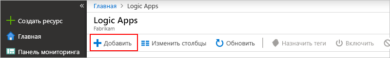

# <a name="tutorial-automate-tasks-to-process-emails-by-using-azure-logic-apps-azure-functions-and-azure-storage"></a>Руководство по Автоматизация задач обработки сообщений электронной почты с помощью Azure Logic Apps, Функций Azure и службы хранилища Azure

Azure Logic Apps дает возможность автоматизировать рабочие процессы и интегрировать данные в различные службы Azure, Майкрософт, локальные системы и другие приложения SaaS (программное обеспечение как услуга). В этом руководстве показано, как создать [приложение логики](../logic-apps/logic-apps-overview.md), которое обрабатывает входящие электронные письма и вложения. Это логическое приложение анализирует содержимое электронных писем, сохраняет его в хранилище Azure и отправляет уведомления для просмотра этого содержимого.

Из этого руководства вы узнаете, как выполнять следующие задачи:

> [!div class="checklist"]
> * Настройка [хранилища Azure](../storage/common/storage-introduction.md) и Обозревателя службы хранилища для проверки сохраненных электронных писем и вложений.
> * Создание [функции Azure](../azure-functions/functions-overview.md), которая удаляет HTML из электронных писем. В этом руководстве содержится код, который можно использовать для этой функции.
> * Создание пустого приложения логики.
> * Добавление триггера, который отслеживает сообщения электронной почты для вложений.
> * Добавление условия, которое проверяет наличие вложений в сообщениях электронной почты.
> * Добавление действия, которое вызывает функцию Azure при наличии вложения в сообщении электронной почты.
> * Добавление действия, которое создает хранилище BLOB-объектов для сообщения электронной почты и вложений.
> * Добавление действия, которое отправляет электронные уведомления.

По завершении приложение логики будет выглядеть как этот высокоуровневый рабочий процесс:


## <a name="prerequisites"></a>Предварительные требования

* Подписка Azure. Если у вас еще нет подписки Azure, [зарегистрируйтесь для получения бесплатной учетной записи Azure](https://azure.microsoft.com/free/).

* Учетная запись электронной почты поставщика услуг электронной почты, поддерживаемого Logic Apps, например Office 365 Outlook, Outlook.com или Gmail. Сведения о дополнительных поставщиках см. в [списке соединителей](https://docs.microsoft.com/connectors/).

  Это приложение логики использует учетную запись Office 365 Outlook. Если используется другая учетная запись электронной почты, общие шаги остаются неизменными, однако интерфейс может выглядеть несколько иначе.

* Скачайте и установите [бесплатный Обозреватель хранилищ Microsoft Azure](https://storageexplorer.com/). Это средство помогает проверить, правильно ли настроен контейнер хранилища.

## <a name="sign-in-to-azure-portal"></a>Вход на портал Azure

Войдите на [портал Azure](https://portal.azure.com) с помощью учетных данных учетной записи Azure.

## <a name="set-up-storage-to-save-attachments"></a>Настройка хранилища для сохранения вложений

Входящие сообщения электронной почты и вложения можно сохранить в виде больших двоичных объектов в [контейнере хранилища Azure](../storage/common/storage-introduction.md).

1. Прежде чем создать контейнер хранилища, [создайте учетную запись хранения](../storage/common/storage-quickstart-create-account.md), указав приведенные параметры на вкладке **Основы** на портале Azure.

   | Параметр | Значение | ОПИСАНИЕ |
   |---------|-------|-------------|
   | **подписка** | <*Azure-subscription-name*> | Имя подписки Azure. |  
   | **группа ресурсов** | <*Azure-resource-group*> | Имя [группы ресурсов Azure](../azure-resource-manager/resource-group-overview.md), используемой для упорядочения связанных ресурсов и управления ими. В этом примере используется "LA-Tutorial-RG". <p>**Примечание.** Группа ресурсов существует в определенном регионе. Хотя элементы из этого руководства могут быть недоступны во всех регионах, попробуйте по возможности использовать тот же регион. |
   | **Имя учетной записи хранения** | <*Azure-storage-account-name*> | Имя учетной записи хранения, которое должно содержать от 3 до 24 символов и которое может включать только строчные буквы и цифры. В этом примере используется "attachmentstorageacct". |
   | **Местоположение.** | <*Azure-region*> | Регион для хранения сведений об учетной записи хранения. В этом примере используется регион "Западная часть США". |
   | **Производительность** | Стандартная | Этот параметр определяет поддерживаемые типы данных и носители для хранения данных. См. раздел [Типы учетных записей хранения](../storage/common/storage-introduction.md#types-of-storage-accounts). |
   | **Account kind** (Тип учетной записи) | Общего назначения | [Тип учетной записи хранения](../storage/common/storage-introduction.md#types-of-storage-accounts) |
   | **Репликация** | Локально избыточное хранилище (LRS) | Этот параметр указывает, как копируются, хранятся, управляются и синхронизируются данные. См. статью [Локально избыточное хранилище (LRS): недорогое средство, чтобы обеспечить избыточность данных для службы хранилища Azure](../storage/common/storage-redundancy-lrs.md). |
   | **Уровень доступа (по умолчанию)** | Сохраняет текущее значение параметра. |
   ||||

   На вкладке **Расширенный** выберите следующий параметр.

   | Параметр | Значение | ОПИСАНИЕ |
   |---------|-------|-------------|
   | **Secure transfer required** (Требуется безопасное перемещение) | Отключено | Этот параметр указывает параметры безопасности, требуемые для запросов подключений. См. статью [Require secure transfer in Azure Storage](../storage/common/storage-require-secure-transfer.md) (Требование безопасной передачи в службе хранилища Azure). |
   ||||

   Учетную запись хранения также можно создать с помощью [Azure PowerShell](../storage/common/storage-quickstart-create-storage-account-powershell.md) или [Azure CLI](../storage/common/storage-quickstart-create-storage-account-cli.md).

1. Когда все будет готово, выберите **Просмотр и создание**.

1. После развертывания учетной записи хранения в Azure найдите учетную запись хранения и получите ключ доступа к ней:

   1. В меню учетной записи хранения в разделе **Параметры** выберите **Ключи доступа**.

   1. Скопируйте имя учетной записи хранения и ключ **key1**, сохраните эти значения в безопасном месте.

      

   Получить ключ доступа к учетной записи хранения также можно с помощью [Azure PowerShell](https://docs.microsoft.com/powershell/module/az.storage/get-azstorageaccountkey) или [Azure CLI](https://docs.microsoft.com/cli/azure/storage/account/keys?view=azure-cli-latest.md#az-storage-account-keys-list).

1. Создайте контейнер хранилища BLOB-объектов для вложений электронной почты.

   1. В меню учетной записи хранения выберите **Обзор**. В разделе **Службы** выберите **Контейнеры**.

      

   1. После того, как откроется страница **Контейнеры**, на панели инструментов выберите **Контейнер**.

   1. В разделе **Создание контейнера** введите `attachments` в качестве имени контейнера. В разделе **Общедоступный уровень доступа** выберите **Container (anonymous read access for containers and blobs) (Контейнер (анонимный доступ на чтение к контейнерам и большим двоичным объектам))**  > **ОК**.

      После завершения можно найти контейнер хранилища в учетной записи на портале Azure:

      

   Контейнер хранилища также можно создать с помощью [Azure PowerShell](https://docs.microsoft.com/powershell/module/az.storage/new-azstoragecontainer) или [Azure CLI](https://docs.microsoft.com/cli/azure/storage/container?view=azure-cli-latest#az-storage-container-create).

Подключите Обозреватель службы хранилища к учетной записи.

## <a name="set-up-storage-explorer"></a>Настройка Обозревателя службы хранилища

Теперь подключите Обозреватель службы хранилища к учетной записи хранения, чтобы убедиться, что ваше приложение логики правильно сохраняет вложения как большие двоичные объекты в контейнере хранилища.

1. Запустите Microsoft Azure Storage Explorer.

   Обозреватель службы хранилища запросит подключение к вашей учетной записи хранения.

1. На панели **Подключение к службе хранилища Azure** выберите **Использовать имя и ключ учетной записи хранения** > **Далее**.

   

   > [!TIP]
   > Если запрос не отображается, выберите **Добавить учетную запись** на панели инструментов Обозревателя службы хранилища.

1. В разделе **Отображаемое имя** введите понятное имя для подключения. В разделе **Имя учетной записи** укажите имя своей учетной записи хранения. В разделе **Ключ учетной записи** укажите ключ доступа, сохраненный ранее, и выберите **Далее**.

1. Подтвердите сведения о подключении, а затем выберите **Подключить**.

   Обозреватель службы хранилища создает подключение. Ваша учетная запись хранения отображается в окне Обозревателя в разделе **Local & Attached** (Локальные и присоединенные)  > **Учетные записи хранения**.

1. Чтобы найти свой контейнер хранилища BLOB-объектов, в разделе **Учетные записи хранения** разверните свою учетную запись хранения **attachmentstorageacct**, **Blob Containers** (Контейнеры больших двоичных объектов), в которых находится контейнер **attachments**, например:

   

Создайте [функцию Azure](../azure-functions/functions-overview.md), которая удаляет HTML из входящей электронной почты.

## <a name="create-function-to-clean-html"></a>Создание функции для очистки HTML

Теперь используйте фрагмент кода, предоставленный в руководстве, для создания функции Azure, которая удаляет HTML из каждого входящего сообщения электронной почты. Таким образом, содержимое электронной почты становится более простым в обработке. Затем можно вызвать эту функцию с помощью приложения логики.

1. Перед созданием функции [создайте приложение-функцию](../azure-functions/functions-create-function-app-portal.md) с такими параметрами:

   | Параметр | Значение | ОПИСАНИЕ |
   | ------- | ----- | ----------- |
   | **Имя приложения** | <*function-app-name*> | Имя приложения-функции должно быть максимально уникальным в пределах Azure. В этом примере уже используется "CleanTextFunctionApp", поэтому укажите другое имя, например "MyCleanTextFunctionApp-<*ваше имя*>" |
   | **подписка** | <*Имя вашей подписки Azure*> | Та же подписка Azure, которая использовалась ранее |
   | **Группа ресурсов** | LA-Tutorial-RG | Та же группа ресурсов Azure, которая использовалась ранее |
   | **ОС** | <*операционная система*> | Выберите операционную систему, которая поддерживает нужный функциональный язык программирования. Для этого примера выберите **Windows**. |
   | **План размещения** | План потребления | Этот параметр определяет способ распределения и масштабирования ресурсов, например вычислительной мощности, для выполнения приложения-функции. См. статью [Масштабирование и размещение Функций Azure](../azure-functions/functions-scale.md). |
   | **Местоположение.** | Запад США | Регион, использованный ранее |
   | **Стек среды выполнения** | Предпочитаемый язык | Выберите среду выполнения, которая поддерживает нужный функциональный язык программирования. Выберите **.NET** для функций C# и F#. |
   | **Хранилище** | cleantextfunctionstorageacct | Создайте учетную запись хранения для приложения-функции. Вы можете использовать только строчные буквы и цифры. <p>**Примечание.** Эта учетная запись хранения содержит приложения-функции и отличается от ранее созданной учетной записи хранения для вложений электронной почты. |
   | **Application Insights** | Disable | Включает мониторинг приложения с помощью [Application Insights](../azure-monitor/app/app-insights-overview.md). В рамках этого руководства установите параметр **Отключить** > **Применить**. |
   ||||

   Если приложение-функция не открывается автоматически после развертывания, в поле поиска [портал Azure](https://portal.azure.com) найдите и выберите **Приложение-функция**. В разделе **Приложение-функция** выберите ваше приложение функции.

   

   В противном случае Azure автоматически откроет приложение-функцию, как показано ниже:

   

   Приложение-функцию можно также создать с помощью [Azure CLI](../azure-functions/functions-create-first-azure-function-azure-cli.md) или [шаблонов PowerShell и Resource Manager](../azure-resource-manager/resource-group-template-deploy.md).

1. Разверните приложение в списке **Приложения-функции**, если оно еще не развернуто. В разделе приложения-функции выберите **Функции**. На панели инструментов функций выберите **Новая функция**.

   

1. В разделе **Choose a template below or go to the quickstart** (Выберите шаблон ниже или перейдите к краткому руководству) выберите шаблон **Триггер HTTP**.

   

   Azure создает функцию, используя шаблон функции, активируемой HTTP-запросом, для конкретного языка.

1. В области **Новая функция** в разделе **Имя** введите `RemoveHTMLFunction`. В разделе **Уровень авторизации** оставьте значение **Функция** и выберите **Создать**.

   

1. После того как редактор откроется, замените код шаблона на этот код, который удаляет HTML и возвращает результаты вызывающему объекту:

   ```CSharp
   #r "Newtonsoft.Json"

   using System.Net;
   using Microsoft.AspNetCore.Mvc;
   using Microsoft.Extensions.Primitives;
   using Newtonsoft.Json;
   using System.Text.RegularExpressions;

   public static async Task<IActionResult> Run(HttpRequest req, ILogger log) {

      log.LogInformation("HttpWebhook triggered");

      // Parse query parameter
      string emailBodyContent = await new StreamReader(req.Body).ReadToEndAsync();

      // Replace HTML with other characters
      string updatedBody = Regex.Replace(emailBodyContent, "<.*?>", string.Empty);
      updatedBody = updatedBody.Replace("\\r\\n", " ");
      updatedBody = updatedBody.Replace(@"&nbsp;", " ");

      // Return cleaned text
      return (ActionResult)new OkObjectResult(new { updatedBody });
   }
   ```

1. Когда все будет готово, нажмите кнопку **Сохранить**. Чтобы проверить функцию, выберите **Тестирование** под значком стрелки ( **<** ) на правой границе редактора.

   

1. В области **Тестирование** в разделе **Текст запроса** введите следующую строку и выберите **Запуск**.

   `{"name": "<p><p>Testing my function</br></p></p>"}`

   

   В окне **Выходные данные** отображается результат, возвращаемый функцией:

   ```json
   {"updatedBody":"{\"name\": \"Testing my function\"}"}
   ```

После проверки работоспособности функции создайте приложение логики. Хотя в этом руководстве рассказывается, как создать функцию, которая удаляет HTML из сообщений электронной почты, в Logic Apps также имеется соединитель, преобразующий **HTML в текст**.

## <a name="create-your-logic-app"></a>Создание приложения логики

1. На домашней странице Azure найдите с помощью поля поиска и выберите **Logic Apps**.

   

1. На странице **Logic Apps** нажмите **Добавить**.

   

1. В разделе **Создание приложения логики** предоставьте сведения о приложении логики, как показано здесь. Когда все будет готово, выберите **Создать**.

   

   | Параметр | Значение | ОПИСАНИЕ |
   | ------- | ----- | ----------- |
   | **Имя** | LA-ProcessAttachment | Имя приложения логики. |
   | **подписка** | <*Имя вашей подписки Azure*> | Та же подписка Azure, которая использовалась ранее |
   | **группа ресурсов** | LA-Tutorial-RG | Та же группа ресурсов Azure, которая использовалась ранее |
   | **Местоположение.** | Запад США | Регион, использованный ранее |
   | **Служба Log Analytics** | Отключить | В рамках этого руководства выберите параметр **Отключено**. |
   ||||

1. После развертывания приложения в Azure на панели инструментов Azure выберите значок уведомления и выберите **Перейти к ресурсу**.

   

1. После открытия конструктор Logic Apps отобразит страницу с вводным видео и шаблонами шаблонов общих шаблонов приложений логики. В разделе **Шаблоны** выберите **Пустое приложение логики**.

   

Затем добавьте [триггер](../logic-apps/logic-apps-overview.md#logic-app-concepts), который ожидает передачи входящих сообщений электронной почты с вложениями. Каждое приложение логики должно запускаться по триггеру, который активируется, когда происходит определенное событие или если новые данные соответствуют заданным условиям. Дополнительные сведения см. в статье о [создании первого приложения логики](../logic-apps/quickstart-create-first-logic-app-workflow.md).

## <a name="monitor-incoming-email"></a>Мониторинг входящей электронной почты

1. В конструкторе в поле поиска введите `when new email arrives` в качестве фильтра. Выберите этот триггер для своего поставщика электронной почты: **Когда приходит новое электронное письмо — <*ваш поставщик услуг электронной почты*>** .

   Например:

   

   * Для рабочих или учебных учетных записей Azure выберите Office 365 Outlook.

   * Для личных учетных записей Майкрософт выберите Outlook.com.

1. При появлении запроса учетных данных войдите в свою учетную запись электронной почты для подключения к этой учетной записи в Logic Apps.

1. Теперь укажите критерии, используемые триггером для фильтрации новых сообщений электронной почты.

   1. Укажите параметры, описанные ниже, для проверки сообщений электронной почты.

      

      | Параметр | Значение | ОПИСАНИЕ |
      | ------- | ----- | ----------- |
      | **Папка** | Папка "Входящие" | Папка электронной почты для мониторинга |
      | **Has Attachment** (С вложением) | Yes | Получать только письма с вложениями. <p>**Примечание.** Триггер не удаляет никакие электронные письма из вашей учетной записи, а проверяет только новые сообщения и обрабатывает только те электронные письма, которые соответствуют фильтру темы. |
      | **Включить вложения** | Yes | Получать вложения в качестве входных данных для рабочего процесса, а не просто проверять вложения. |
      | **Интервал** | 1 | Количество интервалов ожидания между проверками. |
      | **Frequency** | Минута | Единица измерения времени для каждого интервала между проверками |
      ||||
  
   1. Из списка **Добавить новый параметр** выберите **Фильтр темы**.

   1. После появления поля **Фильтр темы** в действии укажите тему, как показано ниже.

      | Параметр | Значение | ОПИСАНИЕ |
      | ------- | ----- | ----------- |
      | **Фильтр темы** | `Business Analyst 2 #423501` | Текст для поиска в темах сообщений |
      ||||

1. Чтобы скрыть сведения о триггере, щелкните внутри заголовка окна триггера.

   

1. Сохраните приложение логики. На панели инструментов конструктора щелкните **Сохранить**.

   Теперь приложение логики активно, но оно только проверяет электронную почту. Затем добавьте условие, которое указывает критерии для продолжения рабочего процесса.

## <a name="check-for-attachments"></a>Проверка вложений

Теперь добавьте условие, которое выбирает только письма с вложениями.

1. В разделе триггера щелкните **Добавить шаг**.

   

1. В разделе **Выберите действие**, введите в поле поиска `condition`. Выбор действия **Condition**

   

   1. Переименуйте условие, чтобы оно содержало более понятное описание. В строке заголовка условия нажмите кнопку с многоточием ( **…** ) и выберите **Переименовать**.

      

   1. Переименуйте условие, используя описание: `If email has attachments and key subject phrase`.

1. Создайте условие, которое проверяет наличие сообщений электронной почты с вложениями.

   1. В первой строке в разделе **И** щелкните поле слева. В появившемся списке динамического содержимого выберите свойство **С вложением**.

      

   1. В среднем поле укажите для оператора значение **равно**.

   1. В поле справа введите **true** в качестве значения для сравнения со значением свойства **С вложением**, указанного для триггера.

      

      Если оба значения равны, сообщение имеет по крайней мере одно вложение, передается условие и рабочий процесс продолжает работу.

   В базовом определении приложения логики, которое вы можете просмотреть в окне редактора кода, это условие выглядит следующим образом:

   ```json
   "Condition": {
      "actions": { <actions-to-run-when-condition-passes> },
      "expression": {
         "and": [ {
            "equals": [
               "@triggerBody()?['HasAttachment']",
                 "true"
            ]
         } ]
      },
      "runAfter": {},
      "type": "If"
   }
   ```

1. Сохраните приложение логики. На панели инструментов конструктора щелкните **Сохранить**.

### <a name="test-your-condition"></a>Проверка условия

Теперь проверьте правильность работы условия:

1. Если приложение логики еще не запущено, выберите **Запуск** на панели инструментов конструктора.

   На этом шаге приложение логики запускается вручную без необходимости ожидания указанного интервала времени. Тем не менее ничего не произойдет, пока не поступит тестовое сообщение электронной почты в папку "Входящие".

1. Отправьте электронное сообщение, которое соответствует этому критерию:

   * Тема электронного сообщения содержит текст, который указан в триггере **субъекта фильтра**: `Business Analyst 2 #423501`

   * Сообщение электронной почты имеет одно вложение. Теперь создайте один пустой текстовый файл и вложите его в электронное сообщение.

   Когда приходит сообщение электронной почты, приложение логики проверяет вложения и указанный текст темы. Если условие выполняется успешно, срабатывает триггер и обработчик Logic Apps создает экземпляр приложения логики и запускает рабочий процесс.

1. Чтобы убедиться, что триггер сработал и приложение логики удачно запустилось, в меню приложения логики выберите **Обзор**.

   

   Если приложение логики не запускается несмотря на срабатывание триггера, см. статью [Диагностика и устранение сбоев приложений логики](../logic-apps/logic-apps-diagnosing-failures.md).

Определите действия, выполняемые в ветви **Если истинно**. Чтобы сохранить сообщение электронной почты и вложения, удалите любой HTML из текста электронной почты, затем создайте большие двоичные объекты в контейнере для хранения электронной почты и вложений.

> [!NOTE]
> Приложение логики не должно выполнять никаких действий в ветви **Если ложно**, если сообщение электронной почты не имеет вложения. В качестве дополнительного упражнения после завершения работы с этим руководством вы можете добавить любое подходящее действие, которое вы хотите выполнить для ветви **Если ложно**.

## <a name="call-removehtmlfunction"></a>Вызов RemoveHTMLFunction

На этом шаге вы добавите ранее созданную функцию Azure в приложение логики и отправите содержимое электронного письма из триггера электронной почты в функцию.

1. В меню приложения логики выберите **Конструктор приложений логики**. Внутри ветви **Если истинно** выберите **Добавить действие**.

   

1. В поле поиска введите "функции azure" и выберите действие: **Choose an Azure function — Azure Functions** (Выбор функции Azure — Функции Azure).

   

1. Выберите ранее созданное приложение-функцию, которое в этом примере называется `CleanTextFunctionApp`:

   

1. Теперь выберите свою функцию: **RemoveHTMLFunction**.

   

1. Переименуйте фигуру функции с использованием этого описания: `Call RemoveHTMLFunction to clean email body`.

1. Теперь укажите входные данные для обработки с помощью функции.

   1. В разделе **Текст запроса** введите этот текст с пробелом в конце:

      `{ "emailBody":`

      Пока вы будете работать с этими входными данными на следующих шагах, будет отображаться сообщение об ошибке о недопустимом формате JSON. При тестировании этой функции ранее входные данные, указанные для данной функции, использовали JavaScript Object Notation (JSON). Таким образом, текст запроса должен использовать тот же формат.

      Кроме того, когда ваш курсор находится внутри поля **Текст запроса**, появляется список динамического содержимого, поэтому вы можете выбрать значения свойств, доступные из предыдущих действий.

   1. Из списка динамического содержимого в разделе **Когда приходит новое электронное письмо** выберите свойство **Текст**. После этого свойства добавьте закрывающую фигурную скобку: `}`

      

   В итоге входные данные функции должны выглядеть приблизительно так, как показано в примере ниже:

   

1. Сохраните приложение логики.

Затем добавьте действие, создающее большой двоичный объект в контейнере хранилища для сохранения текста электронного сообщения.

## <a name="create-blob-for-email-body"></a>Создание большого двоичного объекта для текста электронного сообщения

1. В блоке **Если истинно** и в разделе функции Azure выберите **Добавить действие**.

1. В поле поиска в качестве фильтра введите `create blob` и выберите действие: **Создать BLOB-объект**

   

1. Установите подключение к своей учетной записи хранения с этими параметрами, как показано ниже. Когда все будет готово, выберите **Создать**.

   

   | Параметр | Значение | ОПИСАНИЕ |
   | ------- | ----- | ----------- |
   | **Имя подключения** | AttachmentStorageConnection | Описательное имя для подключения |
   | **Учетная запись хранения** | attachmentstorageacct | Имя учетной записи хранения, созданной ранее для сохранения вложений |
   ||||

1. Переименуйте действие **Создать BLOB-объект** с использованием этого описания: `Create blob for email body`.

1. В действии **Создать BLOB-объект** укажите эти сведения и выберите поля, чтобы создать большой двоичный объект, как показано и описано:

   

   | Параметр | Значение | ОПИСАНИЕ |
   | ------- | ----- | ----------- |
   | **Путь к папке** | /attachments | Путь и имя контейнера, созданные ранее. В этом примере щелкните значок папки, а затем выберите контейнер /attachments. |
   | **Имя BLOB-объекта** | Поле **От** | В этом примере в качестве имени большого двоичного объекта используйте имя отправителя. Щелкните это поле, чтобы открылся список динамического содержимого, а затем выберите поле **От** в разделе действия **Когда приходит новое электронное письмо**. |
   | **Содержимое BLOB-объекта** | Поле **Содержимое** | В этом примере используйте текст электронного сообщения без HTML в качестве содержимого большого двоичного объекта. Щелкните это поле, чтобы появился список динамического содержимого, а затем выберите **Текст** в разделе действия **Call RemoveHTMLFunction to clean email body** (Вызов функции RemoveHTMLFunction для удаления текста электронного сообщения). |
   ||||

   В итоге действие должно выглядеть приблизительно так, как показано в примере ниже:

   

1. Сохраните приложение логики.

### <a name="check-attachment-handling"></a>Проверка обработки вложений

Теперь проверьте, обрабатывает ли приложение логики электронные сообщения выбранным способом:

1. Если приложение логики еще не запущено, выберите **Запуск** на панели инструментов конструктора.

1. Отправьте электронное сообщение, которое соответствует этому критерию:

   * Тема электронного сообщения содержит текст, который указан в триггере **субъекта фильтра**: `Business Analyst 2 #423501`

   * Ваше электронное сообщение содержит по крайней мере одно вложение. Теперь создайте один пустой текстовый файл и вложите его в электронное сообщение.

   * Ваше электронное сообщение имеет тестовое содержимое в тексте, например: `Testing my logic app`

   Если приложение логики не запускается несмотря на срабатывание триггера, см. статью [Диагностика и устранение сбоев приложений логики](../logic-apps/logic-apps-diagnosing-failures.md).

1. Убедитесь, что приложение логики сохранило электронное сообщение в правильный контейнер хранилища.

   1. В Обозревателе службы хранилища разверните узел **(Local & Attached) (Локальные и присоединенные)**  > **Учетные записи хранения** > **attachmentstorageacct (Key)**  > **Контейнеры BLOB-объектов** > **attachments**.

   1. Проверьте контейнер электронных сообщений **attachments**.

      На данный момент в контейнере появляются только электронные сообщения, потому что приложение логики еще не обрабатывает вложения.

      

   1. Затем удалите электронные сообщения в Обозревателе службы хранилища.

1. При желании для проверки ветви **Если ложно**, которая пока не активна, вы можете отправить электронное письмо, не соответствующее критериям.

Добавьте цикл для обработки всех вложений электронной почты.

## <a name="process-attachments"></a>Обработка вложений

Для обработки каждого вложения в электронном сообщении добавьте цикл **For each** в рабочий процесс приложения логики.

1. В области фигуры **Создание большого двоичного объекта для текста электронного сообщения** выберите **Добавить действие**.

   

1. В разделе **Выберите действие**введите фильтр `for each` в поле поиска и выберите следующее действие: **For each** (Для каждого)

   

1. Переименуйте цикл, используя описание: `For each email attachment`.

1. Теперь укажите данные для обработки цикла. Щелкните в текстовом поле **Select an output from previous steps** (Выберите выходные данные из предыдущих шагов), чтобы открыть список динамического содержимого и выберите **Вложения**.

   

   Поле **Вложения** передает массив, содержащий все вложения, включенные в электронные сообщения. Цикл **For each** повторяет действия для каждого элемента, который передается в массив.

1. Сохраните приложение логики.

Добавьте действие, которое сохраняет каждое вложение в виде большого двоичного объекта в контейнере хранилища **attachments**.

## <a name="create-blob-for-each-attachment"></a>Создание большого двоичного объекта для каждого вложения

1. В цикле **For each email attachment** (Для каждого вложения электронной почты) выберите **Добавить действие**, чтобы назначить задачу для каждого найденного вложения.

   

1. В поле поиска в качестве фильтра введите `create blob` и выберите действие: **Создать BLOB-объект**

   

1. Переименуйте действие **Создать BLOB-объект 2** с использованием этого описания: `Create blob for each email attachment`.

1. В действии **Create blob for each email attachment** (Создать большой двоичный объект для каждого вложения электронной почты) укажите эти сведения и выберите свойства для каждого большого двоичного объекта, который вы хотите создать, как показано и описано:

   

   | Параметр | Значение | ОПИСАНИЕ |
   | ------- | ----- | ----------- |
   | **Путь к папке** | /attachments | Путь и имя контейнера, созданные ранее. В этом примере щелкните значок папки, а затем выберите контейнер /attachments. |
   | **Имя BLOB-объекта** | Поле **Имя** | В этом примере в качестве имени большого двоичного объекта используйте имя вложения. Щелкните это поле, чтобы открылся список динамического содержимого, а затем выберите поле **Имя** в разделе действия **Когда приходит новое электронное письмо**. |
   | **Содержимое BLOB-объекта** | Поле **Содержимое** | В этом примере в качестве содержимого большого двоичного объекта используйте поле **Содержимое**. Щелкните это поле, чтобы открылся список динамического содержимого, а затем выберите поле **Содержимое** в разделе действия **Когда приходит новое электронное письмо**. |
   ||||

   В итоге действие должно выглядеть приблизительно так, как показано в примере ниже:

   

1. Сохраните приложение логики.

### <a name="check-attachment-handling"></a>Проверка обработки вложений

Затем проверьте, обрабатывает ли приложение логики вложения так, как вы указали:

1. Если приложение логики еще не запущено, выберите **Запуск** на панели инструментов конструктора.

1. Отправьте электронное сообщение, которое соответствует этому критерию:

   * Тема электронного сообщения содержит текст, который указан в свойстве триггера **Субъект фильтра**: `Business Analyst 2 #423501`

   * Ваше электронное сообщение содержит по крайней мере два вложения. Теперь создайте два пустых текстовых файла и вложите их в электронное сообщение.

   Если приложение логики не запускается несмотря на срабатывание триггера, см. статью [Диагностика и устранение сбоев приложений логики](../logic-apps/logic-apps-diagnosing-failures.md).

1. Убедитесь, что приложение логики сохранило электронное сообщение и вложения в правильный контейнер хранилища.

   1. В Обозревателе службы хранилища разверните узел **(Local & Attached) (Локальные и присоединенные)**  > **Учетные записи хранения** > **attachmentstorageacct (Key)**  > **Контейнеры BLOB-объектов** > **attachments**.

   1. Проверьте электронное сообщение и вложения в контейнере **attachments**.

      

   1. Затем удалите электронное сообщение и вложения в Обозревателе службы хранилища.

Добавьте действие, чтобы приложение логики отправляло электронное сообщение для просмотра вложений.

## <a name="send-email-notifications"></a>Отправка уведомлений по электронной почте

1. В ветви **Если истинно** в цикле **For each email attachment** (Для каждого вложения электронной почты) выберите **Добавить действие**.

   

1. В поле поиска в качестве фильтра введите `send email`, а затем выберите действие "отправить сообщение электронной почты" для поставщика электронной почты.

   Чтобы отфильтровать список действий для определенной службы, можно сначала выбрать соединитель.

   

   * Для рабочих или учебных учетных записей Azure выберите Office 365 Outlook.

   * Для личных учетных записей Майкрософт выберите Outlook.com.

1. При появлении запроса на ввод учетных данных войдите в свою учетную запись электронной почты для установки подключения к этой учетной записи в Logic Apps.

1. Переименуйте действие **Отправить сообщение электронной почты** с использованием этого описания: `Send email for review`.

1. Укажите сведения для этого действия и выберите поля, которые следует добавить в электронное сообщение, как показано и описано. Чтобы добавить пустые строки в поле редактирования, нажмите Shift + ВВОД.

   

   Если требуемое поле не удается найти в списке динамического содержимого, выберите **Еще** рядом с полем **Когда приходит новое электронное письмо**.

   | Параметр | Значение | Примечания |
   | ------- | ----- | ----- |
   | **To** | <*электронный адрес получателя*> | Для тестировании можете использовать свой собственный адрес. |
   | **Тема**  | ```ASAP - Review applicant for position:``` **Тема** | Тема электронного письма, которую необходимо указать. Щелкните это поле, введите текст примера и из списка динамического содержимого выберите в разделе **Когда приходит новое электронное письмо** поле **Тема**. |
   | **Текст** | ```Please review new applicant:``` <p>```Applicant name:``` **От** <p>```Application file location:``` **Путь** <p>```Application email content:``` **Текст** | Содержимое текста электронного сообщения. Щелкните это поле, введите текст примера и из списка динамического содержимого выберите следующие поля: <p>— Поле **От** в разделе **Когда приходит новое электронное письмо**. </br>— Поле **Путь** в разделе **Create blob for email body** (Создание большого двоичного объекта в тексте электронного сообщения). </br>— **Текст** в разделе **Call RemoveHTMLFunction to clean email body** (Вызов функции RemoveHTMLFunction для удаления текста электронного сообщения). |
   ||||

   > [!NOTE]
   > Если вы выбрали поле с массивом, в котором содержатся вложения, например **Содержимое**, конструктор автоматически добавляет цикл For each для действия, которое ссылается на это поле. Таким образом приложение логики будет выполнять это действие для каждого элемента массива. Чтобы удалить цикл, удалите поле массива, переместите ссылочное действие за пределы цикла, нажмите кнопку с многоточием ( **...** ) на панели заголовка цикла и щелкните **Удалить**.

1. Сохраните приложение логики.

Теперь протестируйте приложение логики, которое выглядит, как показано в примере:


## <a name="run-your-logic-app"></a>Запуск приложения логики

1. Отправьте электронное сообщение, которое соответствует этому критерию:

   * Тема электронного сообщения содержит текст, который указан в свойстве триггера **Субъект фильтра**: `Business Analyst 2 #423501`

   * Ваше электронное сообщение содержит одно или несколько вложений. Вы можете повторно использовать пустой текстовый файл из предыдущего теста. Для более реалистичного сценария присоедините файл резюме.

   * Текстом электронного сообщения будет этот текст, который можно скопировать и вставить.

     ```text

     Name: Jamal Hartnett

     Street address: 12345 Anywhere Road

     City: Any Town

     State or Country: Any State

     Postal code: 00000

     Email address: jamhartnett@outlook.com

     Phone number: 000-000-0000

     Position: Business Analyst 2 #423501

     Technical skills: Dynamics CRM, MySQL, Microsoft SQL Server, JavaScript, Perl, Power BI, Tableau, Microsoft Office: Excel, Visio, Word, PowerPoint, SharePoint, and Outlook

     Professional skills: Data, process, workflow, statistics, risk analysis, modeling; technical writing, expert communicator and presenter, logical and analytical thinker, team builder, mediator, negotiator, self-starter, self-managing  

     Certifications: Six Sigma Green Belt, Lean Project Management

     Language skills: English, Mandarin, Spanish

     Education: Master of Business Administration
     ```

1. Запустите приложение логики. В случае успешного запуска приложение логики отправляет электронное сообщение, которое выглядит как в следующем примере:

   

   Если электронные сообщения не приходят, проверьте папку нежелательной почты. Фильтр нежелательной почты может перенаправлять такие виды электронных сообщений. В противном случае, если вы не уверены, что приложение логики работает правильно, см. статью [Диагностика сбоев приложений логики](../logic-apps/logic-apps-diagnosing-failures.md).

Поздравляем, вы создали и запустили приложение логики, которое автоматизирует задачи в различных службах Azure и вызывает пользовательский код.

## <a name="clean-up-resources"></a>Очистка ресурсов

Если этот образец больше не нужен, удалите группу ресурсов, содержащую приложение логики и связанные ресурсы.

1. В главном меню Azure выберите **Группы ресурсов**. В списке группы ресурсов выберите группу ресурсов для этого учебника. На вкладке **Обзор** выберите **Удалить группу ресурсов**.

   

1. Когда отобразится панель подтверждения, введите имя группы ресурсов и выберите **Удалить**.

## <a name="next-steps"></a>Дополнительная информация

В этом руководстве вы ознакомились с созданием приложения логики, с помощью которого можно обрабатывать и сохранять вложения электронной почты путем интеграции служб Azure, например службы хранилища Azure и функций Azure. Теперь узнайте о других соединителях, которые можно использовать для создания приложений логики.

> [!div class="nextstepaction"]
> [Connectors list](../connectors/apis-list.md) (Список соединителей)
