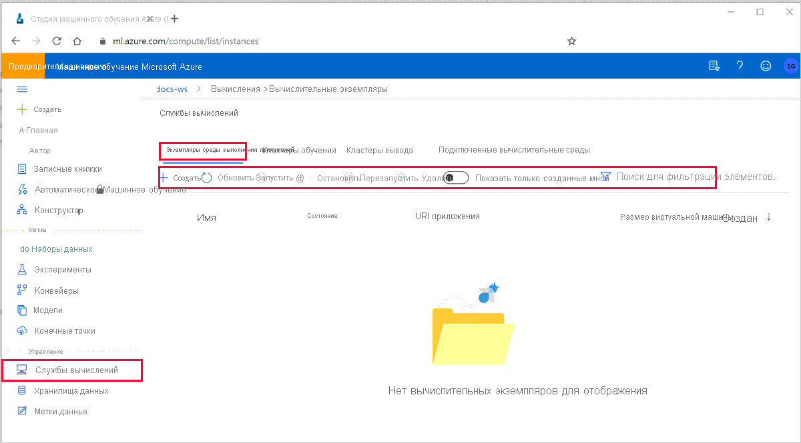

# Что такое Машинное обучение Azure вычислительного экземпляра?

Вычислительный экземпляр Машинное обучение Azure (Предварительная версия) — это полностью управляемая облачная Рабочая станция для специалистов по обработке и анализу данных. 

Экземпляры вычислений упрощают начало работы с Машинное обучение Azure разработки, а также предоставляют ИТ администраторам возможности управления и готовности предприятия.  

Используйте вычислительный экземпляр в качестве полностью настроенной и управляемой среды разработки в облаке.

Вычислительные экземпляры обычно используются в качестве сред разработки.  Их также можно использовать в качестве целевого объекта вычислений для обучения и изучения при разработке и тестировании.  Для больших задач в качестве целевого объекта вычислений лучше выбрать [машинное обучение Azureный кластер](how-to-set-up-training-targets.md#amlcompute) с возможностями масштабирования с несколькими узлами.

> [!NOTE]
> В настоящее время экземпляры вычислений доступны только для рабочих областей с регионом **северо-центральная часть США** или **Южная часть Соединенного Королевства**, в ближайшее время ожидающих поддержки других регионов.
>Если ваша рабочая область находится в другом регионе, можно продолжить, выбрав создание и использование [Виртуальной машины записной книжки](concept-compute-instance.md#notebookvm). 

## Зачем использовать вычислительный экземпляр?

Вычислительный экземпляр — это полностью управляемая облачная Рабочая станция, оптимизированная для среды разработки машинного обучения. Он предоставляет следующие преимущества:

|Основные преимущества||
|----|----|
|Производительность|Специалисты по обработке и анализу данных могут создавать и развертывать модели с помощью интегрированных записных книжек и следующих средств веб-браузера: -Jupyter -JupyterLab -RStudio|
|Безопасность управляемого &|Сократите объемы безопасности и добавьте соответствие требованиям корпоративной безопасности. Экземпляры вычислений предоставляют надежные политики управления и защищенные сетевые конфигурации, такие как:  Автоматическая подготовка на основе шаблонов диспетчер ресурсов или пакета SDK для Машинное обучение Azure - [управления доступом на основе ролей (RBAC)](/azure/role-based-access-control/overview) [поддержка - виртуальной сети](how-to-enable-virtual-network.md#compute-instance) — Политика SSH для включения или отключения доступа по протоколу SSH|
|Предварительно настроенный&nbsp;или&nbsp;ML|Сэкономьте время на задачах установки с предварительно настроенными и обновленными пакетами ML, платформами для глубокого обучения, драйверами GPU.|
|Полностью настраиваемый|Широкая поддержка типов виртуальных машин Azure, включая GPU и устойчивую настройку низкого уровня, например установку пакетов и драйверов, делает более сложными сценарии. |

## Средства и среды

Машинное обучение Azure вычислительный экземпляр позволяет создавать, обучать и развертывать модели в полностью интегрированной записной книжке в рабочей области.

Эти средства и среды устанавливаются на вычислительный экземпляр: 

|Общие средства & средах|Сведения|
|----|:----:|
|Драйверы|`CUDA` `cuDNN` `NVIDIA` `Blob FUSE` |
|Библиотека Intel MPI||
|Интерфейс командной строки Azure ||
|Примеры Машинное обучение Azure ||
|Машинное обучение Azure подсистему ЕДАТ ||
|Docker||
|Nginx||
|НККЛ 2,0 ||
|Protobuf|| 

|Инструменты **R** & средах|Сведения|
|----|:----:|
|Выпуск RStudio Server с открытым исходным кодом||
|Ядро R||
|Пакет SDK для Машинное обучение Azure для R|[азуремлсдк](https://azure.github.io/azureml-sdk-for-r/reference/index.html) Примеры пакета SDK|

|Инструменты **PYTHON** & средах|Сведения|
|----|----|
|Anaconda Python||
|Jupyter и расширения||
|Jupyterlab и расширения||
|Код Visual Studio ||
[Пакет SDK службы "Машинное обучение Azure" для Python](https://docs.microsoft.com/python/api/overview/azure/ml/intro?view=azure-ml-py) из PyPI|`azureml-sdk[notebooks,contrib,automl,explain]` `azureml-contrib-datadrift` `azureml-telemetry` `azureml-tensorboard` `azureml-contrib-opendatasets` `azureml-opendatasets` `azureml-contrib-reinforcementlearning` `azureml-mlflow` `azureml-contrib-interpret` |
|Другие пакеты PyPI|`jupytext` `jupyterlab-git` `tensorboard` `nbconvert` `notebook` `Pillow`|
|Пакеты Conda|`cython` `numpy` `ipykernel` `scikit-learn` `matplotlib` `tqdm` `joblib` `nodejs` `nb_conda_kernels`|
|Пакеты глубокого обучения|`PyTorch` `TensorFlow` `Keras` `Horovod` `MLFlow` `pandas-ml` `scrapbook`|
|Пакеты ONNX|`keras2onnx` `onnx` `onnxconverter-common` `skl2onnx` `onnxmltools`|
|Примеры SDK для Машинное обучение Azure Python & R||

Пакеты Python устанавливаются в среде **python 3,6-AzureML** .  

Вычислительные экземпляры обычно используются в качестве сред разработки.  Их также можно использовать в качестве целевого объекта вычислений для обучения и изучения при разработке и тестировании.  Для больших задач в качестве целевого объекта вычислений лучше выбрать [машинное обучение Azureный кластер](how-to-set-up-training-targets.md#amlcompute) с возможностями масштабирования с несколькими узлами.

### Установка пакетов

Пакеты можно устанавливать непосредственно в записной книжке Jupyter или Rstudio:

* RStudio используйте вкладку **пакеты** в правом нижнем углу или вкладку **консоли** в левом верхнем углу.  
* Python: Добавьте код установки и выполните команду в ячейке записной книжки Jupyter.

Кроме того, можно получить доступ к окну терминала одним из следующих способов:

* RStudio: выберите вкладку **Terminal (терминал** ) в левом верхнем углу.
* Jupyter Lab: выберите плитку **терминала** под заголовком **другой** на вкладке Средство запуска.
* Jupyter: выберите **новый > терминал** в правом верхнем углу на вкладке "файлы".
* Подключитесь к компьютеру по протоколу SSH.  Затем установите пакеты Python в среду **python 3,6-AzureML** .  Установите пакеты R в среду **r** .

## Доступ к файлам

Записные книжки и скрипты R хранятся в учетной записи хранения по умолчанию для рабочей области в файловом ресурсе Azure.  Эти файлы находятся в каталоге "User Files". Это хранилище упрощает обмен записными книжками между разными экземплярами вычислений. Учетная запись хранения также позволяет безопасно сохранять записные книжки при завершении или удалении вычислительного экземпляра.

Учетная запись общей папки Azure рабочей области монтируется в виде диска на вычислительном экземпляре. Этот диск является рабочим каталогом по умолчанию для Jupyter, Jupyter Labs и RStudio.

Файлы в общей папке доступны из всех экземпляров вычислений в одной рабочей области. Любые изменения этих файлов на вычислительном экземпляре будут надежно сохранены в общей папке.

Вы также можете клонировать последние примеры Машинное обучение Azure в папку в каталоге User Files в общей папке рабочей области.

Запись небольших файлов на сетевые диски может выполняться медленнее, чем запись в саму виртуальную машину.  При написании большого количества небольших файлов попробуйте использовать каталог непосредственно в вычислительном экземпляре, например `/tmp` Directory. Обратите внимание, что эти файлы будут недоступны из других вычислений в рабочей области.

## Управление вычислительным экземпляром

В рабочей области в Машинное обучение Azure **Studio выберите Среда**выполнения приложений, а затем в верхней части выберите **вычислительный экземпляр** .

Вы можете выполнять следующие действия:

* Создание вычислительного экземпляра. Укажите имя, тип виртуальной машины Azure, включая GPU (Обратите внимание, что тип виртуальной машины не может быть изменен после создания), включите или отключите доступ по протоколу SSH и настройте параметры виртуальной сети дополнительно. Кроме того, экземпляр можно создать непосредственно из интегрированных записных книжек, портал Azure, диспетчер ресурсов шаблона или пакета SDK для Машинное обучение Azure. Квоты выделенных ядер на регион, применяемые к созданию вычислительных экземпляров, объединены и совместно используются с квотой вычислительных кластеров Машинное обучение Azure.
* Обновление вкладки "вычисленные экземпляры"
* Запуск, завершение и перезапуск вычислительного экземпляра
* Удаление вычислительного экземпляра

Для каждого вычислительного экземпляра в рабочей области можно:

* Доступ к Jupyter, JupyterLab, RStudio, VS Code URI на вычислительном экземпляре
* SSH-подключение к вычислительному экземпляру. Доступ по протоколу SSH отключен по умолчанию, но его можно включить во время создания вычислительного экземпляра. Доступ по протоколу SSH осуществляется с помощью механизма открытого и закрытого ключей. На вкладке приводятся подробные сведения о SSH-подключении, такие как адрес, имя пользователя и номер порта.
* Получение сведений о конкретном вычислительном экземпляре, таком как IP-адрес и регион.

[RBAC](/azure/role-based-access-control/overview) позволяет контролировать, какие пользователи в рабочей области могут создавать, удалять, запускать, останавливаться, перезапускать вычислительный экземпляр. Все пользователи в роли "участник рабочей области" и "владелец" могут создавать, удалять, запускать, прекращать и перезапускать экземпляры вычислений в рабочей области. Однако доступ к Jupyter, JupyterLab и RStudio на этом вычислительном экземпляре разрешен только создателю определенного вычислительного экземпляра. Создатель вычислительного экземпляра имеет выделенный вычислительный экземпляр, имеет доступ с доступом root и может выполнять через Jupyter. У экземпляра COMPUTE будет одно имя входа пользователя-создателя, и все действия будут использовать удостоверение этого пользователя для RBAC и атрибуты выполнения экспериментов. Доступ по протоколу SSH контролируется с помощью механизма открытого и закрытого ключей.

Можно также создать экземпляр
* Непосредственно из интегрированных записных книжек
* На портале Azure
* Из шаблона Azure Resource Manager
* С помощью пакета SDK для Машинное обучение Azure

Квоты выделенных ядер на регион, применяемые к созданию вычислительных экземпляров, объединены и предоставлены совместно с Машинное обучение Azureной квотой кластера обучения. 

## Целевой объект вычислений

Экземпляры вычислений можно использовать в качестве [целевого объекта для обучения](concept-compute-target.md#train) , похожего на машинное обучение Azure вычисление кластеров обучения. Подготовка виртуальной машины с несколькими GPU для выполнения распределенных заданий обучения с помощью средств оценки TensorFlow и PyTorch. Можно также создать конфигурацию запуска и использовать ее для выполнения эксперимента на вычислительном экземпляре. Вы можете использовать вычислительный экземпляр в качестве локального целевого объекта развертывания для сценариев тестирования и отладки.

## Что случилось с виртуальной машиной записной книжки?

Экземпляры вычислений заменяют виртуальную машину записной книжки.  В регионах, где экземпляры вычислений пока недоступны, вы можете продолжать использовать виртуальные машины записных книжек с полной функциональностью и создавать виртуальные машины записной книжки.

Все файлы записных книжек, хранящиеся в общей папке рабочей области и данные в хранилищах данных рабочей области, будут доступны из вычислительного экземпляра. Однако все пользовательские пакеты, ранее установленные на виртуальной машине записной книжки, необходимо будет повторно установить на вычислительном экземпляре. Ограничения квот, применяемые к созданию вычислительных кластеров, будут также применяться к созданию вычислительных экземпляров. 

В регионах, где доступны экземпляры вычислений, невозможно создать новые виртуальные машины записной книжки. Тем не менее вы по-прежнему можете получать доступ к созданным виртуальным машинам записных книжек и использовать их полностью. Экземпляры вычислений можно создать в той же рабочей области, что и существующие виртуальные машины записной книжки. 

## Дальнейшие действия

 * [Учебник. обучение первой модели машинного обучения](tutorial-1st-experiment-sdk-train.md) демонстрирует использование вычислительного экземпляра с интегрированной записной книжкой.
