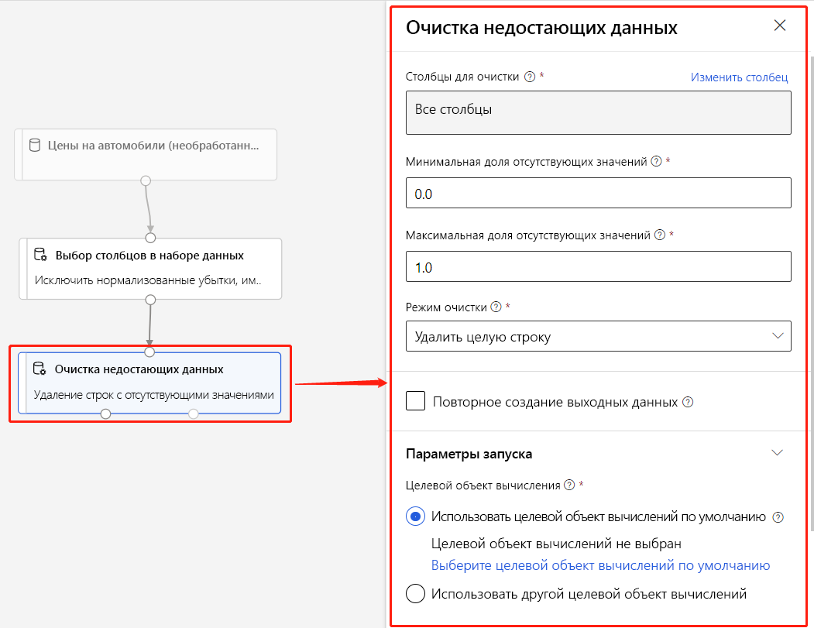

# Что такое конструктор Машинного обучения Azure (предварительная версия)? 
[!INCLUDE [applies-to-skus](../../includes/aml-applies-to-enterprise-sku.md)]

Дизайнер машинного обучения Azure позволяет визуально подключать [наборы данных](#datasets) и [модули](#module) на интерактивном холсте для создания моделей машинного обучения. Чтобы узнать, как начать работу с дизайнером, [см.](tutorial-designer-automobile-price-train-score.md)

Дизайнер использует [рабочее пространство](concept-workspace.md) Azure Machine Learning для организации общих ресурсов, таких как:

+ [Конвейеры](#pipeline)
+ [Наборы данных](#datasets)
+ [Вычислительные ресурсы](#compute)
+ [Зарегистрированные модели](concept-azure-machine-learning-architecture.md#models)
+ [Опубликованные трубопроводы](#publish)
+ [Конечные точки в реальном времени](#deploy)

## Моделирование обучения и развертывания

Дизайнер предоставляет визуальное полотно для создания, тестирования и развертывания моделей машинного обучения. С дизайнером вы можете:

+ Перетащите и падение [наборов данных](#datasets) и [модулей](#module) на холст.
+ Соедините модули вместе, чтобы создать [проект конвейера.](#pipeline-draft)
+ Отправить [запуск конвейера](#pipeline-run) с использованием вычислительных ресурсов в рабочем пространстве Azure Machine Learning.
+ Преобразуйте **конвейеры обучения** в **конвейеры выводов.**
+ [Опубликовать](#publish) конвейеры в **конечную точку конвейера** REST для отправки новых запусков конвейера с различными параметрами и наборами данных.
    + Опубликовать **обучающий конвейер** для повторного использования одного конвейера для обучения нескольких моделей при изменении параметров и наборов данных.
    + Опубликовать **конвейер выводов пакетов** для прогнозирования новых данных с помощью ранее обученной модели.
+ [Развертывание](#deploy) **конвейера выводов в режиме реального времени** в конечную точку в реальном времени для прогнозирования новых данных в режиме реального времени.

## Pipeline

[Конвейер](concept-azure-machine-learning-architecture.md#ml-pipelines) состоит из наборов данных и аналитических модулей, которые вы соединяете вместе. Трубопроводы имеют много применений: вы можете сделать трубопровод, который тренирует одну модель, или тот, который тренирует несколько моделей. Можно создать конвейер, который делает прогнозы в режиме реального времени или в пакете, или сделать конвейер, который очищает только данные. Трубопроводы позволяют повторно использовать свою работу и организовывать свои проекты.

### Проект трубопровода

При отсечении конвейера в проекте ваш прогресс сохраняется в виде **проекта конвейера.** В любой момент можно отсеить проект конвейера, добавив или удалив модули, нанастройки вычислительных целей, создания параметров и так далее.

Действительный конвейер имеет следующие характеристики:

* Наборы данных могут подключаться только к модулям.
* Модули могут подключаться только к наборам данных или другим модулям.
* Все входные порты для модулей должны иметь некоторое подключение к потоку данных.
* Все необходимые параметры для каждого модуля должны быть установлены.

Когда вы будете готовы к запуску проекта конвейера, вы отправляете запуск конвейера.

### Выполнение конвейера

Каждый раз при запуске конвейера конфигурация конвейера и его результаты сохраняются в рабочем пространстве в виде **запуска конвейера.** Вы можете вернуться к любому запуску конвейера, чтобы проверить его для устранения неполадок или аудита целей. **Клонировать** запуск конвейера для создания нового проекта конвейера для отсеиваемого.

Прогоны трубопровода сгруппированы в [эксперименты](concept-azure-machine-learning-architecture.md#experiments) для организации истории запуска. Можно установить эксперимент для каждого запуска конвейера. 

## Наборы данных

Набор данных машинного обучения упрощает доступ к данным и работу с ними. Ряд наборов выборочных данных включены в проектировщик для экспериментов. Вы можете [зарегистрировать](how-to-create-register-datasets.md) больше наборов данных по мере необходимости.

## Module

Модуль — это алгоритм, который можно выполнять с данными. Конструктор имеет ряд модулей, начиная от функций проникновения данных до обучения, скоринга и процессов проверки.

Модуль может иметь ряд параметров, которые можно использовать для настройки внутренних алгоритмов модуля. При выборе модуля на холсте его параметры отображаются на панели Свойства в правой части холста. Подстройка модели осуществляется изменением параметров в этой области. Вы можете настроить вычислительные ресурсы для отдельных модулей в проектировщике. 

Для некоторых помочь навигации по библиотеке алгоритмов машинного обучения доступны, см [Алгоритм & обзор ссылки модуля](algorithm-module-reference/module-reference.md)

## Вычислить ресурсы

Используйте ресурсы вычислений из рабочего пространства для запуска конвейера и размещения развернутых моделей в качестве конечных точек в реальном времени или конечных точек конвейера (для пакетного выводов). Поддерживаются следующие целевые объекты вычислений:

| Целевой объект вычисления | Обучение | Развертывание |
| ---- |:----:|:----:|
| Вычислительная среда Машинного обучения Azure | ✓ | |
| Служба Azure Kubernetes | | ✓ |

Вычислительные цели прикрепляются к [рабочему пространству Azure Machine Learning.](concept-workspace.md) Вы управляете целевыми показателями вычислений в рабочем пространстве в [студии машинного обучения Azure (классический).](https://ml.azure.com)

## Развертывание

Для выполнения выводов в режиме реального времени необходимо развернуть конвейер в качестве **конечной точки в реальном времени.** Конечная точка в реальном времени создает интерфейс между внешним приложением и вашей моделью скоринга. Вызов в конечную точку в реальном времени возвращает результаты прогнозирования в приложение в режиме реального времени. Чтобы вызвать конечную точку в реальном времени, вы передаете ключ API, который был создан при развертывании конечной точки. Конечная точка основана на REST, популярном выборе архитектуры для проектов веб-программирования.

Конечные точки в режиме реального времени должны быть развернуты в кластере службы Azure Kubernetes.

Чтобы узнать, как развернуть модель, [см.](tutorial-designer-automobile-price-deploy.md)

## Публикация

Можно также опубликовать конвейер в **конечную точку конвейера.** Подобно конечная точка в реальном времени, конечная точка конвейера позволяет отправлять новые запуски конвейера из внешних приложений с помощью вызовов REST. Однако с помощью конечной точки конвейера нельзя отправлять или получать данные в режиме реального времени.

Опубликованные конвейеры являются гибкими, они могут быть использованы для обучения или переподготовки моделей, [выполнения пакетных выводов,](how-to-run-batch-predictions-designer.md)обработки новых данных и многое другое. Можно опубликовать несколько конвейеров в одну конечную точку конвейера и указать, какую версию конвейера запустить.

Опубликованный конвейер работает на вычислительных ресурсах, определяемых в проекте конвейера для каждого модуля.

Дизайнер создает тот же объект [PublishedPipeline,](https://docs.microsoft.com/python/api/azureml-pipeline-core/azureml.pipeline.core.graph.publishedpipeline?view=azure-ml-py) что и SDK.

## Переход от визуального интерфейса к дизайнеру

Визуальный интерфейс (предварительный просмотр) был обновлен и теперь является дизайнером машинного обучения Azure (предварительный просмотр). Дизайнер был перегнан для использования бэкэнда на основе конвейера, который полностью интегрируется с другими функциями машинного обучения Azure. 

В результате этих обновлений некоторые концепции и термины визуального интерфейса были изменены или переименованы. Смотрите таблицу ниже для наиболее важных концептуальных изменений. 

| Концепция в дизайнере | Ранее в визуальном интерфейсе |
| ---- |:----:|
| Проект трубопровода | Эксперимент |
| Конечная точка в реальном времени | Веб-служба |

### Мигрирование к дизайнеру

Существующие эксперименты по визуальному интерфейсу и веб-сервисы можно преобразовать в конвейеры и конечные точки в реальном времени в конструкторе. Используйте следующие шаги для переноса активов визуального интерфейса:

[!INCLUDE [migrate from the visual interface](../../includes/aml-vi-designer-migration.md)]

## Дальнейшие действия

* Узнайте основы прогностической аналитики и машинного обучения с [помощью учебника: Предсказать цену автомобиля с дизайнером](tutorial-designer-automobile-price-train-score.md)
* Узнайте, как модифицировать существующие [образцы конструктора,](samples-designer.md) чтобы адаптировать их к вашим потребностям.

