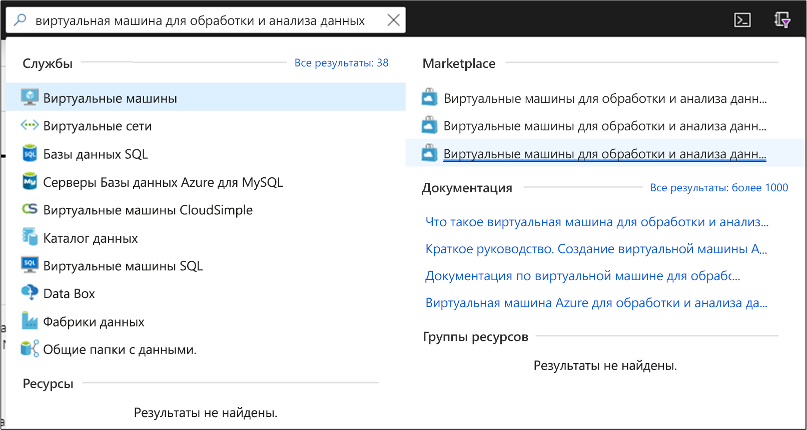
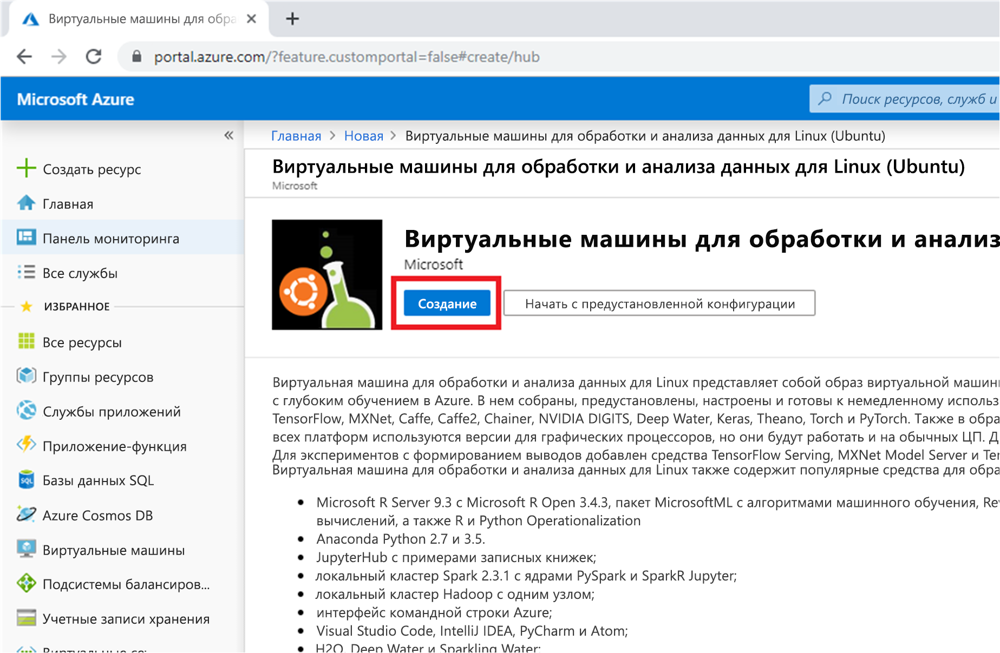
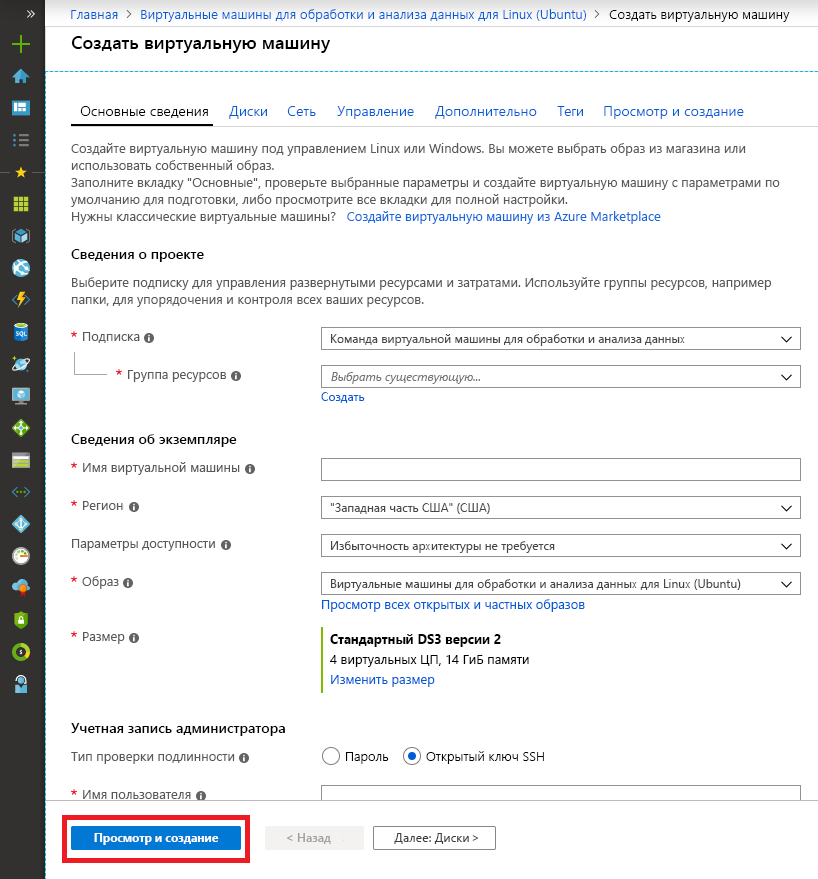
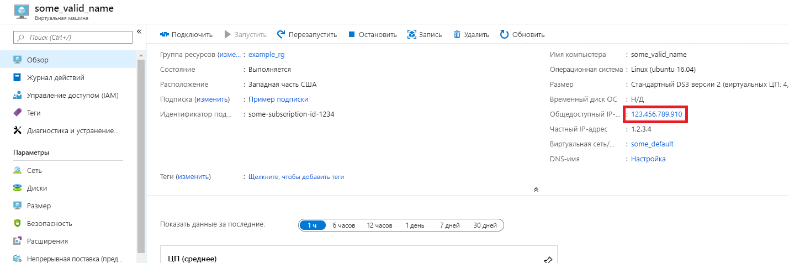
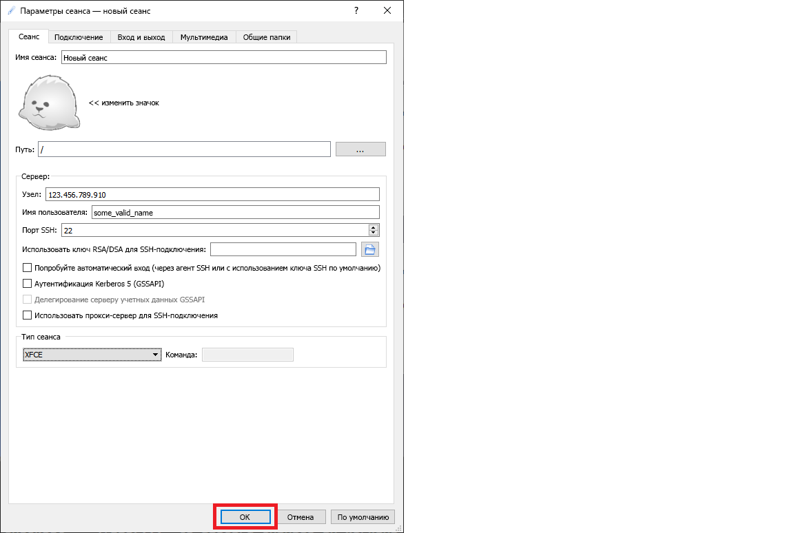

# <a name="quickstart-set-up-the-data-science-virtual-machine-for-linux-ubuntu"></a>Краткое руководство. Настройка Виртуальной машины Linux (Ubuntu) для обработки и анализа данных

Начните работу с виртуальной машиной для обработки и анализа данных Ubuntu.

## <a name="prerequisites"></a>Предварительные требования

Чтобы создать виртуальную машину Windows для обработки и анализа данных, вам потребуется подписка Azure. [Воспользуйтесь бесплатной пробной версией Azure](https://azure.com/free).

## <a name="create-your-data-science-virtual-machine-for-linux"></a>Создание виртуальной машины Linux для обработки и анализа данных

Ниже приведены шаги по созданию экземпляра виртуальной машины Linux для обработки и анализа данных.

1. Войдите на [портал Azure](https://portal.azure.com). Если вы еще не вошли в свою учетную запись Azure, появится запрос на вход.
1. Найдите список виртуальных машин, введя команду "Виртуальная машина для обработки и анализа данных", и выберите "Виртуальная машина для обработки и обработки данных для Linux (Ubuntu)".
    
    

1. В следующем окне выберите **Создать**.

   [](media/dsvm-ubuntu-intro/create-linux-expanded.png#lightbox)

1. Вы будете перенаправлены в колонку "Создание виртуальной машины".
   
   

1. Введите следующую информацию на каждом шаге работы мастера:

    1. **Основные сведения**:
    
       * **Подписка**: При наличии нескольких подписок выберите ту, в которой будет создана виртуальная машина и для которой будут выставляться счета. Вам необходимо иметь права на создание ресурсов для этой подписки.
       * **Группа ресурсов.** Создайте новую группу или используйте существующую.
       * **Имя виртуальной машины**. Введите имя виртуальной машины. Так оно будет отображаться на портале Azure.
       * **Регион**. Выберите наиболее подходящий центр обработки данных. Чтобы ускорить доступ к сети, выбирайте центр обработки данных, в котором размещена большая часть ваших данных, или который ближе всего вашему физическому расположению. Дополнительные сведения о [Регионах Azure](https://azure.microsoft.com/global-infrastructure/regions/).
       * **Образ**. Оставьте значение по умолчанию.
       * **Размер**: Это поле должно автоматически заполняться размером, подходящим для общих рабочих нагрузок. Дополнительные сведения см. в статье [Размеры виртуальных машин Linux в Azure](../../virtual-machines/linux/sizes.md).
       * **Тип проверки подлинности.** Для ускорения установки выберите "Пароль". 
         
         > [!NOTE]
         > Если вы планируете использовать JupyterHub, убедитесь, что параметр "Пароль" выбран, поскольку JupyterHub *не* настроен на использование открытых ключей SSH.

       * **Имя пользователя**. Введите имя пользователя для учетной записи администратора. Это имя пользователя, которое будет использоваться для входа в виртуальную машину. Оно не должно совпадать с именем пользователя Azure. *Не* используйте прописные буквы.
         
         > [!NOTE]
         > Если в имени пользователя используются прописные буквы, JupyterHub не будет работать и появится сообщение 500 — внутренняя ошибка сервера.

       * **Пароль**. Введите пароль, который будет использоваться для входа в виртуальную машину.    
    
   1. Выберите **Review + create** (Просмотреть и создать).
   1. **Просмотреть и создать**
      * Убедитесь, что все сведения введены правильно. 
      * Нажмите кнопку **Создать**.
    
    Подготовка занимает примерно 5 минут. Данные о состоянии отображаются на портале Azure.

## <a name="how-to-access-the-ubuntu-data-science-virtual-machine"></a>Как получить доступ к виртуальной машине для обработки и анализа Ubuntu

Доступ к виртуальной машины для обработки и анализа данных Ubuntu можно получить одним из трех способов:

  * SSH для сеансов терминала
  * X2Go для графических сеансов
  * JupyterHub и JupyterLab для записных книжек Jupyter

Вы также можете подключить Виртуальную машину для обработки и анализа данных к службе "Записные книжки Azure", чтобы запускать записные книжки Jupyter на виртуальной машине и обходить ограничения бесплатного уровня служб. Дополнительные сведения см. в статье [о настройке проектов Записных книжек Azure и управлении ими](../../notebooks/configure-manage-azure-notebooks-projects.md#compute-tier).

### <a name="ssh"></a>SSH

Если машина была настроена с помощью SSH-доступа, после создания вы можете войти в нее с помощью SSH. Для входа с помощью интерфейса текстовой оболочки используйте учетную запись, созданную в разделе **Основные сведения** на шаге 3. Для Windows можно скачать клиент SSH, например [PuTTY](https://www.putty.org). Если вы предпочитаете графический интерфейс (X Window System), можно использовать перенаправление X11 в PuTTY.

> [!NOTE]
> При тестировании клиент X2Go работал лучше по сравнению с перенаправлением X11. Мы рекомендуем клиент X2Go для графического интерфейса рабочего стола.

### <a name="x2go"></a>X2Go

Виртуальная машина Linux уже подготовлена на сервере X2Go и готова к приему подключений клиента. Для подключения к графическому рабочему столу виртуальной машины Linux выполните следующую процедуру на клиенте.

1. Скачайте клиент X2Go для своей клиентской платформы [отсюда](https://wiki.x2go.org/doku.php/doc:installation:x2goclient)и установите его.
1. Запишите общедоступный IP-адрес виртуальной машины, который можно найти на портале Azure, открыв только что созданную виртуальную машину.

   

1. Запустите клиент X2Go. Если окно "Новый сеанс" не появляется автоматически, перейдите во вкладку "Сеанс" — > "Новый сеанс".

1. В появившемся окне конфигурации введите следующие параметры конфигурации:
   * **Вкладка "Сеанс"** :
     * **Узел**: Введите IP-адрес виртуальной машины, которая была создана ранее.
     * **Имя входа**: Введите имя пользователя для виртуальной машины Linux.
     * **Порт SSH**: Оставьте 22 (значение по умолчанию).
     * **Тип сеанса**. Измените значение на **XFCE**. В настоящее время виртуальная машина Linux поддерживает только рабочий стол XFCE.
   * **Вкладка "Мультимедиа"** : Здесь можно отключить поддержку звука и печати на клиенте, если они не нужны.
   * **Общие папки**. если необходимо подключить каталоги клиентских компьютеров на виртуальной машине Linux, добавьте необходимые каталоги на этой вкладке.

   
1. Нажмите кнопку **ОК**.
1. Щелкните поле в правой области окна X2Go, чтобы открыть экран входа в систему для виртуальной машины.
1. Введите пароль для виртуальной машины.
1. Нажмите кнопку **ОК**.
1. Чтобы завершить подключение, может потребоваться предоставить X2Go разрешение на обход брандмауэра.
1. Теперь вы увидите графический интерфейс для DSVM Ubuntu. 


### <a name="jupyterhub-and-jupyterlab"></a>JupyterHub и JupyterLab

На Ubuntu DSVM работает [JupyterHub](https://github.com/jupyterhub/jupyterhub), многопользовательский сервер Jupyter. Чтобы подключиться, выполните следующие действия:

   1. Запишите общедоступный IP-адрес виртуальной машины, выполнив поиск и выбрав виртуальную машину на портале Azure.
      

   1. На локальном компьютере откройте веб-браузер и перейдите по адресу https:\//your-vm-ip:8000, заменив "your-vm-ip" на IP-адрес, который вы указали ранее.
   1. Введите имя пользователя и пароль, которые вы указали при создании виртуальной машины, и выполните вход. 

      

   1. Просмотрите множество образцов доступных записных книжек.

Кроме того, доступен JupyterLab, следующее поколение записных книжек Jupyter, и JupyterHub. Чтобы получить к нему доступ, войдите в JupyterHub, а затем перейдите по URL-адресу https:\//your-vm-ip:8000/user/your-username/lab, заменив "your-username" именем пользователя, выбранного при настройке виртуальной машины.

JupyterLab можно установить в качестве сервера записных книжек по умолчанию, добавив следующую строку в файл `/etc/jupyterhub/jupyterhub_config.py`:

```python
c.Spawner.default_url = '/lab'
```

## <a name="next-steps"></a>Дополнительная информация

Вот как можно продолжить обучение и изучение.

* В пошаговом руководстве по [работе с Виртуальной машиной для обработки и анализа данных для Linux](linux-dsvm-walkthrough.md) описаны способы выполнения распространенных задач с помощью подготовленной DSVM Linux. 
* Изучите описанные в этой статье средства обработки и анализа данных, предоставляемые в DSVM. Кроме того, можно выполнить команду `dsvm-more-info` в оболочке на виртуальной машине, чтобы получить базовые сведения и ссылки на дополнительные сведения об инструментах, которые установлены на виртуальной машине.  
* Изучите систематический подход к созданию комплексных аналитических решений с помощью [группового процесса обработки и анализа данных](https://aka.ms/tdsp).
* В [Коллекции решений ИИ Azure](https://gallery.azure.ai/) можно найти примеры для машинного обучения и анализа данных, в которых используются службы ИИ Azure.
* Обратитесь к соответствующей [справочной документации](./reference-ubuntu-vm.md) для этой виртуальной машины.
