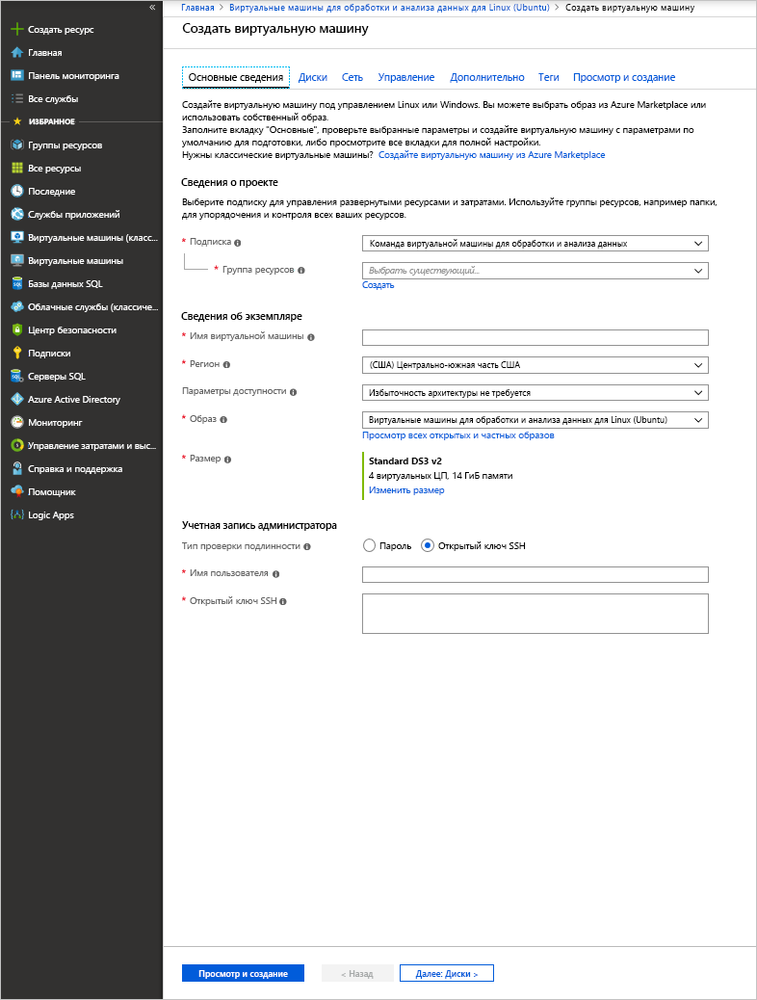

# <a name="quickstart-set-up-the-data-science-virtual-machine-for-linux-ubuntu"></a>Краткое руководство. Настройка Виртуальной машины Linux (Ubuntu) для обработки и анализа данных

Виртуальная машина для обработки и анализа данных (DSVM) для Linux — это образ виртуальной машины Azure на основе Ubuntu, который позволяет легко начать работу с машинным обучением в Azure, включая глубокое обучение. Доступны следующие инструменты глубокого обучения:

* [Caffe](https://caffe.berkeleyvision.org/): платформа глубокого обучения, предназначенная для обеспечения скорости, выразительности и модульности.
* [Caffe2](https://github.com/caffe2/caffe2): кроссплатформенная версия Caffe.
* [Microsoft Cognitive Toolkit](https://github.com/Microsoft/CNTK): набор программных средств для глубокого обучения от Microsoft Research;
* [H2O](https://www.h2o.ai/): платформа для больших данных с открытым исходным кодом и графический пользовательский интерфейс.
* [Keras](https://keras.io/): API нейронной сети высокого уровня на языке Python для TensorFlow, Microsoft Cognitive Toolkit и Theano.
* [MXNet](https://mxnet.io/): гибкая и эффективная библиотека глубокого обучения с множеством языковых привязок.
* [NVIDIA DIGITS](https://developer.nvidia.com/digits): графическая система, которая упрощает выполнение распространенных задач глубокого обучения.
* [PyTorch](https://pytorch.org/): высокоуровневая библиотека Python с поддержкой динамических сетей.
* [TensorFlow](https://www.tensorflow.org/): библиотека с открытым исходным кодом для использования искусственного интеллекта от Google.
* [Theano](http://deeplearning.net/software/theano/): библиотека Python для определения, оптимизации и эффективной оценки математических выражений с применением многомерных массивов.
* [Torch](http://torch.ch/): платформа для научных расчетов с поддержкой разнообразных алгоритмов машинного обучения.
* CUDA, cuDNN и драйвер NVIDIA.
* Множество примеров записных книжек Jupyter.

Все библиотеки являются версиями для графического процессора, хотя они также работают при использовании центрального процессора.

Виртуальная машина Linux для обработки и анализа данных также содержит популярные инструменты для обработки и анализа данных, включая следующие:

* Microsoft Machine Learning Server с компонентом Microsoft R Open.
* Дистрибутив Anaconda Python (версий 2.7 и 3.5), включая популярные библиотеки для анализа данных.
* JuliaPro — проверенный дистрибутив на языке Julia с популярными библиотеками для обработки и анализа данных.
* Изолированный экземпляр Spark и кластер Hadoop (HDFS, Yarn) с одним узлом.
* JupyterHub — многопользовательский сервер Jupyter Notebook, который поддерживает ядра R, Python, PySpark и Julia.
* Обозреватель хранилищ Azure
* Интерфейс командной строки Azure для управления ресурсами Azure.
* Средства машинного обучения:
  * [Vowpal Wabbit](https://github.com/JohnLangford/vowpal_wabbit): система быстрого машинного обучения, поддерживающая такие методы, как онлайн-обучение, хэширование, allreduce (общее сокращение), сокращение, learning2search (обучение поиску), активное и интерактивное обучение.
  * [XGBoost](https://xgboost.readthedocs.org/en/latest/): Инструмент, предоставляющий быструю и точную реализацию усиленного дерева.
  * [Rattle](https://togaware.com/rattle/). Графический инструмент, который облегчает начало работы с аналитикой данных и машинным обучением в R.
  * [LightGBM](https://github.com/Microsoft/LightGBM). Быстрая, распределенная и высокопроизводительная платформа для градиентного усиления.
* Пакет SDK Azure для Java, Python, Node.js, Ruby и PHP.
* Библиотеки R и Python для машинного обучения Azure и других служб Azure.
* Средства разработки и редакторы (RStudio, PyCharm, IntelliJ, Emacs и vim).

Анализ данных включает выполнение следующих задач:

1. поиск, загрузка и предварительная обработка данных;
1. построение и тестирование моделей;
1. развертывание моделей для использования в приложениях для анализа.

Для выполнения этих задач специалисты по обработке и анализу данных используют широкий набор инструментов. Поиск подходящей версии программного обеспечения и его последующее скачивание, компиляция и установка могут занимать много времени.

Виртуальная машина Linux для обработки и анализа данных может существенно упростить выполнение этих задач. Используйте ее, чтобы быстро начать работу со своим аналитическим проектом. Она позволяет работать над задачами, используя различные языки, включая R, Python, SQL, Java и C++. Пакет SDK для Azure в виртуальной машине позволяет создавать приложения с помощью различных служб в Linux для облачной платформы Майкрософт. Кроме того, доступны другие языки, такие как Ruby, Perl, PHP и Node.js, которые также предварительно установлены.

Плата за программное обеспечение для этого образа виртуальной машины DSVM не взимается. Вы платите только за оборудование Azure в зависимости от размера виртуальной машины, которая подготавливается. Дополнительные сведения об оплате вычислительных ресурсов см. на [странице цен на виртуальные машины в Azure Marketplace](https://azure.microsoft.com/marketplace/partners/microsoft-ads/linux-data-science-vm/).

## <a name="other-versions-of-the-data-science-virtual-machine"></a>Другие версии виртуальных машин для обработки и анализа данных

Также доступен образ [CentOS](linux-dsvm-intro.md), который содержит большинство инструментов, входящих в образ Ubuntu. Также доступен образ [Windows](provision-vm.md).

## <a name="prerequisites"></a>Предварительные требования

Перед созданием виртуальной машины Linux для обработки и анализа данных необходимо убедиться в наличии подписки Azure. Получите [бесплатную пробную версию Azure](https://azure.microsoft.com/free/).

## <a name="create-your-data-science-virtual-machine-for-linux"></a>Создание виртуальной машины Linux для обработки и анализа данных

Ниже приведены шаги по созданию экземпляра виртуальной машины Linux для обработки и анализа данных.

1. Перейдите к списку виртуальных машин на [портале Azure](https://portal.azure.com/#create/microsoft-dsvm.linux-data-science-vm-ubuntulinuxdsvmubuntu). Если вы еще не вошли в свою учетную запись Azure, появится запрос на вход. 
1. Щелкните **Создать**, чтобы открыть мастер.
    
1. Введите следующую информацию на каждом шаге работы мастера:

    1. **Основные сведения**:
    
       * **Подписка**: При наличии нескольких подписок выберите ту, в которой будет создана виртуальная машина и для которой будут выставляться счета. Вам необходимо иметь права на создание ресурсов для этой подписки.
       * **Группа ресурсов.** Вы можете создать новую или использовать существующую группу.
       * **Имя виртуальной машины**. Введите имя создаваемого сервера для обработки и анализа данных.
       * **Регион**. Выберите наиболее подходящий центр обработки данных. Обычно это центр обработки данных, в котором размещена большая часть ваших данных, или ближайший к вашему физическому расположению центр для наиболее быстрого доступа к сети.
       * **Параметры доступности**. Установите этот параметр, если хотите использовать эту виртуальную машину в наборах или зонах доступности. В противном случае сохраните значение по умолчанию.
       * **Образ**. Оставьте значение по умолчанию.
       * **Размер**: Выберите тип сервера, который соответствует вашим функциональным требованиям и финансовым ограничениям. Выберите виртуальную машину серии NC или ND для виртуальных машин на основе GPU. 
       * **Имя пользователя**. Введите имя пользователя для учетной записи администратора.
       * **Открытый ключ SSH**. Введите открытый ключ RSA в однострочном формате. (Вместо ключа SSH можно использовать пароль.)
    
    1. **Диски**:
    
       * **Тип диска ОС**: Выберите **SSD (цен. категория "Премиум")** , если требуется твердотельный накопитель (SSD). В противном случае выберите тип **HDD (цен. категория "Стандартный")** .
    
    1. Для остальных параметров можно использовать значения по умолчанию. Чтобы изучить значения, отличные от значений по умолчанию, наведите указатель мыши на информационную ссылку. Завершив этот процесс, щелкните **Просмотр и создание**.
    
    1. Когда завершится проверка виртуальной машины, проверьте правильность всей введенной информации. С условиями использования можно ознакомиться по ссылке. За использование виртуальной машины не взимается дополнительная плата, кроме платы за размер сервера, выбранный на шаге **Размер**. Чтобы начать процесс подготовки, щелкните **Создать**.
    
    Подготовка занимает примерно 5 минут. Данные о состоянии отображаются на портале Azure.

## <a name="how-to-access-the-data-science-virtual-machine-for-linux"></a>Как осуществить доступ к виртуальной машине Linux для обработки и анализа данных

Существует три метода доступа к DSVM Ubuntu:

- SSH для сеансов терминала
- X2Go для графических сеансов
- JupyterHub и JupyterLab для записных книжек Jupyter

Вы также можете подключить Виртуальную машину для обработки и анализа данных к службе "Записные книжки Azure", чтобы запускать записные книжки Jupyter на виртуальной машине и обходить ограничения бесплатного уровня служб. Дополнительные сведения см. в статье [о настройке проектов Записных книжек Azure и управлении ими](../../notebooks/configure-manage-azure-notebooks-projects.md#compute-tier).

### <a name="ssh"></a>SSH

После создания виртуальной машины вы можете войти в нее с помощью протокола SSH. Для входа с помощью интерфейса текстовой оболочки используйте учетную запись, созданную в разделе **Основные сведения** на шаге 3. Для Windows можно скачать клиент SSH, например [PuTTY](https://www.putty.org). Если вы предпочитаете графический интерфейс (X Window System), можно использовать перенаправление X11 в PuTTY или установить клиент X2Go.

> [!NOTE]
> При тестировании клиент X2Go работал лучше по сравнению с перенаправлением X11. Мы рекомендуем клиент X2Go для графического интерфейса рабочего стола.

### <a name="x2go"></a>X2Go

Виртуальная машина Linux уже подготовлена на сервере X2Go и готова к приему подключений клиента. Для подключения к графическому рабочему столу виртуальной машины Linux выполните следующую процедуру на клиенте.

1. Скачайте клиент X2Go для своей клиентской платформы [отсюда](https://wiki.x2go.org/doku.php/doc:installation:x2goclient)и установите его.
1. Запустите клиент X2Go и выберите **Новая сессия**. Откроется окно конфигурации с несколькими вкладками. Введите следующие параметры конфигурации:
   * **Вкладка "Сеанс"** :
     * **Узел**: Введите имя узла или IP-адрес виртуальной машины Linux для обработки и анализа данных.
     * **Имя входа**: Введите имя пользователя для виртуальной машины Linux.
     * **Порт SSH**: Оставьте 22 (значение по умолчанию).
     * **Тип сеанса**. Измените значение на **XFCE**. В настоящее время виртуальная машина Linux поддерживает только рабочий стол XFCE.
   * **Вкладка "Мультимедиа"** : Здесь можно отключить поддержку звука и печати на клиенте, если они не нужны.
   * **Общие папки**. если необходимо подключить каталоги клиентских компьютеров на виртуальной машине Linux, добавьте необходимые каталоги на этой вкладке.

Выполнив вход на виртуальную машину с помощью клиента SSH или рабочего стола XFCE в клиенте X2Go, вы можете использовать любые инструменты, которые установлены и настроены на виртуальной машине. На рабочем столе XFCE отображаются ярлыки из меню и значки рабочего стола для многих инструментов.

### <a name="jupyterhub-and-jupyterlab"></a>JupyterHub и JupyterLab

На Ubuntu DSVM работает [JupyterHub](https://github.com/jupyterhub/jupyterhub), многопользовательский сервер Jupyter. Чтобы подключиться к нему, перейдите по адресу https:\//IP-адрес_вашей_виртуальной_машины:8000. Введите имя пользователя и пароль, которые вы указали при создании виртуальной машины, и выполните вход. Для просмотра и испытания доступно много примеров записных книжек.

Кроме того, доступен JupyterLab, следующее поколение записных книжек Jupyter, и JupyterHub. Чтобы получить к нему доступ, войдите в JupyterHub и перейдите по URL-адресу https:\//IP-адрес_вашей_виртуальной_машины:8000/user/ваше_имя_пользователя/lab. JupyterLab можно установить в качестве сервера записных книжек по умолчанию, добавив следующую строку в файл `/etc/jupyterhub/jupyterhub_config.py`:

```python
c.Spawner.default_url = '/lab'
```

## <a name="tools-installed-on-the-data-science-virtual-machine-for-linux"></a>Инструменты, установленные на виртуальной машине Linux для обработки и анализа данных

### <a name="deep-learning-libraries"></a>Библиотеки глубокого обучения

#### <a name="cntk"></a>CNTK

Набор средств Microsoft Cognitive Toolkit имеет открытый исходный код и предназначен для глубокого обучения. Привязки Python доступны в корневой среде и в средах Conda для Python 3.5 (py35). В набор также входит программа командной строки (CNTK), которая уже добавлена в переменную PATH.

Примеры объектов Python Notebook доступны в JupyterHub. Чтобы запустить в командной строке простой пример, выполните следующие команды в оболочке:

```bash
cd /home/[USERNAME]/notebooks/CNTK/HelloWorld-LogisticRegression
cntk configFile=lr_bs.cntk makeMode=false command=Train
```

Дополнительные сведения см. в разделе CNTK на сайте [GitHub](https://github.com/Microsoft/CNTK) и на [вики-сайте CNTK](https://github.com/Microsoft/CNTK/wiki).

#### <a name="caffe"></a>Caffe

Caffe — это платформа глубокого обучения из Berkeley Vision и центра обучения. Она расположена в папке /opt/caffe. Примеры находятся в папке /opt/caffe/examples.

#### <a name="caffe2"></a>Caffe2

Caffe2 — это платформа глубокого обучения от Facebook на основе Caffe. Она доступна из Python 2.7 в корневой среде Conda. Для активации выполните следующую команду из оболочки:

```bash
source /anaconda/bin/activate root
```

Некоторые примеры объектов Notebook доступны в JupyterHub.

#### <a name="h2o"></a>H2O

H2O — это быстрая распределенная платформа, работающая в памяти, для машинного обучения и прогнозной аналитики. Пакет Python установлен в корневой среде и в средах Anaconda для Python 3.5 (py35). Также установлен пакет R. 

Чтобы открыть H2O из командной строки, выполните команду `java -jar /dsvm/tools/h2o/current/h2o.jar`. Она поддерживает различные [параметры командой строки](http://docs.h2o.ai/h2o/latest-stable/h2o-docs/starting-h2o.html#from-the-command-line), которые можно настраивать. Чтобы открыть веб-интерфейс Flow и начать работу с ним, перейдите по адресу http://localhost:54321. Примеры объектов Notebook доступны в JupyterHub.

#### <a name="keras"></a>Keras

Keras представляет собой API нейронной сети высокого уровня на языке Python. Он может выполняться в средах Microsoft Cognitive Toolkit, TensorFlow и Theano. Он доступен в средах Python root и py35.

#### <a name="mxnet"></a>MXNet

MXNet — это платформа глубокого обучения, предназначенная для обеспечения эффективности и гибкости. Она имеет привязки R и Python, входящие в состав DSVM. Примеры объектов Notebook доступны в JupyterHub, а пример кода доступен в папке /dsvm/samples/mxnet.

#### <a name="nvidia-digits"></a>NVIDIA DIGITS

Система глубокого обучения NVIDIA с использованием GPU, известная как DIGITS, представляет собой систему для упрощения распространенных задач глубокого обучения. Сюда относятся такие задачи, как управление данными, разработка и обучение нейронных сетей в системах с графическими процессорами, а также мониторинг производительности в режиме реального времени с помощью расширенного представления.

Система DIGITS доступна в виде службы с именем *digits*. Чтобы начать, запустите службу и перейдите к http://localhost:5000.

Служба DIGITS также установлена как модуль Python в корневой среде Conda.

#### <a name="tensorflow"></a>TensorFlow

TensorFlow — это библиотека глубокого обучения от Google. Она является библиотекой программного обеспечения с открытым исходным кодом для числовых вычислений с применением графиков потоков данных. TensorFlow доступен в среде Python 3.5 (py35), а несколько примеров объектов Notebook доступно в JupyterHub.

#### <a name="theano"></a>Theano

Theano — это библиотека Python для эффективных численных вычислений. Она доступна в средах Python root и py35. 

#### <a name="torch"></a>Torch

Torch — это платформа для научных расчетов с поддержкой разнообразных алгоритмов машинного обучения. Она находится в папке /dsvm/tools/torch, а интерактивный сеанс **th** и диспетчер пакетов LuaRocks работают из командной строки. Примеры доступны в папке /dsvm/samples/torch.

Платформа PyTorch также доступна в корневой среде Anaconda. Примеры доступны в папке /dsvm/samples/pytorch.

### <a name="microsoft-machine-learning-server"></a>Microsoft Machine Learning Server

R — один из самых популярных языков для анализа данных и машинного обучения. Если вы хотите использовать R для аналитики, воспользуйтесь установленной на виртуальной машине платформой Microsoft Machine Learning Server с компонентом Microsoft R Open и библиотекой Math Kernel Library. Библиотека Math Kernel Library оптимизирует математические операции, которые широко применяются в аналитических алгоритмах. Microsoft R Open полностью совместим с CRAN R, и в нем можно установить любые библиотеки R, опубликованные в CRAN. 

Machine Learning Server обеспечивает масштабирование и эксплуатацию моделей R, преобразованных в веб-службы. Для редактирования программ R можно воспользоваться одним из редакторов по умолчанию, например RStudio, vi или Emacs. Если вы предпочитаете использовать редактор Emacs, то он предварительно установлен. Пакет ESS (Emacs Speaks Statistics) упрощает работу с файлами R в редакторе Emacs.

Чтобы открыть консоль R, введите в оболочке команду **R**. Вы перейдете в интерактивную среду. Для разработки программы R обычно используется текстовый редактор, например Emacs или vi, а затем скрипты запускаются в среде R. RStudio предоставляет полноценную графическую интегрированную среду разработки для разработки программ R.

Также существует скрипт R, который позволяет установить [20 самых популярных пакетов R](https://www.kdnuggets.com/2015/06/top-20-r-packages.html), если потребуется. Этот скрипт вы можете выполнить в интерактивном интерфейсе R. Как упоминалось ранее, этот интерфейс можно открыть в оболочке командой **R**.  

### <a name="python"></a>Python

Anaconda Python устанавливается вместе со средой Python 2.7 и 3.5. Среда версии 2.7 называется _root_, а среда версии 3.5 — _py35_. Этот дистрибутив содержит базовую версию Python, а также примерно 300 наиболее популярных математических и инженерных пакетов и пакетов аналитики данных.

Среда py35 устанавливается по умолчанию. Чтобы активировать среду root (версии 2.7), выполните эту команду:

```bash
source activate root
```

Чтобы снова активировать среду py35, выполните эту команду:

```bash
source activate py35
```

Чтобы вызвать интерактивный сеанс Python, введите **python** в оболочке. 

Дополнительные библиотеки Python можно установить с помощью Conda или pip. Сначала активируйте правильную среду для pip, если не хотите использовать среду по умолчанию:

```bash
source activate root
pip install <package>
```

Или укажите полный путь к pip:

```bash
/anaconda/bin/pip install <package>
```

Для Conda всегда следует указывать имя среды (py35 или root):

```bash
conda install <package> -n py35
```

Если вы используете графический интерфейс или перенаправление X11, то с помощью команды **pycharm** вы можете открыть интегрированную среду разработки PyCharm Python. Можно использовать текстовые редакторы по умолчанию. Кроме того, можно использовать Spyder, интегрированную среду разработки Python из дистрибутивов Anaconda Python. Для Spyder необходим графический рабочий стол или перенаправление X11. В графическом интерфейсе есть ярлык для запуска Spyder.

### <a name="jupyter-notebook"></a>Записная книжка Jupyter

Дистрибутив Anaconda также содержит записную книжку Jupyter, среду для совместного использования кода и анализа. Доступ к записной книжке Jupyter можно получить через JupyterHub. Для входа используйте имя и пароль локального пользователя Linux.

На сервере записной книжки Jupyter предварительно настроена поддержка ядер Python 2, Python 3 и R. Чтобы запустить браузер для доступа к серверу записных книжек, используйте значок **Jupyter Notebook** на рабочем столе. Если вы подключаетесь к виртуальной машине с помощью клиента SSH или X2Go, то к серверу Jupyter Notebook можно обратиться по адресу [https://localhost:8000/](https://localhost:8000/).

> [!NOTE]
> При появлении любых предупреждений о сертификатах нажмите кнопку "Продолжить".

Сервер записной книжки Jupyter доступен с любого узла. Введите адрес **https://\<DNS-имя или IP-адрес виртуальной машины\>:8000/** .

> [!NOTE]
> Когда виртуальная машина подготавливается, на брандмауэре по умолчанию открывается порт 8000. 

Мы добавили примеры записных книжек: один для Python и один для R. Ссылки на эти примеры вы увидите на домашней странице записных книжек, когда войдете в Jupyter Notebook с именем и паролем локального пользователя Linux. Чтобы создать новую записную книжку, щелкните **Создать** и выберите подходящий язык ядра. Если вы не видите кнопки **Создать**, щелкните значок **Jupyter** в верхнем левом углу, чтобы перейти на домашнюю страницу сервера записной книжки.

### <a name="apache-spark-standalone"></a>Изолированный экземпляр Apache Spark

На Linux DSVM устанавливается изолированный экземпляр Apache Spark, чтобы вам было удобно локально разрабатывать приложения Spark перед тестированием и развертыванием в крупных кластерах. 

Программы PySpark можно выполнять через ядро Jupyter. Открыв Jupyter, нажмите кнопку **Создать**, чтобы увидеть список доступных ядер. Ядро PySpark **Spark-Python** позволяет создавать приложения Spark, используя язык Python. Вы также можете использовать интегрированную среду разработки Python, такую как PyCharm или Spyder, для создания своей программы Spark. 

В изолированном экземпляре стек Spark работает в вызывающей клиентской программе. Эта возможность позволяет быстрее и проще устранять неполадки по сравнению с разработкой в кластере Spark.

Jupyter предоставляет пример записной книжки для PySpark. Вы найдете его в каталоге SparkML корневого каталога Jupyter ($HOME/notebooks/SparkML/pySpark). 

Если вы программируете на R для Spark, то можете использовать Microsoft Machine Learning Server, SparkR или sparklyr. 

Перед запуском контекста Spark на Microsoft Machine Learning Server необходимо один раз выполнить настройку для включения локального кластера Hadoop HDFS с одним узлом и экземпляра Yarn. По умолчанию на виртуальной машине для обработки и анализа данных службы Hadoop установлены, но отключены. Чтобы включить их, при первом использовании выполните следующие команды с правами суперпользователя:

```bash
echo -e 'y\n' | ssh-keygen -t rsa -P '' -f ~hadoop/.ssh/id_rsa
cat ~hadoop/.ssh/id_rsa.pub >> ~hadoop/.ssh/authorized_keys
chmod 0600 ~hadoop/.ssh/authorized_keys
chown hadoop:hadoop ~hadoop/.ssh/id_rsa
chown hadoop:hadoop ~hadoop/.ssh/id_rsa.pub
chown hadoop:hadoop ~hadoop/.ssh/authorized_keys
systemctl start hadoop-namenode hadoop-datanode hadoop-yarn
```

Когда вам не нужны службы, связанные с Hadoop, вы можете останавливать их работу с помощью команды ```systemctl stop hadoop-namenode hadoop-datanode hadoop-yarn```.

В каталоге /dsvm/samples/MRS размещен пример, демонстрирующий разработку и тестирование Microsoft Machine Learning Server в удаленном контексте Spark (на изолированным экземпляре Spark на DSVM).

### <a name="ides-and-editors"></a>Интегрированные среды разработки и редакторы

На выбор предоставляются несколько редакторов кода, в том числе vi/Vim, Emacs, PyCharm, RStudio и IntelliJ. 

PyCharm, RStudio и IntelliJ являются графическими редакторами. Чтобы использовать их, нужно войти в графический рабочий стол. На рабочем столе и в меню приложений есть значки для запуска этих редакторов.

Vim и Emacs — это текстовые редакторы. Работу с R в Emacs можно упростить с помощью пакета надстройки ESS. Дополнительные сведения см. [на веб-сайте ESS](https://ess.r-project.org/).

LaTeX устанавливается с помощью пакета texlive вместе с пакетом надстройки [AUCTeX](https://www.gnu.org/software/auctex/manual/auctex/auctex.html) для Emacs. Этот пакет упрощает создание документов LaTeX в Emacs.  

### <a name="databases"></a>Базы данных

#### <a name="graphical-sql-client"></a>Графический клиент SQL

Графический клиент SQuirrel SQL умеет подключаться к разным базам данных (включая Microsoft SQL Server и MySQL) и выполнять SQL-запросы. Вы можете запустить SQuirrel SQL в сеансе графического интерфейса (например, из клиента X2Go), щелкнув значок на рабочем столе. Вы также можете запустить клиент, выполнив в оболочке следующую команду:

```bash
/usr/local/squirrel-sql-3.7/squirrel-sql.sh
```

Перед первым применением настройте драйверы и псевдонимы базы данных. Драйверы JDBC расположены в каталоге /usr/share/java/jdbcdrivers.

Дополнительные сведения см. в разделе [SQuirrel SQL](http://squirrel-sql.sourceforge.net/index.php?page=screenshots).

#### <a name="command-line-tools-for-accessing-microsoft-sql-server"></a>Программы командной строки для доступа к Microsoft SQL Server

В пакете драйвера ODBC для SQL Server также содержатся две программы командной строки.

- **bcp**. Служебная программа bcp предназначена для массового копирования данных между экземпляром Microsoft SQL Server и файлом данных в любом пользовательском формате. С помощью средства bcp можно выполнять импорт большого количества новых строк в таблицы SQL Server или экспорт данных из таблиц в файлы данных. Для импорта данных в таблицу следует использовать файл форматирования, созданный для этой таблицы. Вы также можете изучить структуру таблицы и типы данных, допустимые для ее столбцов.

  Дополнительную информацию см. в статье [Соединение с помощью bcp](https://msdn.microsoft.com/library/hh568446.aspx).

- **sqlcmd**. Инструкции Transact-SQL можно ввести с помощью средства sqlcmd. Также системные процедуры и файлы скриптов можно вводить в командной строке. Это средство использует ODBC для выполнения пакетов Transact-SQL.

  Дополнительную информацию см. в статье [Соединение с помощью sqlcmd](https://msdn.microsoft.com/library/hh568447.aspx).

  > [!NOTE]
  > Версии этого средства для платформ Windows и Linux немного отличаются. Дополнительные сведения см. в документации по .

#### <a name="database-access-libraries"></a>Библиотеки для доступа к базам данных

В Python и R доступны библиотеки для доступа к базам данных.

* Для R: пакеты RODBC и dplyr позволяют выполнять запросы и инструкции SQL на сервере базы данных.
* Для Python: библиотека pyodbc предоставляет доступ к базе данных с использованием ODBC в качестве базового уровня.  

### <a name="azure-tools"></a>Инструменты Azure

На виртуальной машине установлены следующие инструменты Azure:

* **Azure CLI.** Этот интерфейс командной строки позволяет создавать ресурсы Azure и управлять ими с помощью команд оболочки. Чтобы открыть средства Azure, введите **azure help**. Дополнительные сведения см. на [странице документации по Azure CLI](https://docs.microsoft.com/cli/azure/get-started-with-az-cli2).
* **Обозреватель службы хранилища.** Обозреватель службы хранилища — это графический инструмент, который позволяет просматривать объекты, сохраненные в учетной записи хранения Azure, а также передавать и скачивать данные BLOB-объектов Azure. Для доступа к обозревателю хранилищ воспользуйтесь значком рабочего стола. Его можно открыть из командной строки, введя команду **StorageExplorer**. Для этого необходимо выполнить вход в клиенте X2Go или настроить перенаправление X11.
* **Библиотеки Azure**. Ниже приведены некоторые предварительно установленные библиотеки.
  
  * **Python**. К библиотекам Python для Azure относятся *azure*, *azureml*, *pydocumentdb* и *pyodbc*. Первые три библиотеки позволяют обращаться к службам хранилища Azure, Машинному обучению Azure и Azure Cosmos DB (база данных NoSQL в Azure). Четвертая библиотека, pyodbc, (вместе с драйвером Microsoft ODBC для SQL Server) обеспечивает доступ к SQL Server, Базе данных SQL Azure и хранилищу данных SQL Azure из Python с помощью интерфейса ODBC. Для просмотра всех перечисленных библиотек введите команду **pip list**. Выполните эту команду как в среде Python версии 2.7, так и в среде Python версии 3.5.
  * **R**. К библиотекам R для Azure относятся AzureML и RODBC.
  * **Java**. Список библиотек Java для Azure можно найти в каталоге /dsvm/sdk/AzureSDKJava на виртуальной машине. Основные библиотеки — это API-интерфейсы для службы хранилища Azure и API-интерфейсы для управления Azure, драйверы Azure Cosmos DB и драйверы JDBC для SQL Server.  

[Портал Azure](https://portal.azure.com) можно открыть в предустановленном браузере Firefox. На портале Azure можно создавать ресурсы Azure, а также управлять ими и отслеживать их.

### <a name="azure-machine-learning"></a>Машинное обучение Azure

Машинное обучение Azure — полностью управляемая облачная служба, которая позволяет легко создавать, развертывать решения прогнозной аналитики и предоставлять к ним общий доступ. В Студии машинного обучения Azure можно создавать свои эксперименты и модели. Ее можно открыть из браузера на Виртуальной машине для обработки и анализа данных, перейдя на страницу [Машинное обучение Microsoft Azure](https://studio.azureml.net).

После входа в Студию машинного обучения Azure вы увидите холст для экспериментов, на котором вы можете создать логическую блок-схему алгоритмов машинного обучения. В Машинном обучении Azure также доступна записная книжка Jupyter, что позволяет удобно работать с экспериментами в Студии машинного обучения. 

Вы можете ввести в эксплуатацию созданные модели машинного обучения, упаковав их в интерфейс веб-службы. Ввод моделей машинного обучения в эксплуатацию позволяет клиентам, написанным на любом языке, получать прогнозы из этих моделей. Дополнительные сведения см. в [документации по машинному обучению](https://azure.microsoft.com/documentation/services/machine-learning/).

Можно также создавать модели в R или Python на виртуальной машине, а затем развертывать их в рабочей среде в Машинном обучении Azure. Мы установили библиотеки в R (**AzureML**) и Python (**azureml**), которые позволят выполнить эти действия.

Сведения о развертывании моделей R и Python в Машинном обучении Azure см. в статье о [задачах, которые можно выполнять на Виртуальной машине для обработки и анализа данных](vm-do-ten-things.md).

> [!NOTE]
> Эти инструкции были написаны для Windows-версии Виртуальной машины для обработки и анализа данных. Но приведенная информация о развертывании моделей в Машинном обучении Azure также применима к виртуальной машине Linux.

### <a name="machine-learning-tools"></a>Инструменты машинного обучения

В состав виртуальной машины входят некоторые инструменты и алгоритмы машинного обучения, которые были предварительно скомпилированы и установлены локально. в частности такие:

* **Vowpal Wabbit**. алгоритм быстрого онлайн-обучения;
* **xgboost**: Инструмент, предоставляющий оптимизированные алгоритмы повышенного дерева.
* **Rattle**. Графический инструмент на основе R, который облегчает просмотр данных и моделирование.
* **Python**. Anaconda Python поставляется с алгоритмами машинного обучения в таких библиотеках, как Scikit-learn. С помощью команды `pip install` можно установить другие библиотеки.
* **LightGBM**. Быстрая, распределенная и высокопроизводительная платформа для градиентного усиления, основанная на алгоритмах дерева принятия решений.
* **R**. Для R предоставляется богатая библиотека функций машинного обучения. В число предустановленных входят библиотеки lm, glm, randomForest и rpart. С помощью следующей команды можно установить другие библиотеки.
  
        install.packages(<lib name>)

Вот некоторые дополнительные сведения о первых трех инструментах машинного обучения в списке.

#### <a name="vowpal-wabbit"></a>Vowpal Wabbit

Vowpal Wabbit — это система машинного обучения, поддерживающая такие методы, как онлайн-обучение, хэширование, общее сокращение, сокращение, обучение поиску, активное и интерактивное обучение.

Для запуска инструмента с простым примером используйте следующие команды:

```bash
cp -r /dsvm/tools/VowpalWabbit/demo vwdemo
cd vwdemo
vw house_dataset
```

В этом каталоге есть и другие примеры, большего размера. Дополнительные сведения о Vowpal Wabbit см. в [этом разделе GitHub](https://github.com/JohnLangford/vowpal_wabbit) и на [вики-сайте Vowpal Wabbit](https://github.com/JohnLangford/vowpal_wabbit/wiki).

#### <a name="xgboost"></a>XGBoost

Библиотека xgboost разработана и оптимизирована для алгоритмов увеличивающегося дерева. Цель этой библиотеки — сдвинуть вычислительные ограничения виртуальных машин до пределов, необходимых для получения повышенного дерева большого размера, которое является масштабируемым, переносимым и точным.

Она предоставляется в виде оболочки командной строки и в виде библиотеки R. Чтобы использовать эту библиотеку в R, запустите интерактивный сеанс R (командой **R** в оболочке) и загрузите библиотеку.

Вот простой пример, который вы можете запустить в командной строке R:

```R
library(xgboost)

data(agaricus.train, package='xgboost')
data(agaricus.test, package='xgboost')
train <- agaricus.train
test <- agaricus.test
bst <- xgboost(data = train$data, label = train$label, max.depth = 2,
                eta = 1, nthread = 2, nround = 2, objective = "binary:logistic")
pred <- predict(bst, test$data)
```

Для запуска командной строки xgboost выполните следующие команды в оболочке.

```bash
cp -r /dsvm/tools/xgboost/demo/binary_classification/ xgboostdemo
cd xgboostdemo
xgboost mushroom.conf
```

Файл .model записывается в указанный каталог. Дополнительную информацию об этом примере см. [на сайте GitHub](https://github.com/dmlc/xgboost/tree/master/demo/binary_classification).

Дополнительные сведения об xgboost см. на [странице документации по xgboost](https://xgboost.readthedocs.org/en/latest/) и в соответствующем [репозитории GitHub](https://github.com/dmlc/xgboost).

#### <a name="rattle"></a>Rattle;

Rattle (**R** **A**nalytical **T**ool **T**o **L**earn **E**asily, аналитический инструмент R для легкого обучения) использует изучение и моделирование данных на основе графического пользовательского интерфейса. Он предоставляет статистические и визуальные сводные данные, преобразует данные для удобного моделирования, создает контролируемые и неконтролируемые модели на основе данных, показывает производительность моделей в графическом виде и оценивает новые наборы данных. Он также формирует код R, соответствующий операциям в пользовательском интерфейсе. Этот код можно запустить непосредственно в R или использовать в качестве отправной точки для дальнейшего анализа.

Для запуска Rattle необходимо войти в сеанс графического рабочего стола. Чтобы открыть среду R, введите **R** в терминале. В командной строке R введите следующие команды.

```R
library(rattle)
rattle()
```

Откроется графический интерфейс с набором вкладок. Следующая процедура быстрого запуска позволяет быстро создать в Rattle модель на основе примера с набором данных о погоде. На некоторых шагах будет предложено автоматически скачать и установить необходимые пакеты R, которые еще не установлены в системе.

> [!NOTE]
> Если у вас нет разрешений на установку пакета в системном каталоге (по умолчанию), то в окне консоли R может появиться запрос на установку пакетов в вашей персональной библиотеке. Ответьте **y** (да) на все эти запросы.

1. Нажмите кнопку **Выполнить**.
1. Откроется диалоговое окно с вопросом, хотите ли вы использовать пример с набором данных о погоде. Щелкните **Yes** (Да), чтобы загрузить пример.
1. Выберите вкладку **Model** (Модель).
1. Щелкните **Execute** (Выполнить), чтобы создать дерево принятия решений.
1. Щелкните **Draw** (Нарисовать), чтобы отобразить дерево принятия решений.
1. Выберите **Лес** и щелкните **Выполнить**, чтобы создать случайный лес.
1. Перейдите на вкладку **Evaluate** (Оценка).
1. Выберите **Риск** и щелкните **Выполнить**, чтобы отобразить две диаграммы производительности **Риск (накопительный)** .
1. Откройте вкладку **Log** (Журнал), чтобы показать код R, созданный для предыдущих операций.
   (Из-за ошибки в текущем выпуске Rattle необходимо вставить знак **#** перед строкой **Export this log…** (Экспортировать этот файл журнала…) в тексте журнала.)
1. Нажмите кнопку **Export** (Экспортировать), чтобы сохранить файл со скриптом R с именем *weather_script.R* в домашней папке.

Теперь вы можете выйти из Rattle и R и отредактировать созданный скрипт R. Этот скрипт можно использовать и без изменений, запуская его в любой момент для повтора действий, выполненных в пользовательском интерфейсе Rattle. Этот способ позволяет новичкам в R быстро выполнить анализ и машинное обучение в простом графическом интерфейсе с автоматическим созданием кода на R для изменения и (или) изучения.

## <a name="next-steps"></a>Дополнительная информация

Вот как можно продолжить обучение и изучение.

* В пошаговом руководстве по [работе с Виртуальной машиной для обработки и анализа данных для Linux](linux-dsvm-walkthrough.md) описаны способы выполнения распространенных задач с помощью подготовленной DSVM Linux. 
* Изучите описанные в этой статье средства обработки и анализа данных, предоставляемые в DSVM. Кроме того, можно выполнить команду `dsvm-more-info` в оболочке на виртуальной машине, чтобы получить базовые сведения и ссылки на дополнительные сведения об инструментах, которые установлены на виртуальной машине.  
* Изучите систематический подход к созданию комплексных аналитических решений с помощью [группового процесса обработки и анализа данных](https://aka.ms/tdsp).
* В [Коллекции решений ИИ Azure](https://gallery.azure.ai/) можно найти примеры для машинного обучения и анализа данных, в которых используются службы ИИ Azure.
