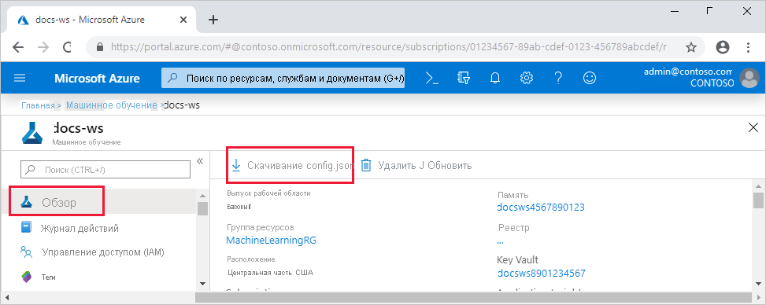
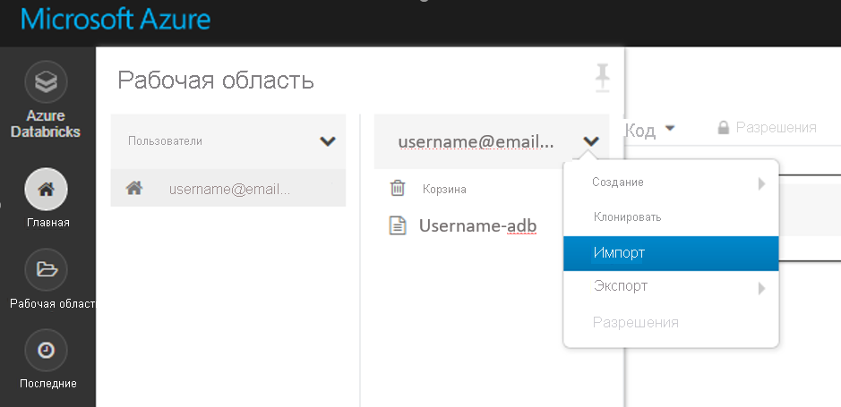

# <a name="set-up-a-development-environment-for-azure-machine-learning"></a>Настройка среды разработки для Машинное обучение Azure

Узнайте, как настроить среду разработки Python для Машинное обучение Azure.

В следующей таблице показаны все среды разработки, описываемые в этой статье, а также достоинства и недостатки.

| Среда | Плюсы | Минусы |
| --- | --- | --- |
| [Локальная среда](#local) | Полный контроль над средой разработки и зависимостями. Запустите с любым инструментом сборки, средой или интегрированной средой разработки. | Приступая к работе, занимает больше времени. Необходимо установить необходимые пакеты SDK, а также установить среду, если у вас ее еще нет. |
| [Вычислительная операция Машинного обучения Azure](#compute-instance) | Самый простой способ начать работу. В виртуальной машине рабочей области уже установлен весь пакет SDK, а учебные материалы для записных книжек предварительно клонированы и готовы к выполнению. | Отсутствие контроля над средой разработки и зависимостями. Дополнительные затраты на виртуальную машину Linux (виртуальную машину можно остановить, когда она не используется, чтобы избежать расходов). См. сведения о [ценах](https://azure.microsoft.com/pricing/details/virtual-machines/linux/). |
| [Azure Databricks](#aml-databricks) | Идеально подходит для выполнения крупномасштабных рабочих процессов машинного обучения на масштабируемой Apache Sparkной платформе. | Избыточное для экспериментального машинного обучения, а также экспериментов и рабочих процессов с меньшим масштабом. Дополнительные затраты, вызванные Azure Databricks. См. сведения о [ценах](https://azure.microsoft.com/pricing/details/databricks/). |
| [Виртуальная машина для обработки и анализа данных (DSVM)](#dsvm) | Аналогично облачному вычислительному экземпляру (Python и пакет SDK предварительно установлены), но с предварительно установленными дополнительными популярными средствами обработки и анализа данных и машинного обучения. Простота масштабирования и объединения с другими пользовательскими инструментами и рабочими процессами. | Более медленный режим работы по сравнению с облачным вычислительным экземпляром. |

В этой статье также приводятся дополнительные советы по использованию следующих средств:

* Jupyter Notebook: если вы уже используете приложения Jupyter Notebook, вам нужно установить некоторые вспомогательные элементы, которые содержит пакет SDK.

* Visual Studio Code. при использовании Visual Studio Code [расширение машинное обучение Azure](https://marketplace.visualstudio.com/items?itemName=ms-toolsai.vscode-ai) включает расширенную языковую поддержку для Python, а также функции, позволяющие работать с машинное обучение Azure гораздо более удобной и продуктивной.

## <a name="prerequisites"></a>предварительные требования

* Рабочая область Машинное обучение Azure. Если у вас ее нет, можно создать рабочую область Машинное обучение Azure с помощью шаблонов [портал Azure](how-to-manage-workspace.md), [Azure CLI](how-to-manage-workspace-cli.md#create-a-workspace)и [Azure Resource Manager](how-to-create-workspace-template.md).

### <a name="local-and-dsvm-only-create-a-workspace-configuration-file"></a><a id="workspace"></a> (Только Local и DSVM) Создание файла конфигурации рабочей области

Файл конфигурации рабочей области — это JSON-файл, который сообщает пакету SDK, как взаимодействовать с рабочей областью Машинное обучение Azure. В этого файла *config.json* следующий формат:

```json
{
    "subscription_id": "<subscription-id>",
    "resource_group": "<resource-group>",
    "workspace_name": "<workspace-name>"
}
```

Этот JSON-файл должен находиться в структуре каталогов, которые содержат сценарии Python или приложения Jupyter Notebook. Он может находиться в том же каталоге, подкаталоге с именем *.azureml* или родительском каталоге.

Чтобы использовать этот файл из кода, используйте [`Workspace.from_config`](https://docs.microsoft.com/python/api/azureml-core/azureml.core.workspace.workspace?view=azure-ml-py#from-config-path-none--auth-none---logger-none---file-name-none-&preserve-view=true) метод. Этот код загружает данные из файла и подключается к рабочей области.

Создайте файл конфигурации рабочей области одним из следующих способов.

* Портал Azure

    **Скачайте файл**: в [портал Azure](https://ms.portal.azure.com)выберите  **скачать config.jsв** разделе **Обзор** рабочей области.

    

* Пакет SDK Python для Машинного обучения Azure

    Создайте скрипт для подключения к рабочей области Машинное обучение Azure и используйте [`write_config`](https://docs.microsoft.com/python/api/azureml-core/azureml.core.workspace.workspace?view=azure-ml-py#write-config-path-none--file-name-none-&preserve-view=true) метод для создания файла и сохраните его как *. azureml/config.jsв*. Обязательно замените `subscription_id` , `resource_group` и `workspace_name` собственными.

    ```python
    from azureml.core import Workspace

    subscription_id = '<subscription-id>'
    resource_group  = '<resource-group>'
    workspace_name  = '<workspace-name>'

    try:
        ws = Workspace(subscription_id = subscription_id, resource_group = resource_group, workspace_name = workspace_name)
        ws.write_config()
        print('Library configuration succeeded')
    except:
        print('Workspace not found')
    ```

## <a name="local-computer"></a><a id="local"></a>Локальный компьютер

Чтобы настроить локальную среду разработки (которая также может быть удаленной виртуальной машиной, например Машинное обучение Azure вычислительного экземпляра или DSVM):

1. Создайте виртуальную среду Python (Virtualenv, conda).

    > [!NOTE]
    > Хотя это и не является обязательным, рекомендуется использовать [Anaconda](https://www.anaconda.com/download/) или [Miniconda](https://www.anaconda.com/download/) для управления виртуальными средами Python и установки пакетов.

    > [!IMPORTANT]
    > Если в Linux или macOS вы используете оболочку, отличающуюся от bash (например, zsh), при выполнении некоторых команд могут возникнуть ошибки. Чтобы решить эту проблему, используйте команду `bash`, чтобы запустить bash и выполните там нужные команды.

1. Активируйте только что созданную виртуальную среду Python.
1. Установите [пакет SDK для машинное обучение Azure Python](https://docs.microsoft.com/python/api/overview/azure/ml/install?view=azure-ml-py&preserve-view=true).
1. Чтобы настроить локальную среду для использования рабочей области Машинное обучение Azure, [Создайте файл конфигурации рабочей области](#workspace) или используйте существующий.

Теперь, когда локальная среда настроена, можно приступить к работе с Машинное обучение Azure. Чтобы приступить к работе, ознакомьтесь с [руководством по началу работы с машинное обучение Azure Python](tutorial-1st-experiment-sdk-setup-local.md) .

### <a name="jupyter-notebooks"></a><a id="jupyter"></a>Jupyter Notebook

При запуске локального Jupyter Notebook сервера рекомендуется создать ядро IPython Notebook для виртуальной среды Python. Это помогает обеспечить ожидаемое поведение при импорте ядра и пакета.

1. Включение ядер IPython Notebook для конкретной среды

    ```bash
    conda install notebook ipykernel
    ```

1. Создайте ядро для виртуальной среды Python. Обязательно замените `<myenv>` именем виртуальной среды Python.

    ```bash
    ipython kernel install --user --name <myenv> --display-name "Python (myenv)"
    ```

1. Запуск сервера Jupyter Notebook

Чтобы начать работу с записными книжками Машинное обучение Azure и Jupyter, ознакомьтесь с [репозиторием записных книжек машинное обучение Azure](https://github.com/Azure/MachineLearningNotebooks) .

### <a name="visual-studio-code"></a><a id="vscode"></a>Visual Studio Code

Использование Visual Studio Code для разработки:

1. Установите [Visual Studio Code](https://code.visualstudio.com/Download).
1. Установите [расширение Машинное обучение Azure Visual Studio Code](tutorial-setup-vscode-extension.md) (Предварительная версия).

После установки расширения Visual Studio Code можно управлять [ресурсами машинное обучение Azure](how-to-manage-resources-vscode.md), [запускать и отлаживать эксперименты](how-to-debug-visual-studio-code.md)и [развертывать обученные модели](tutorial-train-deploy-image-classification-model-vscode.md).

## <a name="azure-machine-learning-compute-instance"></a><a id="compute-instance"></a>Машинное обучение Azure вычислительный экземпляр

Машинное обучение Azure [вычислительным экземпляром](concept-compute-instance.md) является защищенная облачная Рабочая станция Azure, которая предоставляет специалистам по обработке и анализу данных Jupyter Notebook сервер, JupyterLab и полностью управляемую среду машинного обучения.

Нет ничего для установки или настройки для вычислительного экземпляра.  

Создайте его в рабочей области Машинное обучение Azure в любое время. Укажите только имя и укажите тип виртуальной машины Azure. Попробуйте сейчас с помощью этого [учебника: Настройка среды и рабочей области](tutorial-1st-experiment-sdk-setup.md).

Дополнительные сведения об экземплярах вычислений, включая установку пакетов, см. в разделе [COMPUTE Instances](concept-compute-instance.md).

> [!TIP]
> Чтобы избежать расходов на неиспользуемый вычислительный экземпляр, следует [прерывать работу вычислительного экземпляра](tutorial-1st-experiment-bring-data.md#clean-up-resources).

Помимо Jupyter Notebook Server и JupyterLab, можно использовать функции COMPUTE Instances в [интегрированной записной книжке в машинное обучение Azure Studio](how-to-run-jupyter-notebooks.md).

Можно также использовать расширение Машинное обучение Azure Visual Studio Code, чтобы [настроить вычислительный экземпляр машинное обучение Azure в качестве удаленного сервера Jupyter Notebook](how-to-set-up-vs-code-remote.md#configure-compute-instance-as-remote-notebook-server).

## <a name="data-science-virtual-machine"></a><a id="dsvm"></a>Виртуальная машина для обработки и анализа данных

DSVM — это настраиваемый образ виртуальной машины. Она разработана для работы с обработкой и анализом данных, которая является предварительно настроенными инструментами и программами, такими как:

  - пакеты TensorFlow, PyTorch, Scikit-learn, XGBoost и пакет SDK для Машинного обучения Azure;
  - популярные инструменты для обработки и анализа данных, в том числе изолированная среда Spark и Drill;
  - инструменты Azure, такие как интерфейс командной строки Azure, AzCopy и Обозреватель службы хранилища;
  - интегрированные среды разработки, например Visual Studio Code и PyCharm;
  - Сервер Jupyter Notebook.

Более полный список средств см. в разделе " [DSVM прилагаемые средства](data-science-virtual-machine/tools-included.md)".

> [!IMPORTANT]
> Если вы планируете использовать DSVM в качестве [целевого объекта вычислений](concept-compute-target.md) для обучения или задания, то поддерживается только Ubuntu.

Использование DSVM в качестве среды разработки

1. Создайте DSVM с помощью одного из следующих методов:

    * Используйте портал Azure, чтобы создать DSVM [Ubuntu](data-science-virtual-machine/dsvm-ubuntu-intro.md) или [Windows](data-science-virtual-machine/provision-vm.md) .
    * [Создайте DSVM с помощью шаблонов ARM](data-science-virtual-machine/dsvm-tutorial-resource-manager.md).
    * Использование командной строки Azure CLI

        Чтобы создать DSVM Ubuntu, используйте следующую команду:

        ```azurecli-interactive
        # create a Ubuntu DSVM in your resource group
        # note you need to be at least a contributor to the resource group in order to execute this command successfully
        # If you need to create a new resource group use: "az group create --name YOUR-RESOURCE-GROUP-NAME --location YOUR-REGION (For example: westus2)"
        az vm create --resource-group YOUR-RESOURCE-GROUP-NAME --name YOUR-VM-NAME --image microsoft-dsvm:linux-data-science-vm-ubuntu:linuxdsvmubuntu:latest --admin-username YOUR-USERNAME --admin-password YOUR-PASSWORD --generate-ssh-keys --authentication-type password
        ```

        Чтобы создать DSVM Windows, используйте следующую команду:

        ```azurecli-interactive
        # create a Windows Server 2016 DSVM in your resource group
        # note you need to be at least a contributor to the resource group in order to execute this command successfully
        az vm create --resource-group YOUR-RESOURCE-GROUP-NAME --name YOUR-VM-NAME --image microsoft-dsvm:dsvm-windows:server-2016:latest --admin-username YOUR-USERNAME --admin-password YOUR-PASSWORD --authentication-type password
        ```

1. Активируйте среду conda, содержащую пакет SDK для Машинное обучение Azure.

    * Виртуальная машина для обработки и анализа данных под управлением Ubuntu:

        ```bash
        conda activate py36
        ```

    * Виртуальная машина для обработки и анализа данных под управлением Windows:

        ```bash
        conda activate AzureML
        ```

1. Чтобы настроить DSVM для использования рабочей области Машинное обучение Azure, [Создайте файл конфигурации рабочей области](#workspace) или используйте существующий.

Как и в случае с локальными средами, для взаимодействия с Машинное обучение Azure можно использовать Visual Studio Code и [расширение Машинное обучение Azure Visual Studio Code](#vscode) .

Дополнительные сведения о Виртуальных машинах для обработки и анализа данных см. [здесь](https://azure.microsoft.com/services/virtual-machines/data-science-virtual-machines/).

## <a name="azure-databricks"></a><a name="aml-databricks"></a> Azure Databricks

Azure Databricks — это среда, которая лежит в основе Apache Spark в облаке Azure. Она предоставляет среду для совместной работы на основе записных книжек с вычислительным кластером на основе ЦП или GPU.

Как Azure Databricks работает с Машинное обучение Azure:

+ Вы можете обучить модель с помощью Spark MLlib и развернуть модель в ACI/AKS из Azure Databricks.
+ Вы также можете использовать [автоматизированные возможности машинного обучения](concept-automated-ml.md) в специальном пакете SDK для машинного обучения Azure с Azure Databricks.
+ Azure Databricks можно использовать в качестве целевого объекта вычислений из [конвейера машинное обучение Azure](concept-ml-pipelines.md).

### <a name="set-up-your-databricks-cluster"></a>Настройка кластера кирпичей данных

Создание [кластера кирпичей](https://docs.microsoft.com/azure/azure-databricks/quickstart-create-databricks-workspace-portal). Некоторые параметры применяются только в том случае, если пакет SDK устанавливается для автоматического машинного обучения в модулях.
**Создание кластера занимает несколько минут.**

Используйте следующие параметры:

| Параметр |Область применения| Значение |
|----|---|---|
| Имя кластера |always| yourclustername |
| Среда выполнения Databricks |always|Среда выполнения, не поддерживающая ML 7,1 (Scala 2,21, Spark 3.0.0) |
| Версия Python |always| 3 |
| Рабочие роли |always| 2 или больше |
| Типы виртуальных машин узла рабочей роли <br>(определяет максимальное число одновременных итераций) |Автоматическое Машинное обучение<br>только| Предпочитается виртуальная машина, оптимизированная для операций в памяти |
| Включение автомасштабирования |Автоматическое Машинное обучение<br>только| Снять пометку |

Дождитесь запуска кластера, прежде чем продолжать.

### <a name="install-the-correct-sdk-into-a-databricks-library"></a>Установка правильного пакета SDK в библиотеке кирпичей

После запуска кластера [Создайте библиотеку](https://docs.databricks.com/user-guide/libraries.html#create-a-library) , чтобы присоединить соответствующий пакет SDK машинное обучение Azure к кластеру. Для автоматизированного ML перейдите к [пакету SDK для блоков с автоматическим машинным обучением](#sdk-for-databricks-with-automated-machine-learning).

1. Щелкните правой кнопкой мыши текущую папку рабочей области, в которой нужно сохранить библиотеку. Выберите **создать**  >  **библиотеку**.

1. Выберите следующий параметр (другие установки пакета SDK не поддерживаются).

   |&nbsp;Дополнительные возможности пакета SDK &nbsp;|Источник|&nbsp;Имя PyPi&nbsp;&nbsp;&nbsp;&nbsp;&nbsp;&nbsp;|
   |----|---|---|
   |Для кирпичей| Отправка Python Egg или PyPI | azureml-sdk[databricks]|

   > [!Warning]
   > Другие дополнительные компоненты SDK устанавливаться не могут. Выберите только параметр [ `databricks` ].

   * Не выбирайте **Автоматическое присоединение ко всем кластерам**.
   * Выберите  **присоединить** рядом с именем кластера.

1. Отслеживать ошибки до тех пор, пока состояние не изменится на " **подключено**", что может занять несколько минут.  Если этот шаг завершается ошибкой:

   Попробуйте перезапустить кластер, выполнив следующие действия.
   1. В левой области щелкните **Кластеры**.
   1. Выберите имя кластера в таблице.
   1. На вкладке **Библиотеки** щелкните **Перезапустить**.

   Также учитывайте следующее.
   + В Аутомл config при использовании Azure Databricks добавьте следующие параметры:
       1. ```max_concurrent_iterations``` основано на количестве рабочих узлов в кластере.
        2. ```spark_context=sc``` основывается на контексте Spark по умолчанию.
   + Если у вас старая версия пакета SDK, отмените ее выбор из установленных библиотек кластера и перейдите в корзину. Установите новую версию пакета SDK и перезапустите кластер. Если после перезагрузки возникла ошибка, отключите и повторно подключите кластер.

Если установка прошла успешно, Импортированная библиотека должна выглядеть следующим образом:

#### <a name="sdk-for-databricks"></a>Пакет SDK для кирпичей


#### <a name="sdk-for-databricks-with-automated-machine-learning"></a>Пакет SDK для кирпичей с автоматическим машинным обучением
Если кластер был создан с модулями данных, не являющимися средой выполнения ML 7,1 или выше, выполните следующую команду в первой ячейке записной книжки, чтобы установить пакет SDK для AML.

```
%pip install --upgrade --force-reinstall -r https://aka.ms/automl_linux_requirements.txt
```
Для модулями выполнения, не поддерживающими ML Runtime 7,0 и ниже, установите пакет SDK для AML с помощью [скрипта init](https://github.com/Azure/MachineLearningNotebooks/blob/master/how-to-use-azureml/azure-databricks/automl/README.md).


### <a name="start-exploring"></a>Начало знакомства

Попробуйте продукт:
+ Несмотря на то что доступны многие примеры записных книжек, **с Azure Databricks работают только [эти образцы записных книжек](https://github.com/Azure/MachineLearningNotebooks/blob/master/how-to-use-azureml/azure-databricks) .**

+ Импортируйте эти примеры непосредственно из рабочей области. См. ниже: 
 

+ Узнайте, как [создать конвейер с модулями обработки в качестве обучающего вычислений](how-to-create-your-first-pipeline.md).

## <a name="next-steps"></a>Дальнейшие действия

- [Обучение модели](tutorial-train-models-with-aml.md) на машинное обучение Azure с помощью набора данных MNIST
- Просмотрите статью [What is the Azure Machine Learning SDK for Python?](https://docs.microsoft.com/python/api/overview/azure/ml/intro?view=azure-ml-py&preserve-view=true) (Что такое пакет SDK для Машинного обучения Azure для Python?)
