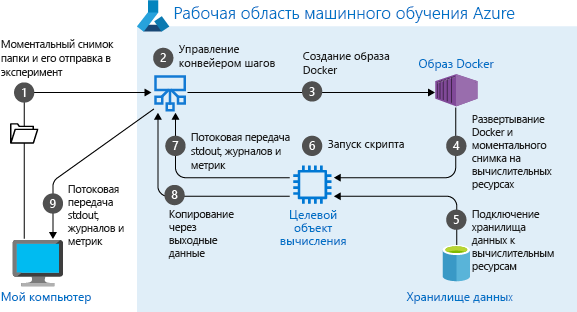
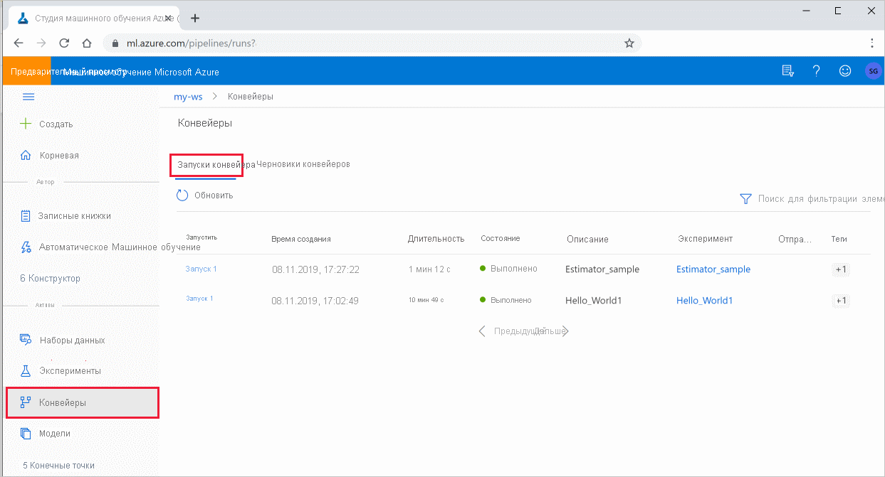

# <a name="create-and-run-machine-learning-pipelines-with-azure-machine-learning-sdk"></a>Создание и запуск конвейеров машинного обучения с помощью пакета SDK для Машинное обучение Azure

Из этой статьи вы узнаете, как создавать и запускать [конвейеры машинного обучения](concept-ml-pipelines.md) с помощью [пакета SDK для машинное обучение Azure](/python/api/overview/azure/ml/intro?preserve-view=true&view=azure-ml-py). Используйте **конвейеры машинного обучения** для создания рабочего процесса, который объединяет различные фазы машинного обучения. Затем опубликуйте этот конвейер для последующего доступа или совместного использования с другими пользователями. Отслеживайте конвейеры машинного обучения, чтобы узнать, как модель работает в реальном мире и как обнаружить смещение данных. Конвейеры машинного обучения идеально подходят для сценариев пакетной оценки с использованием различных вычислений, повторного использования действий вместо их перезапуска, а также совместного использования рабочих процессов машинного обучения с другими пользователями.

Эта статья не является учебником. Рекомендации по созданию первого конвейера см. в разделе [учебник. создание конвейера машинное обучение Azure для пакетной оценки](tutorial-pipeline-batch-scoring-classification.md) или [Использование автоматизированного ML в конвейере машинное обучение Azure в Python](how-to-use-automlstep-in-pipelines.md). 

Хотя можно использовать другой тип конвейера, называемый [конвейером Azure](/azure/devops/pipelines/targets/azure-machine-learning?context=azure%2fmachine-learning%2fservice%2fcontext%2fml-context&preserve-view=true&tabs=yaml&view=azure-devops) для автоматизации задач ML в CI/CD, этот тип конвейера не хранится в рабочей области. [Сравните эти разные конвейеры](concept-ml-pipelines.md#which-azure-pipeline-technology-should-i-use).

Создаваемые конвейеры машинного обучения видимы для членов [рабочей области](how-to-manage-workspace.md)машинное обучение Azure. 

Конвейеры машинного обучения выполняются в целевых объектах вычислений (см. раздел [что такое целевые показатели вычислений в машинное обучение Azure](./concept-compute-target.md)). Конвейеры могут считывать и записывать данные в поддерживаемые расположения [хранилища Azure](../storage/index.yml) и из них.

Если у вас еще нет подписки Azure, создайте бесплатную учетную запись, прежде чем начинать работу. Попробуйте [бесплатную или платную версию Машинного обучения Azure](https://aka.ms/AMLFree).

## <a name="prerequisites"></a>Предварительные требования

* Создайте [рабочую область Машинного обучения Azure](how-to-manage-workspace.md) для хранения всех ресурсов конвейера.

* [Настройте среду разработки](how-to-configure-environment.md) , чтобы установить пакет sdk для машинное обучение Azure, или используйте [машинное обучение Azure вычислительный экземпляр](concept-compute-instance.md) с уже установленным пакетом SDK.

Начните с подключения рабочей области:

```Python
import azureml.core
from azureml.core import Workspace, Datastore

ws = Workspace.from_config()
```

## <a name="set-up-machine-learning-resources"></a>Настройка ресурсов машинного обучения

Создайте ресурсы, необходимые для запуска конвейера машинного обучения.

* Настройте хранилище данных для хранения данных, необходимых для выполнения шагов конвейера.

* Настройте `Dataset` объект так, чтобы он указывал на постоянные данные, которые находятся в или доступны в хранилище данных. Настройте `PipelineData` объект для временных данных, передаваемых между этапами конвейера. 

    > [!TIP]
    > Улучшенный интерфейс передачи временных данных между этапами конвейера доступен в общедоступном классе предварительной версии  [`OutputFileDatasetConfig`](/python/api/azureml-core/azureml.data.outputfiledatasetconfig?preserve-view=true&view=azure-ml-py) .  Этот класс является [экспериментальной](/python/api/overview/azure/ml/?preserve-view=true&view=azure-ml-py#&preserve-view=truestable-vs-experimental) функцией предварительной версии и может измениться в любое время.

* Настройте [целевые объекты вычислений](concept-azure-machine-learning-architecture.md#compute-targets) для выполнения шагов вашего конвейера.

### <a name="set-up-a-datastore"></a>Настройка хранилища данных

Хранилище данных содержит данные, которые использует конвейер. У каждой рабочей области есть хранилище данных по умолчанию. Вы можете зарегистрировать дополнительные хранилища данных. 

При создании рабочей области [файлы Azure](../storage/files/storage-files-introduction.md) и [хранилище BLOB-объектов Azure](../storage/blobs/storage-blobs-introduction.md) присоединяются к рабочей области. Для подключения к хранилищу BLOB-объектов Azure регистрируется хранилище данных по умолчанию. Дополнительные сведения см. в статье [Выбор между большими двоичными объектами Azure, службой файлов Azure и дисками Azure](../storage/common/storage-introduction.md). 

```python
# Default datastore 
def_data_store = ws.get_default_datastore()

# Get the blob storage associated with the workspace
def_blob_store = Datastore(ws, "workspaceblobstore")

# Get file storage associated with the workspace
def_file_store = Datastore(ws, "workspacefilestore")

```

Действия обычно потребляют данные и создают выходные данные. Шаг может создать данные, такие как модель, каталог с моделью и зависимыми файлами или временные данные. Эти данные становятся доступными для последующих шагов в конвейере. Дополнительные сведения о подключении конвейера к данным см. в статьях [как получить доступ к данным](how-to-access-data.md) и [как зарегистрировать наборы](how-to-create-register-datasets.md)данных. 

### <a name="configure-data-with-dataset-and-pipelinedata-objects"></a>Настройка данных с `Dataset` помощью `PipelineData` объектов и

Предпочтительный способ передачи данных в конвейер — это объект [DataSet](/python/api/azureml-core/azureml.core.dataset.Dataset) . `Dataset`Объект указывает на данные, которые находятся в или доступны из хранилища данных или URL-адреса. `Dataset`Класс является абстрактным, поэтому вы создадите экземпляр `FileDataset` (ссылающийся на один или несколько файлов) или объект `TabularDataset` , созданный из одного или нескольких файлов с разделенными столбцами данных.


Вы создаете `Dataset` с помощью таких методов, как [from_files](/python/api/azureml-core/azureml.data.dataset_factory.filedatasetfactory?preserve-view=true&view=azure-ml-py#&preserve-view=truefrom-files-path--validate-true-) или [from_delimited_files](/python/api/azureml-core/azureml.data.dataset_factory.tabulardatasetfactory?preserve-view=true&view=azure-ml-py#&preserve-view=truefrom-delimited-files-path--validate-true--include-path-false--infer-column-types-true--set-column-types-none--separator------header-true--partition-format-none--support-multi-line-false-).

```python
from azureml.core import Dataset

my_dataset = Dataset.File.from_files([(def_blob_store, 'train-images/')])
```
Промежуточные данные (или выходные данные шага) представляет объект [PipelineData](/python/api/azureml-pipeline-core/azureml.pipeline.core.pipelinedata?preserve-view=true&view=azure-ml-py). `output_data1` создается как выходные данные шага и используется в качестве входных данных одного шага или нескольких последующих шагов. `PipelineData` представляет зависимость данных между шагами и неявно определяет порядок выполнения шагов в конвейере. Этот объект будет использоваться позже при создании шагов конвейера.

```python
from azureml.pipeline.core import PipelineData

output_data1 = PipelineData(
    "output_data1",
    datastore=def_blob_store,
    output_name="output_data1")

```

> [!TIP]
> Сохранение промежуточных данных между этапами конвейера также возможно благодаря общедоступному классу предварительной версии [`OutputFileDatasetConfig`](/python/api/azureml-core/azureml.data.outputfiledatasetconfig?preserve-view=true&view=azure-ml-py) . Пример кода с использованием `OutputFileDatasetConfig` класса см. в разделе [создание конвейера машинного обучения на два этапа](https://github.com/Azure/MachineLearningNotebooks/blob/master/how-to-use-azureml/work-with-data/datasets-tutorial/pipeline-with-datasets/pipeline-for-image-classification.ipynb).

> [!TIP]
> Отправляйте только файлы, относящиеся к заданию. Любые изменения в файлах в каталоге данных будут рассматриваться как причины для повторного выполнения шага при следующем запуске конвейера, даже если указано повторное использование. 

## <a name="set-up-a-compute-target"></a>Настройка целевой среды для вычислений


В машинном обучении Azure __вычислительной средой__ (или __целевым объектом вычислений__) считаются компьютеры или кластеры, которые выполняют вычислительные операции конвейера машинного обучения.   Полный список целевых объектов вычислений и [Создание целевых объектов](how-to-create-attach-compute-studio.md) вычислений для создания и присоединения к рабочей области см. в разделе [целевые объекты вычислений для обучения модели](concept-compute-target.md#train) .   Процесс создания и присоединения целевого объекта вычислений одинаков, независимо от того, выполняется ли обучение модели или выполнение этапа конвейера. После того как вы создадите и присоедините свой целевой объект вычислений, используйте объект `ComputeTarget` на [шаге конвейера](#steps).

> [!IMPORTANT]
> Выполнение операций управления на целевых объектах вычислений не поддерживается внутри удаленных заданий. Так как конвейеры машинного обучения передаются в качестве удаленного задания, не используйте операции управления на целевых объектах вычислений внутри конвейера.

### <a name="azure-machine-learning-compute"></a>Вычислительная среда Машинного обучения Azure

Для выполнения шагов конвейера можно создать вычислительную среду Машинного обучения Azure. Код для других целевых объектов вычислений очень похож на, в зависимости от типа, несколько других параметров. 

```python
from azureml.core.compute import ComputeTarget, AmlCompute

compute_name = "aml-compute"
vm_size = "STANDARD_NC6"
if compute_name in ws.compute_targets:
    compute_target = ws.compute_targets[compute_name]
    if compute_target and type(compute_target) is AmlCompute:
        print('Found compute target: ' + compute_name)
else:
    print('Creating a new compute target...')
    provisioning_config = AmlCompute.provisioning_configuration(vm_size=vm_size,  # STANDARD_NC6 is GPU-enabled
                                                                min_nodes=0,
                                                                max_nodes=4)
    # create the compute target
    compute_target = ComputeTarget.create(
        ws, compute_name, provisioning_config)

    # Can poll for a minimum number of nodes and for a specific timeout.
    # If no min node count is provided it will use the scale settings for the cluster
    compute_target.wait_for_completion(
        show_output=True, min_node_count=None, timeout_in_minutes=20)

    # For a more detailed view of current cluster status, use the 'status' property
    print(compute_target.status.serialize())
```

## <a name="configure-the-training-runs-environment"></a>Настройка среды учебного запуска

Следующим шагом является проверка того, что удаленный обучающий запуск имеет все зависимости, необходимые для обучения. Зависимости и контекст среды выполнения задаются путем создания и настройки `RunConfiguration` объекта. 

```python
from azureml.core.runconfig import RunConfiguration
from azureml.core.conda_dependencies import CondaDependencies
from azureml.core import Environment 

aml_run_config = RunConfiguration()
# `compute_target` as defined in "Azure Machine Learning compute" section above
aml_run_config.target = compute_target

USE_CURATED_ENV = True
if USE_CURATED_ENV :
    curated_environment = Environment.get(workspace=ws, name="AzureML-Tutorial")
    aml_run_config.environment = curated_environment
else:
    aml_run_config.environment.python.user_managed_dependencies = False
    
    # Add some packages relied on by data prep step
    aml_run_config.environment.python.conda_dependencies = CondaDependencies.create(
        conda_packages=['pandas','scikit-learn'], 
        pip_packages=['azureml-sdk', 'azureml-dataprep[fuse,pandas]'], 
        pin_sdk_version=False)
```

В приведенном выше коде показаны два варианта обработки зависимостей. Как было представлено, `USE_CURATED_ENV = True` Конфигурация основана на проверенной среде. Проверенные среды — "пребакед" с общими взаимозависимыми библиотеками, и их можно значительно ускорить, чтобы перевести в режим «в сети». Проверенные среды имеют предварительно созданные образы DOCKER в [реестре контейнеров Microsoft](https://hub.docker.com/publishers/microsoftowner). Дополнительные сведения см. в разделе [машинное обучение Azure проверенные среды](resource-curated-environments.md).

Путь, полученный при изменении `USE_CURATED_ENV` , чтобы `False` Показать шаблон для явного задания зависимостей. В этом случае новый пользовательский образ DOCKER будет создан и зарегистрирован в реестре контейнеров Azure в группе ресурсов (см. статью [Введение в частные реестры контейнеров DOCKER в Azure](../container-registry/container-registry-intro.md)). Создание и регистрация этого образа может занять несколько минут.

## <a name="construct-your-pipeline-steps"></a><a id="steps"></a>Создание шагов конвейера

После создания ресурсов и среды вычислений вы можете определить шаги конвейера. Существует множество встроенных шагов, доступных через пакет SDK для Машинное обучение Azure, как можно увидеть в [справочной документации по `azureml.pipeline.steps` пакету](/python/api/azureml-pipeline-steps/azureml.pipeline.steps?preserve-view=true&view=azure-ml-py). Наиболее гибкий класс — это [писонскриптстеп](/python/api/azureml-pipeline-steps/azureml.pipeline.steps.python_script_step.pythonscriptstep?preserve-view=true&view=azure-ml-py), который запускает сценарий Python.

```python
from azureml.pipeline.steps import PythonScriptStep
dataprep_source_dir = "./dataprep_src"
entry_point = "prepare.py"
# `my_dataset` as defined above
ds_input = my_dataset.as_named_input('input1')

# `output_data1`, `compute_target`, `aml_run_config` as defined above
data_prep_step = PythonScriptStep(
    script_name=entry_point,
    source_directory=dataprep_source_dir,
    arguments=["--input", ds_input.as_download(), "--output", output_data1],
    inputs=[ds_input],
    outputs=[output_data1],
    compute_target=compute_target,
    runconfig=aml_run_config,
    allow_reuse=True
)
```

В приведенном выше коде показан типичный этап начального конвейера. Код подготовки данных находится в подкаталоге (в этом примере — в `"prepare.py"` каталоге `"./dataprep.src"` ). В рамках процесса создания конвейера этот каталог загружается в ZIP-архив и передается в, `compute_target` а на шаге выполняется скрипт, указанный в качестве значения параметра `script_name` .

`arguments`Значения, `inputs` и `outputs` определяют входные и выходные данные шага. В приведенном выше примере базовые данные представляют собой `my_dataset` набор данных. Соответствующие данные будут скачаны в ресурс вычислений, так как в коде указано значение `as_download()` . Сценарий `prepare.py` выполняет любые задачи преобразования данных, подходящие для выполняемой задачи, и выводит данные в `output_data1` тип `PipelineData` . Дополнительные сведения см. [в разделе Перемещение данных в и между этапами конвейера машинного обучения (Python)](how-to-move-data-in-out-of-pipelines.md). 

Этот шаг будет выполняться на компьютере, определенном с `compute_target` помощью конфигурации `aml_run_config` . 

Повторное использование предыдущих результатов ( `allow_reuse` ) является ключом при использовании конвейеров в среде совместной работы, поскольку устранение ненужных повторов обеспечивает гибкость. Используется по умолчанию, когда script_name, входные и параметры шага остаются неизменными. Если разрешено повторное использование, результаты предыдущего выполнения немедленно отправляются на следующий шаг. Если параметр `allow_reuse` имеет значение `False` , то во время выполнения конвейера для этого шага всегда будет создаваться новый запуск.

Можно создать конвейер с одним шагом, но почти всегда вы решили разделить весь процесс на несколько этапов. Например, могут быть выполнены действия по подготовке данных, обучению, сравнению моделей и развертыванию. Например, можно предположить, что после `data_prep_step` указанного выше действия может пройти обучение:

```python
train_source_dir = "./train_src"
train_entry_point = "train.py"

training_results = PipelineData(name = "training_results", 
                                datastore=def_blob_store,
                                output_name="training_results")

    
train_step = PythonScriptStep(
    script_name=train_entry_point,
    source_directory=train_source_dir,
    arguments=["--prepped_data", output_data1.as_input(), "--training_results", training_results],
    compute_target=compute_target,
    runconfig=aml_run_config,
    allow_reuse=True
)
```

Приведенный выше код очень похож на этап подготовки данных. Обучающий код находится в каталоге, отдельном от кода подготовки данных. `PipelineData`Выходные данные шага подготовки данных `output_data1` используются в качестве _входных данных_ для этапа обучения. Создается новый `PipelineData` объект `training_results` для хранения результатов последующего сравнения или шага развертывания. 


> [!TIP]
> Для повышения производительности и возможности записи промежуточных данных обратно в хранилища в конце выполнения конвейера Используйте общедоступный класс предварительной версии [`OutputFileDatasetConfig`](/python/api/azureml-core/azureml.data.outputfiledatasetconfig?preserve-view=true&view=azure-ml-py) . Примеры кода см. в статьях [создание конвейера машинного обучения на основе двух шагов](https://github.com/Azure/MachineLearningNotebooks/blob/master/how-to-use-azureml/work-with-data/datasets-tutorial/pipeline-with-datasets/pipeline-for-image-classification.ipynb) и [запись данных обратно в хранилища после завершения выполнения](https://github.com/Azure/MachineLearningNotebooks/blob/master/how-to-use-azureml/work-with-data/datasets-tutorial/scriptrun-with-data-input-output/how-to-use-scriptrun.ipynb).

После определения шагов следует создать конвейер, добавив в него некоторые созданные шаги (или все).

> [!NOTE]
> Файл или данные не передаются в Машинное обучение Azure при определении шагов или при построении конвейера. Файлы передаются при вызове [эксперимента. Submit ()](/python/api/azureml-core/azureml.core.experiment.experiment?preserve-view=true&view=azure-ml-py#&preserve-view=truesubmit-config--tags-none----kwargs-).

```python
# list of steps to run (`compare_step` definition not shown)
compare_models = [data_prep_step, train_step, compare_step]

from azureml.pipeline.core import Pipeline

# Build the pipeline
pipeline1 = Pipeline(workspace=ws, steps=[compare_models])
```

### <a name="how-python-environments-work-with-pipeline-parameters"></a>Как среды Python работают с параметрами конвейера

Как обсуждалось ранее в разделе [Настройка среды обучающего выполнения](#configure-the-training-runs-environment), зависимости состояния среды и библиотеки Python указываются с помощью `Environment` объекта. Как правило, можно указать существующий объект `Environment` , обратившись к его имени и (необязательно) версию:

```python
aml_run_config = RunConfiguration()
aml_run_config.environment.name = 'MyEnvironment'
aml_run_config.environment.version = '1.0'
```

Однако, если вы решили использовать `PipelineParameter` объекты для динамического задания переменных в среде выполнения для шагов конвейера, этот метод нельзя использовать для ссылки на существующий объект `Environment` . Вместо этого, если необходимо использовать `PipelineParameter` объекты, необходимо задать `environment` `RunConfiguration` для поля объекта значение `Environment` . Ответственность за то, чтобы такой объект получил свои `Environment` зависимости от внешних пакетов Python, должен быть установлен правильно.

### <a name="use-a-dataset"></a>Использование набора данных 

Наборы данных, созданные из хранилища BLOB-объектов Azure, службы "файлы Azure", Azure Data Lake Storage 1-го поколения, Azure Data Lake Storage 2-го поколения, базу Azure SQL и базу данных Azure для PostgreSQL, можно использовать в качестве входных данных для любого этапа конвейера. Вы можете записывать выходные данные в [дататрансферстеп](/python/api/azureml-pipeline-steps/azureml.pipeline.steps.datatransferstep?preserve-view=true&view=azure-ml-py), [датабрикксстеп](/python/api/azureml-pipeline-steps/azureml.pipeline.steps.databricks_step.databricksstep?preserve-view=true&view=azure-ml-py)или, если вы хотите записать данные в определенное хранилище данных, используя [пипелинедата](/python/api/azureml-pipeline-core/azureml.pipeline.core.pipelinedata?preserve-view=true&view=azure-ml-py). 

> [!IMPORTANT]
> Записывать выходные данные обратно в хранилище данных с помощью Пипелинедата поддерживается только для больших двоичных объектов Azure и хранилищ данных файловых ресурсов Azure. 
>
> Чтобы записать выходные данные обратно в большой двоичный объект Azure, файловый ресурс Azure, ADLS Gen 1 и ADLS поколения 2, используйте общедоступный класс предварительной версии [`OutputFileDatasetConfig`](/python/api/azureml-core/azureml.data.output_dataset_config.outputfiledatasetconfig?preserve-view=true&view=azure-ml-py) .

```python
dataset_consuming_step = PythonScriptStep(
    script_name="iris_train.py",
    inputs=[iris_tabular_dataset.as_named_input("iris_data")],
    compute_target=compute_target,
    source_directory=project_folder
)
```

Затем вы получаете набор данных в конвейере с помощью словаря [Run.input_datasets](/python/api/azureml-core/azureml.core.run.run?preserve-view=true&view=azure-ml-py#&preserve-view=trueinput-datasets) .

```python
# iris_train.py
from azureml.core import Run, Dataset

run_context = Run.get_context()
iris_dataset = run_context.input_datasets['iris_data']
dataframe = iris_dataset.to_pandas_dataframe()
```

Линия `Run.get_context()` стоит выделить. Эта функция получает `Run` представление, представляющее текущий экспериментальный запуск. В приведенном выше примере мы используем его для получения зарегистрированного набора данных. Другим распространенным применением `Run` объекта является получение самого эксперимента и рабочей области, в которой находится эксперимент. 

```python
# Within a PythonScriptStep

ws = Run.get_context().experiment.workspace
```

Дополнительные сведения, включая альтернативные способы передачи данных и доступа к ним, см. [в разделе Перемещение данных в и между этапами конвейера ml (Python)](how-to-move-data-in-out-of-pipelines.md).

## <a name="caching--reuse"></a>Повторное использование кэширования &  

Чтобы оптимизировать и настроить поведение конвейеров, можно выполнить несколько действий по кэшированию и повторному использованию. Например, можно выбрать один из следующих способов:
+ **Отключите повторное использование по умолчанию выходных данных шага выполнения** , задав `allow_reuse=False` во время [определения шага](/python/api/azureml-pipeline-steps/?preserve-view=true&view=azure-ml-py). Повторное использование является ключом при использовании конвейеров в среде совместной работы, поскольку удаление ненужных запусков обеспечивает гибкость. Однако можно отказаться от повторного использования.
+ **Принудительное повторное создание выходных данных для всех шагов в запуске** с `pipeline_run = exp.submit(pipeline, regenerate_outputs=False)`

По умолчанию `allow_reuse` для шагов включен параметр, а в `source_directory` определении шага — хэшированный. Таким образом, если скрипт для данного шага остается неизменным ( `script_name` , входами и параметрами) и в нем ничего не ` source_directory` изменилось, то выходные данные предыдущего шага используются повторно, задание не отправляется в вычисление, а результаты предыдущего запуска сразу же становятся доступными для следующего шага.

```python
step = PythonScriptStep(name="Hello World",
                        script_name="hello_world.py",
                        compute_target=aml_compute,
                        source_directory=source_directory,
                        allow_reuse=False,
                        hash_paths=['hello_world.ipynb'])
```

## <a name="submit-the-pipeline"></a>Отправка конвейера

При отправке конвейера Машинное обучение Azure проверяет зависимости для каждого шага и загружает моментальный снимок указанного исходного каталога. Если исходный каталог не указан, передается текущий локальный каталог. Моментальный снимок также хранится в рамках эксперимента в рабочей области.

> [!IMPORTANT]
> [!INCLUDE [amlinclude-info](../../includes/machine-learning-amlignore-gitignore.md)]
>
> Дополнительные сведения см. в разделе о [моментальных снимках](concept-azure-machine-learning-architecture.md#snapshots).

```python
from azureml.core import Experiment

# Submit the pipeline to be run
pipeline_run1 = Experiment(ws, 'Compare_Models_Exp').submit(pipeline1)
pipeline_run1.wait_for_completion()
```

При первом запуске конвейера служба машинного обучения Azure выполняет следующие действия.

* Скачивает моментальный снимок проекта из хранилища BLOB-объектов, связанного с рабочей областью, на целевой объект вычислений.
* Создает образ Docker, соответствующий каждому шагу в конвейере.
* Скачивает образ DOCKER для каждого шага в целевом объекте вычислений из реестра контейнеров.
* Настраивает доступ к `Dataset` `PipelineData` объектам и. Для `as_mount()` режима доступа AS используется предохранитель для обеспечения виртуального доступа. Если подключение не поддерживается или пользователь указал параметр доступа как `as_download()` , данные копируются в целевой объект вычислений.

* Выполняет шаг на целевом объекте вычислений, указанном в определении этого шага. 
* Создает артефакты (журналы, stdout и stderr, метрики и выходные данные), указанные в шаге. Затем эти артефакты передаются и сохраняются в хранилище данных пользователя по умолчанию.



Дополнительные сведения см. в справочнике по [классу эксперимента](/python/api/azureml-core/azureml.core.experiment.experiment?preserve-view=true&view=azure-ml-py) .

## <a name="use-pipeline-parameters-for-arguments-that-change-at-inference-time"></a>Использовать параметры конвейера для аргументов, которые изменяются во время вывода

## <a name="view-results-of-a-pipeline"></a>Просмотр результатов конвейера

Просмотрите список всех конвейеров и сведения о его выполнении в студии:

1. Войдите в [Студию машинного обучения Azure](https://ml.azure.com).

1. [Просмотрите рабочую область](how-to-manage-workspace.md#view).

1. В левой части выберите **конвейеры** , чтобы просмотреть все запуски конвейера.
 
 
1. Выберите конкретный конвейер, чтобы просмотреть результаты его запуска.

### <a name="git-tracking-and-integration"></a>Отслеживание и интеграция Git

При выполнении запуска обучения, в котором исходный каталог является локальным репозиторием Git, сведения о репозитории хранятся в журнале выполнения. Дополнительные сведения см. в статье [Интеграция с Git для Машинного обучения Azure](concept-train-model-git-integration.md).

## <a name="next-steps"></a>Дальнейшие действия

- Сведения о том, как поделиться конвейером с коллегами или клиентами, см. в статье [Публикация конвейеров машинного обучения](how-to-deploy-pipelines.md) .
- Используйте [эти записные книжки Jupyter на сайте GitHub](https://aka.ms/aml-pipeline-readme) для дальнейшей изучения конвейеров машинного обучения
- См. справочную справку по пакету [azureml-конвейеры-Core](/python/api/azureml-pipeline-core/?preserve-view=true&view=azure-ml-py) и пакету [azureml-конвейеры — шаги](/python/api/azureml-pipeline-steps/?preserve-view=true&view=azure-ml-py) .
- Советы по отладке и устранению неполадок конвейеров см [. в статье](how-to-debug-pipelines.md)
- Узнайте, как запускать записные книжки, следуя указаниям из статьи [Использование записных книжек Jupyter в Машинном обучении Azure](samples-notebooks.md).