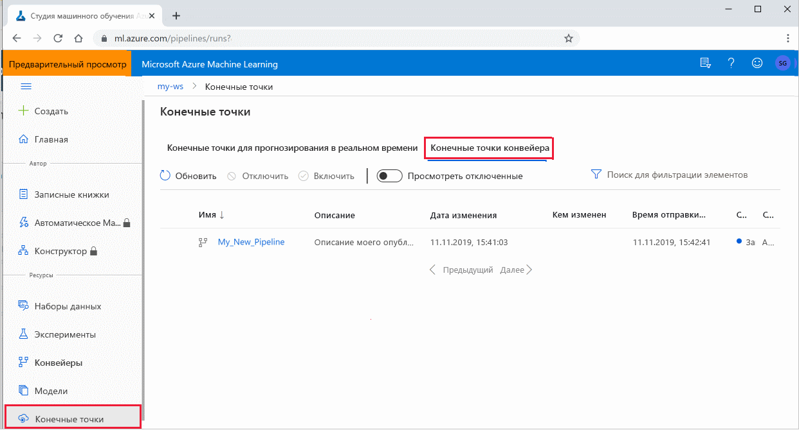

# <a name="publish-and-track-machine-learning-pipelines"></a>Публикация и мониторинг конвейеров машинного обучения


В этой статье показано, как совместно использовать конвейер машинного обучения с вашими коллегами или клиентами.

Конвейеры машинного обучения — это многократно используемые рабочие процессы для задач машинного обучения. Одним из преимуществ конвейеров является повышение совместной работы. Вы также можете создавать конвейеры версий, что позволяет клиентам использовать текущую модель при работе с новой версией. 

## <a name="prerequisites"></a>Предварительные требования

* Создание [рабочей области машинное обучение Azure](how-to-manage-workspace.md) для хранения всех ресурсов конвейера

* [Настройка среды разработки](how-to-configure-environment.md) для установки пакета SDK машинное обучение Azure или использование [машинное обучение Azure вычислительного экземпляра](concept-compute-instance.md) с уже установленным пакетом SDK

* Создайте и запустите конвейер машинного обучения, как описано в следующем [руководстве. создание конвейера машинное обучение Azure для пакетной оценки](tutorial-pipeline-batch-scoring-classification.md). Другие варианты см. [в статье Создание и запуск конвейеров машинного обучения с помощью пакета SDK для машинное обучение Azure](how-to-create-your-first-pipeline.md) .

## <a name="publish-a-pipeline"></a>Публикация конвейера

После создания и запуска конвейера можно опубликовать конвейер, чтобы он выполнялся с разными входными данными. Чтобы конечная точка RESTFUL уже опубликованного конвейера принимала параметры, необходимо настроить конвейер на использование `PipelineParameter` объектов для аргументов, которые будут отличаться.

1. Чтобы создать параметр конвейера, используйте объект [PipelineParameter](https://docs.microsoft.com/python/api/azureml-pipeline-core/azureml.pipeline.core.graph.pipelineparameter?view=azure-ml-py&preserve-view=true) со значением по умолчанию.

   ```python
   from azureml.pipeline.core.graph import PipelineParameter
   
   pipeline_param = PipelineParameter(
     name="pipeline_arg",
     default_value=10)
   ```

2. Добавьте этот объект `PipelineParameter` в качестве параметра в любой из шагов в конвейере следующим образом.

   ```python
   compareStep = PythonScriptStep(
     script_name="compare.py",
     arguments=["--comp_data1", comp_data1, "--comp_data2", comp_data2, "--output_data", out_data3, "--param1", pipeline_param],
     inputs=[ comp_data1, comp_data2],
     outputs=[out_data3],
     compute_target=compute_target,
     source_directory=project_folder)
   ```

3. Опубликуйте этот конвейер, который будет принимать параметр при вызове.

   ```python
   published_pipeline1 = pipeline_run1.publish_pipeline(
        name="My_Published_Pipeline",
        description="My Published Pipeline Description",
        version="1.0")
   ```

## <a name="run-a-published-pipeline"></a>Запустите опубликованный конвейер.

Все опубликованные конвейеры используют конечную точку REST. Конечная точка конвейера позволяет запускать конвейер из любых внешних систем, включая клиентов, не относящихся к Python. Эта конечная точка обеспечивает управляемую повторяемость для сценариев пакетной оценки и переобучения.

Чтобы вызвать выполнение предыдущего конвейера, необходим маркер заголовка проверки подлинности Azure Active Directory. Этот маркер описан в справочнике по [классам азуреклиаусентикатион](https://docs.microsoft.com/python/api/azureml-core/azureml.core.authentication.azurecliauthentication?view=azure-ml-py&preserve-view=true) и в [проверке подлинности в машинное обучение Azure](https://aka.ms/pl-restep-auth) записной книжке.

```python
from azureml.pipeline.core import PublishedPipeline
import requests

response = requests.post(published_pipeline1.endpoint,
                         headers=aad_token,
                         json={"ExperimentName": "My_Pipeline",
                               "ParameterAssignments": {"pipeline_arg": 20}})
```

`json`Аргумент для запроса POST должен содержать, для `ParameterAssignments` ключа, словарь, содержащий параметры конвейера и их значения. Кроме того, `json` аргумент может содержать следующие ключи:

| Ключ | Описание |
| --- | --- | 
| `ExperimentName` | Имя эксперимента, связанного с этой конечной точкой |
| `Description` | Произвольный текст, описывающий конечную точку | 
| `Tags` | Произвольные пары "ключ-значение", которые могут использоваться для добавления меток и создания заметок к запросам  |
| `DataSetDefinitionValueAssignments` | Словарь, используемый для изменения наборов данных без повторного обучения (см. обсуждение ниже) | 
| `DataPathAssignments` | Словарь, используемый для изменения путей к контурам без повторного обучения (см. обсуждение ниже) | 

### <a name="changing-datasets-and-datapaths-without-retraining"></a>Изменение наборов данных и путей к ним без повторного обучения

Может потребоваться обучение и вывод для различных наборов данных и путей к ним. Например, вы можете пожелать обучить меньший, более плотный набор данных, но выводить его в полном наборе данных. Вы можете переключать наборы данных с помощью `DataSetDefinitionValueAssignments` ключа в `json` аргументе запроса. Пути к данным переключаются с помощью `DataPathAssignments` . Метод для обоих методов аналогичен:

1. В скрипте определения конвейера создайте `PipelineParameter` для набора данных. Создайте `DatasetConsumptionConfig` или `DataPath` из `PipelineParameter` :

    ```python
    tabular_dataset = Dataset.Tabular.from_delimited_files('https://dprepdata.blob.core.windows.net/demo/Titanic.csv')
    tabular_pipeline_param = PipelineParameter(name="tabular_ds_param", default_value=tabular_dataset)
    tabular_ds_consumption = DatasetConsumptionConfig("tabular_dataset", tabular_pipeline_param)
    ```

1. В скрипте ML получите доступ к динамически заданному набору данных с помощью `Run.get_context().input_datasets` :

    ```python
    from azureml.core import Run
    
    input_tabular_ds = Run.get_context().input_datasets['tabular_dataset']
    dataframe = input_tabular_ds.to_pandas_dataframe()
    # ... etc ...
    ```

    Обратите внимание, что скрипт ML обращается к значению, заданному для `DatasetConsumptionConfig` ( `tabular_dataset` ), а не к значению `PipelineParameter` ( `tabular_ds_param` ).

1. В скрипте определения конвейера присвойте `DatasetConsumptionConfig` параметру значение `PipelineScriptStep` :

    ```python
    train_step = PythonScriptStep(
        name="train_step",
        script_name="train_with_dataset.py",
        arguments=["--param1", tabular_ds_consumption],
        inputs=[tabular_ds_consumption],
        compute_target=compute_target,
        source_directory=source_directory)
    
    pipeline = Pipeline(workspace=ws, steps=[train_step])
    ```

1. Чтобы динамически переключать наборы данных в вызове RESTFUL, используйте `DataSetDefinitionValueAssignments` :
    
    ```python
    tabular_ds1 = Dataset.Tabular.from_delimited_files('path_to_training_dataset')
    tabular_ds2 = Dataset.Tabular.from_delimited_files('path_to_inference_dataset')
    ds1_id = tabular_ds1.id
    d22_id = tabular_ds2.id
    
    response = requests.post(rest_endpoint, 
                             headers=aad_token, 
                             json={
                                "ExperimentName": "MyRestPipeline",
                               "DataSetDefinitionValueAssignments": {
                                    "tabular_ds_param": {
                                        "SavedDataSetReference": {"Id": ds1_id #or ds2_id
                                    }}}})
    ```

В записных книжках, демонстрирующих [набор данных и пипелинепараметер](https://github.com/Azure/MachineLearningNotebooks/blob/master/how-to-use-azureml/machine-learning-pipelines/intro-to-pipelines/aml-pipelines-showcasing-dataset-and-pipelineparameter.ipynb) и демонстрирующих [пути к](https://github.com/Azure/MachineLearningNotebooks/blob/master/how-to-use-azureml/machine-learning-pipelines/intro-to-pipelines/aml-pipelines-showcasing-datapath-and-pipelineparameter.ipynb) данным и пипелинепараметер, приведены полные примеры этого метода.

## <a name="create-a-versioned-pipeline-endpoint"></a>Создание конечной точки конвейера с версией

Вы можете создать конечную точку конвейера с несколькими опубликованными конвейерами. Это позволяет получить фиксированную конечную точку RESTFUL при итерации и обновлении конвейеров машинного обучения.

```python
from azureml.pipeline.core import PipelineEndpoint

published_pipeline = PipelineEndpoint.get(workspace=ws, name="My_Published_Pipeline")
pipeline_endpoint = PipelineEndpoint.publish(workspace=ws, name="PipelineEndpointTest",
                                            pipeline=published_pipeline, description="Test description Notebook")
```

## <a name="submit-a-job-to-a-pipeline-endpoint"></a>Отправка задания в конечную точку конвейера

Вы можете отправить задание в версию по умолчанию конечной точки конвейера:

```python
pipeline_endpoint_by_name = PipelineEndpoint.get(workspace=ws, name="PipelineEndpointTest")
run_id = pipeline_endpoint_by_name.submit("PipelineEndpointExperiment")
print(run_id)
```

Вы также можете отправить задание в определенную версию:

```python
run_id = pipeline_endpoint_by_name.submit("PipelineEndpointExperiment", pipeline_version="0")
print(run_id)
```

То же самое можно сделать с помощью REST API:

```python
rest_endpoint = pipeline_endpoint_by_name.endpoint
response = requests.post(rest_endpoint, 
                         headers=aad_token, 
                         json={"ExperimentName": "PipelineEndpointExperiment",
                               "RunSource": "API",
                               "ParameterAssignments": {"1": "united", "2":"city"}})
```

## <a name="use-published-pipelines-in-the-studio"></a>Использование опубликованных конвейеров в студии

Вы также можете запустить опубликованный конвейер из студии:

1. Войдите в [Студию машинного обучения Azure](https://ml.azure.com).

1. [Просмотрите рабочую область](how-to-manage-workspace.md#view).

1. В левой части выберите **конечные точки**.

1. В верхней части окна выберите **конечные точки конвейера**.
 

1. Выберите конкретный конвейер для выполнения, использования или просмотра результатов предыдущих запусков конечной точки конвейера.

## <a name="disable-a-published-pipeline"></a>Отключение опубликованного конвейера

Чтобы скрыть конвейер из списка опубликованных конвейеров, отключите его либо в студии, либо в пакете SDK:

```python
# Get the pipeline by using its ID from Azure Machine Learning studio
p = PublishedPipeline.get(ws, id="068f4885-7088-424b-8ce2-eeb9ba5381a6")
p.disable()
```

Его можно включить снова с помощью `p.enable()` . Дополнительные сведения см. в разделе Справочник по [классам публишедпипелине](https://docs.microsoft.com/python/api/azureml-pipeline-core/azureml.pipeline.core.publishedpipeline?view=azure-ml-py&preserve-view=true) .

## <a name="next-steps"></a>Дальнейшие шаги

- Используйте [эти записные книжки Jupyter на сайте GitHub](https://aka.ms/aml-pipeline-readme), чтобы подробнее изучить конвейеры машинного обучения.
- См. справочную справку по пакету [azureml-конвейеры-Core](https://docs.microsoft.com/python/api/azureml-pipeline-core/?view=azure-ml-py&preserve-view=true) и пакету [azureml-конвейеры-этапов](https://docs.microsoft.com/python/api/azureml-pipeline-steps/?view=azure-ml-py&preserve-view=true) .
- Советы по отладке и устранению неполадок конвейеров см. [в этой статье](how-to-debug-pipelines.md) .
