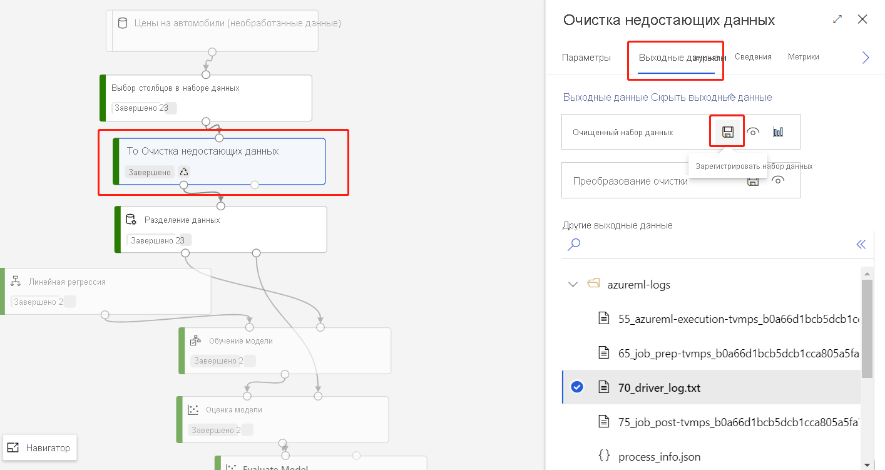
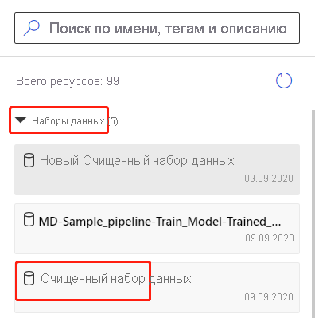

# Импорт данных в конструктор Машинное обучение Azure (Предварительная версия)

Из этой статьи вы узнаете, как импортировать собственные данные в конструктор для создания пользовательских решений. Импортировать данные в конструктор можно двумя способами: 

* **Машинное обучение Azure наборы данных** . Зарегистрируйте [наборы данных](concept-data.md#datasets) в машинное обучение Azure, чтобы включить дополнительные функции, помогающие управлять данными.
* **Модуль импорта данных** — используйте модуль [Импорт данных](algorithm-module-reference/import-data.md) для прямого доступа к данным из сетевых источников данных.

## Использование Машинное обучение Azure наборов данных

Чтобы импортировать данные в конструктор, рекомендуется использовать [наборы](concept-data.md#datasets) данных. При регистрации набора данных можно воспользоваться всеми преимуществами расширенных функций данных, таких как [Управление версиями и отслеживание версий](how-to-version-track-datasets.md) и [мониторинг данных](how-to-monitor-datasets.md).

### Регистрация набора данных

Вы можете зарегистрировать существующие наборы данных программно [с помощью пакета SDK](how-to-create-register-datasets.md#use-the-sdk) или [визуально в машинное обучение Azure Studio](how-to-create-register-datasets.md#use-the-ui).

Можно также зарегистрировать выходные данные для любого модуля конструктора в качестве набора данных.

1. Выберите модуль, выводящий данные, которые необходимо зарегистрировать.

1. На панели Свойства выберите **выходные данные** > **зарегистрировать набор данных**.

    

### Использование набора данных

Зарегистрированные наборы данных можно найти на палитре модулей в разделе **наборы данных** > **Мои наборы данных**. Чтобы использовать набор данных, перетащите его на холст конвейера. Затем подключите порт вывода набора данных к другим модулям в палитре.

Любой [Файловый набор данных](how-to-create-register-datasets.md#dataset-types) , зарегистрированный в рабочей области машинного обучения, появится на палитре модулей. Вы не ограничены использованием наборов данных, созданных в конструкторе.

> [!NOTE]
> В настоящее время конструктор поддерживает только обработку [табличных наборов данных](how-to-create-register-datasets.md#dataset-types). Если вы хотите использовать [Файловые наборы данных](how-to-create-register-datasets.md#dataset-types), используйте пакет SDK для машинное обучение Azure, доступный для Python и R.

## Импорт данных с помощью модуля "Импорт данных"

Хотя мы рекомендуем использовать наборы данных для импорта данных, можно также использовать модуль [импортировать данные](algorithm-module-reference/import-data.md) . Модуль Импорт данных пропускает регистрацию набора данных в Машинное обучение Azure и импортирует данные непосредственно из [хранилища](concept-data.md#datastores) данных или URL-адреса HTTP.

Подробные сведения об использовании модуля импорт данных см. на [странице Справочник по импорту данных](algorithm-module-reference/import-data.md).

## Поддерживаемые источники

В этом разделе перечислены источники данных, поддерживаемые конструктором. Данные поступают в конструктор из хранилища данных или из [табличного набора](how-to-create-register-datasets.md#dataset-types).

### Источники данных хранилища
Список поддерживаемых источников хранилища данных см. [в статье доступ к данным в службах хранилища Azure](how-to-access-data.md#supported-data-storage-service-types).

### Источники табличных наборов данных

Конструктор поддерживает табличные наборы данных, созданные из следующих источников:
 * Файлы с разделителями
 * файлы JSON;
 * файлы Parquet;
 * SQL-запросы

## Типы данных

Конструктор внутренне распознает следующие типы данных:

* String
* Целое число
* Decimal
* Логическое
* Дата

Конструктор использует внутренний тип данных для передачи данных между модулями. Вы можете явно преобразовать данные в формат таблицы данных с помощью модуля [преобразовать в набор данных](algorithm-module-reference/convert-to-dataset.md) . Любой модуль, который принимает форматы, отличные от внутреннего формата, преобразует данные в автоматическом режиме перед передачей их следующему модулю.

## Ограничения данных

Модули в конструкторе ограничиваются размером целевого объекта вычислений. Для больших наборов данных следует использовать ресурс с большим Машинное обучение Azure вычислений. Дополнительные сведения о Машинное обучение Azure COMPUTE см [. в разделе что такое целевые показатели вычислений в машинное обучение Azure?](concept-compute-target.md#azure-machine-learning-compute-managed)

## Дальнейшие действия

Изучите основы конструктора с помощью инструкции по [прогнозированию стоимости автомобилей в конструкторе](tutorial-designer-automobile-price-train-score.md).